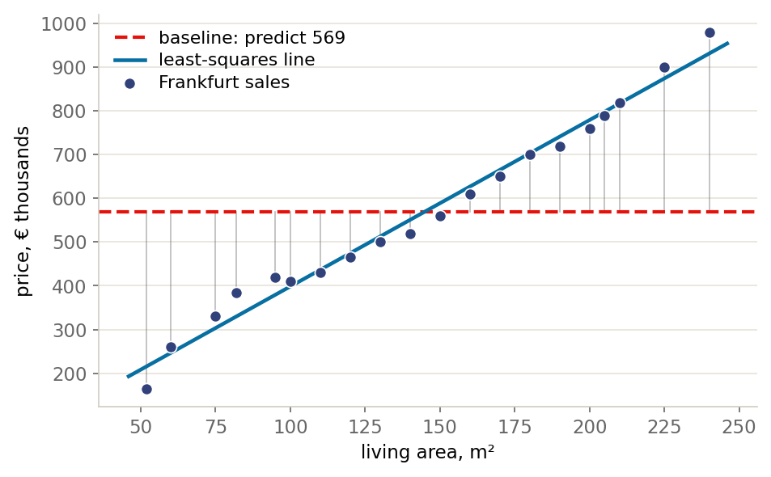

::: {.lm-hero}
[Chapter 1 · Introduction]{.eyebrow}

# The Baseline

[Before fitting anything, fix the number to beat. It turns out the mean is not a convention but a consequence, and the loss you pick is what chooses it.]{.dek}
:::

Machine learning turns data into predictions that hold up on cases you have not seen.
Before reaching for anything elaborate it pays to fix a [baseline]{.term}: the simplest
model, the one that ignores every input and predicts the same value every time. For a
numeric target that value is the mean. Any model worth its complexity has to beat it,
and the amount by which it does is the only honest measure of what the complexity
bought.

::: {.defbox}
[Baseline model]{.lbl}
[ h(x) = c &nbsp;&nbsp; for every x, &nbsp; with &nbsp; c = y&#772; ]{.math}
:::

Below we compute that baseline on twenty Frankfurt sales, show that the mean is forced
on us by the choice of squared error rather than chosen by taste, and then measure
exactly how much one feature buys. The last section does the same for a classification
label, where the do-nothing model is a much more dangerous thing to overlook.

```{=html}
<figure class="lm-figure">

<figcaption><strong>The baseline, and what one feature buys.</strong> The dashed line predicts the same average for every house, ignoring living area; the grey segments are the error it leaves. Tilting that flat line to follow the data absorbs almost all of it. That is Chapter 2 in one picture.</figcaption>
</figure>
```

## The baseline and the error it leaves

Twenty sales: living area in square metres, price in thousands of euros. The baseline
ignores the area entirely.

::: {.panel-tabset group="lang"}

## Python
```{pyodide}
import numpy as np

area = np.array([52, 82, 120, 95, 140, 160, 180, 200, 210, 225,
                 150, 110, 130, 170, 190, 205, 240, 60, 75, 100.])
price = np.array([164, 384, 465, 420, 520, 610, 700, 760, 820, 900,
                  560, 430, 500, 650, 720, 790, 980, 260, 330, 410.])

baseline = price.mean()
mse = ((price - baseline) ** 2).mean()

print(f"baseline prediction = {baseline:7.1f}")
print(f"baseline MSE        = {mse:9.1f}")
print(f"typical miss (RMSE) = {np.sqrt(mse):7.1f} thousand euros")
```

## R
```{webr}
area <- c(52, 82, 120, 95, 140, 160, 180, 200, 210, 225,
          150, 110, 130, 170, 190, 205, 240, 60, 75, 100)
price <- c(164, 384, 465, 420, 520, 610, 700, 760, 820, 900,
           560, 430, 500, 650, 720, 790, 980, 260, 330, 410)

baseline <- mean(price)
mse <- mean((price - baseline)^2)

cat(sprintf("baseline prediction = %7.1f\n", baseline))
cat(sprintf("baseline MSE        = %9.1f\n", mse))
cat(sprintf("typical miss (RMSE) = %7.1f thousand euros\n", sqrt(mse)))
```

:::

A typical miss of about €213,000 on houses averaging €569,000 is a poor prediction. It
is also the number every later chapter is trying to shrink.

## Why the mean, and not something else

The mean is not a convention. Among all constant predictions $c$, it is the unique
minimizer of mean squared error, $\frac{1}{m}\sum_i (y_i - c)^2$. You can see this
without calculus by scanning $c$ across a range and watching the error.

::: {.panel-tabset group="lang"}

## Python
```{pyodide}
candidates = np.linspace(price.min(), price.max(), 400)

errors = np.empty_like(candidates)
for i, c in enumerate(candidates):
    errors[i] = ((price - c) ** 2).mean()

print(f"scanned minimum at c = {candidates[errors.argmin()]:.1f}")
print(f"the mean is          {price.mean():.1f}")

# absolute error instead of squared error picks a different summary
abs_err = np.array([np.abs(price - c).mean() for c in candidates])
best = candidates[np.isclose(abs_err, abs_err.min())]

srt = np.sort(price)
print(f"\nunder absolute error the minimum is FLAT,")
print(f"  from {best.min():.1f} to {best.max():.1f}")
print(f"  between the two middle observations, {srt[9]:.0f} and {srt[10]:.0f}")
print(f"  the median, their midpoint, is {np.median(price):.1f}")
```

## R
```{webr}
candidates <- seq(min(price), max(price), length.out = 400)

errors <- numeric(length(candidates))
for (i in seq_along(candidates)) {
  errors[i] <- mean((price - candidates[i])^2)
}

cat(sprintf("scanned minimum at c = %.1f\n", candidates[which.min(errors)]))
cat(sprintf("the mean is          %.1f\n", mean(price)))

# absolute error instead of squared error picks a different summary
abs_err <- sapply(candidates, function(c) mean(abs(price - c)))
best <- candidates[abs_err <= min(abs_err) + 1e-9]

srt <- sort(price)
cat(sprintf("\nunder absolute error the minimum is FLAT,\n"))
cat(sprintf("  from %.1f to %.1f\n", min(best), max(best)))
cat(sprintf("  between the two middle observations, %.0f and %.0f\n", srt[10], srt[11]))
cat(sprintf("  the median, their midpoint, is %.1f\n", median(price)))
```

:::

The squared-error curve is a parabola with its vertex at the mean, and the scan lands
there to within the grid spacing. Swap in absolute error and the answer moves to the
median — but notice the output is more interesting than that. With an even number of
observations absolute error is *flat* across the whole interval between the two middle
values, so there is not one minimizer but a range of them, and the median is simply the
conventional representative of that range. (With an odd number of observations the
minimizer is unique, and it is the middle observation exactly.)

Both claims are easier to believe once you see them, so this plot draws itself when the page
opens. It repeats the two scans rather than reusing the results above, which keeps it
independent of what you have run so far.

::: {.panel-tabset group="lang"}

## Python
```{pyodide}
#| autorun: true
import numpy as np
import matplotlib.pyplot as plt

price = np.array([164, 384, 465, 420, 520, 610, 700, 760, 820, 900,
                  560, 430, 500, 650, 720, 790, 980, 260, 330, 410.])

candidates = np.linspace(price.min(), price.max(), 400)
errors = np.array([((price - c) ** 2).mean() for c in candidates])
abs_err = np.array([np.abs(price - c).mean() for c in candidates])

fig, (axL, axR) = plt.subplots(1, 2, figsize=(11, 4.2), sharex=True)

axL.plot(candidates, errors, color="#076FA1", lw=2)
axL.axvline(price.mean(), color="#E3120B", ls="--", lw=1.4,
            label=f"mean = {price.mean():.1f}")
axL.set_title("Squared error: one vertex, at the mean")
axL.set_xlabel("constant prediction $c$")
axL.set_ylabel("mean squared error")
axL.legend(frameon=False)

axR.plot(candidates, abs_err, color="#076FA1", lw=2)
# the flat stretch: every c in it is a minimizer
flat = candidates[np.isclose(abs_err, abs_err.min())]
axR.axvspan(flat.min(), flat.max(), color="#9E4F00", alpha=0.25,
            label="flat: all minimizers")
axR.axvline(np.median(price), color="#E3120B", ls="--", lw=1.4,
            label=f"median = {np.median(price):.1f}")
axR.set_title("Absolute error: a flat floor, not a point")
axR.set_xlabel("constant prediction $c$")
axR.set_ylabel("mean absolute error")
axR.legend(frameon=False)

plt.tight_layout()
plt.show()
```

## R
```{webr}
price <- c(164, 384, 465, 420, 520, 610, 700, 760, 820, 900,
           560, 430, 500, 650, 720, 790, 980, 260, 330, 410)

candidates <- seq(min(price), max(price), length.out = 400)
errors  <- sapply(candidates, function(c) mean((price - c)^2))
abs_err <- sapply(candidates, function(c) mean(abs(price - c)))
best    <- candidates[abs_err <= min(abs_err) + 1e-9]

op <- par(mfrow = c(1, 2))

plot(candidates, errors, type = "l", col = "#076FA1", lwd = 2,
     xlab = "constant prediction c", ylab = "mean squared error",
     main = "Squared error: one vertex, at the mean")
grid(col = "#e6e3da", lty = 1, lwd = 0.6)
abline(v = mean(price), col = "#E3120B", lty = 2, lwd = 1.4)
legend("topright", sprintf("mean = %.1f", mean(price)),
       col = "#E3120B", lty = 2, lwd = 1.4, bty = "n")

plot(candidates, abs_err, type = "n",
     xlab = "constant prediction c", ylab = "mean absolute error",
     main = "Absolute error: a flat floor, not a point")
grid(col = "#e6e3da", lty = 1, lwd = 0.6)
# the flat stretch: every c in it is a minimizer
rect(min(best), par("usr")[3], max(best), par("usr")[4],
     col = "#9E4F0040", border = NA)
lines(candidates, abs_err, col = "#076FA1", lwd = 2)
abline(v = median(price), col = "#E3120B", lty = 2, lwd = 1.4)
legend("topright", c("flat: all minimizers", sprintf("median = %.1f", median(price))),
       fill = c("#9E4F0040", NA), border = NA,
       col = c(NA, "#E3120B"), lty = c(NA, 2), lwd = c(NA, 1.4), bty = "n")

par(op)
```

:::

The left panel is the parabola the text promised; the right one shows why the median is
a convention rather than a consequence — the shaded stretch is flat, so every value in it
minimizes absolute error equally well.

This is the first instance of a pattern that runs through the whole book: **choose a
loss and the loss chooses the estimate.** Squared error picks the mean, absolute error
picks the median, and the choice is yours to defend rather than a fact about the data.
Chapter 5 makes the pattern explicit; Chapter 2 uses it to derive least squares.

## What one feature buys

Now let the prediction depend on the living area. Chapter 2 derives the least-squares
line properly; here we just fit it and ask how much of the baseline's error it removes.

::: {.panel-tabset group="lang"}

## Python
```{pyodide}
area_c = area - area.mean()
price_c = price - price.mean()

slope = (area_c * price_c).sum() / (area_c ** 2).sum()
intercept = price.mean() - slope * area.mean()

fitted = intercept + slope * area
mse_line = ((price - fitted) ** 2).mean()

print(f"price = {intercept:.1f} + {slope:.2f} * area")
print(f"line MSE      = {mse_line:9.1f}")
print(f"baseline MSE  = {mse:9.1f}")
print(f"error removed = {1 - mse_line / mse:8.1%}")
```

## R
```{webr}
area_c <- area - mean(area)
price_c <- price - mean(price)

slope <- sum(area_c * price_c) / sum(area_c^2)
intercept <- mean(price) - slope * mean(area)

fitted <- intercept + slope * area
mse_line <- mean((price - fitted)^2)

cat(sprintf("price = %.1f + %.2f * area\n", intercept, slope))
cat(sprintf("line MSE      = %9.1f\n", mse_line))
cat(sprintf("baseline MSE  = %9.1f\n", mse))
cat(sprintf("error removed = %7.1f%%\n", 100 * (1 - mse_line / mse)))
```

:::

That last number has a name you already know. It is $R^2$: the fraction of the
baseline's squared error that the model removes. Read this way $R^2$ is not a
mysterious goodness-of-fit index but a comparison against the do-nothing model, which
is why a high $R^2$ on data with little variance to begin with is worth so much less
than it looks.

## The same discipline for labels

When the target is a category, the do-nothing model predicts the majority class and its
accuracy is the base rate. Overlook it and a useless model can look excellent.

::: {.panel-tabset group="lang"}

## Python
```{pyodide}
# 950 negatives, 50 positives: a deliberately imbalanced screening problem
labels = np.concatenate([np.zeros(950), np.ones(50)])

majority = 0.0 if (labels == 0).sum() > (labels == 1).sum() else 1.0
baseline_accuracy = (labels == majority).mean()

print(f"majority class     = {majority:.0f}")
print(f"baseline accuracy  = {baseline_accuracy:.1%}")
print(f"positives it finds = 0 of {int(labels.sum())}")
```

## R
```{webr}
# 950 negatives, 50 positives: a deliberately imbalanced screening problem
labels <- c(rep(0, 950), rep(1, 50))

majority <- if (sum(labels == 0) > sum(labels == 1)) 0 else 1
baseline_accuracy <- mean(labels == majority)

cat(sprintf("majority class     = %d\n", majority))
cat(sprintf("baseline accuracy  = %.1f%%\n", 100 * baseline_accuracy))
cat(sprintf("positives it finds = 0 of %d\n", sum(labels)))
```

:::

A model reported at 95% accuracy on this problem has done exactly as well as saying
"no" a thousand times in a row. Chapter 6 builds the vocabulary for saying what is
wrong with that report — precision, recall, the confusion matrix. Chapter 1's
contribution is the habit that comes first: ask what the baseline scores before you
are impressed by anything.

## Try it yourself

The two cells below are exercises rather than demonstrations: each has a blank to fill in.
Use **Show Hint** if you want a nudge, **Show Solution** to see one answer, and **Start
Over** to clear your attempt.

The first asks what happens when a single observation is removed. Drop the largest sale, refit,
and compare how far the mean moves against how far the slope moves. Guess before you run it.

```{pyodide}
#| exercise: drop_largest
import numpy as np

area = np.array([52, 82, 120, 95, 140, 160, 180, 200, 210, 225,
                 150, 110, 130, 170, 190, 205, 240, 60, 75, 100.])
price = np.array([164, 384, 465, 420, 520, 610, 700, 760, 820, 900,
                  560, 430, 500, 650, 720, 790, 980, 260, 330, 410.])

def fit(a, p):
    slope = ((a - a.mean()) * (p - p.mean())).sum() / ((a - a.mean()) ** 2).sum()
    return p.mean(), slope

mean_all, slope_all = fit(area, price)

# Remove the single largest sale, then refit. Which index is the largest price?
keep = ______
mean_cut, slope_cut = fit(area[keep], price[keep])

print(f"mean : {mean_all:7.2f} -> {mean_cut:7.2f}   ({100*abs(mean_cut/mean_all - 1):.2f}% change)")
print(f"slope: {slope_all:7.3f} -> {slope_cut:7.3f}   ({100*abs(slope_cut/slope_all - 1):.2f}% change)")
```

```{pyodide}
#| exercise: drop_largest
#| hint: true
# np.argmax(price) is the index of the largest sale.
# You want every index EXCEPT that one — a boolean mask is the tidiest way.
keep = np.arange(len(price)) != np.argmax(______)
```

```{pyodide}
#| exercise: drop_largest
#| solution: true
keep = np.arange(len(price)) != np.argmax(price)
```

The result is not the one most people guess. The mean moves by about $3.8\%$ and the slope by
about $2.4\%$ — the *simpler* summary is the less stable one here. The reason is that the
largest sale is also the largest house: it sits squarely on the trend, so it tells the line
very little it did not already know, while for an average that ignores area it is simply a big
number being removed. Sensitivity to a single point depends on where the point sits, not only
on how flexible the model is. Chapter 5 makes that dependence precise.

The second exercise returns to the imbalanced screening problem. Rebalance it and watch what
happens to the number that looked so impressive.

```{pyodide}
#| exercise: rebalance
import numpy as np

# The original screen: 950 negatives, 50 positives.
labels = np.concatenate([np.zeros(950), np.ones(50)])
majority = 0.0 if (labels == 0).sum() > (labels == 1).sum() else 1.0
print(f"imbalanced 950/50 -> baseline accuracy {(labels == majority).mean():.1%}")

# Now make it balanced: 500 negatives and 500 positives.
balanced = ______
majority_b = 0.0 if (balanced == 0).sum() > (balanced == 1).sum() else 1.0
print(f"balanced   500/500 -> baseline accuracy {(balanced == majority_b).mean():.1%}")
```

```{pyodide}
#| exercise: rebalance
#| hint: true
# Same construction as above, with different counts.
balanced = np.concatenate([np.zeros(____), np.ones(____)])
```

```{pyodide}
#| exercise: rebalance
#| solution: true
balanced = np.concatenate([np.zeros(500), np.ones(500)])
```

A model reported at 95% accuracy is doing nothing at all on the first problem and beating the
do-nothing model by a wide margin on the second. The number did not change; what it is worth
did.
