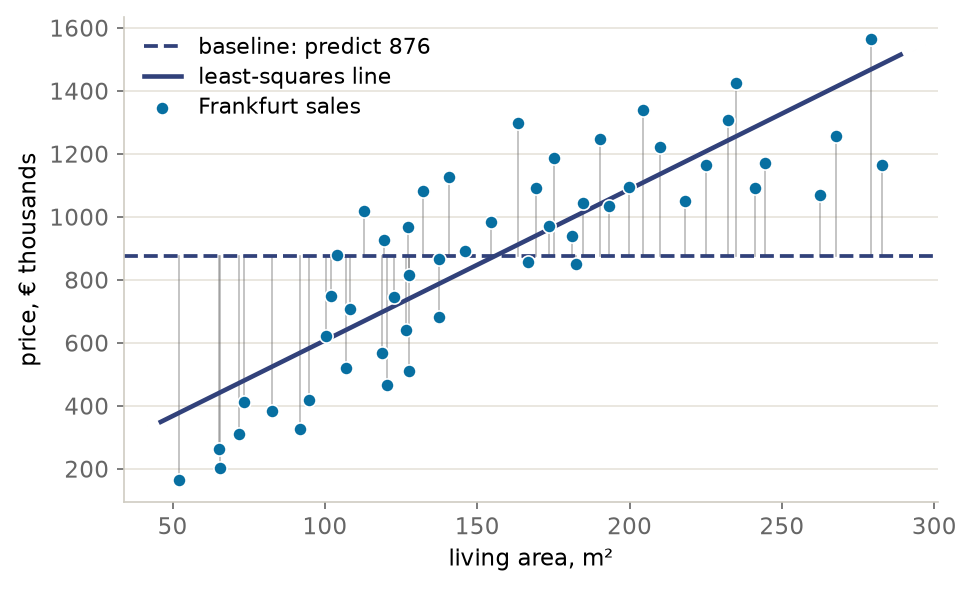

::: {.lm-hero}
[Chapter 1 · Introduction]{.eyebrow}

# The Baseline

[Before fitting anything, fix the number to beat. It turns out the mean is not a convention but a consequence, and the loss you pick is what chooses it.]{.dek}
:::

Machine learning turns data into predictions that hold up on cases you have not seen.
Before reaching for anything elaborate it pays to fix a [baseline]{.term}: the simplest
model, the one that ignores every input and predicts the same value every time. For a
numeric target that value is the mean. Any model worth its complexity has to beat it,
and the amount by which it does is the only honest measure of what the complexity
bought.

::: {.defbox}
[Baseline model]{.lbl}
[ h(x) = c &nbsp;&nbsp; for every x, &nbsp; with &nbsp; c = y&#772; ]{.math}
:::

Below we compute that baseline on the book's 51 Frankfurt sales, show that the mean is forced
on us by the choice of squared error rather than chosen by taste, and then measure
exactly how much one feature buys. The last section does the same for a classification
label, where the do-nothing model is a much more dangerous thing to overlook.

```{=html}
<figure class="lm-figure">

<figcaption><strong>The baseline, and what one feature buys.</strong> The dashed line predicts the same average for every house, ignoring living area; the gray segments are the error it leaves. Tilting that flat line to follow the data absorbs about 72% of the squared error. That is Chapter 2 in one picture.</figcaption>
</figure>
```

## The baseline and the error it leaves

The book's Frankfurt data set, all 51 sales: living area in square meters, price in thousands
of euros. The baseline
ignores the area entirely.

::: {.panel-tabset group="lang"}

## Python
```{pyodide}
import numpy as np

area = np.array([52.14, 82.69, 120.47, 122.73, 65.40, 65.38, 71.93, 91.84, 94.83,
                 127.50, 118.60, 100.25, 137.55, 127.57, 106.99, 108.39, 119.38,
                 137.29, 154.64, 181.20, 169.44, 173.70, 145.83, 127.38, 102.05,
                 103.82, 140.80, 163.27, 175.09, 190.21, 199.78, 184.82, 209.91,
                 204.40, 224.98, 218.35, 232.28, 234.83, 279.30, 73.43, 126.59,
                 132.08, 112.79, 182.39, 166.70, 193.13, 244.35, 267.66, 282.95,
                 262.52, 241.04])
price = np.array([164.22, 384.49, 465.42, 746.54, 202.26, 261.71, 309.79, 327.96,
                  418.90, 510.13, 568.72, 622.15, 680.99, 816.50, 521.13, 706.28,
                  927.26, 867.77, 982.82, 938.77, 1091.30, 972.08, 891.48, 966.61,
                  750.34, 877.96, 1125.54, 1298.89, 1187.27, 1245.91, 1095.59,
                  1045.57, 1221.02, 1340.73, 1164.67, 1051.99, 1308.82, 1424.86,
                  1564.31, 412.86, 640.80, 1083.50, 1018.04, 851.83, 855.79, 1034.45,
                  1172.15, 1256.15, 1164.69, 1071.07, 1091.18])

baseline = price.mean()
mse = ((price - baseline) ** 2).mean()

print(f"baseline prediction = {baseline:7.1f}")
print(f"baseline MSE        = {mse:9.1f}")
print(f"typical miss (RMSE) = {np.sqrt(mse):7.1f} thousand euros")
```

## R
```{webr}
area <- c(52.14, 82.69, 120.47, 122.73, 65.40, 65.38, 71.93, 91.84, 94.83, 127.50,
          118.60, 100.25, 137.55, 127.57, 106.99, 108.39, 119.38, 137.29, 154.64,
          181.20, 169.44, 173.70, 145.83, 127.38, 102.05, 103.82, 140.80, 163.27,
          175.09, 190.21, 199.78, 184.82, 209.91, 204.40, 224.98, 218.35, 232.28,
          234.83, 279.30, 73.43, 126.59, 132.08, 112.79, 182.39, 166.70, 193.13,
          244.35, 267.66, 282.95, 262.52, 241.04)
price <- c(164.22, 384.49, 465.42, 746.54, 202.26, 261.71, 309.79, 327.96, 418.90,
           510.13, 568.72, 622.15, 680.99, 816.50, 521.13, 706.28, 927.26, 867.77,
           982.82, 938.77, 1091.30, 972.08, 891.48, 966.61, 750.34, 877.96, 1125.54,
           1298.89, 1187.27, 1245.91, 1095.59, 1045.57, 1221.02, 1340.73, 1164.67,
           1051.99, 1308.82, 1424.86, 1564.31, 412.86, 640.80, 1083.50, 1018.04,
           851.83, 855.79, 1034.45, 1172.15, 1256.15, 1164.69, 1071.07, 1091.18)

baseline <- mean(price)
mse <- mean((price - baseline)^2)

cat(sprintf("baseline prediction = %7.1f\n", baseline))
cat(sprintf("baseline MSE        = %9.1f\n", mse))
cat(sprintf("typical miss (RMSE) = %7.1f thousand euros\n", sqrt(mse)))
```

:::

A typical miss of about €340,000 on houses averaging €876,000 is a poor prediction. It
is also the number every later chapter is trying to shrink.

## Why the mean, and not something else

The mean is not a convention. Among all constant predictions $c$, it is the unique
minimizer of mean squared error, $\frac{1}{m}\sum_i (y_i - c)^2$. You can see this
without calculus by scanning $c$ across a range and watching the error.

::: {.panel-tabset group="lang"}

## Python
```{pyodide}
import numpy as np

# Same 51 sales as the first cell: every cell here stands on its own.
area = np.array([52.14, 82.69, 120.47, 122.73, 65.40, 65.38, 71.93, 91.84, 94.83,
                 127.50, 118.60, 100.25, 137.55, 127.57, 106.99, 108.39, 119.38,
                 137.29, 154.64, 181.20, 169.44, 173.70, 145.83, 127.38, 102.05,
                 103.82, 140.80, 163.27, 175.09, 190.21, 199.78, 184.82, 209.91,
                 204.40, 224.98, 218.35, 232.28, 234.83, 279.30, 73.43, 126.59,
                 132.08, 112.79, 182.39, 166.70, 193.13, 244.35, 267.66, 282.95,
                 262.52, 241.04])
price = np.array([164.22, 384.49, 465.42, 746.54, 202.26, 261.71, 309.79, 327.96,
                  418.90, 510.13, 568.72, 622.15, 680.99, 816.50, 521.13, 706.28,
                  927.26, 867.77, 982.82, 938.77, 1091.30, 972.08, 891.48, 966.61,
                  750.34, 877.96, 1125.54, 1298.89, 1187.27, 1245.91, 1095.59,
                  1045.57, 1221.02, 1340.73, 1164.67, 1051.99, 1308.82, 1424.86,
                  1564.31, 412.86, 640.80, 1083.50, 1018.04, 851.83, 855.79, 1034.45,
                  1172.15, 1256.15, 1164.69, 1071.07, 1091.18])

candidates = np.linspace(price.min(), price.max(), 400)

errors = np.empty_like(candidates)
for i, c in enumerate(candidates):
    errors[i] = ((price - c) ** 2).mean()

print(f"scanned minimum at c = {candidates[errors.argmin()]:.1f}")
print(f"the mean is          {price.mean():.1f}")

# absolute error instead of squared error picks a different summary
abs_err = np.array([np.abs(price - c).mean() for c in candidates])
print(f"\nunder absolute error the scan bottoms out at c = {candidates[abs_err.argmin()]:.1f},")
print(f"  the grid point nearest the median, the 26th of 51 sorted prices: {np.median(price):.1f}")

# drop the largest sale: with 50 observations the count is even
p50 = price[price != price.max()]
srt = np.sort(p50)
print(f"\nwith 50 sales the minimum is FLAT:")
print(f"  every c between the two middle observations, {srt[24]:.2f} and {srt[25]:.2f}")
print(f"  the median, their midpoint, is {np.median(p50):.1f}")
```

## R
```{webr}
# Same 51 sales as the first cell: every cell here stands on its own.
area <- c(52.14, 82.69, 120.47, 122.73, 65.40, 65.38, 71.93, 91.84, 94.83, 127.50,
          118.60, 100.25, 137.55, 127.57, 106.99, 108.39, 119.38, 137.29, 154.64,
          181.20, 169.44, 173.70, 145.83, 127.38, 102.05, 103.82, 140.80, 163.27,
          175.09, 190.21, 199.78, 184.82, 209.91, 204.40, 224.98, 218.35, 232.28,
          234.83, 279.30, 73.43, 126.59, 132.08, 112.79, 182.39, 166.70, 193.13,
          244.35, 267.66, 282.95, 262.52, 241.04)
price <- c(164.22, 384.49, 465.42, 746.54, 202.26, 261.71, 309.79, 327.96, 418.90,
           510.13, 568.72, 622.15, 680.99, 816.50, 521.13, 706.28, 927.26, 867.77,
           982.82, 938.77, 1091.30, 972.08, 891.48, 966.61, 750.34, 877.96, 1125.54,
           1298.89, 1187.27, 1245.91, 1095.59, 1045.57, 1221.02, 1340.73, 1164.67,
           1051.99, 1308.82, 1424.86, 1564.31, 412.86, 640.80, 1083.50, 1018.04,
           851.83, 855.79, 1034.45, 1172.15, 1256.15, 1164.69, 1071.07, 1091.18)

candidates <- seq(min(price), max(price), length.out = 400)

errors <- numeric(length(candidates))
for (i in seq_along(candidates)) {
  errors[i] <- mean((price - candidates[i])^2)
}

cat(sprintf("scanned minimum at c = %.1f\n", candidates[which.min(errors)]))
cat(sprintf("the mean is          %.1f\n", mean(price)))

# absolute error instead of squared error picks a different summary
abs_err <- sapply(candidates, function(c) mean(abs(price - c)))
cat(sprintf("\nunder absolute error the scan bottoms out at c = %.1f,\n",
            candidates[which.min(abs_err)]))
cat(sprintf("  the grid point nearest the median, the 26th of 51 sorted prices: %.1f\n", median(price)))

# drop the largest sale: with 50 observations the count is even
p50 <- price[price != max(price)]
srt <- sort(p50)
cat(sprintf("\nwith 50 sales the minimum is FLAT:\n"))
cat(sprintf("  every c between the two middle observations, %.2f and %.2f\n", srt[25], srt[26]))
cat(sprintf("  the median, their midpoint, is %.1f\n", median(p50)))
```

:::

The squared-error curve is a parabola with its vertex at the mean, and the scan lands
there to within the grid spacing. Swap in absolute error and the answer moves to the
median. With 51 sales, an odd number, the minimizer is unique: the middle observation
exactly, which the scan finds to within its grid spacing. Drop one sale and the output
becomes more interesting. With an even number of observations absolute error is *flat*
across the whole interval between the two middle values, so there is not one minimizer but
a range of them, and the median is simply the conventional representative of that range.

Both claims are easier to believe once you see them. The plot below draws itself when the
page opens.

::: {.panel-tabset group="lang"}

## Python
```{pyodide}
#| autorun: true
import numpy as np
import matplotlib.pyplot as plt

price = np.array([164.22, 384.49, 465.42, 746.54, 202.26, 261.71, 309.79, 327.96,
                  418.90, 510.13, 568.72, 622.15, 680.99, 816.50, 521.13, 706.28,
                  927.26, 867.77, 982.82, 938.77, 1091.30, 972.08, 891.48, 966.61,
                  750.34, 877.96, 1125.54, 1298.89, 1187.27, 1245.91, 1095.59,
                  1045.57, 1221.02, 1340.73, 1164.67, 1051.99, 1308.82, 1424.86,
                  1564.31, 412.86, 640.80, 1083.50, 1018.04, 851.83, 855.79, 1034.45,
                  1172.15, 1256.15, 1164.69, 1071.07, 1091.18])

candidates = np.linspace(price.min(), price.max(), 400)
errors = np.array([((price - c) ** 2).mean() for c in candidates])
abs_err = np.array([np.abs(price - c).mean() for c in candidates])

fig, (axL, axR) = plt.subplots(1, 2, figsize=(11, 4.2))

axL.plot(candidates, errors, color="#076FA1", lw=2)
axL.axvline(price.mean(), color="#31417A", ls="--", lw=1.4,
            label=f"mean = {price.mean():.1f}")
axL.set_title("Squared error: one vertex, at the mean")
axL.set_xlabel("constant prediction $c$")
axL.set_ylabel("mean squared error")
axL.legend(frameon=False)

axR.plot(candidates, abs_err, color="#076FA1", lw=2, label="51 sales")
axR.axvline(np.median(price), color="#31417A", ls="--", lw=1.4,
            label=f"median = {np.median(price):.1f}")
# drop the largest sale: with 50 the floor is flat, and every c on it is a minimizer
p50 = price[price != price.max()]
abs_50 = np.array([np.abs(p50 - c).mean() for c in candidates])
axR.plot(candidates, abs_50, color="#666666", lw=1.4, label="50 sales")
lo, hi = np.sort(p50)[[24, 25]]   # the two middle sales bound the flat floor
axR.axvspan(lo, hi, color="#9E4F00", alpha=0.25,
            label="flat: all minimizers (50 sales)")
axR.set_xlim(850, 1030); axR.set_ylim(268, 302)
axR.set_title("Absolute error: a corner, or a flat floor")
axR.set_xlabel("constant prediction $c$")
axR.set_ylabel("mean absolute error")
axR.legend(loc="upper left", frameon=False, fontsize=9)

plt.tight_layout()
plt.show()
```

## R
```{webr}
price <- c(164.22, 384.49, 465.42, 746.54, 202.26, 261.71, 309.79, 327.96, 418.90,
           510.13, 568.72, 622.15, 680.99, 816.50, 521.13, 706.28, 927.26, 867.77,
           982.82, 938.77, 1091.30, 972.08, 891.48, 966.61, 750.34, 877.96, 1125.54,
           1298.89, 1187.27, 1245.91, 1095.59, 1045.57, 1221.02, 1340.73, 1164.67,
           1051.99, 1308.82, 1424.86, 1564.31, 412.86, 640.80, 1083.50, 1018.04,
           851.83, 855.79, 1034.45, 1172.15, 1256.15, 1164.69, 1071.07, 1091.18)

candidates <- seq(min(price), max(price), length.out = 400)
errors  <- sapply(candidates, function(c) mean((price - c)^2))
abs_err <- sapply(candidates, function(c) mean(abs(price - c)))
# drop the largest sale: with 50 the floor is flat, and every c on it is a minimizer
p50     <- price[price != max(price)]
abs_50  <- sapply(candidates, function(c) mean(abs(p50 - c)))
best    <- sort(p50)[c(25, 26)]   # the two middle sales bound the flat floor

op <- par(mfrow = c(1, 2))

plot(candidates, errors, type = "l", col = "#076FA1", lwd = 2,
     xlab = "constant prediction c", ylab = "mean squared error",
     main = "Squared error: one vertex, at the mean")
grid(col = "#e6e3da", lty = 1, lwd = 0.6)
abline(v = mean(price), col = "#31417A", lty = 2, lwd = 1.4)
legend("topright", sprintf("mean = %.1f", mean(price)),
       col = "#31417A", lty = 2, lwd = 1.4, bty = "n")

plot(candidates, abs_err, type = "n", xlim = c(850, 1030), ylim = c(268, 302),
     xlab = "constant prediction c", ylab = "mean absolute error",
     main = "Absolute error: a corner, or a flat floor")
grid(col = "#e6e3da", lty = 1, lwd = 0.6)
rect(min(best), par("usr")[3], max(best), par("usr")[4],
     col = "#9E4F0040", border = NA)
lines(candidates, abs_err, col = "#076FA1", lwd = 2)
lines(candidates, abs_50, col = "#666666", lwd = 1.4)
abline(v = median(price), col = "#31417A", lty = 2, lwd = 1.4)
legend("topleft", c("51 sales", sprintf("median = %.1f", median(price)), "50 sales",
                     "flat: all minimizers (50 sales)"),
       fill = c(NA, NA, NA, "#9E4F0040"), border = NA,
       col = c("#076FA1", "#31417A", "#666666", NA), lty = c(1, 2, 1, NA),
       lwd = c(2, 1.4, 1.4, NA), bty = "n")

par(op)
```

:::

The left panel is the parabola the text promised. The right one, zoomed in on the floor,
shows the two cases: with 51 sales the curve has a corner at the median; with the largest
sale dropped it has a flat stretch, shaded, where every value minimizes absolute error
equally well. That is why the median of an even count is a convention rather than a
consequence.

This is the first instance of a pattern that runs through the whole book: **choose a
loss and the loss chooses the estimate.** Squared error picks the mean, absolute error
picks the median, and the choice is yours to defend rather than a fact about the data.
Chapter 5 makes the pattern explicit; Chapter 2 uses it to derive least squares.

## What one feature buys

Now let the prediction depend on the living area. Chapter 2 derives the least-squares
line properly; here we just fit it and ask how much of the baseline's error it removes.

::: {.panel-tabset group="lang"}

## Python
```{pyodide}
import numpy as np

# Same 51 sales as the first cell: every cell here stands on its own.
area = np.array([52.14, 82.69, 120.47, 122.73, 65.40, 65.38, 71.93, 91.84, 94.83,
                 127.50, 118.60, 100.25, 137.55, 127.57, 106.99, 108.39, 119.38,
                 137.29, 154.64, 181.20, 169.44, 173.70, 145.83, 127.38, 102.05,
                 103.82, 140.80, 163.27, 175.09, 190.21, 199.78, 184.82, 209.91,
                 204.40, 224.98, 218.35, 232.28, 234.83, 279.30, 73.43, 126.59,
                 132.08, 112.79, 182.39, 166.70, 193.13, 244.35, 267.66, 282.95,
                 262.52, 241.04])
price = np.array([164.22, 384.49, 465.42, 746.54, 202.26, 261.71, 309.79, 327.96,
                  418.90, 510.13, 568.72, 622.15, 680.99, 816.50, 521.13, 706.28,
                  927.26, 867.77, 982.82, 938.77, 1091.30, 972.08, 891.48, 966.61,
                  750.34, 877.96, 1125.54, 1298.89, 1187.27, 1245.91, 1095.59,
                  1045.57, 1221.02, 1340.73, 1164.67, 1051.99, 1308.82, 1424.86,
                  1564.31, 412.86, 640.80, 1083.50, 1018.04, 851.83, 855.79, 1034.45,
                  1172.15, 1256.15, 1164.69, 1071.07, 1091.18])
mse = ((price - price.mean()) ** 2).mean()          # the baseline to beat

area_c = area - area.mean()
price_c = price - price.mean()

slope = (area_c * price_c).sum() / (area_c ** 2).sum()
intercept = price.mean() - slope * area.mean()

fitted = intercept + slope * area
mse_line = ((price - fitted) ** 2).mean()

print(f"price = {intercept:.1f} + {slope:.2f} * area")
print(f"line MSE      = {mse_line:9.1f}")
print(f"baseline MSE  = {mse:9.1f}")
print(f"error removed = {1 - mse_line / mse:8.1%}")
```

## R
```{webr}
# Same 51 sales as the first cell: every cell here stands on its own.
area <- c(52.14, 82.69, 120.47, 122.73, 65.40, 65.38, 71.93, 91.84, 94.83, 127.50,
          118.60, 100.25, 137.55, 127.57, 106.99, 108.39, 119.38, 137.29, 154.64,
          181.20, 169.44, 173.70, 145.83, 127.38, 102.05, 103.82, 140.80, 163.27,
          175.09, 190.21, 199.78, 184.82, 209.91, 204.40, 224.98, 218.35, 232.28,
          234.83, 279.30, 73.43, 126.59, 132.08, 112.79, 182.39, 166.70, 193.13,
          244.35, 267.66, 282.95, 262.52, 241.04)
price <- c(164.22, 384.49, 465.42, 746.54, 202.26, 261.71, 309.79, 327.96, 418.90,
           510.13, 568.72, 622.15, 680.99, 816.50, 521.13, 706.28, 927.26, 867.77,
           982.82, 938.77, 1091.30, 972.08, 891.48, 966.61, 750.34, 877.96, 1125.54,
           1298.89, 1187.27, 1245.91, 1095.59, 1045.57, 1221.02, 1340.73, 1164.67,
           1051.99, 1308.82, 1424.86, 1564.31, 412.86, 640.80, 1083.50, 1018.04,
           851.83, 855.79, 1034.45, 1172.15, 1256.15, 1164.69, 1071.07, 1091.18)
mse <- mean((price - mean(price))^2)               # the baseline to beat

area_c <- area - mean(area)
price_c <- price - mean(price)

slope <- sum(area_c * price_c) / sum(area_c^2)
intercept <- mean(price) - slope * mean(area)

fitted <- intercept + slope * area
mse_line <- mean((price - fitted)^2)

cat(sprintf("price = %.1f + %.2f * area\n", intercept, slope))
cat(sprintf("line MSE      = %9.1f\n", mse_line))
cat(sprintf("baseline MSE  = %9.1f\n", mse))
cat(sprintf("error removed = %7.1f%%\n", 100 * (1 - mse_line / mse)))
```

:::

That last number has a name you already know. It is $R^2$: the fraction of the
baseline's squared error that the model removes. Read this way $R^2$ is not a
mysterious goodness-of-fit index but a comparison against the do-nothing model, which
is why a high $R^2$ on data with little variance to begin with is worth so much less
than it looks.

## The same discipline for labels

When the target is a category, the do-nothing model predicts the majority class and its
accuracy is the base rate. Overlook it and a useless model can look excellent.

::: {.panel-tabset group="lang"}

## Python
```{pyodide}
import numpy as np

# Same 51 sales as the first cell: every cell here stands on its own.
area = np.array([52.14, 82.69, 120.47, 122.73, 65.40, 65.38, 71.93, 91.84, 94.83,
                 127.50, 118.60, 100.25, 137.55, 127.57, 106.99, 108.39, 119.38,
                 137.29, 154.64, 181.20, 169.44, 173.70, 145.83, 127.38, 102.05,
                 103.82, 140.80, 163.27, 175.09, 190.21, 199.78, 184.82, 209.91,
                 204.40, 224.98, 218.35, 232.28, 234.83, 279.30, 73.43, 126.59,
                 132.08, 112.79, 182.39, 166.70, 193.13, 244.35, 267.66, 282.95,
                 262.52, 241.04])
price = np.array([164.22, 384.49, 465.42, 746.54, 202.26, 261.71, 309.79, 327.96,
                  418.90, 510.13, 568.72, 622.15, 680.99, 816.50, 521.13, 706.28,
                  927.26, 867.77, 982.82, 938.77, 1091.30, 972.08, 891.48, 966.61,
                  750.34, 877.96, 1125.54, 1298.89, 1187.27, 1245.91, 1095.59,
                  1045.57, 1221.02, 1340.73, 1164.67, 1051.99, 1308.82, 1424.86,
                  1564.31, 412.86, 640.80, 1083.50, 1018.04, 851.83, 855.79, 1034.45,
                  1172.15, 1256.15, 1164.69, 1071.07, 1091.18])

# 950 negatives, 50 positives: a deliberately imbalanced screening problem
labels = np.concatenate([np.zeros(950), np.ones(50)])

majority = 0.0 if (labels == 0).sum() > (labels == 1).sum() else 1.0
baseline_accuracy = (labels == majority).mean()

print(f"majority class     = {majority:.0f}")
print(f"baseline accuracy  = {baseline_accuracy:.1%}")
print(f"positives it finds = 0 of {int(labels.sum())}")
```

## R
```{webr}
# 950 negatives, 50 positives: a deliberately imbalanced screening problem
labels <- c(rep(0, 950), rep(1, 50))

majority <- if (sum(labels == 0) > sum(labels == 1)) 0 else 1
baseline_accuracy <- mean(labels == majority)

cat(sprintf("majority class     = %d\n", majority))
cat(sprintf("baseline accuracy  = %.1f%%\n", 100 * baseline_accuracy))
cat(sprintf("positives it finds = 0 of %d\n", sum(labels)))
```

:::

A model reported at 95% accuracy on this problem has done exactly as well as saying
"no" a thousand times in a row. Chapter 6 builds the vocabulary for saying what is
wrong with that report — precision, recall, the confusion matrix. Chapter 1's
contribution is the habit that comes first: ask what the baseline scores before you
are impressed by anything.

## Try it yourself

The two cells below are exercises rather than demonstrations: each has a blank to fill in.
Use **Show Hint** if you want a nudge, **Show Solution** to see one answer, and **Start
Over** to clear your attempt. They are Python only — the exercise machinery does not carry a
second tab — so R readers should treat them as worked problems.

The first asks what happens when a single observation is removed. Drop the largest sale, refit,
and compare how far each summary moves in units of its own standard error. Guess first.

```{pyodide}
#| exercise: drop_largest
import numpy as np

area = np.array([52.14, 82.69, 120.47, 122.73, 65.40, 65.38, 71.93, 91.84, 94.83,
                 127.50, 118.60, 100.25, 137.55, 127.57, 106.99, 108.39, 119.38,
                 137.29, 154.64, 181.20, 169.44, 173.70, 145.83, 127.38, 102.05,
                 103.82, 140.80, 163.27, 175.09, 190.21, 199.78, 184.82, 209.91,
                 204.40, 224.98, 218.35, 232.28, 234.83, 279.30, 73.43, 126.59,
                 132.08, 112.79, 182.39, 166.70, 193.13, 244.35, 267.66, 282.95,
                 262.52, 241.04])
price = np.array([164.22, 384.49, 465.42, 746.54, 202.26, 261.71, 309.79, 327.96,
                  418.90, 510.13, 568.72, 622.15, 680.99, 816.50, 521.13, 706.28,
                  927.26, 867.77, 982.82, 938.77, 1091.30, 972.08, 891.48, 966.61,
                  750.34, 877.96, 1125.54, 1298.89, 1187.27, 1245.91, 1095.59,
                  1045.57, 1221.02, 1340.73, 1164.67, 1051.99, 1308.82, 1424.86,
                  1564.31, 412.86, 640.80, 1083.50, 1018.04, 851.83, 855.79, 1034.45,
                  1172.15, 1256.15, 1164.69, 1071.07, 1091.18])

def fit(a, p):
    slope = ((a - a.mean()) * (p - p.mean())).sum() / ((a - a.mean()) ** 2).sum()
    return p.mean(), slope

def standard_errors(a, p):
    """SE of the mean, and SE of the least-squares slope."""
    m = len(a)
    _, slope = fit(a, p)
    intercept = p.mean() - slope * a.mean()
    resid = p - (intercept + slope * a)
    s2 = (resid ** 2).sum() / (m - 2)
    return p.std(ddof=1) / np.sqrt(m), np.sqrt(s2 / ((a - a.mean()) ** 2).sum())

mean_all, slope_all = fit(area, price)
se_mean, se_slope = standard_errors(area, price)

# Remove the single largest sale, then refit. Which index is the largest price?
keep = ______
mean_cut, slope_cut = fit(area[keep], price[keep])

# Report each shift in units of its own standard error: percentages of a price level and
# of a price per square meter are percentages of different things, and cannot be compared.
print(f"mean : {mean_all:7.2f} -> {mean_cut:7.2f}   moved {abs(mean_cut - mean_all)/se_mean:.2f} standard errors")
print(f"slope: {slope_all:7.3f} -> {slope_cut:7.3f}   moved {abs(slope_cut - slope_all)/se_slope:.2f} standard errors")
```

```{pyodide}
#| exercise: drop_largest
#| hint: true
# np.argmax(price) is the index of the largest sale.
# You want every index EXCEPT that one — a boolean mask is the tidiest way.
keep = np.arange(len(price)) != np.argmax(______)
```

```{pyodide}
#| exercise: drop_largest
#| solution: true
keep = np.arange(len(price)) != np.argmax(price)
```

The mean moves $0.29$ standard errors; the slope moves $0.17$. Raw percentages ($1.6\%$ and
$1.5\%$) would have called it a tie, but a percentage of a price level and a percentage of a
price per square meter are percentages of different things.

The largest sale is the second-largest house, which puts it at the edge of the design: its
leverage is $0.103$ against an average of $0.039$, second only to the largest house. Yet its
residual is small, 34th largest of the 51, because the sale sits close to the line. Leverage
alone does not move a slope; a point has to be both far out in $x$ and off the line before a
slope cannot ignore it. Chapter 6 gives the observation its vocabulary: the
leverage $h_{ii}$ on the diagonal of the hat matrix, in Theorem 6.2 and Exercise 6.7.

The second exercise returns to the imbalanced screening problem. Rebalance it and watch what
happens to the number that looked so impressive.

```{pyodide}
#| exercise: rebalance
import numpy as np

# The original screen: 950 negatives, 50 positives.
labels = np.concatenate([np.zeros(950), np.ones(50)])
majority = 0.0 if (labels == 0).sum() > (labels == 1).sum() else 1.0
print(f"imbalanced 950/50 -> baseline accuracy {(labels == majority).mean():.1%}")

# Now make it balanced: 500 negatives and 500 positives.
balanced = ______
majority_b = 0.0 if (balanced == 0).sum() > (balanced == 1).sum() else 1.0
print(f"balanced   500/500 -> baseline accuracy {(balanced == majority_b).mean():.1%}")
```

```{pyodide}
#| exercise: rebalance
#| hint: true
# Same construction as above, with different counts.
balanced = np.concatenate([np.zeros(____), np.ones(____)])
```

```{pyodide}
#| exercise: rebalance
#| solution: true
balanced = np.concatenate([np.zeros(500), np.ones(500)])
```

A model reported at 95% accuracy is doing nothing at all on the first problem and beating the
do-nothing model by a wide margin on the second. The number did not change; what it is worth
did.
