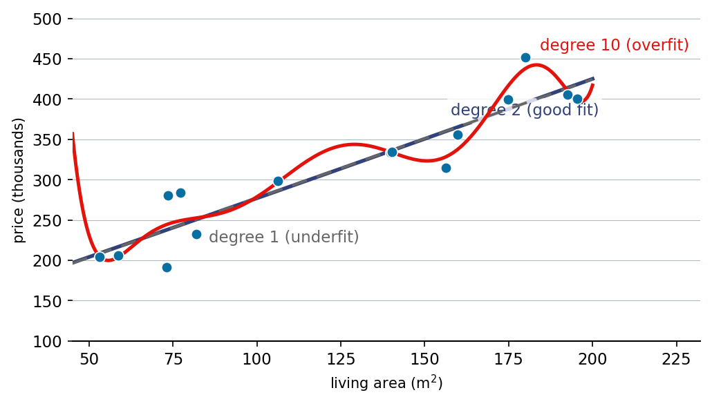

::: {.lm-hero}
[Chapter 2 · Regression Models]{.eyebrow}

# Polynomial Regression

[A single knob, the degree of the polynomial, slides a model from too rigid to see the curve to too flexible to ignore the noise, and the bill comes due only on data the model never saw.]{.dek}
:::

A degree-$d$ polynomial regression fits $\hat{y} = \theta_0 + \theta_1 x + \cdots + \theta_d x^d$
by least squares: the coefficients minimize the residual sum of squares on the training data.
The degree is the model's complexity knob. Turn it up and the curve can bend through more
points; turn it too far and it bends through *every* point, noise included. The central
tension of machine learning lives in that knob. A model too simple to capture the real
pattern [underfits]{.term}; a model flexible enough to memorize the sample [overfits]{.term}.

::: {.defbox}
[Polynomial Model of Degree d]{.lbl}
[ y&#770; = &theta;<sub>0</sub> + &theta;<sub>1</sub>x + &theta;<sub>2</sub>x<sup>2</sup> + &hellip; + &theta;<sub>d</sub>x<sup>d</sup> ]{.math}
:::

We use a fixed sample of fifteen Frankfurt houses: living area in square meters against
price in thousands. The prices were drawn once from a curved relationship,
$\text{price} = 50 + 4.0\,\text{area} - 0.010\,\text{area}^2$, plus Gaussian noise, so the
true signal is exactly quadratic and everything past degree two is the model chasing noise.
The same fifteen points are hard-coded into every cell, so Python and R compute identical
numbers. We measure fit with [mean squared error]{.term},
$\text{MSE} = \frac{1}{n}\sum_i (y_i - \hat{y}_i)^2$.

One numerical note carried by both languages: before building the design matrix we
standardize the area (subtract its mean, divide by its standard deviation). A raw Vandermonde
matrix in $\text{area}^{14}$ is hopelessly ill-conditioned; standardizing keeps the
high-degree fits stable without changing the model.

## Underfit, good fit, overfit

Three degrees on the same data. A straight line (degree 1) cannot bend toward the curvature
and misses the data through the middle. A parabola (degree 2) matches the quadratic truth. A
degree-10 polynomial wiggles to chase individual points. Note the training MSE: it *falls*
as the degree rises (546, 176, 80), so the worst-looking curve has the best training score.
Training error alone cannot tell you which model to trust; that is the job of held-out data, next.

```{=html}
<figure class="lm-figure">

<figcaption><strong>One knob, three fits.</strong> The same fifteen houses fit by a degree-1 line that can't bend to the curve (underfit), a degree-2 parabola that tracks the true relationship (good fit), and a degree-10 polynomial that wiggles to chase the noise (overfit). This is the result the code below reproduces.</figcaption>
</figure>
```

::: {.panel-tabset group="lang"}

## Python
```{pyodide}
import numpy as np
import matplotlib.pyplot as plt

# Fifteen houses: living area (m^2) and price (thousands), drawn once from
# price = 50 + 4.0*area - 0.010*area^2 + Normal(0, 14).
x = np.array([53.1, 58.7, 73.0, 73.4, 77.3, 81.9, 106.2, 139.8, 140.2,
              156.2, 159.8, 174.9, 179.9, 192.6, 195.5])
y = np.array([236.9, 243.0, 282.9, 255.5, 324.6, 326.5, 357.5, 424.6, 418.2,
              423.1, 447.5, 439.4, 441.4, 438.4, 456.2])

# Standardize area, then fit/predict via a Vandermonde design matrix.
mu, sigma = x.mean(), x.std()
def poly_fit(degree):
    Phi = np.vander((x - mu) / sigma, degree + 1, increasing=True)
    theta, *_ = np.linalg.lstsq(Phi, y, rcond=None)
    return theta
def poly_pred(theta, x_eval, degree):
    return np.vander((x_eval - mu) / sigma, degree + 1, increasing=True) @ theta
def mse(a, b):
    return np.mean((a - b) ** 2)

true = lambda a: 50 + 4.0 * a - 0.010 * a ** 2
xs = np.linspace(45, 200, 300)

fig, ax = plt.subplots(figsize=(8, 5))
ax.scatter(x, y, s=70, color="#076FA1", edgecolor="white", zorder=4, label="training data")
ax.plot(xs, true(xs), color="#666666", linestyle="--", linewidth=2, label="true relationship")
for degree, color, name in [(1, "#9E4F00", "degree 1 (underfit)"),
                            (2, "#31417A", "degree 2 (good fit)"),
                            (10, "#E3120B", "degree 10 (overfit)")]:
    theta = poly_fit(degree)
    ax.plot(xs, poly_pred(theta, xs, degree), color=color, linewidth=2.5, label=name)
    print(f"degree {degree:2d}: train MSE = {mse(y, poly_pred(theta, x, degree)):.1f}")

ax.set_xlim(45, 200); ax.set_ylim(100, 500)
ax.set_xlabel("Living area (m$^2$)"); ax.set_ylabel("Price (thousands)")
ax.legend(loc="upper left")
for s in ["top", "right"]:
    ax.spines[s].set_visible(False)
ax.grid(axis="y", color="#e6e3da", lw=0.8); ax.set_axisbelow(True)
plt.tight_layout()
plt.show()
```

## R
```{webr}
# Fifteen houses: living area (m^2) and price (thousands), drawn once from
# price = 50 + 4.0*area - 0.010*area^2 + Normal(0, 14).
x <- c(53.1, 58.7, 73.0, 73.4, 77.3, 81.9, 106.2, 139.8, 140.2,
       156.2, 159.8, 174.9, 179.9, 192.6, 195.5)
y <- c(236.9, 243.0, 282.9, 255.5, 324.6, 326.5, 357.5, 424.6, 418.2,
       423.1, 447.5, 439.4, 441.4, 438.4, 456.2)

# Standardize area (population sd, to match numpy), then fit/predict.
mu <- mean(x); sigma <- sqrt(mean((x - mu)^2))
design    <- function(xv, d) outer((xv - mu) / sigma, 0:d, `^`)
poly_fit  <- function(d) qr.solve(design(x, d), y)
poly_pred <- function(theta, xe, d) as.vector(design(xe, d) %*% theta)
mse <- function(a, b) mean((a - b)^2)

true <- function(a) 50 + 4.0 * a - 0.010 * a^2
xs <- seq(45, 200, length.out = 300)

plot(x, y, pch = 21, bg = "#076FA1", col = "white", cex = 1.4,
     xlim = c(45, 200), ylim = c(100, 500),
     xlab = "Living area (m^2)", ylab = "Price (thousands)", bty = "l")
grid(col = "#e6e3da", lty = 1, lwd = 0.6)
lines(xs, true(xs), col = "#666666", lty = 2, lwd = 2)
specs <- list(c(1, "#9E4F00"), c(2, "#31417A"), c(10, "#E3120B"))
for (s in specs) {
  d <- as.integer(s[1]); theta <- poly_fit(d)
  lines(xs, poly_pred(theta, xs, d), col = s[2], lwd = 2.5)
  cat(sprintf("degree %2d: train MSE = %.1f\n", d, mse(y, poly_pred(theta, x, d))))
}
legend("topleft", bty = "n",
       legend = c("training data", "true relationship",
                  "degree 1 (underfit)", "degree 2 (good fit)", "degree 10 (overfit)"),
       col = c("#076FA1", "#666666", "#9E4F00", "#31417A", "#E3120B"),
       pch = c(19, NA, NA, NA, NA), lty = c(NA, 2, 1, 1, 1), lwd = 2)
```

:::

## The pathology of interpolation

Push the degree to $n - 1 = 14$ and the polynomial passes *exactly* through all fifteen
points: training MSE is zero. The price of that perfection is paid between and beyond the
points, where the curve swings violently. Evaluated across a slightly wider range of house
sizes, this interpolating polynomial predicts *negative prices* across part of its range, an
impossibility that a degree-1 line would never produce.

::: {.panel-tabset group="lang"}

## Python
```{pyodide}
import numpy as np
import matplotlib.pyplot as plt

x = np.array([53.1, 58.7, 73.0, 73.4, 77.3, 81.9, 106.2, 139.8, 140.2,
              156.2, 159.8, 174.9, 179.9, 192.6, 195.5])
y = np.array([236.9, 243.0, 282.9, 255.5, 324.6, 326.5, 357.5, 424.6, 418.2,
              423.1, 447.5, 439.4, 441.4, 438.4, 456.2])

mu, sigma = x.mean(), x.std()
def design(x_eval, degree):
    return np.vander((x_eval - mu) / sigma, degree + 1, increasing=True)

degree = len(x) - 1                       # 14: the interpolating polynomial
theta, *_ = np.linalg.lstsq(design(x, degree), y, rcond=None)

x_ext = np.linspace(30, 220, 300)         # a little beyond the data
y_ext = design(x_ext, degree) @ theta

fig, ax = plt.subplots(figsize=(9, 5))
ax.scatter(x, y, s=70, color="#076FA1", edgecolor="white", zorder=4, label="training data")
ax.plot(x_ext, y_ext, color="#E3120B", linewidth=2,
        label=f"degree {degree} (interpolates)")
ax.axhline(0, color="black", linewidth=1)
ax.fill_between(x_ext, y_ext, 0, where=(y_ext < 0), color="#E3120B", alpha=0.2,
                label="negative prices")
ax.set_xlim(30, 220); ax.set_ylim(-250, 850)
ax.set_xlabel("Living area (m$^2$)"); ax.set_ylabel("Price (thousands)")
ax.legend(loc="lower right")
for s in ["top", "right"]:
    ax.spines[s].set_visible(False)
ax.grid(axis="y", color="#e6e3da", lw=0.8); ax.set_axisbelow(True)
plt.tight_layout()
plt.show()

print(f"Training MSE at degree {degree}: {np.mean((y - design(x, degree) @ theta) ** 2):.2e}")
print(f"Negative prices predicted at {(y_ext < 0).sum()} of {len(x_ext)} points.")
```

## R
```{webr}
x <- c(53.1, 58.7, 73.0, 73.4, 77.3, 81.9, 106.2, 139.8, 140.2,
       156.2, 159.8, 174.9, 179.9, 192.6, 195.5)
y <- c(236.9, 243.0, 282.9, 255.5, 324.6, 326.5, 357.5, 424.6, 418.2,
       423.1, 447.5, 439.4, 441.4, 438.4, 456.2)

mu <- mean(x); sigma <- sqrt(mean((x - mu)^2))
design <- function(xv, d) outer((xv - mu) / sigma, 0:d, `^`)

degree <- length(x) - 1                    # 14: the interpolating polynomial
theta  <- qr.solve(design(x, degree), y)

x_ext <- seq(30, 220, length.out = 300)    # a little beyond the data
y_ext <- as.vector(design(x_ext, degree) %*% theta)

plot(x, y, pch = 21, bg = "#076FA1", col = "white", cex = 1.4,
     xlim = c(30, 220), ylim = c(-250, 850),
     xlab = "Living area (m^2)", ylab = "Price (thousands)", bty = "l")
grid(col = "#e6e3da", lty = 1, lwd = 0.6)
neg <- y_ext < 0
polygon(c(x_ext, rev(x_ext)),
        c(ifelse(neg, y_ext, 0), rep(0, length(x_ext))),
        col = rgb(227, 18, 11, 60, maxColorValue = 255), border = NA)
lines(x_ext, y_ext, col = "#E3120B", lwd = 2)
abline(h = 0, lwd = 1)
legend("bottomright", bty = "n",
       legend = c("training data", paste0("degree ", degree, " (interpolates)"),
                  "negative prices"),
       col = c("#076FA1", "#E3120B", "#E3120B"),
       pch = c(19, NA, 15), lty = c(NA, 1, NA), lwd = 2)

cat(sprintf("Training MSE at degree %d: %.2e\n",
            degree, mean((y - as.vector(design(x, degree) %*% theta))^2)))
cat(sprintf("Negative prices predicted at %d of %d points.\n", sum(neg), length(x_ext)))
```

:::

## Training error lies; test error tells

Training error falls every time we add a degree, because a more flexible model can always
hug the training points more closely. The quantity that matters is error on data held out
from fitting. Below we split off a separate test set of forty houses and sweep the degree
from 1 to 12. Training error marches down toward zero. Test error dips slightly, bottoms out
around degree two or three (where the quadratic truth lives), then climbs and finally
explodes once the model has enough freedom to start interpolating. The gap between the two
curves is overfitting made visible.

::: {.panel-tabset group="lang"}

## Python
```{pyodide}
import numpy as np
import matplotlib.pyplot as plt

x = np.array([53.1, 58.7, 73.0, 73.4, 77.3, 81.9, 106.2, 139.8, 140.2,
              156.2, 159.8, 174.9, 179.9, 192.6, 195.5])
y = np.array([236.9, 243.0, 282.9, 255.5, 324.6, 326.5, 357.5, 424.6, 418.2,
              423.1, 447.5, 439.4, 441.4, 438.4, 456.2])
x_test = np.array([55.2, 56.8, 59.8, 61.2, 63.3, 64.7, 68.3, 71.1, 75.6, 77.7,
                   79.4, 88.8, 90.7, 92.1, 95.7, 96.8, 98.8, 103.5, 108.3, 116.0,
                   124.3, 128.0, 131.4, 132.0, 139.7, 149.4, 152.6, 165.8, 166.3,
                   170.3, 171.3, 174.3, 184.2, 186.4, 188.3, 190.9, 192.3, 194.8,
                   195.4, 198.0])
y_test = np.array([238.9, 252.6, 244.9, 259.1, 250.6, 278.7, 279.2, 288.5, 301.0,
                   286.3, 315.5, 355.1, 307.6, 309.4, 320.1, 355.3, 349.4, 372.0,
                   376.0, 382.4, 396.7, 395.8, 415.1, 387.9, 407.7, 427.8, 452.8,
                   427.6, 423.5, 433.3, 455.3, 440.1, 466.0, 421.9, 464.4, 463.7,
                   429.5, 451.9, 466.8, 451.2])

mu, sigma = x.mean(), x.std()
def design(x_eval, degree):
    return np.vander((x_eval - mu) / sigma, degree + 1, increasing=True)
def mse(a, b):
    return np.mean((a - b) ** 2)

degrees = range(1, 13)
train_err, test_err = [], []
for d in degrees:
    theta, *_ = np.linalg.lstsq(design(x, d), y, rcond=None)
    train_err.append(mse(y, design(x, d) @ theta))
    test_err.append(mse(y_test, design(x_test, d) @ theta))

best = list(degrees)[int(np.argmin(test_err))]
fig, ax = plt.subplots(figsize=(8, 5))
ax.plot(list(degrees), train_err, "o-", color="#076FA1", linewidth=2, label="training error")
ax.plot(list(degrees), test_err, "s-", color="#E3120B", linewidth=2, label="test error")
ax.axvline(best, color="#666666", linestyle=":", linewidth=1.5, label=f"best degree = {best}")
ax.set_yscale("log")
ax.set_xlabel("Polynomial degree"); ax.set_ylabel("Mean squared error (log scale)")
ax.set_xticks(list(degrees)); ax.legend()
for s in ["top", "right"]:
    ax.spines[s].set_visible(False)
ax.grid(axis="y", color="#e6e3da", lw=0.8); ax.set_axisbelow(True)
plt.tight_layout()
plt.show()

print(f"Lowest test error at degree {best} (test MSE = {min(test_err):.1f})")
print(f"Test MSE at degree 12: {test_err[-1]:.1f}")
```

## R
```{webr}
x <- c(53.1, 58.7, 73.0, 73.4, 77.3, 81.9, 106.2, 139.8, 140.2,
       156.2, 159.8, 174.9, 179.9, 192.6, 195.5)
y <- c(236.9, 243.0, 282.9, 255.5, 324.6, 326.5, 357.5, 424.6, 418.2,
       423.1, 447.5, 439.4, 441.4, 438.4, 456.2)
x_test <- c(55.2, 56.8, 59.8, 61.2, 63.3, 64.7, 68.3, 71.1, 75.6, 77.7,
            79.4, 88.8, 90.7, 92.1, 95.7, 96.8, 98.8, 103.5, 108.3, 116.0,
            124.3, 128.0, 131.4, 132.0, 139.7, 149.4, 152.6, 165.8, 166.3,
            170.3, 171.3, 174.3, 184.2, 186.4, 188.3, 190.9, 192.3, 194.8,
            195.4, 198.0)
y_test <- c(238.9, 252.6, 244.9, 259.1, 250.6, 278.7, 279.2, 288.5, 301.0,
            286.3, 315.5, 355.1, 307.6, 309.4, 320.1, 355.3, 349.4, 372.0,
            376.0, 382.4, 396.7, 395.8, 415.1, 387.9, 407.7, 427.8, 452.8,
            427.6, 423.5, 433.3, 455.3, 440.1, 466.0, 421.9, 464.4, 463.7,
            429.5, 451.9, 466.8, 451.2)

mu <- mean(x); sigma <- sqrt(mean((x - mu)^2))
design <- function(xv, d) outer((xv - mu) / sigma, 0:d, `^`)
mse <- function(a, b) mean((a - b)^2)

degrees <- 1:12
train_err <- numeric(length(degrees)); test_err <- numeric(length(degrees))
for (i in seq_along(degrees)) {
  d <- degrees[i]; theta <- qr.solve(design(x, d), y)
  train_err[i] <- mse(y, as.vector(design(x, d) %*% theta))
  test_err[i]  <- mse(y_test, as.vector(design(x_test, d) %*% theta))
}

best <- degrees[which.min(test_err)]
plot(degrees, train_err, type = "b", pch = 19, col = "#076FA1", log = "y", lwd = 2,
     ylim = range(c(train_err, test_err)),
     xlab = "Polynomial degree", ylab = "Mean squared error (log scale)", bty = "l")
grid(col = "#e6e3da", lty = 1, lwd = 0.6)
lines(degrees, test_err, type = "b", pch = 15, col = "#E3120B", lwd = 2)
abline(v = best, col = "#666666", lty = 3, lwd = 1.5)
legend("topleft", bty = "n",
       legend = c("training error", "test error", paste0("best degree = ", best)),
       col = c("#076FA1", "#E3120B", "#666666"), lty = c(1, 1, 3), pch = c(19, 15, NA), lwd = 2)

cat(sprintf("Lowest test error at degree %d (test MSE = %.1f)\n", best, min(test_err)))
cat(sprintf("Test MSE at degree 12: %.1f\n", test_err[length(test_err)]))
```

:::

## Why high degree goes wrong: coefficient explosion

The wild oscillations have a fingerprint in the coefficients. To thread through every point,
a high-degree polynomial needs enormous coefficients of alternating sign that nearly cancel,
a delicate balance that shatters between the data. We track the size of the fitted
coefficients with their L2 norm, $\lVert\boldsymbol\theta\rVert = \sqrt{\sum_j \theta_j^2}$
(intercept excluded). It grows from about 76 at degree 1 to over two thousand by degree 10 and
to more than a million at the interpolating degree 14. This explosion is exactly what the next
chapter's ridge and LASSO penalties are built to prevent.

::: {.panel-tabset group="lang"}

## Python
```{pyodide}
import numpy as np
import matplotlib.pyplot as plt

x = np.array([53.1, 58.7, 73.0, 73.4, 77.3, 81.9, 106.2, 139.8, 140.2,
              156.2, 159.8, 174.9, 179.9, 192.6, 195.5])
y = np.array([236.9, 243.0, 282.9, 255.5, 324.6, 326.5, 357.5, 424.6, 418.2,
              423.1, 447.5, 439.4, 441.4, 438.4, 456.2])

mu, sigma = x.mean(), x.std()
def fit(degree):
    Phi = np.vander((x - mu) / sigma, degree + 1, increasing=True)
    theta, *_ = np.linalg.lstsq(Phi, y, rcond=None)
    return theta

degrees = [1, 2, 5, 8, 10, 14]
norms = [np.linalg.norm(fit(d)[1:]) for d in degrees]   # exclude intercept

fig, ax = plt.subplots(figsize=(8, 5))
ax.bar([str(d) for d in degrees], norms, color="#076FA1", edgecolor="white")
ax.set_yscale("log")
ax.set_xlabel("Polynomial degree"); ax.set_ylabel("Coefficient norm (log scale)")
for s in ["top", "right"]:
    ax.spines[s].set_visible(False)
ax.grid(axis="y", color="#e6e3da", lw=0.8); ax.set_axisbelow(True)
plt.tight_layout()
plt.show()

for d, nrm in zip(degrees, norms):
    print(f"degree {d:2d}: ||theta|| = {nrm:.4g}")
```

## R
```{webr}
x <- c(53.1, 58.7, 73.0, 73.4, 77.3, 81.9, 106.2, 139.8, 140.2,
       156.2, 159.8, 174.9, 179.9, 192.6, 195.5)
y <- c(236.9, 243.0, 282.9, 255.5, 324.6, 326.5, 357.5, 424.6, 418.2,
       423.1, 447.5, 439.4, 441.4, 438.4, 456.2)

mu <- mean(x); sigma <- sqrt(mean((x - mu)^2))
fit <- function(d) qr.solve(outer((x - mu) / sigma, 0:d, `^`), y)

degrees <- c(1, 2, 5, 8, 10, 14)
norms <- sapply(degrees, function(d) sqrt(sum(fit(d)[-1]^2)))   # exclude intercept

barplot(norms, names.arg = degrees, col = "#076FA1", border = "white", log = "y",
        xlab = "Polynomial degree", ylab = "Coefficient norm (log scale)", bty = "l")
grid(col = "#e6e3da", lty = 1, lwd = 0.6)

for (i in seq_along(degrees))
  cat(sprintf("degree %2d: ||theta|| = %.4g\n", degrees[i], norms[i]))
```

:::

Training error always falls with complexity, so it cannot be the thing we optimize. The
degree that minimizes error on held-out data is the one to trust, and here it sits near the
quadratic truth. Beyond it, coefficients explode, predictions leave the realm of the
possible, and the model has learned the noise instead of the signal.

::: {.explore}
[Try it]{.lbl}
In the pathology cell, lower `degree` from 14 to 8 and re-run. The curve stops interpolating,
the negative-price region shrinks, and the coefficient balance steadies. How low must the
degree go before no predicted price is negative?
:::
