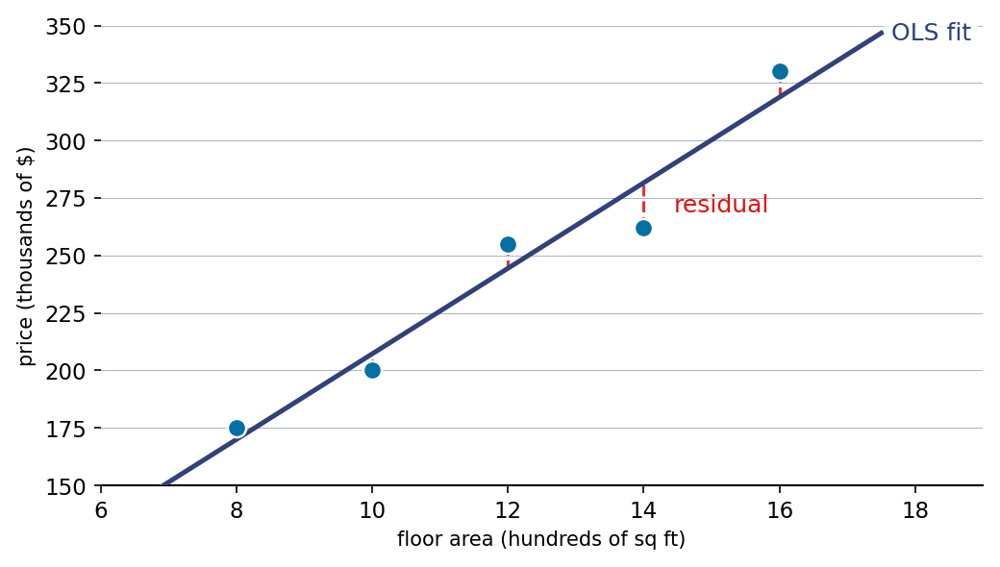

::: {.lm-hero}
[Chapter 2 · Regression Models]{.eyebrow}

# Ordinary Least Squares

[One matrix equation turns a cloud of points into the line that fits them best, and the steps in between show you exactly what "solving" a regression means.]{.dek}
:::

For a linear model $\mathbf{y} = \mathbf{X}\boldsymbol{\theta} + \boldsymbol{\varepsilon}$, the
[ordinary least squares]{.term} estimate is the coefficient vector that minimizes the
residual sum of squares, $\lVert \mathbf{y} - \mathbf{X}\boldsymbol{\theta} \rVert^2$.
Differentiating and setting the gradient to zero gives the [normal equations]{.term}
$\mathbf{X}^\top\mathbf{X}\,\hat{\boldsymbol{\theta}} = \mathbf{X}^\top\mathbf{y}$. When
$\mathbf{X}^\top\mathbf{X}$ is invertible, one line of linear algebra returns the optimum
with no iteration.

::: {.defbox}
[Ordinary Least Squares Estimate]{.lbl}
[ &theta;&#770; = (X&#8868;X)&#8722;&sup1; X&#8868;y ]{.math}
:::

The book states this in a single equation. Below we unpack it: build the
[design matrix]{.term}, watch each cross-product form, invert a $2\times2$ block, and read
off the coefficients. Then we look at the same fit two other ways, extend it to several
features, and see where the formula breaks down numerically.

```{=html}
<figure class="lm-figure">

<figcaption><strong>Least squares, pictured.</strong> The fitted line sits where the total squared length of the dashed red residuals, the vertical gaps from each point to the line, is as small as possible. This is the result the code below reproduces.</figcaption>
</figure>
```

## Solving the normal equations by hand

Five houses, one feature: floor area (hundreds of square feet) against price (thousands of
dollars). The design matrix gets a leading column of ones so the model carries an intercept.
We form $\mathbf{X}^\top\mathbf{X}$ and $\mathbf{X}^\top\mathbf{y}$, invert the first, and
multiply.

::: {.panel-tabset group="lang"}

## Python
```{pyodide}
import numpy as np
np.set_printoptions(precision=4, suppress=True)

# Floor area (hundreds of sq ft) and price (thousands of $)
x = np.array([8, 10, 12, 14, 16])
y = np.array([175, 200, 255, 262, 330])

# Design matrix: a column of ones for the intercept, then the feature
X = np.column_stack([np.ones(len(x)), x])

XtX = X.T @ X                       # 2x2 cross-product
Xty = X.T @ y                       # 2x1
theta = np.linalg.inv(XtX) @ Xty    # normal-equations solution

print("X^T X =\n", XtX)
print("\nX^T y =", Xty)
print("\n(X^T X)^-1 =\n", np.linalg.inv(XtX))
print(f"\ntheta_0 (intercept) = {theta[0]:.2f}")
print(f"theta_1 (slope)     = {theta[1]:.2f}")
print(f"\nPrice ~ {theta[0]:.0f} + {theta[1]:.1f} * area")
```

## R
```{webr}
# Floor area (hundreds of sq ft) and price (thousands of $)
x <- c(8, 10, 12, 14, 16)
y <- c(175, 200, 255, 262, 330)

# Design matrix: a column of ones for the intercept, then the feature
X <- cbind(1, x)

XtX <- t(X) %*% X                 # 2x2 cross-product
Xty <- t(X) %*% y                 # 2x1
theta <- solve(XtX) %*% Xty       # normal-equations solution

cat("X^T X =\n"); print(XtX)
cat("\nX^T y =\n"); print(Xty)
cat("\n(X^T X)^-1 =\n"); print(solve(XtX))
cat(sprintf("\ntheta_0 (intercept) = %.2f\n", theta[1]))
cat(sprintf("theta_1 (slope)     = %.2f\n", theta[2]))
cat(sprintf("\nPrice ~ %.0f + %.1f * area\n", theta[1], theta[2]))
```

:::

The two languages compute the same quantity from the same fixed data, so the coefficients
agree to the printed digits.

## The fit and the residuals it minimizes

The fitted values are $\hat{\mathbf{y}} = \mathbf{X}\hat{\boldsymbol{\theta}}$, and the
residuals $\mathbf{y} - \hat{\mathbf{y}}$ are the vertical gaps that least squares makes as
small as possible in aggregate. The dashed segments below are exactly those gaps.

::: {.panel-tabset group="lang"}

## Python
```{pyodide}
import numpy as np
import matplotlib.pyplot as plt

x = np.array([8, 10, 12, 14, 16])
y = np.array([175, 200, 255, 262, 330])
X = np.column_stack([np.ones(len(x)), x])
theta = np.linalg.inv(X.T @ X) @ (X.T @ y)

y_pred = X @ theta
residuals = y - y_pred

fig, ax = plt.subplots(figsize=(7, 5))
ax.scatter(x, y, s=80, color="#076FA1", edgecolor="white", zorder=3, label="data")
xs = np.linspace(6, 18, 100)
ax.plot(xs, theta[0] + theta[1] * xs, color="#31417A", linewidth=2, label="OLS fit")
for xi, yi, yp in zip(x, y, y_pred):
    ax.plot([xi, xi], [yi, yp], color="#E3120B", linestyle="--", linewidth=1.5, alpha=0.7)
ax.set_xlabel("Floor area (hundreds of sq ft)")
ax.set_ylabel("Price (thousands of $)")
ax.legend()
plt.tight_layout()
plt.show()

print("Actual:    ", y)
print("Predicted: ", y_pred.round(1))
print("Residuals: ", residuals.round(1))
```

## R
```{webr}
x <- c(8, 10, 12, 14, 16)
y <- c(175, 200, 255, 262, 330)
X <- cbind(1, x)
theta <- solve(t(X) %*% X, t(X) %*% y)   # solve(A, b) avoids forming the inverse

y_pred <- as.vector(X %*% theta)
residuals <- y - y_pred

plot(x, y, pch = 19, col = "#076FA1", cex = 1.6,
     xlab = "Floor area (hundreds of sq ft)",
     ylab = "Price (thousands of $)")
abline(a = theta[1], b = theta[2], col = "#31417A", lwd = 2)
segments(x, y, x, y_pred, col = "#E3120B", lty = 2, lwd = 1.5)

cat("Actual:    ", y, "\n")
cat("Predicted: ", round(y_pred, 1), "\n")
cat("Residuals: ", round(residuals, 1), "\n")
```

:::

## A projection in disguise

Least squares has a geometric reading: $\hat{\mathbf{y}}$ is the orthogonal projection of
$\mathbf{y}$ onto the column space of $\mathbf{X}$, the closest reachable point. The
[hat matrix]{.term} $\mathbf{H} = \mathbf{X}(\mathbf{X}^\top\mathbf{X})^{-1}\mathbf{X}^\top$
carries out that projection, and $\mathbf{H}\mathbf{y}$ reproduces the fitted values without
ever naming $\hat{\boldsymbol{\theta}}$. Its trace equals the number of parameters, a fact
that returns later as effective degrees of freedom.

::: {.panel-tabset group="lang"}

## Python
```{pyodide}
import numpy as np
np.set_printoptions(precision=3, suppress=True)

x = np.array([8, 10, 12, 14, 16])
y = np.array([175, 200, 255, 262, 330])
X = np.column_stack([np.ones(len(x)), x])

# Hat matrix: projects y onto the column space of X
H = X @ np.linalg.inv(X.T @ X) @ X.T
print("Hat matrix H (5x5):")
print(H)

theta = np.linalg.inv(X.T @ X) @ (X.T @ y)
print("\nFitted via H @ y:    ", (H @ y).round(1))
print("Fitted via X @ theta:", (X @ theta).round(1))
print("\ntrace(H) =", round(float(np.trace(H)), 3), "= number of parameters")
```

## R
```{webr}
x <- c(8, 10, 12, 14, 16)
y <- c(175, 200, 255, 262, 330)
X <- cbind(1, x)

# Hat matrix: projects y onto the column space of X
H <- X %*% solve(t(X) %*% X) %*% t(X)
cat("Hat matrix H (5x5):\n")
print(round(H, 3))

theta <- solve(t(X) %*% X, t(X) %*% y)
cat("\nFitted via H %*% y:     ", round(as.vector(H %*% y), 1), "\n")
cat("Fitted via X %*% theta: ", round(as.vector(X %*% theta), 1), "\n")
cat("\ntrace(H) =", round(sum(diag(H)), 3), "= number of parameters\n")
```

:::

## More than one feature

Nothing in the formula cares how many columns $\mathbf{X}$ has. We simulate fifty houses
with two features, floor area and bedroom count, from a known relationship
($\text{price} = 20 + 15\,\text{area} + 25\,\text{bedrooms} + \text{noise}$), recover the
coefficients from the noisy data, and confirm them against the production fitter
(`LinearRegression` in Python, `lm` in R). The residual plot checks the model: no pattern
against the fitted values means roughly constant variance.

The two languages draw their noise from different random number generators, so the recovered
numbers differ in the last digits, but both land near the true $(20, 15, 25)$.

::: {.panel-tabset group="lang"}

## Python
```{pyodide}
import numpy as np
import matplotlib.pyplot as plt
from sklearn.linear_model import LinearRegression

np.random.seed(42)
n = 50
area = np.random.uniform(8, 20, n)
bedrooms = np.random.randint(2, 5, n)
price = 20 + 15 * area + 25 * bedrooms + np.random.normal(0, 15, n)

X = np.column_stack([np.ones(n), area, bedrooms])
theta = np.linalg.inv(X.T @ X) @ (X.T @ price)

print("Closed-form coefficients (true value in parens):")
print(f"  intercept       {theta[0]:7.2f}  (20)")
print(f"  area effect     {theta[1]:7.2f}  (15)")
print(f"  bedroom effect  {theta[2]:7.2f}  (25)")

model = LinearRegression().fit(np.column_stack([area, bedrooms]), price)
print(f"\nsklearn: intercept {model.intercept_:.2f}, coefs {model.coef_.round(2)}")

fitted = X @ theta
fig, ax = plt.subplots(figsize=(7, 4))
ax.scatter(fitted, price - fitted, s=40, color="#076FA1", edgecolor="white")
ax.axhline(0, color="black", linestyle="--", linewidth=1, alpha=0.6)
ax.set_xlabel("Fitted values")
ax.set_ylabel("Residuals")
plt.tight_layout()
plt.show()
```

## R
```{webr}
set.seed(42)
n <- 50
area <- runif(n, 8, 20)
bedrooms <- sample(2:4, n, replace = TRUE)
price <- 20 + 15 * area + 25 * bedrooms + rnorm(n, 0, 15)

X <- cbind(1, area, bedrooms)
theta <- solve(t(X) %*% X, t(X) %*% price)

cat("Closed-form coefficients (true value in parens):\n")
cat(sprintf("  intercept       %7.2f  (20)\n", theta[1]))
cat(sprintf("  area effect     %7.2f  (15)\n", theta[2]))
cat(sprintf("  bedroom effect  %7.2f  (25)\n", theta[3]))

fit <- lm(price ~ area + bedrooms)          # lm fits the same model
cat("\nlm coefficients:\n")
print(round(coef(fit), 2))

fitted_vals <- as.vector(X %*% theta)
plot(fitted_vals, price - fitted_vals, pch = 19, col = "#076FA1",
     xlab = "Fitted values", ylab = "Residuals")
abline(h = 0, lty = 2)
```

:::

## When the formula misbehaves

The closed form needs $\mathbf{X}^\top\mathbf{X}$ to be invertible, and inverting it directly
is risky when columns are nearly collinear. The [condition number]{.term} of a matrix
measures how much it amplifies small perturbations; a value past about $10^6$ is a warning.
Forming $\mathbf{X}^\top\mathbf{X}$ squares that condition number, so a feature matrix that is
merely awkward becomes a cross-product that is hopeless.

Below, a second feature is a near-copy of the first. The individual coefficients are then
unidentifiable and both methods report nonsense for them. What survives is the identifiable
quantity $\theta_1 + \theta_2 \approx 5$. Working from $\mathbf{X}$ directly (NumPy's `lstsq`
via the SVD; here, an explicit SVD pseudoinverse in base R) keeps the effective condition
number at its square root and recovers that sum more faithfully than inverting
$\mathbf{X}^\top\mathbf{X}$. The production fitters take the same care for a different reason:
`lm` and `qr.solve` factor $\mathbf{X}$ with QR and never form the cross-product at all.

::: {.panel-tabset group="lang"}

## Python
```{pyodide}
import numpy as np

np.random.seed(42)
n = 100
x1 = np.random.randn(n)
x2 = x1 + np.random.randn(n) * 1e-8        # x2 is almost identical to x1
y = 3 * x1 + 2 * x2 + np.random.randn(n) * 0.1   # so theta1 + theta2 should be ~5

X = np.column_stack([np.ones(n), x1, x2])
print(f"Condition number of X^T X: {np.linalg.cond(X.T @ X):.2e}  (housing data: ~10)\n")

theta_inv = np.linalg.inv(X.T @ X) @ (X.T @ y)   # invert the squared matrix
theta_svd, *_ = np.linalg.lstsq(X, y, rcond=None)  # SVD on X directly

print("Individual coefficients (true: theta1=3, theta2=2):")
print(f"  inverse: theta1={theta_inv[1]:12.2f}, theta2={theta_inv[2]:12.2f}")
print(f"  lstsq:   theta1={theta_svd[1]:12.2f}, theta2={theta_svd[2]:12.2f}")
print("\nIdentifiable quantity theta1 + theta2 (should be ~5):")
print(f"  inverse: {theta_inv[1] + theta_inv[2]:.3f}")
print(f"  lstsq:   {theta_svd[1] + theta_svd[2]:.3f}")
```

## R
```{webr}
set.seed(42)
n <- 100
x1 <- rnorm(n)
x2 <- x1 + rnorm(n) * 1e-8                 # x2 is almost identical to x1
y <- 3 * x1 + 2 * x2 + rnorm(n) * 0.1      # so theta1 + theta2 should be ~5

X <- cbind(1, x1, x2)
cat(sprintf("Condition number of X^T X: %.2e  (housing data: ~10)\n\n",
            kappa(t(X) %*% X, exact = TRUE)))

# Invert the squared matrix (tol = 0 forces R past its singularity guard)
theta_inv <- solve(t(X) %*% X, tol = 0) %*% (t(X) %*% y)

# SVD on X directly: minimum-norm least-squares solution, like numpy's lstsq
sv <- svd(X)
cutoff <- max(sv$d) * .Machine$double.eps * max(dim(X))
d_inv <- ifelse(sv$d > cutoff, 1 / sv$d, 0)
theta_svd <- as.vector(sv$v %*% (d_inv * (t(sv$u) %*% y)))

cat("Individual coefficients (true: theta1=3, theta2=2):\n")
cat(sprintf("  inverse: theta1=%12.2f, theta2=%12.2f\n", theta_inv[2], theta_inv[3]))
cat(sprintf("  svd:     theta1=%12.2f, theta2=%12.2f\n", theta_svd[2], theta_svd[3]))
cat("\nIdentifiable quantity theta1 + theta2 (should be ~5):\n")
cat(sprintf("  inverse: %.3f\n", theta_inv[2] + theta_inv[3]))
cat(sprintf("  svd:     %.3f\n", theta_svd[2] + theta_svd[3]))
```

:::

The closed form is exact, direct, and the right mental model for what regression does. Its
costs (an invertible cross-product, an $\mathcal{O}(p^3)$ inversion, no easy room for
regularization) are exactly what motivate gradient descent and ridge penalties in the
chapters that follow.

::: {.explore}
[Try it]{.lbl}
In the housing example, change one price to a clear outlier (say `330` becomes `530`) and
re-run the fit and residual plot. Watch how the single point tugs the whole line and inflates
every residual, a first look at why least squares is sensitive to outliers.
:::
