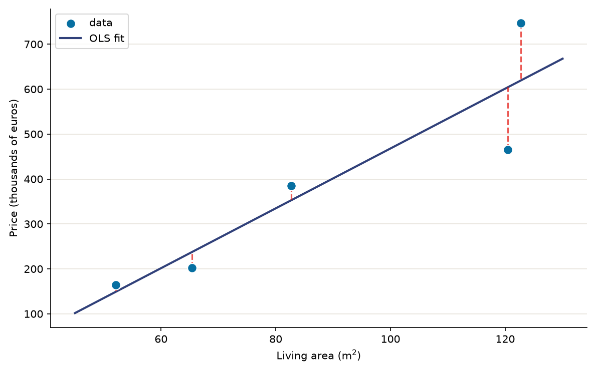

::: {.lm-hero}
[Chapter 2 · Regression Models]{.eyebrow}

# Ordinary Least Squares

[One matrix equation turns a cloud of points into the line that fits them best, and the steps in between show you exactly what "solving" a regression means.]{.dek}
:::

For a linear model $\mathbf{y} = \mathbf{X}\boldsymbol{\theta} + \boldsymbol{\varepsilon}$, the
[ordinary least squares]{.term} estimate is the coefficient vector that minimizes the
residual sum of squares, $\lVert \mathbf{y} - \mathbf{X}\boldsymbol{\theta} \rVert^2$.
Differentiating and setting the gradient to zero gives the [normal equation]{.term}
$\mathbf{X}^\top\mathbf{X}\,\hat{\boldsymbol{\theta}} = \mathbf{X}^\top\mathbf{y}$. When
$\mathbf{X}^\top\mathbf{X}$ is invertible, one line of linear algebra returns the optimum
with no iteration.

::: {.defbox}
[Ordinary Least Squares Estimate]{.lbl}
[ &theta;&#770; = (X<sup>&#8868;</sup>X)<sup>&#8722;1</sup> X<sup>&#8868;</sup>y ]{.math}
:::

The book states this in a single equation. Below we unpack it: build the
[design matrix]{.term}, watch each cross-product form, invert a $2\times2$ block, and read
off the coefficients. Then we look at the same fit two other ways, extend it to several
features, and see where the formula breaks down numerically.

```{=html}
<figure class="lm-figure">

<figcaption><strong>Least squares, pictured.</strong> The fitted line sits where the total squared length of the dashed red residuals, the vertical gaps from each point to the line, is as small as possible. This is the result the code below reproduces.</figcaption>
</figure>
```

## Solving the normal equation by hand

Five houses, one feature: the first five rows of the book's Frankfurt data set, living area
in square meters against price in thousands of euros. The design matrix gets a leading column of ones so the model carries an intercept.
We form $\mathbf{X}^\top\mathbf{X}$ and $\mathbf{X}^\top\mathbf{y}$, invert the first, and
multiply.

::: {.panel-tabset group="lang"}

## Python
```{pyodide}
import numpy as np
np.set_printoptions(precision=4, suppress=True)

# Living area (m^2) and price (thousands of euros): the book's first five Frankfurt houses
x = np.array([52.14, 82.69, 120.47, 122.73, 65.40])
y = np.array([164.22, 384.49, 465.42, 746.54, 202.26])

# Design matrix: a column of ones for the intercept, then the feature
X = np.column_stack([np.ones(len(x)), x])

XtX = X.T @ X                       # 2x2 cross-product
Xty = X.T @ y                       # 2x1
theta = np.linalg.inv(XtX) @ Xty    # normal-equation solution

print("X^T X =\n", XtX)
print("\nX^T y =", Xty)
print("\n(X^T X)^-1 =\n", np.linalg.inv(XtX))
print(f"\ntheta_0 (intercept) = {theta[0]:.2f}")
print(f"theta_1 (slope)     = {theta[1]:.2f}")
print(f"\nPrice ~ {theta[0]:.0f} + {theta[1]:.1f} * area")
```

## R
```{webr}
# Living area (m^2) and price (thousands of euros): the book's first five Frankfurt houses
x <- c(52.14, 82.69, 120.47, 122.73, 65.40)
y <- c(164.22, 384.49, 465.42, 746.54, 202.26)

# Design matrix: a column of ones for the intercept, then the feature
X <- cbind(1, x)

XtX <- t(X) %*% X                 # 2x2 cross-product
Xty <- t(X) %*% y                 # 2x1
theta <- solve(XtX) %*% Xty       # normal-equation solution

cat("X^T X =\n"); print(XtX)
cat("\nX^T y =\n"); print(Xty)
cat("\n(X^T X)^-1 =\n"); print(solve(XtX))
cat(sprintf("\ntheta_0 (intercept) = %.2f\n", theta[1]))
cat(sprintf("theta_1 (slope)     = %.2f\n", theta[2]))
cat(sprintf("\nPrice ~ %.0f + %.1f * area\n", theta[1], theta[2]))
```

:::

## The fit and the residuals it minimizes

The fitted values are $\hat{\mathbf{y}} = \mathbf{X}\hat{\boldsymbol{\theta}}$, and the
residuals $\mathbf{y} - \hat{\mathbf{y}}$ are the vertical gaps that least squares makes as
small as possible in aggregate. The dashed segments below are exactly those gaps.

::: {.panel-tabset group="lang"}

## Python
```{pyodide}
import numpy as np
import matplotlib.pyplot as plt

x = np.array([52.14, 82.69, 120.47, 122.73, 65.40])
y = np.array([164.22, 384.49, 465.42, 746.54, 202.26])
X = np.column_stack([np.ones(len(x)), x])
theta = np.linalg.inv(X.T @ X) @ (X.T @ y)

y_pred = X @ theta
residuals = y - y_pred

fig, ax = plt.subplots(figsize=(7, 5))
ax.scatter(x, y, s=80, color="#076FA1", edgecolor="white", zorder=3, label="data")
xs = np.linspace(45, 130, 100)
ax.plot(xs, theta[0] + theta[1] * xs, color="#31417A", linewidth=2, label="OLS fit")
for xi, yi, yp in zip(x, y, y_pred):
    ax.plot([xi, xi], [yi, yp], color="#E3120B", linestyle="--", linewidth=1.5, alpha=0.7)
ax.set_xlabel("Living area (m$^2$)")
ax.set_ylabel("Price (thousands of euros)")
ax.legend()
for s in ["top", "right"]:
    ax.spines[s].set_visible(False)
ax.grid(axis="y", color="#e6e3da", lw=0.8)
ax.set_axisbelow(True)
plt.tight_layout()
plt.show()

print("Actual:    ", y)
print("Predicted: ", y_pred.round(1))
print("Residuals: ", residuals.round(1))
```

## R
```{webr}
x <- c(52.14, 82.69, 120.47, 122.73, 65.40)
y <- c(164.22, 384.49, 465.42, 746.54, 202.26)
X <- cbind(1, x)
theta <- solve(t(X) %*% X, t(X) %*% y)   # solve(A, b) avoids forming the inverse

y_pred <- as.vector(X %*% theta)
residuals <- y - y_pred

plot(x, y, pch = 19, col = "#076FA1", cex = 1.6, bty = "l",
     xlab = "Living area (m^2)",
     ylab = "Price (thousands of euros)")
grid(col = "#e6e3da", lty = 1, lwd = 0.6)
abline(a = theta[1], b = theta[2], col = "#31417A", lwd = 2)
segments(x, y, x, y_pred, col = "#E3120B", lty = 2, lwd = 1.5)

cat("Actual:    ", y, "\n")
cat("Predicted: ", round(y_pred, 1), "\n")
cat("Residuals: ", round(residuals, 1), "\n")
```

:::

## A projection in disguise

Least squares has a geometric reading: $\hat{\mathbf{y}}$ is the orthogonal projection of
$\mathbf{y}$ onto the column space of $\mathbf{X}$, the closest reachable point. The
[hat matrix]{.term} $\mathbf{H} = \mathbf{X}(\mathbf{X}^\top\mathbf{X})^{-1}\mathbf{X}^\top$
carries out that projection, and $\mathbf{H}\mathbf{y}$ reproduces the fitted values without
ever naming $\hat{\boldsymbol{\theta}}$. Its trace equals the number of parameters, a fact
that returns later as effective degrees of freedom.

::: {.panel-tabset group="lang"}

## Python
```{pyodide}
import numpy as np
np.set_printoptions(precision=3, suppress=True)

x = np.array([52.14, 82.69, 120.47, 122.73, 65.40])
y = np.array([164.22, 384.49, 465.42, 746.54, 202.26])
X = np.column_stack([np.ones(len(x)), x])

# Hat matrix: projects y onto the column space of X
H = X @ np.linalg.inv(X.T @ X) @ X.T
print("Hat matrix H (5x5):")
print(H)

theta = np.linalg.inv(X.T @ X) @ (X.T @ y)
print("\nFitted via H @ y:    ", (H @ y).round(1))
print("Fitted via X @ theta:", (X @ theta).round(1))
print("\ntrace(H) =", round(float(np.trace(H)), 3), "= number of parameters")
```

## R
```{webr}
x <- c(52.14, 82.69, 120.47, 122.73, 65.40)
y <- c(164.22, 384.49, 465.42, 746.54, 202.26)
X <- cbind(1, x)

# Hat matrix: projects y onto the column space of X
H <- X %*% solve(t(X) %*% X) %*% t(X)
cat("Hat matrix H (5x5):\n")
print(round(H, 3))

theta <- solve(t(X) %*% X, t(X) %*% y)
cat("\nFitted via H %*% y:     ", round(as.vector(H %*% y), 1), "\n")
cat("Fitted via X %*% theta: ", round(as.vector(X %*% theta), 1), "\n")
cat("\ntrace(H) =", round(sum(diag(H)), 3), "= number of parameters\n")
```

:::

The hat matrix prints, but the geometry it performs does not. Drop to three observations and
the picture becomes drawable: with two parameters the column space of $\mathbf{X}$ is a plane
inside $\mathbb{R}^3$, $\mathbf{y}$ is a point off that plane, and $\hat{\mathbf{y}}$ is the
spot on it that $\mathbf{y}$ is closest to. The dashed residual meets the plane at a right
angle, and that right angle *is* the least-squares condition — it is what $\mathbf{X}^\top
\mathbf{r} = \mathbf{0}$ says. The cell checks it two ways before drawing: the residual is
orthogonal to both columns, and $\lVert\mathbf{y}\rVert^2 = \lVert\hat{\mathbf{y}}\rVert^2 +
\lVert\mathbf{r}\rVert^2$ exactly, which is Pythagoras with the right angle supplied by the
projection.

::: {.panel-tabset group="lang"}

## Python
```{pyodide}
import numpy as np
import matplotlib.pyplot as plt

# Three observations, so the column space of X is a plane in R^3. y is chosen well off
# that plane; with y nearly inside it the residual would be too short to see.
x3 = np.array([8., 12., 16.])
y3 = np.array([100., 400., 250.])
X3 = np.column_stack([np.ones(len(x3)), x3])

H3 = X3 @ np.linalg.inv(X3.T @ X3) @ X3.T
y_hat3 = H3 @ y3
r3 = y3 - y_hat3

print("X^T r =", (X3.T @ r3).round(9), " <- zero: the residual is perpendicular to the plane")
print(f"|y|^2               = {y3 @ y3:.1f}")
print(f"|y_hat|^2 + |r|^2   = {y_hat3 @ y_hat3 + r3 @ r3:.1f}   <- Pythagoras, exactly")
print(f"trace(H) = {np.trace(H3):.1f} = number of parameters")

# y, y_hat and r all lie in one plane, so drawing that plane loses nothing: the picture
# below is exact, not a projection of a 3-D scene. The column space appears edge-on.
adj = np.linalg.norm(y_hat3)
opp = np.linalg.norm(r3)

fig, ax = plt.subplots(figsize=(7, 4.6))
ax.axhline(0, color="#076FA1", lw=2.5, zorder=1)
ax.annotate("", xy=(adj, 0), xytext=(0, 0),
            arrowprops=dict(arrowstyle="-|>", color="#31417A", lw=2.4))
ax.annotate("", xy=(adj, opp), xytext=(0, 0),
            arrowprops=dict(arrowstyle="-|>", color="#E3120B", lw=2.4))
ax.plot([adj, adj], [0, opp], color="#666666", lw=2.0, ls="--")
tick = adj * 0.045
ax.plot([adj - tick, adj - tick, adj], [0, tick, tick], color="#666666", lw=1.2)
ax.text(adj * 0.06, -34, "column space of X, seen edge-on", color="#076FA1", fontsize=10)
ax.text(adj * 0.50, -30, r"$\hat{y} = Hy$", color="#31417A", fontsize=12)
ax.text(adj * 0.40, opp * 0.62, r"$y$", color="#E3120B", fontsize=13)
ax.text(adj * 1.02, opp * 0.45, r"$r$", color="#666666", fontsize=12)
ax.set_xlim(-30, adj * 1.18); ax.set_ylim(-50, opp * 1.35)
ax.set_aspect("equal"); ax.axis("off")
ax.set_title("Least squares is a projection onto the column space")
plt.tight_layout()
plt.show()
```

## R
```{webr}
# Three observations, so the column space of X is a plane in R^3. y is chosen well off
# that plane; with y nearly inside it the residual would be too short to see.
x3 <- c(8, 12, 16)
y3 <- c(100, 400, 250)
X3 <- cbind(1, x3)

H3 <- X3 %*% solve(t(X3) %*% X3) %*% t(X3)
y_hat3 <- as.vector(H3 %*% y3)
r3 <- y3 - y_hat3

cat("t(X) %*% r =", round(as.vector(t(X3) %*% r3), 9),
    " <- zero: the residual is perpendicular to the plane\n")
cat(sprintf("|y|^2             = %.1f\n", sum(y3^2)))
cat(sprintf("|y_hat|^2 + |r|^2 = %.1f   <- Pythagoras, exactly\n",
            sum(y_hat3^2) + sum(r3^2)))
cat(sprintf("trace(H) = %.1f = number of parameters\n", sum(diag(H3))))

# y, y_hat and r all lie in one plane, so drawing that plane loses nothing: the picture
# below is exact, not a projection of a 3-D scene. The column space appears edge-on.
adj <- sqrt(sum(y_hat3^2))
opp <- sqrt(sum(r3^2))

plot(NA, xlim = c(-30, adj * 1.18), ylim = c(-50, opp * 1.35), asp = 1,
     axes = FALSE, xlab = "", ylab = "",
     main = "Least squares is a projection onto the column space")
abline(h = 0, col = "#076FA1", lwd = 2.5)
arrows(0, 0, adj, 0, col = "#31417A", lwd = 2.4, length = 0.12)
arrows(0, 0, adj, opp, col = "#E3120B", lwd = 2.4, length = 0.12)
segments(adj, 0, adj, opp, col = "#666666", lwd = 2.0, lty = 2)
tick <- adj * 0.045
lines(c(adj - tick, adj - tick, adj), c(0, tick, tick), col = "#666666", lwd = 1.2)
text(adj * 0.06, -34, "column space of X, seen edge-on", col = "#076FA1", cex = 0.8, adj = 0)
text(adj * 0.50, -30, "y_hat = Hy", col = "#31417A", cex = 0.95)
text(adj * 0.40, opp * 0.62, "y", col = "#E3120B", cex = 1.05)
text(adj * 1.02, opp * 0.45, "r", col = "#666666", cex = 0.95, adj = 0)
```

:::

The static drawing above fixes the line at its least-squares position. The interactive
figure below lets you move the line and watch the projection respond. It uses the three houses
of Section 2.3 of the book, with sizes $-1, 0, 1$ relative to the mean and prices $2, 3, 5$. Its
left panel shows the familiar line. Its right panel shows the same fit in data space, where each
axis is one house's price, so the three prices are a single point and every line the model can
draw is a point on the shaded plane. Drag the sliders, or rotate the right panel. The residual
stands at a right angle to the plane exactly when it has no average left and no trend in size.

```{=html}
<div class="lm-ix lsproj" role="figure" aria-label="Interactive figure: least squares as a projection">
<div class="ix-eyebrow">Interactive</div>
<div class="ix-title">Least squares as a projection</div>
<div class="ix-views">
    <div class="ix-card">
      <div class="ix-ttl">The line</div>
      <p class="ix-sub">Residuals are the vertical gaps; the intercept is the height at size 0.</p>
      <svg id="lsp-fit" viewBox="0 0 420 340" aria-label="Scatter of three houses with the current line and residuals"></svg>
    </div>
    <div class="ix-card">
      <div class="ix-ttl">Data space</div>
      <p class="ix-sub">Each axis is one house's price, so the three prices are a single point. The shaded plane holds every set of fitted values a line can produce. Drag to rotate.</p>
      <svg id="lsp-space" viewBox="0 0 520 400" aria-label="Three-dimensional view of the target vector, the column-space plane and the residual"></svg>
    </div>
  </div>

  <div class="lm-slider"><label for="lsp-t0">Intercept <span class="sym">θ₀</span></label><input id="lsp-t0" type="range" min="0" max="6" step="any" value="3.3333333333"><output id="lsp-t0v"></output></div>
<div class="lm-slider"><label for="lsp-t1">Slope <span class="sym">θ₁</span></label><input id="lsp-t1" type="range" min="-1" max="4" step="any" value="2"><output id="lsp-t1v"></output></div>
  <div class="ix-buttons">
    <button id="lsp-ls">Least-squares line</button>
    <button id="lsp-steep">Slope 2 (the text's steeper line)</button>
    <button id="lsp-flat">Flat line at the mean</button>
    <button id="lsp-zoom">Show the whole space</button>
  </div>

  <div class="ix-readout">
    <div class="ix-stat" id="lsp-s-rss"><div class="k">RSS = length² of the residual</div><div class="v" id="lsp-rss"></div></div>
    <div class="ix-stat" id="lsp-s-sum"><div class="k">Residuals summed (against the column of 1s)</div><div class="v" id="lsp-sum"></div></div>
    <div class="ix-stat" id="lsp-s-trend"><div class="k">Residuals × size (against the size column)</div><div class="v" id="lsp-trend"></div></div>
    <div class="ix-stat" id="lsp-s-ang"><div class="k">Angle between residual and plane</div><div class="v" id="lsp-ang"></div></div>
  </div>

  <div class="ix-note" id="lsp-note"></div>
<script>
(function () {
  const X = [-1, 0, 1], Y = [2, 3, 5];
  const LS = { t0: 10 / 3, t1: 1.5 };
  const t0 = document.getElementById('lsp-t0'), t1 = document.getElementById('lsp-t1');
  const root = document.querySelector('.lsproj');
  const css = n => getComputedStyle(root).getPropertyValue(n === '--fsblue' ? '--ix-fs' : n.replace('--', '--ix-')).trim();   // kit colors (theme.scss .lm-ix)
  const NS = 'http://www.w3.org/2000/svg';
  function el(tag, attrs, parent) {
    const e = document.createElementNS(NS, tag);
    for (const k in attrs) e.setAttribute(k, attrs[k]);
    if (parent) parent.appendChild(e);
    return e;
  }
  const fmt = (v, d = 2) => (Math.abs(v) < 0.005 ? 0 : v).toFixed(d).replace('-0.00', '0.00');

  // ---- left panel: the line ----
  const fit = document.getElementById('lsp-fit');
  const fx = x => 60 + (x + 1.6) / 3.2 * 330, fy = y => 300 - (y - 0) / 7 * 270;
  function drawFit(a, b) {
    fit.innerHTML = '';
    const defs = el('defs', {}, fit); const cp = el('clipPath', { id: 'lsp-plotclip' }, defs); el('rect', { x: 60, y: 30, width: 330, height: 270 }, cp);
    const g = css('--grid'), f = css('--axis'), m = css('--muted');
    for (let y = 0; y <= 7; y++) {
      el('line', { x1: 60, x2: 390, y1: fy(y), y2: fy(y), stroke: g }, fit);
      el('text', { x: 52, y: fy(y) + 4, 'text-anchor': 'end', 'font-size': 14, fill: m }, fit).textContent = y;
    }
    el('line', { x1: 60, x2: 390, y1: 300, y2: 300, stroke: f }, fit);
    el('line', { x1: 60, x2: 60, y1: 30, y2: 300, stroke: f }, fit);
    for (const x of [-1, 0, 1]) el('text', { x: fx(x), y: 318, 'text-anchor': 'middle', 'font-size': 14, fill: m }, fit).textContent = x;
    el('text', { x: 225, y: 336, 'text-anchor': 'middle', 'font-size': 15, fill: m }, fit).textContent = 'size, relative to the mean';
    el('text', { x: 14, y: 165, 'font-size': 15, fill: m, transform: 'rotate(-90 14 165)', 'text-anchor': 'middle' }, fit).textContent = 'price';
    el('line', { x1: fx(0), x2: fx(0), y1: 30, y2: 300, stroke: m, 'stroke-width': 1, 'stroke-dasharray': '2 4' }, fit);
    el('line', { x1: fx(-1.6), y1: fy(a + b * -1.6), x2: fx(1.6), y2: fy(a + b * 1.6), stroke: css('--fsblue'), 'stroke-width': 2.6, 'clip-path': 'url(#lsp-plotclip)' }, fit);
    if (a >= 0 && a <= 7) {
      el('line', { x1: fx(0) - 12, x2: fx(0) - 3, y1: fy(a), y2: fy(a), stroke: css('--fsblue'), 'stroke-width': 2 }, fit);
      el('text', { x: fx(0) - 16, y: fy(a) + 4, 'text-anchor': 'end', 'font-size': 15, fill: css('--fsblue') }, fit).textContent = 'intercept θ₀ = ' + fmt(a);
    }
    X.forEach((x, i) => {
      const yh = a + b * x;
      el('line', { x1: fx(x), x2: fx(x), y1: fy(Y[i]), y2: fy(yh), stroke: css('--red'), 'stroke-width': 2, 'stroke-dasharray': '4 3' }, fit);
      el('circle', { cx: fx(x), cy: fy(Y[i]), r: 6, fill: css('--blue'), stroke: css('--bg'), 'stroke-width': 2 }, fit);
    });
  }

  // ---- right panel: data space ----
  const space = document.getElementById('lsp-space');
    let yaw = -2.3, pitch = 0.6;
  let close = true;
  let CX = 235, CY = 300, S = 27, OFF = [0, 0, 0];
  function proj(v) {
    v = v.map((c, i) => c - OFF[i]);
    // rotate about vertical (z) axis, then tilt; orthographic
    const [x, y, z] = v;
    const cy = Math.cos(yaw), sy = Math.sin(yaw), cp = Math.cos(pitch), sp = Math.sin(pitch);
    const x1 = cy * x - sy * y, y1 = sy * x + cy * y;
    const sx = x1, depth = y1 * cp + z * sp, sz = z * cp - y1 * sp;
    return [CX + S * sx, CY - S * sz, depth];
  }
  const add = (a, b) => a.map((v, i) => v + b[i]), mul = (a, s) => a.map(v => v * s);
  const C1 = [1, 1, 1], C2 = [-1, 0, 1];
  const P = (a, b) => add(mul(C1, a), mul(C2, b));
  function line(a, b, attrs) { const p = proj(a), q = proj(b); return el('line', Object.assign({ x1: p[0], y1: p[1], x2: q[0], y2: q[1] }, attrs), space); }
  function arrow(from, to, color, w) {
    line(from, to, { stroke: color, 'stroke-width': w || 2.2 });
    const p = proj(from), q = proj(to), dx = q[0] - p[0], dy = q[1] - p[1], L = Math.hypot(dx, dy) || 1;
    const ux = dx / L, uy = dy / L, s = 8;
    el('polygon', { points: `${q[0]},${q[1]} ${q[0] - s * ux - s * 0.5 * uy},${q[1] - s * uy + s * 0.5 * ux} ${q[0] - s * ux + s * 0.5 * uy},${q[1] - s * uy - s * 0.5 * ux}`, fill: color }, space);
  }
  function label(v, text, color, dx, dy) { const p = proj(v); el('text', { x: p[0] + (dx || 6), y: p[1] + (dy || -6), 'font-size': 15, fill: color }, space).textContent = text; }

  function drawClose(a, b, m, g) {
    const lo0 = Math.min(a, LS.t0) - 0.8, hi0 = Math.max(a, LS.t0) + 0.8;
    const lo1 = Math.min(b, LS.t1) - 0.6, hi1 = Math.max(b, LS.t1) + 0.6;
    const corners = [P(lo0, lo1), P(hi0, lo1), P(hi0, hi1), P(lo0, hi1)].map(proj);
    el('polygon', { points: corners.map(c => c[0] + ',' + c[1]).join(' '), fill: css('--plane'), stroke: css('--cyan'), 'stroke-width': 1 }, space);
    for (let i = Math.ceil(lo0 * 2) / 2; i <= hi0; i += 0.5) line(P(i, lo1), P(i, hi1), { stroke: g, 'stroke-width': 0.8 });
    for (let j = Math.ceil(lo1 * 2) / 2; j <= hi1; j += 0.5) line(P(lo0, j), P(hi0, j), { stroke: g, 'stroke-width': 0.8 });
    // directions within the plane, drawn from the least-squares point
    const base = P(LS.t0, LS.t1);
    arrow(base, add(base, mul(C1, 0.6)), css('--cyan'), 1.8); label(add(base, mul(C1, 0.6)), 'raise the line', css('--blue'), 8, -4);
    arrow(base, add(base, mul(C2, 0.6)), css('--orange'), 1.6); label(add(base, mul(C2, 0.6)), 'tilt the line', css('--orange'), 8, 4);
    const yv = Y, p = P(a, b), r = yv.map((v, i) => v - p[i]);
    line(p, yv, { stroke: css('--red'), 'stroke-width': 2.6, 'stroke-dasharray': '6 4' });
    const pp = proj(p), py = proj(yv);
    el('circle', { cx: pp[0], cy: pp[1], r: 6.5, fill: css('--fsblue'), stroke: css('--bg'), 'stroke-width': 2 }, space);
    el('circle', { cx: py[0], cy: py[1], r: 7, fill: css('--blue'), stroke: css('--bg'), 'stroke-width': 2 }, space);
    label(yv, 'prices y = (2, 3, 5)', css('--blue'), -128, -12);
    label(p, 'fitted values', css('--fsblue'), -40, 24);
    const d1 = r.reduce((s, v, i) => s + v * C1[i], 0), d2 = r.reduce((s, v, i) => s + v * C2[i], 0);
    if (Math.abs(d1) < 0.02 && Math.abs(d2) < 0.02) {
      const rn = Math.hypot(...r) || 1, u = mul(r, 0.14 / rn);
      const w0 = C1, wn = Math.hypot(...w0), w = mul(w0, 0.14 / wn);
      const a1 = proj(add(p, u)), a2 = proj(add(add(p, u), w)), a3 = proj(add(p, w));
      el('polyline', { points: `${a1[0]},${a1[1]} ${a2[0]},${a2[1]} ${a3[0]},${a3[1]}`, fill: 'none', stroke: css('--red'), 'stroke-width': 1.6 }, space);
    }
    return { r, d1, d2 };
  }

  function drawSpace(a, b) {
    space.innerHTML = '';
    const m = css('--muted'), g = css('--grid');
    if (close) { const q = P(a, b), mid = Y.map((v, i) => (v + q[i]) / 2), rl = Math.hypot(...Y.map((v, i) => v - q[i]));
      OFF = mid; CX = 260; CY = 235; S = Math.max(40, Math.min(115, 190 / (rl + 0.9))); } else { OFF = [0, 0, 0]; CX = 235; CY = 300; S = 27; }
    if (close) return drawClose(a, b, m, g);
    // axes
    const L = 6.5;
    [[[L, 0, 0], 'house 1'], [[0, L, 0], 'house 2'], [[0, 0, L], 'house 3']].forEach(([v, t]) => { line([0, 0, 0], v, { stroke: m, 'stroke-width': 1 }); label(v, t, m); });
    // plane patch: theta0 in [0,6], theta1 in [-1.5,3.5]
    const corners = [P(0, -1), P(5.5, -1), P(5.5, 3), P(0, 3)].map(proj);
    el('polygon', { points: corners.map(c => c[0] + ',' + c[1]).join(' '), fill: css('--plane'), stroke: css('--cyan'), 'stroke-width': 1 }, space);
    for (let i = 0; i <= 5; i++) line(P(i, -1), P(i, 3), { stroke: g, 'stroke-width': 0.8 });
    for (let j = -1; j <= 3.01; j += 1) line(P(0, j), P(5.5, j), { stroke: g, 'stroke-width': 0.8 });
    // column vectors
    arrow([0, 0, 0], C1, css('--cyan')); label(C1, 'column of 1s', css('--blue'));
    arrow([0, 0, 0], C2, css('--orange')); label(C2, 'size column', css('--orange'), -70, 4);
    // target, fitted point, residual
    const yv = Y, p = P(a, b);
    const r = yv.map((v, i) => v - p[i]);
    line(p, yv, { stroke: css('--red'), 'stroke-width': 2.4, 'stroke-dasharray': '6 4' });
    const pp = proj(p), py = proj(yv);
    el('circle', { cx: pp[0], cy: pp[1], r: 6, fill: css('--fsblue'), stroke: css('--bg'), 'stroke-width': 2 }, space);
    el('circle', { cx: py[0], cy: py[1], r: 6.5, fill: css('--blue'), stroke: css('--bg'), 'stroke-width': 2 }, space);
    label(yv, 'prices y = (2, 3, 5)', css('--blue'));
    label(p, 'fitted values', css('--fsblue'), 8, 16);
    // right-angle mark when residual is perpendicular to the plane
    const d1 = r.reduce((s, v, i) => s + v * C1[i], 0), d2 = r.reduce((s, v, i) => s + v * C2[i], 0);
    if (Math.abs(d1) < 0.02 && Math.abs(d2) < 0.02) {
      const rn = Math.hypot(...r) || 1, u = mul(r, 0.35 / rn);
      const w0 = add(mul(C1, 0.2), mul(C2, 0.1)), wn = Math.hypot(...w0), w = mul(w0, 0.35 / wn);
      const a1 = proj(add(p, u)), a2 = proj(add(add(p, u), w)), a3 = proj(add(p, w));
      el('polyline', { points: `${a1[0]},${a1[1]} ${a2[0]},${a2[1]} ${a3[0]},${a3[1]}`, fill: 'none', stroke: css('--red'), 'stroke-width': 1.5 }, space);
    }
    return { r, d1, d2 };
  }

  function update() {
    const a = +t0.value, b = +t1.value;
    document.getElementById('lsp-t0v').textContent = fmt(a);
    document.getElementById('lsp-t1v').textContent = fmt(b);
    drawFit(a, b);
    const { r, d1, d2 } = drawSpace(a, b);
    const rss = r.reduce((s, v) => s + v * v, 0);
    document.getElementById('lsp-rss').textContent = fmt(rss, 3);
    document.getElementById('lsp-sum').textContent = fmt(d1);
    document.getElementById('lsp-trend').textContent = fmt(d2);
    // angle between residual and its projection onto the plane's normal
    const n = [1, -2, 1], nn = Math.hypot(...n), rn = Math.hypot(...r);
    const ang = rn < 1e-9 ? 90 : Math.asin(Math.min(1, Math.abs(r.reduce((s, v, i) => s + v * n[i], 0)) / (nn * rn))) * 180 / Math.PI;
    document.getElementById('lsp-ang').textContent = fmt(ang, 1) + '°';
    document.getElementById('lsp-s-sum').classList.toggle('zero', Math.abs(d1) < 0.02);
    document.getElementById('lsp-s-trend').classList.toggle('zero', Math.abs(d2) < 0.02);
    document.getElementById('lsp-s-ang').classList.toggle('zero', Math.abs(ang - 90) < 0.5);
    const note = document.getElementById('lsp-note');
    if (Math.abs(d1) < 0.02 && Math.abs(d2) < 0.02) {
      note.innerHTML = 'This is the least-squares line. The residuals sum to zero and show no trend in size, so the residual meets the plane at a right angle: the fitted values are the point on the plane closest to the prices. RSS is ' + fmt(rss, 3) + ', the smallest any line can reach.';
    } else {
      const parts = [];
      if (Math.abs(d1) >= 0.02) parts.push('the residuals still have an average (' + fmt(d1) + '), so raising or lowering the line would help');
      if (Math.abs(d2) >= 0.02) parts.push('they still trend with size (' + fmt(d2) + '), so tilting the line would help');
      note.innerHTML = 'Not yet the closest point: ' + parts.join('; and ') + '. In data space the residual leans along the plane instead of standing straight off it.';
    }
  }
  function set(a, b) { t0.value = a; t1.value = b; update(); }
  t0.addEventListener('input', update); t1.addEventListener('input', update);
  document.getElementById('lsp-ls').onclick = () => set(LS.t0, LS.t1);
  document.getElementById('lsp-steep').onclick = () => set(LS.t0, 2);
  document.getElementById('lsp-flat').onclick = () => set(LS.t0, 0);
  const zb = document.getElementById('lsp-zoom');
  zb.onclick = () => { close = !close; zb.textContent = close ? 'Show the whole space' : 'Close-up of the fit'; update(); };
  zb.textContent = close ? 'Show the whole space' : 'Close-up of the fit';

  // drag to rotate
  let drag = null;
  space.addEventListener('pointerdown', e => { drag = { x: e.clientX, y: e.clientY, yaw, pitch }; space.setPointerCapture(e.pointerId); });
  space.addEventListener('pointermove', e => {
    if (!drag) return;
    yaw = drag.yaw + (e.clientX - drag.x) * 0.01;
    pitch = Math.max(-1.2, Math.min(1.4, drag.pitch + (e.clientY - drag.y) * 0.01));
    update();
  });
  space.addEventListener('pointerup', () => { drag = null; });
    update();
})();
</script>
</div>
```

## More than one feature

Nothing in the formula cares how many columns $\mathbf{X}$ has. We simulate fifty houses
with two features, floor area and bedroom count, from a known relationship
($\text{price} = 20 + 15\,\text{area} + 25\,\text{bedrooms} + \text{noise}$), recover the
coefficients from the noisy data, and confirm them against the production fitter
(`LinearRegression` in Python, `lm` in R). The residual plot checks the model: no pattern
against the fitted values means roughly constant variance.

The two languages draw their noise from different random number generators, so the recovered
numbers differ in the last digits, but both land near the true $(20, 15, 25)$.

::: {.panel-tabset group="lang"}

## Python
```{pyodide}
import numpy as np
import matplotlib.pyplot as plt
from sklearn.linear_model import LinearRegression

np.random.seed(42)
m = 50
area = np.random.uniform(8, 20, m)
bedrooms = np.random.randint(2, 5, m)
price = 20 + 15 * area + 25 * bedrooms + np.random.normal(0, 15, m)

X = np.column_stack([np.ones(m), area, bedrooms])
theta = np.linalg.inv(X.T @ X) @ (X.T @ price)

print("Closed-form coefficients (true value in parens):")
print(f"  intercept       {theta[0]:7.2f}  (20)")
print(f"  area effect     {theta[1]:7.2f}  (15)")
print(f"  bedroom effect  {theta[2]:7.2f}  (25)")

model = LinearRegression().fit(np.column_stack([area, bedrooms]), price)
print(f"\nsklearn: intercept {model.intercept_:.2f}, coefs {model.coef_.round(2)}")

fitted = X @ theta
fig, ax = plt.subplots(figsize=(7, 4))
ax.scatter(fitted, price - fitted, s=40, color="#076FA1", edgecolor="white")
ax.axhline(0, color="black", linestyle="--", linewidth=1, alpha=0.6)
ax.set_xlabel("Fitted values")
ax.set_ylabel("Residuals")
for s in ["top", "right"]:
    ax.spines[s].set_visible(False)
ax.grid(axis="y", color="#e6e3da", lw=0.8)
ax.set_axisbelow(True)
plt.tight_layout()
plt.show()
```

## R
```{webr}
set.seed(42)
m <- 50
area <- runif(m, 8, 20)
bedrooms <- sample(2:4, m, replace = TRUE)
price <- 20 + 15 * area + 25 * bedrooms + rnorm(m, 0, 15)

X <- cbind(1, area, bedrooms)
theta <- solve(t(X) %*% X, t(X) %*% price)

cat("Closed-form coefficients (true value in parens):\n")
cat(sprintf("  intercept       %7.2f  (20)\n", theta[1]))
cat(sprintf("  area effect     %7.2f  (15)\n", theta[2]))
cat(sprintf("  bedroom effect  %7.2f  (25)\n", theta[3]))

fit <- lm(price ~ area + bedrooms)          # lm fits the same model
cat("\nlm coefficients:\n")
print(round(coef(fit), 2))

fitted_vals <- as.vector(X %*% theta)
plot(fitted_vals, price - fitted_vals, pch = 19, col = "#076FA1", bty = "l",
     xlab = "Fitted values", ylab = "Residuals")
grid(col = "#e6e3da", lty = 1, lwd = 0.6)
abline(h = 0, lty = 2)
```

:::

## When the formula misbehaves

The closed form needs $\mathbf{X}^\top\mathbf{X}$ to be invertible, and inverting it directly
is risky when columns are nearly collinear. The [condition number]{.term} of a matrix
measures how much it amplifies small perturbations; a value past about $10^6$ is a warning.
Forming $\mathbf{X}^\top\mathbf{X}$ squares that condition number, so a feature matrix that is
merely awkward becomes a cross-product that is hopeless.

Below, a second feature is a near-copy of the first. The individual coefficients are then
unidentifiable and both methods report nonsense for them. What survives is the identifiable
quantity $\theta_1 + \theta_2 \approx 5$. Working from $\mathbf{X}$ directly (NumPy's `lstsq`
via the SVD; here, an explicit SVD pseudoinverse in base R) keeps the effective condition
number at its square root and recovers that sum more faithfully than inverting
$\mathbf{X}^\top\mathbf{X}$. The production fitters take the same care for a different reason:
`lm` and `qr.solve` factor $\mathbf{X}$ with QR and never form the cross-product at all.

::: {.panel-tabset group="lang"}

## Python
```{pyodide}
import numpy as np

np.random.seed(42)
m = 100
x1 = np.random.randn(m)
x2 = x1 + np.random.randn(m) * 1e-8        # x2 is almost identical to x1
y = 3 * x1 + 2 * x2 + np.random.randn(m) * 0.1   # so theta1 + theta2 should be ~5

X = np.column_stack([np.ones(m), x1, x2])
print(f"Condition number of X^T X: {np.linalg.cond(X.T @ X):.2e}  (housing data: about 90,000)\n")

theta_inv = np.linalg.inv(X.T @ X) @ (X.T @ y)   # invert the squared matrix
theta_svd, *_ = np.linalg.lstsq(X, y, rcond=None)  # SVD on X directly

print("Individual coefficients (true: theta1=3, theta2=2):")
print(f"  inverse: theta1={theta_inv[1]:12.2f}, theta2={theta_inv[2]:12.2f}")
print(f"  lstsq:   theta1={theta_svd[1]:12.2f}, theta2={theta_svd[2]:12.2f}")
print("\nIdentifiable quantity theta1 + theta2 (should be ~5):")
print(f"  inverse: {theta_inv[1] + theta_inv[2]:.3f}")
print(f"  lstsq:   {theta_svd[1] + theta_svd[2]:.3f}")
```

## R
```{webr}
set.seed(42)
m <- 100
x1 <- rnorm(m)
x2 <- x1 + rnorm(m) * 1e-8                 # x2 is almost identical to x1
y <- 3 * x1 + 2 * x2 + rnorm(m) * 0.1      # so theta1 + theta2 should be ~5

X <- cbind(1, x1, x2)
cat(sprintf("Condition number of X^T X: %.2e  (housing data: about 90,000)\n\n",
            kappa(t(X) %*% X, exact = TRUE)))

# Invert the squared matrix (tol = 0 forces R past its singularity guard)
theta_inv <- solve(t(X) %*% X, tol = 0) %*% (t(X) %*% y)

# SVD on X directly: minimum-norm least-squares solution, like numpy's lstsq
sv <- svd(X)
cutoff <- max(sv$d) * .Machine$double.eps * max(dim(X))
d_inv <- ifelse(sv$d > cutoff, 1 / sv$d, 0)
theta_svd <- as.vector(sv$v %*% (d_inv * (t(sv$u) %*% y)))

cat("Individual coefficients (true: theta1=3, theta2=2):\n")
cat(sprintf("  inverse: theta1=%12.2f, theta2=%12.2f\n", theta_inv[2], theta_inv[3]))
cat(sprintf("  svd:     theta1=%12.2f, theta2=%12.2f\n", theta_svd[2], theta_svd[3]))
cat("\nIdentifiable quantity theta1 + theta2 (should be ~5):\n")
cat(sprintf("  inverse: %.3f\n", theta_inv[2] + theta_inv[3]))
cat(sprintf("  svd:     %.3f\n", theta_svd[2] + theta_svd[3]))
```

:::

The closed form is exact, direct, and the right mental model for what regression does. Its
costs (an invertible cross-product, an $\mathcal{O}(n^3)$ inversion, no easy room for
regularization) are exactly what motivate gradient descent and ridge penalties in the
chapters that follow.

::: {.explore}
[Try it]{.lbl}
In the housing example, change one price to a clear outlier (say `202.26` becomes `702.26`) and
re-run the fit and residual plot. Watch how the single point tugs the whole line and inflates
every residual, a first look at why least squares is sensitive to outliers.
:::
