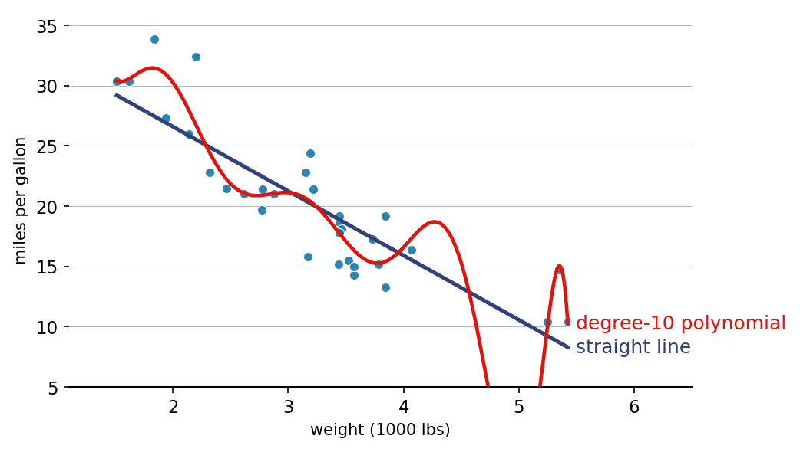

::: {.lm-hero}
[Chapter 2 · Regression Models]{.eyebrow}

# Applied — Regression in Practice

[Carry the normal equations to a real data set and the chapter's warnings turn concrete: collinear features split the credit, scale decides what a coefficient means, and a flexible curve quietly starts chasing noise.]{.dek}
:::

The chapter develops ordinary least squares and the normal equations on a tidy table of house prices. Here we point those same tools at a real data set and watch what the chapter only described. Three things become visible: two features that measure nearly the same thing make their individual coefficients unstable, [standardization]{.term} changes what a coefficient *means*, and a polynomial begins to chase noise as its degree grows.

Because the browser sandbox cannot fetch data over the network, we substitute R's built-in `mtcars` (the fuel economy of 32 cars from a 1974 *Motor Trend* road test) for the chapter's California-housing and auto-mpg sets; the regression workflow is identical. The response is `mpg`; the features are weight, horsepower, and engine displacement.

::: {.defbox}
[Ordinary Least Squares Estimate]{.lbl}
[ &theta;&#770; = (X&#8868;X)&#8722;&sup1; X&#8868;y ]{.math}
:::

```{=html}
<figure class="lm-figure">

<figcaption><strong>Fitting real data.</strong> A straight line through the <code>mtcars</code> fuel-economy data tells an honest downward story, while a degree-10 polynomial fits the noise and wriggles violently where the heavy cars thin out. This is the result the code below reproduces.</figcaption>
</figure>
```

## Multiple regression by the normal equations

Nothing in that formula cares how many columns $\mathbf{X}$ has. We regress fuel economy on three features at once, solving $\mathbf{X}^\top\mathbf{X}\,\hat{\boldsymbol{\theta}} = \mathbf{X}^\top\mathbf{y}$ directly, then confirm the result against the production fitter (`LinearRegression` in Python, `lm` in R). They solve the same system, so they return the same coefficients.

::: {.panel-tabset group="lang"}

## Python
```{pyodide}
import numpy as np
np.set_printoptions(precision=4, suppress=True)

# mtcars (1974 Motor Trend), inlined so the cell needs no network
mpg  = np.array([21,21,22.8,21.4,18.7,18.1,14.3,24.4,22.8,19.2,17.8,16.4,17.3,15.2,
                 10.4,10.4,14.7,32.4,30.4,33.9,21.5,15.5,15.2,13.3,19.2,27.3,26,30.4,
                 15.8,19.7,15,21.4])
wt   = np.array([2.62,2.875,2.32,3.215,3.44,3.46,3.57,3.19,3.15,3.44,3.44,4.07,3.73,
                 3.78,5.25,5.424,5.345,2.2,1.615,1.835,2.465,3.52,3.435,3.84,3.845,
                 1.935,2.14,1.513,3.17,2.77,3.57,2.78])
hp   = np.array([110,110,93,110,175,105,245,62,95,123,123,180,180,180,205,215,230,66,
                 52,65,97,150,150,245,175,66,91,113,264,175,335,109])
disp = np.array([160,160,108,258,360,225,360,146.7,140.8,167.6,167.6,275.8,275.8,275.8,
                 472,460,440,78.7,75.7,71.1,120.1,318,304,350,400,79,120.3,95.1,351,
                 145,301,121])

def ols_normal_equations(X, y):
    """Solve X'X theta = X'y directly; column 0 is the intercept."""
    X_design = np.column_stack([np.ones(len(X)), X])
    return np.linalg.solve(X_design.T @ X_design, X_design.T @ y)

X = np.column_stack([wt, hp, disp])
names = ["weight", "horsepower", "displacement"]
theta = ols_normal_equations(X, mpg)
for name, b in zip(["intercept"] + names, theta):
    print(f"{name:>13}: {b:9.4f}")

from sklearn.linear_model import LinearRegression
m = LinearRegression().fit(X, mpg)            # the production fitter, same system
print("\nsklearn agrees:", np.allclose(np.r_[m.intercept_, m.coef_], theta))
```

## R
```{webr}
mpg <- mtcars$mpg                              # mtcars ships with base R
X   <- cbind(mtcars$wt, mtcars$hp, mtcars$disp)
names <- c("weight", "horsepower", "displacement")

ols_normal_equations <- function(X, y) {       # solve X'X theta = X'y directly
  Xd <- cbind(1, X)
  solve(t(Xd) %*% Xd, t(Xd) %*% y)
}

theta <- as.vector(ols_normal_equations(X, mpg))
labels <- c("intercept", names)
for (k in seq_along(labels)) cat(sprintf("%13s: %9.4f\n", labels[k], theta[k]))

fit <- lm(mpg ~ wt + hp + disp, data = mtcars) # the production fitter, same system
cat("\nlm agrees:", all(abs(coef(fit) - theta) < 1e-6), "\n")
```

:::

Both languages read the same fixed numbers and solve the same linear system, so the coefficients match to every printed digit. A heavier car loses about 3.8 mpg per extra thousand pounds; horsepower and displacement add little once weight is in the model. That last fact is the thread we pull next.

## What a coefficient means: scale and collinearity

The raw coefficients above are not comparable. Weight runs from 1.5 to 5.4 (thousand pounds), horsepower from 50 to 335, so a coefficient's size reflects its units as much as its influence. Standardizing each feature to zero mean and unit variance puts them on a common scale. On that scale weight dominates, horsepower follows, and displacement nearly vanishes.

Displacement vanishing is not a sign that engine size is irrelevant. It is the chapter's collinearity warning made concrete: weight and displacement measure engine size two ways and correlate at $0.89$, so $\mathbf{X}^\top\mathbf{X}$ is ill-conditioned and the two features split the credit for one effect. Fit displacement *alone* and its standardized coefficient is about $-5$; add weight and it collapses to near zero, because weight has already claimed the shared effect. No single coefficient reports this reliably.

::: {.panel-tabset group="lang"}

## Python
```{pyodide}
import numpy as np
np.set_printoptions(precision=4, suppress=True)

mpg  = np.array([21,21,22.8,21.4,18.7,18.1,14.3,24.4,22.8,19.2,17.8,16.4,17.3,15.2,
                 10.4,10.4,14.7,32.4,30.4,33.9,21.5,15.5,15.2,13.3,19.2,27.3,26,30.4,
                 15.8,19.7,15,21.4])
wt   = np.array([2.62,2.875,2.32,3.215,3.44,3.46,3.57,3.19,3.15,3.44,3.44,4.07,3.73,
                 3.78,5.25,5.424,5.345,2.2,1.615,1.835,2.465,3.52,3.435,3.84,3.845,
                 1.935,2.14,1.513,3.17,2.77,3.57,2.78])
hp   = np.array([110,110,93,110,175,105,245,62,95,123,123,180,180,180,205,215,230,66,
                 52,65,97,150,150,245,175,66,91,113,264,175,335,109])
disp = np.array([160,160,108,258,360,225,360,146.7,140.8,167.6,167.6,275.8,275.8,275.8,
                 472,460,440,78.7,75.7,71.1,120.1,318,304,350,400,79,120.3,95.1,351,
                 145,301,121])

def ols(X, y):
    Xd = np.column_stack([np.ones(len(X)), X])
    return np.linalg.solve(Xd.T @ Xd, Xd.T @ y)

def standardize(v):
    return (v - v.mean()) / v.std()           # population sd (numpy default)

Xs = np.column_stack([standardize(wt), standardize(hp), standardize(disp)])
names = ["weight", "horsepower", "displacement"]
ts = ols(Xs, mpg)

order = np.argsort(np.abs(ts[1:]))[::-1]
print("standardized coefficients, largest magnitude first:")
for k in order:
    print(f"  {names[k]:>13}: {ts[1 + k]:8.4f}")

print(f"\ncorr(weight, displacement) = {np.corrcoef(wt, disp)[0, 1]:.3f}")
disp_s = standardize(disp)
print(f"displacement alone:        {ols(disp_s.reshape(-1, 1), mpg)[1]:8.4f}")
print(f"displacement with weight:  {ts[3]:8.4f}")
```

## R
```{webr}
mpg <- mtcars$mpg
standardize <- function(v) (v - mean(v)) / sqrt(mean((v - mean(v))^2))  # population sd
ols <- function(X, y) { Xd <- cbind(1, X); solve(t(Xd) %*% Xd, t(Xd) %*% y) }

names <- c("weight", "horsepower", "displacement")
Xs <- cbind(standardize(mtcars$wt), standardize(mtcars$hp), standardize(mtcars$disp))
ts <- as.vector(ols(Xs, mpg))

ord <- order(abs(ts[-1]), decreasing = TRUE)
cat("standardized coefficients, largest magnitude first:\n")
for (k in ord) cat(sprintf("  %13s: %8.4f\n", names[k], ts[1 + k]))

cat(sprintf("\ncorr(weight, displacement) = %.3f\n", cor(mtcars$wt, mtcars$disp)))
disp_s <- standardize(mtcars$disp)
cat(sprintf("displacement alone:        %8.4f\n", ols(matrix(disp_s, ncol = 1), mpg)[2]))
cat(sprintf("displacement with weight:  %8.4f\n", ts[4]))
```

:::

The lesson the chapter draws on its housing table holds here: a raw coefficient is not a measure of importance, and two collinear features divide an effect between them in a way no single number reports.

## The cost of flexibility

A different question, one feature. Heavier cars use more fuel, so we expect a downward trend. A straight line captures it; a quadratic captures the gentle flattening at the heavy end; a high-degree polynomial captures those *and* the noise. We fit on a standardized weight so the high powers stay numerically well behaved, then plot every fit back on the original scale. (We solve the normal equations on the Vandermonde design matrix; this is `numpy.polyfit` and a base-R `qr.solve` doing the same least squares.)

::: {.panel-tabset group="lang"}

## Python
```{pyodide}
import numpy as np
import matplotlib.pyplot as plt

mpg = np.array([21,21,22.8,21.4,18.7,18.1,14.3,24.4,22.8,19.2,17.8,16.4,17.3,15.2,
                10.4,10.4,14.7,32.4,30.4,33.9,21.5,15.5,15.2,13.3,19.2,27.3,26,30.4,
                15.8,19.7,15,21.4])
wt  = np.array([2.62,2.875,2.32,3.215,3.44,3.46,3.57,3.19,3.15,3.44,3.44,4.07,3.73,
                3.78,5.25,5.424,5.345,2.2,1.615,1.835,2.465,3.52,3.435,3.84,3.845,
                1.935,2.14,1.513,3.17,2.77,3.57,2.78])

w_std    = (wt - wt.mean()) / wt.std()
grid     = np.linspace(wt.min(), wt.max(), 300)
grid_std = (grid - wt.mean()) / wt.std()

fig, ax = plt.subplots(figsize=(7.5, 5))
ax.scatter(wt, mpg, s=28, color="#076FA1", alpha=0.8, edgecolors="white",
           linewidths=0.5, label="cars", zorder=3)
for degree, color in [(1, "#31417A"), (2, "#9E4F00"), (10, "#E3120B")]:
    coeffs = np.polyfit(w_std, mpg, degree)        # least squares on the Vandermonde
    ax.plot(grid, np.polyval(coeffs, grid_std), color=color, lw=2, label=f"degree {degree}")
ax.set_xlabel("weight (1000 lbs)")
ax.set_ylabel("miles per gallon")
ax.set_ylim(5, 36)
ax.legend()
plt.tight_layout()
plt.show()
```

## R
```{webr}
mpg <- mtcars$mpg
wt  <- mtcars$wt

pop_sd   <- function(v) sqrt(mean((v - mean(v))^2))
w_std    <- (wt - mean(wt)) / pop_sd(wt)
grid     <- seq(min(wt), max(wt), length.out = 300)
grid_std <- (grid - mean(wt)) / pop_sd(wt)

plot(wt, mpg, pch = 19, col = "#076FA1", cex = 1.1,
     xlab = "weight (1000 lbs)", ylab = "miles per gallon", ylim = c(5, 36))

degs <- c(1, 2, 10); cols <- c("#31417A", "#9E4F00", "#E3120B")
for (i in seq_along(degs)) {
  V  <- outer(w_std, 0:degs[i], `^`)              # Vandermonde design matrix
  b  <- qr.solve(V, mpg)                           # least-squares polynomial fit
  Vg <- outer(grid_std, 0:degs[i], `^`)
  lines(grid, Vg %*% b, col = cols[i], lwd = 2)
}
legend("topright", legend = paste("degree", degs), col = cols, lwd = 2, bty = "n")
```

:::

The line and the quadratic tell the same honest story: more weight, less mileage, flattening a little where the cars get heavy. The degree-10 polynomial fits the training cars a shade better, but buys it by wriggling, diving and rising at the sparse heavy end where a few cars pull it around. On *new* cars that wriggle would cost it, because it has fit the noise, not the trend. We have no formal measure of that cost yet; Chapter 6 supplies one and Chapter 7 the tools to prevent it.

::: {.explore}
[Try it]{.lbl}
Refit `mpg` on horsepower instead of weight, or on weight *and* quarter-mile time (`mtcars$wt` and `mtcars$qsec`), and ask whether the extra feature earns its place. Then push the polynomial degree past 10 and watch the heavy-end wriggle turn violent.
:::
