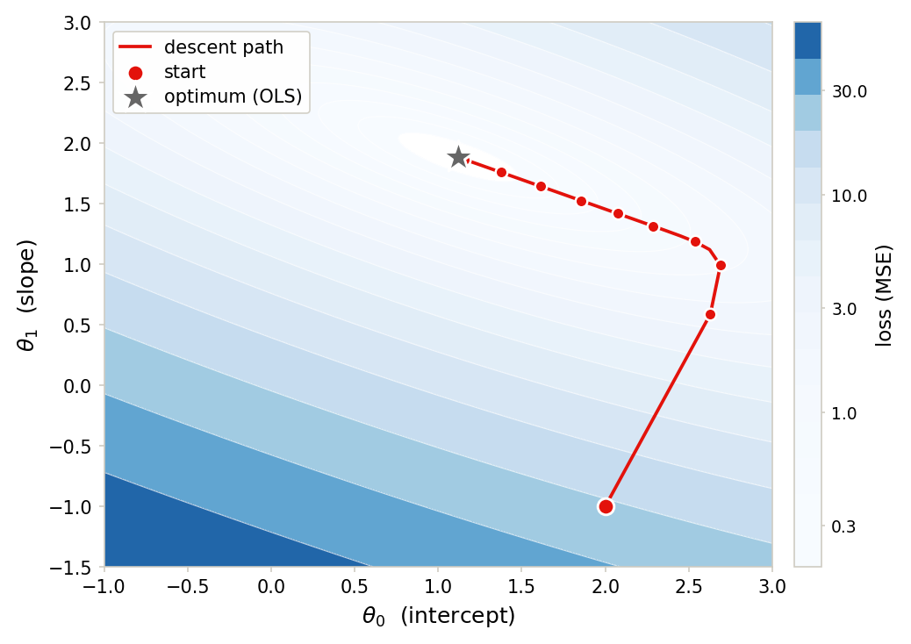

::: {.lm-hero}
[Chapter 3 · Gradient Descent]{.eyebrow}

# Gradient Descent

[Watch the algorithm walk downhill on a loss surface, where one number, the step size, decides whether it crawls, converges, or flies apart.]{.dek}
:::

Most models cannot be solved in closed form. [Gradient descent]{.term} is the workhorse that
replaces a one-shot formula with a walk: stand on the [loss surface]{.term}, look for the
steepest downhill direction, take a step, repeat. For linear regression the surface is a
bowl and we already know its bottom (the OLS solution), which makes it the ideal place to
*see* the algorithm work and, more usefully, to see it fail.

The update rule moves the parameters opposite the gradient, scaled by a [learning rate]{.term}
$\alpha$. The gradient points uphill; we go the other way.

::: {.defbox}
[Gradient Descent Update]{.lbl}
[ &theta;<sup>(t+1)</sup> = &theta;<sup>(t)</sup> &minus; &alpha;&#8201;&nabla;J(&theta;<sup>(t)</sup>) ]{.math}
:::

```{=html}
<figure class="lm-figure">

<figcaption><strong>Gradient descent on the loss surface.</strong> From a start far from the floor, each step follows the negative gradient down the blue MSE bowl in (&theta;<sub>0</sub>, &theta;<sub>1</sub>) until the walk settles on the optimum. This is the result the code below reproduces.</figcaption>
</figure>
```

Throughout we fit a simple line $\hat{y} = \theta_0 + \theta_1 x$ under mean squared error,
$J(\theta_0, \theta_1) = \frac{1}{n}\sum_i (y_i - \theta_0 - \theta_1 x_i)^2$. The data is defined
inline, identical in both languages, so every deterministic result below agrees digit for
digit across Python and R.

## The loss surface and the downhill direction

Because the loss is quadratic in $(\theta_0, \theta_1)$, its contours are nested ellipses
centered on the optimum. The gradient at any point is orthogonal to the contour through it;
its negation is the direction of steepest descent. The arrows below are exactly those
negative gradients, normalized to a common length so direction reads clearly.

::: {.panel-tabset group="lang"}

## Python
```{pyodide}
import numpy as np
import matplotlib.pyplot as plt

# Fixed linear data: y ~ 1 + 2x + noise (inline, so Python and R match exactly)
x = np.array([-0.40, -0.11, 0.14, 0.43, 0.74, 1.02, 1.23,
              1.52, 1.78, 2.09, 2.33, 2.64, 2.94, 3.18])
y = np.array([0.55, 1.46, 1.30, 1.70, 2.26, 2.42, 3.85,
              3.60, 4.09, 5.10, 6.25, 6.37, 6.47, 7.07])
n = len(x)

# OLS optimum: the target gradient descent is trying to reach
X = np.column_stack([np.ones(n), x])
theta_ols = np.linalg.solve(X.T @ X, X.T @ y)
print(f"OLS optimum: theta0 = {theta_ols[0]:.3f}, theta1 = {theta_ols[1]:.3f}")

def mse(b0, b1):
    return np.mean((y - (b0 + b1 * x))**2)

def grad(b0, b1):
    r = (b0 + b1 * x) - y                       # residuals of the current line
    return np.array([2 * np.mean(r), 2 * np.mean(r * x)])

# Loss surface on a grid of (theta0, theta1)
g0 = np.linspace(-1.0, 3.0, 120)
g1 = np.linspace(-1.5, 3.0, 120)
B0, B1 = np.meshgrid(g0, g1)
Loss = np.array([[mse(a, b) for a in g0] for b in g1])

fig, ax = plt.subplots(figsize=(7, 5.5))
levels = np.logspace(np.log10(Loss.min() + 0.05), np.log10(Loss.max()), 18)
ax.contour(B0, B1, Loss, levels=levels, colors="#666666", linewidths=0.6, alpha=0.7)
cf = ax.contourf(B0, B1, Loss, levels=levels, cmap="Blues", alpha=0.30)
fig.colorbar(cf, ax=ax, label="loss (MSE)")

# Negative-gradient arrows: the downhill direction at each grid point
for a in np.linspace(-0.5, 2.5, 8):
    for b in np.linspace(-1.0, 2.75, 8):
        gvec = grad(a, b)
        nrm = np.linalg.norm(gvec)
        if nrm > 1e-6:
            step = gvec / nrm * 0.18            # fixed-length arrow
            ax.arrow(a, b, -step[0], -step[1], head_width=0.06,
                     head_length=0.05, fc="#E3120B", ec="#E3120B", alpha=0.65)

ax.scatter(*theta_ols, color="#666666", s=180, marker="*", zorder=5,
           edgecolors="white", linewidths=1.4, label="OLS optimum")
ax.set_xlabel(r"$\theta_0$ (intercept)")
ax.set_ylabel(r"$\theta_1$ (slope)")
ax.set_title("MSE loss surface; arrows point downhill")
ax.legend(loc="upper right")
plt.tight_layout()
plt.show()
```

## R
```{webr}
# Fixed linear data: y ~ 1 + 2x + noise (inline, so Python and R match exactly)
x <- c(-0.40, -0.11, 0.14, 0.43, 0.74, 1.02, 1.23,
       1.52, 1.78, 2.09, 2.33, 2.64, 2.94, 3.18)
y <- c(0.55, 1.46, 1.30, 1.70, 2.26, 2.42, 3.85,
       3.60, 4.09, 5.10, 6.25, 6.37, 6.47, 7.07)
n <- length(x)

# OLS optimum: the target gradient descent is trying to reach
X <- cbind(1, x)
theta_ols <- solve(t(X) %*% X, t(X) %*% y)
cat(sprintf("OLS optimum: theta0 = %.3f, theta1 = %.3f\n", theta_ols[1], theta_ols[2]))

mse <- function(b0, b1) mean((y - (b0 + b1 * x))^2)
grad <- function(b0, b1) {
  r <- (b0 + b1 * x) - y                        # residuals of the current line
  c(2 * mean(r), 2 * mean(r * x))
}

# Loss surface on a grid of (theta0, theta1); Loss[i, j] = mse(g0[i], g1[j])
g0 <- seq(-1.0, 3.0, length.out = 120)
g1 <- seq(-1.5, 3.0, length.out = 120)
Loss <- outer(g0, g1, Vectorize(mse))

levels <- exp(seq(log(min(Loss) + 0.05), log(max(Loss)), length.out = 18))
blues <- colorRampPalette(c("#f7fbff", "#deebf7", "#c6dbef", "#9ecae1",
                            "#6baed6", "#4292c6", "#2171b5", "#08519c", "#08306b"))
image(g0, g1, log(Loss), col = blues(100),
      xlab = expression(theta[0] ~ "(intercept)"),
      ylab = expression(theta[1] ~ "(slope)"),
      main = "MSE loss surface; arrows point downhill")
contour(g0, g1, Loss, levels = levels, drawlabels = FALSE,
        col = "white", lwd = 0.6, add = TRUE)

# Negative-gradient arrows: the downhill direction at each grid point
for (a in seq(-0.5, 2.5, length.out = 8)) {
  for (b in seq(-1.0, 2.75, length.out = 8)) {
    gvec <- grad(a, b)
    nrm <- sqrt(sum(gvec^2))
    if (nrm > 1e-6) {
      step <- gvec / nrm * 0.18                 # fixed-length arrow
      arrows(a, b, a - step[1], b - step[2], length = 0.04,
             col = "#E3120B", lwd = 1)
    }
  }
}
points(theta_ols[1], theta_ols[2], col = "#666666", pch = 8, cex = 2, lwd = 2)
legend("topright", "OLS optimum", pch = 8, col = "#666666", bty = "n")
```

:::

## The learning rate decides everything

Now we let the algorithm run. Starting far from the bottom at $(2, -1)$, three step sizes tell
the whole story. A tiny $\alpha$ takes timid steps and stalls before reaching the floor. A
well-chosen $\alpha$ slides in smoothly. A large $\alpha$ overshoots the narrow axis of the valley
and zig-zags across it, still converging here but wasting motion. The left panel shows the
paths; the right panel shows the loss falling on a log scale, where a straight line means
geometric convergence.

::: {.panel-tabset group="lang"}

## Python
```{pyodide}
import numpy as np
import matplotlib.pyplot as plt

x = np.array([-0.40, -0.11, 0.14, 0.43, 0.74, 1.02, 1.23,
              1.52, 1.78, 2.09, 2.33, 2.64, 2.94, 3.18])
y = np.array([0.55, 1.46, 1.30, 1.70, 2.26, 2.42, 3.85,
              3.60, 4.09, 5.10, 6.25, 6.37, 6.47, 7.07])
n = len(x)
X = np.column_stack([np.ones(n), x])
theta_ols = np.linalg.solve(X.T @ X, X.T @ y)
opt_loss = np.mean((y - X @ theta_ols)**2)

def mse(b0, b1):
    return np.mean((y - (b0 + b1 * x))**2)

def grad(b0, b1):
    r = (b0 + b1 * x) - y
    return np.array([2 * np.mean(r), 2 * np.mean(r * x)])

def descend(lr, n_iter, start):
    theta = np.array(start, float)
    path = [theta.copy()]
    for _ in range(n_iter):
        theta = theta - lr * grad(theta[0], theta[1])
        path.append(theta.copy())
    return np.array(path)

start = [2.0, -1.0]
rates = [(0.02, "#31417A", "alpha = 0.02 (slow)"),
         (0.10, "#E3120B", "alpha = 0.10 (good)"),
         (0.25, "#9E4F00", "alpha = 0.25 (oscillating)")]

g0 = np.linspace(-1.0, 3.0, 120)
g1 = np.linspace(-1.5, 3.0, 120)
B0, B1 = np.meshgrid(g0, g1)
Loss = np.array([[mse(a, b) for a in g0] for b in g1])

fig, (axL, axR) = plt.subplots(1, 2, figsize=(12, 5))
levels = np.logspace(np.log10(Loss.min() + 0.05), np.log10(Loss.max()), 18)
axL.contour(B0, B1, Loss, levels=levels, colors="#666666", linewidths=0.5, alpha=0.5)
cfL = axL.contourf(B0, B1, Loss, levels=levels, cmap="Blues", alpha=0.20)
fig.colorbar(cfL, ax=axL, label="loss (MSE)")

for lr, color, label in rates:
    path = descend(lr, 40, start)
    axL.plot(path[:, 0], path[:, 1], "o-", color=color, ms=3, lw=1.4, alpha=0.85, label=label)
    axR.plot([mse(*p) for p in path], color=color, lw=1.8, label=label)
    print(f"{label:26s} -> final loss {mse(*path[-1]):.4f}")

axL.scatter(*start, color="black", s=70, zorder=5, label="start")
axL.scatter(*theta_ols, color="#666666", s=170, marker="*", zorder=6,
            edgecolors="white", linewidths=1.4, label="optimum")
axL.set_xlabel(r"$\theta_0$")
axL.set_ylabel(r"$\theta_1$")
axL.set_title("Trajectories on the loss surface")
axL.legend(loc="upper right", fontsize=8)

axR.axhline(opt_loss, color="#666666", ls="--", lw=1, label="optimal loss")
axR.set_yscale("log")
axR.set_xlabel("iteration")
axR.set_ylabel("MSE loss")
axR.set_title("Convergence")
axR.legend(loc="upper right", fontsize=8)
for s in ["top", "right"]: axR.spines[s].set_visible(False)
axR.grid(axis="y", color="#e6e3da", lw=0.8); axR.set_axisbelow(True)
plt.tight_layout()
plt.show()

print(f"optimal loss = {opt_loss:.4f}")
```

## R
```{webr}
x <- c(-0.40, -0.11, 0.14, 0.43, 0.74, 1.02, 1.23,
       1.52, 1.78, 2.09, 2.33, 2.64, 2.94, 3.18)
y <- c(0.55, 1.46, 1.30, 1.70, 2.26, 2.42, 3.85,
       3.60, 4.09, 5.10, 6.25, 6.37, 6.47, 7.07)
n <- length(x)
X <- cbind(1, x)
theta_ols <- solve(t(X) %*% X, t(X) %*% y)
opt_loss <- mean((y - X %*% theta_ols)^2)

mse <- function(b0, b1) mean((y - (b0 + b1 * x))^2)
grad <- function(b0, b1) { r <- (b0 + b1 * x) - y; c(2 * mean(r), 2 * mean(r * x)) }

descend <- function(lr, n_iter, start) {
  theta <- start
  path <- matrix(theta, nrow = 1)
  for (i in seq_len(n_iter)) {
    theta <- theta - lr * grad(theta[1], theta[2])
    path <- rbind(path, theta)
  }
  path
}

start <- c(2.0, -1.0)
rates <- list(list(0.02, "#31417A", "alpha = 0.02 (slow)"),
              list(0.10, "#E3120B", "alpha = 0.10 (good)"),
              list(0.25, "#9E4F00", "alpha = 0.25 (oscillating)"))

g0 <- seq(-1.0, 3.0, length.out = 120)
g1 <- seq(-1.5, 3.0, length.out = 120)
Loss <- outer(g0, g1, Vectorize(mse))
levels <- exp(seq(log(min(Loss) + 0.05), log(max(Loss)), length.out = 18))

paths <- lapply(rates, function(r) descend(r[[1]], 40, start))

op <- par(mfrow = c(1, 2))

# Left: trajectories on the loss surface
blues <- colorRampPalette(c("#f7fbff", "#deebf7", "#c6dbef", "#9ecae1",
                            "#6baed6", "#4292c6", "#2171b5", "#08519c", "#08306b"))
image(g0, g1, log(Loss), col = blues(100),
      xlab = expression(theta[0]), ylab = expression(theta[1]),
      main = "Trajectories on the loss surface")
contour(g0, g1, Loss, levels = levels, drawlabels = FALSE,
        col = "white", lwd = 0.6, add = TRUE)
for (k in seq_along(rates)) {
  p <- paths[[k]]
  lines(p[, 1], p[, 2], type = "o", col = rates[[k]][[2]], pch = 19, cex = 0.5)
  cat(sprintf("%-26s -> final loss %.4f\n",
              rates[[k]][[3]], mse(p[nrow(p), 1], p[nrow(p), 2])))
}
points(start[1], start[2], pch = 19, cex = 1.2)
points(theta_ols[1], theta_ols[2], pch = 8, col = "#666666", cex = 1.8, lwd = 2)
legend("topright", c(sapply(rates, `[[`, 3), "start", "optimum"),
       col = c(sapply(rates, `[[`, 2), "black", "#666666"),
       pch = c(19, 19, 19, 19, 8), bty = "n", cex = 0.8)

# Right: convergence, loss vs iteration on a log scale
loss_curves <- lapply(paths, function(p) apply(p, 1, function(b) mse(b[1], b[2])))
plot(NA, xlim = c(0, 40), ylim = range(unlist(loss_curves), opt_loss), log = "y",
     xlab = "iteration", ylab = "MSE loss", main = "Convergence", bty = "l")
grid(col = "#e6e3da", lty = 1, lwd = 0.6)
for (k in seq_along(rates))
  lines(0:40, loss_curves[[k]], col = rates[[k]][[2]], lwd = 1.8)
abline(h = opt_loss, col = "#666666", lty = 2)
legend("topright", sapply(rates, `[[`, 3), col = sapply(rates, `[[`, 2),
       lwd = 1.8, bty = "n", cex = 0.8)
par(op)

cat(sprintf("optimal loss = %.4f\n", opt_loss))
```

:::

The slow run never reaches the floor in forty steps; the good and oscillating runs both land
on the optimal loss, but the oscillating one earns it through visible zig-zags.

## A hard threshold for stability

The zig-zag is not a quirk of bad luck. On a quadratic the Hessian is constant,
$H = \frac{2}{n}\mathbf{X}^\top\mathbf{X}$, and gradient descent converges only when the step
size stays below $2 / \lambda_{\max}(H)$, twice the reciprocal of the largest curvature. Below
that line the loss falls; a hair above it, the error grows by a fixed factor every step and the
loss explodes. The number is computable, not guessed.

::: {.panel-tabset group="lang"}

## Python
```{pyodide}
import numpy as np
import matplotlib.pyplot as plt

x = np.array([-0.40, -0.11, 0.14, 0.43, 0.74, 1.02, 1.23,
              1.52, 1.78, 2.09, 2.33, 2.64, 2.94, 3.18])
y = np.array([0.55, 1.46, 1.30, 1.70, 2.26, 2.42, 3.85,
              3.60, 4.09, 5.10, 6.25, 6.37, 6.47, 7.07])
n = len(x)
X = np.column_stack([np.ones(n), x])

# The MSE Hessian is constant; stability needs alpha < 2 / lambda_max(H)
Hess = (2 / n) * (X.T @ X)
lam_max = np.linalg.eigvalsh(Hess).max()
alpha_crit = 2 / lam_max
print(f"largest curvature lambda_max  = {lam_max:.3f}")
print(f"critical step size 2/lambda_max = {alpha_crit:.3f}\n")

def mse(b0, b1):
    return np.mean((y - (b0 + b1 * x))**2)

def grad(b0, b1):
    r = (b0 + b1 * x) - y
    return np.array([2 * np.mean(r), 2 * np.mean(r * x)])

def loss_path(lr, n_iter, start):
    theta = np.array(start, float)
    losses = [mse(*theta)]
    for _ in range(n_iter):
        theta = theta - lr * grad(theta[0], theta[1])
        losses.append(mse(*theta))
    return np.array(losses)

start = [2.0, -1.0]
L_stable = loss_path(0.25, 20, start)    # just below the threshold
L_diverge = loss_path(0.30, 20, start)   # just above it
print(f"alpha = 0.25 (< {alpha_crit:.2f}): final loss {L_stable[-1]:.4f}")
print(f"alpha = 0.30 (> {alpha_crit:.2f}): final loss {L_diverge[-1]:.3e}")

fig, ax = plt.subplots(figsize=(7, 4.5))
ax.plot(L_diverge, "o-", color="#E3120B", ms=4, label="alpha = 0.30 (diverges)")
ax.plot(L_stable, "o-", color="#31417A", ms=4, label="alpha = 0.25 (converges)")
ax.set_yscale("log")
ax.set_xlabel("iteration")
ax.set_ylabel("MSE loss")
ax.set_title(f"A step past 2/lambda_max = {alpha_crit:.2f} explodes")
ax.legend()
for s in ["top", "right"]: ax.spines[s].set_visible(False)
ax.grid(axis="y", color="#e6e3da", lw=0.8); ax.set_axisbelow(True)
plt.tight_layout()
plt.show()
```

## R
```{webr}
x <- c(-0.40, -0.11, 0.14, 0.43, 0.74, 1.02, 1.23,
       1.52, 1.78, 2.09, 2.33, 2.64, 2.94, 3.18)
y <- c(0.55, 1.46, 1.30, 1.70, 2.26, 2.42, 3.85,
       3.60, 4.09, 5.10, 6.25, 6.37, 6.47, 7.07)
n <- length(x)
X <- cbind(1, x)

# The MSE Hessian is constant; stability needs alpha < 2 / lambda_max(H)
Hess <- (2 / n) * (t(X) %*% X)
lam_max <- max(eigen(Hess, symmetric = TRUE)$values)
alpha_crit <- 2 / lam_max
cat(sprintf("largest curvature lambda_max  = %.3f\n", lam_max))
cat(sprintf("critical step size 2/lambda_max = %.3f\n\n", alpha_crit))

mse <- function(b0, b1) mean((y - (b0 + b1 * x))^2)
grad <- function(b0, b1) { r <- (b0 + b1 * x) - y; c(2 * mean(r), 2 * mean(r * x)) }

loss_path <- function(lr, n_iter, start) {
  theta <- start
  losses <- mse(theta[1], theta[2])
  for (i in seq_len(n_iter)) {
    theta <- theta - lr * grad(theta[1], theta[2])
    losses <- c(losses, mse(theta[1], theta[2]))
  }
  losses
}

start <- c(2.0, -1.0)
L_stable <- loss_path(0.25, 20, start)    # just below the threshold
L_diverge <- loss_path(0.30, 20, start)   # just above it
cat(sprintf("alpha = 0.25 (< %.2f): final loss %.4f\n", alpha_crit, tail(L_stable, 1)))
cat(sprintf("alpha = 0.30 (> %.2f): final loss %.3e\n", alpha_crit, tail(L_diverge, 1)))

plot(0:20, L_diverge, type = "o", col = "#E3120B", pch = 19, log = "y",
     xlab = "iteration", ylab = "MSE loss",
     main = sprintf("A step past 2/lambda_max = %.2f explodes", alpha_crit),
     bty = "l")
grid(col = "#e6e3da", lty = 1, lwd = 0.6)
lines(0:20, L_stable, type = "o", col = "#31417A", pch = 19)
legend("bottomright", c("alpha = 0.30 (diverges)", "alpha = 0.25 (converges)"),
       col = c("#E3120B", "#31417A"), lwd = 1.8, pch = 19, bty = "n")
```

:::

## Stochastic gradient descent

The full gradient averages over all $n$ points. [Stochastic gradient descent]{.term} estimates
it from a random handful instead, a [mini-batch]{.term}, trading exactness for cheaper, more
frequent steps. The estimate is noisy, so the path wanders, but it still drifts toward the
optimum and each step costs a fraction of the full pass. With a batch of one the loss curve is
jagged; a batch of five smooths it out; the full batch is the clean reference. Because the two
languages draw their random batches from different generators, the noisy curves differ run to
run, while the full-batch curve is identical.

::: {.panel-tabset group="lang"}

## Python
```{pyodide}
import numpy as np
import matplotlib.pyplot as plt

x = np.array([-0.40, -0.11, 0.14, 0.43, 0.74, 1.02, 1.23,
              1.52, 1.78, 2.09, 2.33, 2.64, 2.94, 3.18])
y = np.array([0.55, 1.46, 1.30, 1.70, 2.26, 2.42, 3.85,
              3.60, 4.09, 5.10, 6.25, 6.37, 6.47, 7.07])
n = len(x)
X = np.column_stack([np.ones(n), x])
theta_ols = np.linalg.solve(X.T @ X, X.T @ y)
opt_loss = np.mean((y - X @ theta_ols)**2)

def mse(b0, b1):
    return np.mean((y - (b0 + b1 * x))**2)

def grad_on(idx, b0, b1):
    xb, yb = x[idx], y[idx]                      # gradient on a subset only
    r = (b0 + b1 * xb) - yb
    return np.array([2 * np.mean(r), 2 * np.mean(r * xb)])

def run(lr, n_iter, batch, start, seed):
    rng = np.random.default_rng(seed)
    theta = np.array(start, float)
    losses = [mse(*theta)]
    for _ in range(n_iter):
        idx = rng.choice(n, size=batch, replace=False)
        theta = theta - lr * grad_on(idx, theta[0], theta[1])
        losses.append(mse(*theta))               # full-data loss, for monitoring
    return np.array(losses)

start = [2.0, -1.0]
n_iter = 80
L_batch = run(0.10, n_iter, n, start, 0)        # full batch = ordinary GD
L_mini  = run(0.10, n_iter, 5, start, 1)        # mini-batch of 5
L_sgd   = run(0.05, n_iter, 1, start, 2)        # one sample at a time

fig, ax = plt.subplots(figsize=(7, 4.5))
ax.plot(L_batch, color="#31417A", lw=2, label="batch (all 14)")
ax.plot(L_mini, color="#076FA1", lw=1.3, alpha=0.85, label="mini-batch (5)")
ax.plot(L_sgd, color="#E3120B", lw=1.0, alpha=0.75, label="SGD (1)")
ax.axhline(opt_loss, color="#666666", ls="--", lw=1)
ax.set_yscale("log")
ax.set_xlabel("iteration")
ax.set_ylabel("MSE loss (full data)")
ax.set_title("Batch vs stochastic gradient descent")
ax.legend()
for s in ["top", "right"]: ax.spines[s].set_visible(False)
ax.grid(axis="y", color="#e6e3da", lw=0.8); ax.set_axisbelow(True)
plt.tight_layout()
plt.show()

print(f"final loss  batch {L_batch[-1]:.4f} | mini {L_mini[-1]:.4f} | SGD {L_sgd[-1]:.4f}")
print(f"optimal loss {opt_loss:.4f}")
```

## R
```{webr}
x <- c(-0.40, -0.11, 0.14, 0.43, 0.74, 1.02, 1.23,
       1.52, 1.78, 2.09, 2.33, 2.64, 2.94, 3.18)
y <- c(0.55, 1.46, 1.30, 1.70, 2.26, 2.42, 3.85,
       3.60, 4.09, 5.10, 6.25, 6.37, 6.47, 7.07)
n <- length(x)
X <- cbind(1, x)
theta_ols <- solve(t(X) %*% X, t(X) %*% y)
opt_loss <- mean((y - X %*% theta_ols)^2)

mse <- function(b0, b1) mean((y - (b0 + b1 * x))^2)
grad_on <- function(idx, b0, b1) {
  xb <- x[idx]; yb <- y[idx]                     # gradient on a subset only
  r <- (b0 + b1 * xb) - yb
  c(2 * mean(r), 2 * mean(r * xb))
}

run <- function(lr, n_iter, batch, start, seed) {
  set.seed(seed)
  theta <- start
  losses <- mse(theta[1], theta[2])
  for (i in seq_len(n_iter)) {
    idx <- sample.int(n, batch)
    theta <- theta - lr * grad_on(idx, theta[1], theta[2])
    losses <- c(losses, mse(theta[1], theta[2]))   # full-data loss, for monitoring
  }
  losses
}

start <- c(2.0, -1.0)
n_iter <- 80
L_batch <- run(0.10, n_iter, n, start, 0)        # full batch = ordinary GD
L_mini  <- run(0.10, n_iter, 5, start, 1)        # mini-batch of 5
L_sgd   <- run(0.05, n_iter, 1, start, 2)        # one sample at a time

plot(0:n_iter, L_batch, type = "l", col = "#31417A", lwd = 2, log = "y",
     ylim = range(L_batch, L_mini, L_sgd, opt_loss),
     xlab = "iteration", ylab = "MSE loss (full data)",
     main = "Batch vs stochastic gradient descent", bty = "l")
grid(col = "#e6e3da", lty = 1, lwd = 0.6)
lines(0:n_iter, L_mini, col = "#076FA1", lwd = 1.3)
lines(0:n_iter, L_sgd, col = "#E3120B", lwd = 1.0)
abline(h = opt_loss, col = "#666666", lty = 2)
legend("topright", c("batch (all 14)", "mini-batch (5)", "SGD (1)"),
       col = c("#31417A", "#076FA1", "#E3120B"), lwd = 2, bty = "n")

cat(sprintf("final loss  batch %.4f | mini %.4f | SGD %.4f\n",
            tail(L_batch, 1), tail(L_mini, 1), tail(L_sgd, 1)))
cat(sprintf("optimal loss %.4f\n", opt_loss))
```

:::

## Momentum

In an elongated valley, plain gradient descent crawls along the shallow axis because each
step sees only the local slope. [Momentum]{.term} accumulates a velocity vector,
$\mathbf{v}^{(t+1)} = \gamma\,\mathbf{v}^{(t)} + \alpha\,\nabla J$, then updates with the
velocity. Consistent directions add up and reinforce; alternating ones cancel. At the same
small step size, momentum reaches the floor while plain descent is still inching toward it.

::: {.panel-tabset group="lang"}

## Python
```{pyodide}
import numpy as np
import matplotlib.pyplot as plt

x = np.array([-0.40, -0.11, 0.14, 0.43, 0.74, 1.02, 1.23,
              1.52, 1.78, 2.09, 2.33, 2.64, 2.94, 3.18])
y = np.array([0.55, 1.46, 1.30, 1.70, 2.26, 2.42, 3.85,
              3.60, 4.09, 5.10, 6.25, 6.37, 6.47, 7.07])
n = len(x)
X = np.column_stack([np.ones(n), x])
theta_ols = np.linalg.solve(X.T @ X, X.T @ y)
opt_loss = np.mean((y - X @ theta_ols)**2)

def mse(b0, b1):
    return np.mean((y - (b0 + b1 * x))**2)

def grad(b0, b1):
    r = (b0 + b1 * x) - y
    return np.array([2 * np.mean(r), 2 * np.mean(r * x)])

def plain(lr, n_iter, start):
    theta = np.array(start, float)
    path = [theta.copy()]
    for _ in range(n_iter):
        theta = theta - lr * grad(theta[0], theta[1])
        path.append(theta.copy())
    return np.array(path)

def momentum(lr, gamma, n_iter, start):
    theta = np.array(start, float)
    velocity = np.zeros(2)
    path = [theta.copy()]
    for _ in range(n_iter):
        velocity = gamma * velocity + lr * grad(theta[0], theta[1])
        theta = theta - velocity
        path.append(theta.copy())
    return np.array(path)

start = [2.0, -1.0]
lr = 0.05
n_iter = 40
P0 = plain(lr, n_iter, start)
P1 = momentum(lr, 0.8, n_iter, start)

g0 = np.linspace(-1.0, 3.0, 120)
g1 = np.linspace(-1.5, 3.0, 120)
B0, B1 = np.meshgrid(g0, g1)
Loss = np.array([[mse(a, b) for a in g0] for b in g1])

fig, (axL, axR) = plt.subplots(1, 2, figsize=(12, 5))
levels = np.logspace(np.log10(Loss.min() + 0.05), np.log10(Loss.max()), 18)
axL.contour(B0, B1, Loss, levels=levels, colors="#666666", linewidths=0.5, alpha=0.5)
cfL = axL.contourf(B0, B1, Loss, levels=levels, cmap="Blues", alpha=0.20)
fig.colorbar(cfL, ax=axL, label="loss (MSE)")
axL.plot(P0[:, 0], P0[:, 1], "o-", color="#31417A", ms=3, lw=1.4, label="plain GD")
axL.plot(P1[:, 0], P1[:, 1], "s-", color="#E3120B", ms=3, lw=1.4, label="momentum (gamma=0.8)")
axL.scatter(*start, color="black", s=70, zorder=5)
axL.scatter(*theta_ols, color="#666666", s=170, marker="*", zorder=6,
            edgecolors="white", linewidths=1.4, label="optimum")
axL.set_xlabel(r"$\theta_0$")
axL.set_ylabel(r"$\theta_1$")
axL.set_title(f"Same step size alpha = {lr}")
axL.legend(loc="upper right", fontsize=8)

axR.plot([mse(*p) for p in P0], color="#31417A", lw=2, label="plain GD")
axR.plot([mse(*p) for p in P1], color="#E3120B", lw=2, label="momentum (gamma=0.8)")
axR.axhline(opt_loss, color="#666666", ls="--", lw=1)
axR.set_yscale("log")
axR.set_xlabel("iteration")
axR.set_ylabel("MSE loss")
axR.set_title("Momentum reaches the floor sooner")
axR.legend(fontsize=8)
for s in ["top", "right"]: axR.spines[s].set_visible(False)
axR.grid(axis="y", color="#e6e3da", lw=0.8); axR.set_axisbelow(True)
plt.tight_layout()
plt.show()

print(f"after {n_iter} steps: plain loss {mse(*P0[-1]):.4f}, momentum loss {mse(*P1[-1]):.4f}")
print(f"optimal loss {opt_loss:.4f}")
```

## R
```{webr}
x <- c(-0.40, -0.11, 0.14, 0.43, 0.74, 1.02, 1.23,
       1.52, 1.78, 2.09, 2.33, 2.64, 2.94, 3.18)
y <- c(0.55, 1.46, 1.30, 1.70, 2.26, 2.42, 3.85,
       3.60, 4.09, 5.10, 6.25, 6.37, 6.47, 7.07)
n <- length(x)
X <- cbind(1, x)
theta_ols <- solve(t(X) %*% X, t(X) %*% y)
opt_loss <- mean((y - X %*% theta_ols)^2)

mse <- function(b0, b1) mean((y - (b0 + b1 * x))^2)
grad <- function(b0, b1) { r <- (b0 + b1 * x) - y; c(2 * mean(r), 2 * mean(r * x)) }

plain <- function(lr, n_iter, start) {
  theta <- start
  path <- matrix(theta, nrow = 1)
  for (i in seq_len(n_iter)) {
    theta <- theta - lr * grad(theta[1], theta[2])
    path <- rbind(path, theta)
  }
  path
}

momentum <- function(lr, gamma, n_iter, start) {
  theta <- start
  velocity <- c(0, 0)
  path <- matrix(theta, nrow = 1)
  for (i in seq_len(n_iter)) {
    velocity <- gamma * velocity + lr * grad(theta[1], theta[2])
    theta <- theta - velocity
    path <- rbind(path, theta)
  }
  path
}

start <- c(2.0, -1.0)
lr <- 0.05
n_iter <- 40
P0 <- plain(lr, n_iter, start)
P1 <- momentum(lr, 0.8, n_iter, start)

g0 <- seq(-1.0, 3.0, length.out = 120)
g1 <- seq(-1.5, 3.0, length.out = 120)
Loss <- outer(g0, g1, Vectorize(mse))
levels <- exp(seq(log(min(Loss) + 0.05), log(max(Loss)), length.out = 18))

op <- par(mfrow = c(1, 2))
blues <- colorRampPalette(c("#f7fbff", "#deebf7", "#c6dbef", "#9ecae1",
                            "#6baed6", "#4292c6", "#2171b5", "#08519c", "#08306b"))
image(g0, g1, log(Loss), col = blues(100),
      xlab = expression(theta[0]), ylab = expression(theta[1]),
      main = sprintf("Same step size alpha = %.2f", lr))
contour(g0, g1, Loss, levels = levels, drawlabels = FALSE,
        col = "white", lwd = 0.6, add = TRUE)
lines(P0[, 1], P0[, 2], type = "o", col = "#31417A", pch = 19, cex = 0.5)
lines(P1[, 1], P1[, 2], type = "o", col = "#E3120B", pch = 15, cex = 0.5)
points(start[1], start[2], pch = 19, cex = 1.2)
points(theta_ols[1], theta_ols[2], pch = 8, col = "#666666", cex = 1.8, lwd = 2)
legend("topright", c("plain GD", "momentum (gamma=0.8)", "optimum"),
       col = c("#31417A", "#E3120B", "#666666"), pch = c(19, 15, 8), bty = "n", cex = 0.8)

l0 <- apply(P0, 1, function(b) mse(b[1], b[2]))
l1 <- apply(P1, 1, function(b) mse(b[1], b[2]))
plot(0:n_iter, l0, type = "l", col = "#31417A", lwd = 2, log = "y",
     ylim = range(l0, l1, opt_loss),
     xlab = "iteration", ylab = "MSE loss", main = "Momentum reaches the floor sooner",
     bty = "l")
grid(col = "#e6e3da", lty = 1, lwd = 0.6)
lines(0:n_iter, l1, col = "#E3120B", lwd = 2)
abline(h = opt_loss, col = "#666666", lty = 2)
legend("topright", c("plain GD", "momentum (gamma=0.8)"),
       col = c("#31417A", "#E3120B"), lwd = 2, bty = "n")
par(op)

cat(sprintf("after %d steps: plain loss %.4f, momentum loss %.4f\n",
            n_iter, l0[length(l0)], l1[length(l1)]))
cat(sprintf("optimal loss %.4f\n", opt_loss))
```

:::

Linear regression is convex, so any stable step size lands on the same global optimum; the
choices here only change how fast. For the non-convex surfaces of later chapters the same
machinery still runs, but the floor it finds is local, and the noise of stochastic steps and
the inertia of momentum become tools for escaping bad ones rather than mere accelerators.

::: {.explore}
[Try it]{.lbl}
In the stability cell, nudge the diverging step from `0.30` toward `0.26` and rerun. Watch the
explosion soften into a slow climb and then into convergence as you cross $2/\lambda_{\max}$.
Then make the feature larger (multiply `x` by 5) and see the critical step size shrink, because
steeper curvature means smaller safe steps.
:::
