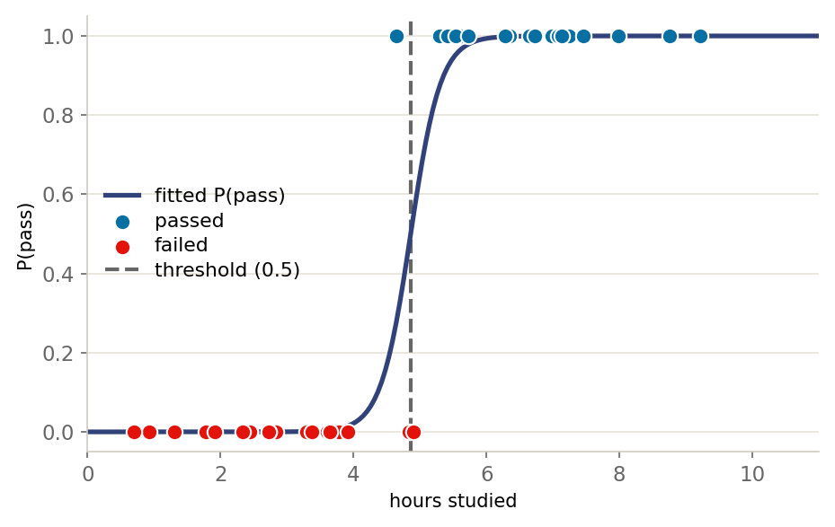

::: {.lm-hero}
[Chapter 4 · Classification]{.eyebrow}

# Logistic Regression

[A straight line predicts numbers that run off the ends of probability; the sigmoid bends it back into (0, 1) and turns regression into a classifier.]{.dek}
:::

In [binary classification]{.term} the target takes two values, $y \in \{0, 1\}$, and we
want a model that returns the probability of the positive class rather than an unbounded
number. We work a single running example: predict whether a student passes an exam from the
hours they studied. The same forty students carry us from the failure of a straight line,
through the [sigmoid]{.term} and [log-loss]{.term}, to a fitted decision rule and the
threshold that controls its errors.

## Why a straight line won't do

Suppose we ignore the discreteness and fit ordinary least squares to the $0/1$ labels. The
line has to keep rising to separate the failures from the passes, so it predicts negative
"probabilities" for students who barely studied and probabilities above one for those who
studied a lot. Both are nonsense as probabilities, and no rescaling fixes it, because a line
is unbounded by construction.

```{=html}
<figure class="lm-figure">

<figcaption><strong>The logistic curve.</strong> The fitted sigmoid maps hours studied to P(pass); the dots are students' <em>actual</em> outcomes (blue passed, red failed), and the gray dashed line is where the curve crosses 0.5 &mdash; the model's decision boundary. The points that straddle the line &mdash; one student passed on just under 4.9 hours, two failed just beyond it &mdash; are genuine misclassifications: the classes overlap, which is exactly why we fit a probability rather than draw a hard cutoff. This is the result the code below reproduces.</figcaption>
</figure>
```

::: {.panel-tabset group="lang"}

## Python
```{pyodide}
import numpy as np
import matplotlib.pyplot as plt

# Forty students: hours studied, and whether they passed (1) or failed (0).
hours = np.array([2.83, 2.72, 2.72, 4.83, 2.44, 1.78, 3.78, 4.65, 7.25, 2.44,
                  6.28, 5.62, 6.65, 4.90, 1.91, 3.60, 1.31, 6.73, 2.44, 5.29,
                  5.41, 6.98, 7.24, 3.29, 2.33, 8.76, 9.22, 6.35, 7.45, 7.08,
                  7.99, 3.92, 0.93, 6.28, 0.70, 5.53, 3.65, 5.73, 7.13, 3.38])
passed = np.array([0, 0, 0, 0, 0, 0, 0, 1, 1, 0, 1, 1, 1, 0, 0, 0, 0, 1, 0, 1,
                   1, 1, 1, 0, 0, 1, 1, 1, 1, 1, 1, 0, 0, 1, 0, 1, 0, 1, 1, 0], dtype=float)

# Ordinary least squares fit to the 0/1 labels
X = np.column_stack([np.ones(len(hours)), hours])
theta = np.linalg.lstsq(X, passed, rcond=None)[0]

print(f"OLS line:  y = {theta[0]:.3f} + {theta[1]:.3f} * hours")
print(f"predicted at  0 hours: {theta[0]:.2f}   (a probability cannot be < 0)")
print(f"predicted at 10 hours: {theta[0] + theta[1]*10:.2f}   (a probability cannot be > 1)")

xs = np.linspace(0, 11, 100)
fig, ax = plt.subplots(figsize=(8, 4.5))
fail, pas = passed == 0, passed == 1
ax.scatter(hours[fail], passed[fail], color="#E3120B", s=70, edgecolor="white", zorder=3, label="Fail")
ax.scatter(hours[pas],  passed[pas],  color="#076FA1", s=70, edgecolor="white", zorder=3, label="Pass")
ax.plot(xs, theta[0] + theta[1]*xs, color="#31417A", lw=2.5, label="OLS line")
ax.fill_between(xs, -0.4, 0, color="#666666", alpha=0.12)
ax.fill_between(xs, 1, 1.4, color="#666666", alpha=0.12)
ax.axhline(0, color="#666666", lw=1, alpha=0.5)
ax.axhline(1, color="#666666", lw=1, alpha=0.5)
ax.set_xlabel("Hours studied"); ax.set_ylabel("Predicted value")
ax.set_xlim(0, 11); ax.set_ylim(-0.3, 1.3); ax.legend(loc="lower right")
for s in ["top", "right"]: ax.spines[s].set_visible(False)
ax.grid(axis="y", color="#e6e3da", lw=0.8); ax.set_axisbelow(True)
plt.tight_layout(); plt.show()
```

## R
```{webr}
hours <- c(2.83, 2.72, 2.72, 4.83, 2.44, 1.78, 3.78, 4.65, 7.25, 2.44,
           6.28, 5.62, 6.65, 4.90, 1.91, 3.60, 1.31, 6.73, 2.44, 5.29,
           5.41, 6.98, 7.24, 3.29, 2.33, 8.76, 9.22, 6.35, 7.45, 7.08,
           7.99, 3.92, 0.93, 6.28, 0.70, 5.53, 3.65, 5.73, 7.13, 3.38)
passed <- c(0, 0, 0, 0, 0, 0, 0, 1, 1, 0, 1, 1, 1, 0, 0, 0, 0, 1, 0, 1,
            1, 1, 1, 0, 0, 1, 1, 1, 1, 1, 1, 0, 0, 1, 0, 1, 0, 1, 1, 0)

# Ordinary least squares fit to the 0/1 labels
theta <- coef(lm(passed ~ hours))

cat(sprintf("OLS line:  y = %.3f + %.3f * hours\n", theta[1], theta[2]))
cat(sprintf("predicted at  0 hours: %.2f   (a probability cannot be < 0)\n", theta[1]))
cat(sprintf("predicted at 10 hours: %.2f   (a probability cannot be > 1)\n", theta[1] + theta[2]*10))

xs  <- seq(0, 11, length.out = 100)
col <- ifelse(passed == 1, "#076FA1", "#E3120B")
plot(hours, passed, pch = 19, col = col, cex = 1.4,
     xlab = "Hours studied", ylab = "Predicted value",
     xlim = c(0, 11), ylim = c(-0.3, 1.3), bty = "l")
grid(col = "#e6e3da", lty = 1, lwd = 0.6)
abline(a = theta[1], b = theta[2], col = "#31417A", lwd = 2.5)
abline(h = 0, col = "#666666"); abline(h = 1, col = "#666666")
```

:::

Both languages fit the identical data, so the line is the same: it predicts about $-0.41$ at
zero hours and $1.51$ at ten. We need a model that lives inside $(0, 1)$ by construction.

## The sigmoid and the model it builds

The [sigmoid]{.term} (or logistic) function $g(z) = 1/(1 + e^{-z})$ squashes any real number
into $(0, 1)$. Feed it the linear score $\boldsymbol{\theta}^\top x$ and the output reads as a
probability: large positive scores approach one, large negative scores approach zero, and
$g(0) = 0.5$ marks the crossover.

::: {.defbox}
[Logistic Regression Model]{.lbl}
[ P(y=1 &#8739; x) = g(&theta;&#8868;x) = 1 &#8725; (1 + e<sup>&#8722;&theta;&#8868;x</sup>) ]{.math}
:::

We cannot fit this by least squares, because squared error against a sigmoid is non-convex.
Instead we minimize the [log-loss]{.term} (cross-entropy)
$J(\boldsymbol{\theta}) = -\frac{1}{m}\sum_i [\, y^{(i)} \log h^{(i)} + (1 - y^{(i)}) \log(1 - h^{(i)}) \,]$,
which is convex and rewards confident correct predictions while punishing confident wrong
ones. Its gradient is strikingly clean, $\nabla J = \frac{1}{m} X^\top (h - y)$, the same
shape as the linear-regression gradient with the sigmoid standing in for the linear map. That
is the quantity gradient descent walks downhill.

The two languages fit the same model by different routes. Python runs gradient descent on the
log-loss; R calls `glm(..., family = binomial)`, which finds the [maximum likelihood]{.term}
estimate by Newton steps. On this near-separable data the likelihood keeps rising as the
coefficients grow, so the two methods report different raw coefficients: gradient descent,
stopped after a fixed budget, has not yet reached the steeper maximum-likelihood values. What
they agree on is what actually classifies a student, the [decision boundary]{.term} where
$\boldsymbol{\theta}^\top x = 0$ (here $x = -\theta_0/\theta_1$) and the resulting accuracy.

::: {.panel-tabset group="lang"}

## Python
```{pyodide}
import numpy as np
import matplotlib.pyplot as plt

hours = np.array([2.83, 2.72, 2.72, 4.83, 2.44, 1.78, 3.78, 4.65, 7.25, 2.44,
                  6.28, 5.62, 6.65, 4.90, 1.91, 3.60, 1.31, 6.73, 2.44, 5.29,
                  5.41, 6.98, 7.24, 3.29, 2.33, 8.76, 9.22, 6.35, 7.45, 7.08,
                  7.99, 3.92, 0.93, 6.28, 0.70, 5.53, 3.65, 5.73, 7.13, 3.38])
passed = np.array([0, 0, 0, 0, 0, 0, 0, 1, 1, 0, 1, 1, 1, 0, 0, 0, 0, 1, 0, 1,
                   1, 1, 1, 0, 0, 1, 1, 1, 1, 1, 1, 0, 0, 1, 0, 1, 0, 1, 1, 0], dtype=float)

def sigmoid(z):
    return 1.0 / (1.0 + np.exp(-z))

X, y = np.column_stack([np.ones(len(hours)), hours]), passed

def log_loss(th):
    h = np.clip(sigmoid(X @ th), 1e-12, 1 - 1e-12)
    return -np.mean(y * np.log(h) + (1 - y) * np.log(1 - h))

# Gradient descent on the log-loss
theta = np.zeros(2)
print(f"initial log-loss: {log_loss(theta):.4f}")
for _ in range(20000):
    theta -= 0.5 * (X.T @ (sigmoid(X @ theta) - y)) / len(y)
print(f"final log-loss:   {log_loss(theta):.4f}")

boundary = -theta[0] / theta[1]
pred = (sigmoid(X @ theta) >= 0.5).astype(int)
print(f"coefficients (GD): theta0={theta[0]:.2f}, theta1={theta[1]:.2f}")
print(f"decision boundary: {boundary:.1f} hours")
print(f"training accuracy: {(pred == y).mean():.1%}")

xs = np.linspace(0, 11, 200)
fig, ax = plt.subplots(figsize=(8, 5))
fail, pas = y == 0, y == 1
ax.scatter(hours[fail], y[fail], color="#E3120B", s=80, edgecolor="white", zorder=3, label="Fail")
ax.scatter(hours[pas],  y[pas],  color="#076FA1", s=80, edgecolor="white", zorder=3, label="Pass")
ax.plot(xs, sigmoid(theta[0] + theta[1]*xs), color="#31417A", lw=2.5, label="P(pass)")
ax.axvline(boundary, color="#666666", ls="--", lw=2, label=f"boundary {boundary:.1f}h")
ax.axhline(0.5, color="#666666", ls=":", alpha=0.6)
ax.set_xlabel("Hours studied"); ax.set_ylabel("P(pass)")
ax.set_xlim(0, 11); ax.set_ylim(-0.05, 1.05); ax.legend(loc="center right")
for s in ["top", "right"]: ax.spines[s].set_visible(False)
ax.grid(axis="y", color="#e6e3da", lw=0.8); ax.set_axisbelow(True)
plt.tight_layout(); plt.show()
```

## R
```{webr}
hours <- c(2.83, 2.72, 2.72, 4.83, 2.44, 1.78, 3.78, 4.65, 7.25, 2.44,
           6.28, 5.62, 6.65, 4.90, 1.91, 3.60, 1.31, 6.73, 2.44, 5.29,
           5.41, 6.98, 7.24, 3.29, 2.33, 8.76, 9.22, 6.35, 7.45, 7.08,
           7.99, 3.92, 0.93, 6.28, 0.70, 5.53, 3.65, 5.73, 7.13, 3.38)
passed <- c(0, 0, 0, 0, 0, 0, 0, 1, 1, 0, 1, 1, 1, 0, 0, 0, 0, 1, 0, 1,
            1, 1, 1, 0, 0, 1, 1, 1, 1, 1, 1, 0, 0, 1, 0, 1, 0, 1, 1, 0)

# Maximum-likelihood logistic fit
fit <- glm(passed ~ hours, family = binomial)
co  <- coef(fit)

boundary <- -co[1] / co[2]
pred <- as.integer(predict(fit, type = "response") >= 0.5)
cat(sprintf("coefficients (glm): theta0=%.2f, theta1=%.2f\n", co[1], co[2]))
cat(sprintf("decision boundary: %.1f hours\n", boundary))
cat(sprintf("training accuracy: %.1f%%\n", 100 * mean(pred == passed)))

xs  <- seq(0, 11, length.out = 200)
ps  <- predict(fit, newdata = data.frame(hours = xs), type = "response")
col <- ifelse(passed == 1, "#076FA1", "#E3120B")
plot(hours, passed, pch = 19, col = col, cex = 1.5,
     xlab = "Hours studied", ylab = "P(pass)",
     xlim = c(0, 11), ylim = c(-0.05, 1.05), bty = "l")
grid(col = "#e6e3da", lty = 1, lwd = 0.6)
lines(xs, ps, col = "#31417A", lwd = 2.5)
abline(v = boundary, col = "#666666", lty = 2, lwd = 2)
abline(h = 0.5, col = "#666666", lty = 3)
```

:::

The coefficients differ, but both put the boundary near 4.9 hours and both score 95% on the
training set: study past that mark and the model predicts a pass. The boundary, not the raw
coefficients, is the object that classifies, and it is robust to how we reach the fit.

## A boundary in two dimensions

With two features the boundary becomes a line. We take thirty points in two overlapping
clusters; because they overlap, the maximum-likelihood fit is finite and well conditioned, so
gradient descent and `glm` land on the *same* coefficients. The boundary $\theta_0 + \theta_1
x_1 + \theta_2 x_2 = 0$ rearranges to a line $x_2 = -(\theta_0 + \theta_1 x_1)/\theta_2$.

::: {.panel-tabset group="lang"}

## Python
```{pyodide}
import numpy as np
import matplotlib.pyplot as plt

x1 = np.array([1.02, 2.25, 1.48, -0.18, 3.14, 1.39, 3.34, 1.60, 3.99, 2.90,
               2.66, 1.16, 0.87, 2.82, 1.87, 3.77, 2.41, 4.83, 4.00, 3.21,
               3.28, 3.65, 4.30, 6.15, 4.88, 2.84, 5.57, 4.03, 4.80, 5.35])
x2 = np.array([2.90, 0.64, 3.49, 1.61, 1.22, 1.91, 1.42, 1.61, 3.97, 2.35,
               3.34, 3.06, 1.43, 0.71, 1.22, 1.48, 3.37, 3.84, 4.62, 4.26,
               2.45, 4.52, 3.99, 4.37, 6.01, 3.07, 3.28, 4.96, 5.58, 4.96])
y = np.array([0]*15 + [1]*15, dtype=float)

def sigmoid(z):
    return 1.0 / (1.0 + np.exp(-z))

X = np.column_stack([np.ones(len(y)), x1, x2])
theta = np.zeros(3)
for _ in range(20000):
    theta -= 0.5 * (X.T @ (sigmoid(X @ theta) - y)) / len(y)

pred = (sigmoid(X @ theta) >= 0.5).astype(int)
print(f"coefficients (GD): {np.round(theta, 4)}")
print(f"training accuracy: {(pred == y).mean():.1%}")
print(f"boundary line: x2 = {-theta[0]/theta[2]:.3f} + {-theta[1]/theta[2]:.3f} * x1")

xs = np.linspace(-1, 7, 200)
fig, ax = plt.subplots(figsize=(7, 6))
c0, c1 = y == 0, y == 1
ax.scatter(x1[c0], x2[c0], color="#E3120B", s=70, edgecolor="white", zorder=3, label="Class 0")
ax.scatter(x1[c1], x2[c1], color="#076FA1", s=70, edgecolor="white", zorder=3, label="Class 1")
ax.plot(xs, -(theta[0] + theta[1]*xs)/theta[2], color="#31417A", lw=2.5, label="boundary")
ax.set_xlabel("Feature x1"); ax.set_ylabel("Feature x2")
ax.set_xlim(-1, 7); ax.set_ylim(0, 7); ax.legend(loc="lower right")
for s in ["top", "right"]: ax.spines[s].set_visible(False)
ax.set_axisbelow(True)
plt.tight_layout(); plt.show()
```

## R
```{webr}
x1 <- c(1.02, 2.25, 1.48, -0.18, 3.14, 1.39, 3.34, 1.60, 3.99, 2.90,
        2.66, 1.16, 0.87, 2.82, 1.87, 3.77, 2.41, 4.83, 4.00, 3.21,
        3.28, 3.65, 4.30, 6.15, 4.88, 2.84, 5.57, 4.03, 4.80, 5.35)
x2 <- c(2.90, 0.64, 3.49, 1.61, 1.22, 1.91, 1.42, 1.61, 3.97, 2.35,
        3.34, 3.06, 1.43, 0.71, 1.22, 1.48, 3.37, 3.84, 4.62, 4.26,
        2.45, 4.52, 3.99, 4.37, 6.01, 3.07, 3.28, 4.96, 5.58, 4.96)
y  <- c(rep(0, 15), rep(1, 15))

fit <- glm(y ~ x1 + x2, family = binomial)
co  <- coef(fit)

pred <- as.integer(predict(fit, type = "response") >= 0.5)
cat("coefficients (glm):", round(co, 4), "\n")
cat(sprintf("training accuracy: %.1f%%\n", 100 * mean(pred == y)))
cat(sprintf("boundary line: x2 = %.3f + %.3f * x1\n", -co[1]/co[3], -co[2]/co[3]))

xs  <- seq(-1, 7, length.out = 200)
col <- ifelse(y == 1, "#076FA1", "#E3120B")
plot(x1, x2, pch = 19, col = col, cex = 1.4,
     xlab = "Feature x1", ylab = "Feature x2",
     xlim = c(-1, 7), ylim = c(0, 7), bty = "l")
grid(col = "#e6e3da", lty = 1, lwd = 0.6)
lines(xs, -(co[1] + co[2]*xs)/co[3], col = "#31417A", lwd = 2.5)
```

:::

Here the two fits coincide to four decimals: well-separated-but-overlapping data pins down a
unique maximum, and gradient descent reaches it. The boundary $x_2 \approx 8.21 - 1.75\,x_1$
slices between the clusters and misclassifies the handful of points that stray across.

## Choosing the threshold

A probability becomes a label only after we pick a [threshold]{.term}. The default $0.5$ is
not sacred: lowering it catches more passes at the cost of more false alarms, raising it does
the reverse. The table sweeps thresholds and counts false positives (predicted pass, actually
failed) against false negatives (predicted fail, actually passed). The two languages produce
identical tables, because thresholding depends only on the *ordering* of the fitted
probabilities, which both fits share.

::: {.panel-tabset group="lang"}

## Python
```{pyodide}
import numpy as np
import matplotlib.pyplot as plt

hours = np.array([2.83, 2.72, 2.72, 4.83, 2.44, 1.78, 3.78, 4.65, 7.25, 2.44,
                  6.28, 5.62, 6.65, 4.90, 1.91, 3.60, 1.31, 6.73, 2.44, 5.29,
                  5.41, 6.98, 7.24, 3.29, 2.33, 8.76, 9.22, 6.35, 7.45, 7.08,
                  7.99, 3.92, 0.93, 6.28, 0.70, 5.53, 3.65, 5.73, 7.13, 3.38])
passed = np.array([0, 0, 0, 0, 0, 0, 0, 1, 1, 0, 1, 1, 1, 0, 0, 0, 0, 1, 0, 1,
                   1, 1, 1, 0, 0, 1, 1, 1, 1, 1, 1, 0, 0, 1, 0, 1, 0, 1, 1, 0], dtype=float)

def sigmoid(z):
    return 1.0 / (1.0 + np.exp(-z))

X, y = np.column_stack([np.ones(len(hours)), hours]), passed
theta = np.zeros(2)
for _ in range(20000):
    theta -= 0.5 * (X.T @ (sigmoid(X @ theta) - y)) / len(y)
prob = sigmoid(X @ theta)

print(f"{'threshold':>9} {'accuracy':>9} {'FP':>4} {'FN':>4}")
thresholds = np.linspace(0.1, 0.9, 9)
accs = []
for t in thresholds:
    pred = (prob >= t).astype(int)
    fp = int(np.sum((y == 0) & (pred == 1)))
    fn = int(np.sum((y == 1) & (pred == 0)))
    acc = (pred == y).mean()
    accs.append(acc)
    print(f"{t:>9.2f} {acc:>9.1%} {fp:>4} {fn:>4}")

best = thresholds[int(np.argmax(accs))]
fig, ax = plt.subplots(figsize=(8, 4.5))
ax.plot(thresholds, accs, "o-", color="#076FA1", lw=2, markersize=8)
ax.axvline(best, color="#666666", ls="--", alpha=0.7, label=f"best {best:.2f}")
ax.set_xlabel("Decision threshold"); ax.set_ylabel("Accuracy")
ax.set_xlim(0, 1); ax.legend()
for s in ["top", "right"]: ax.spines[s].set_visible(False)
ax.grid(axis="y", color="#e6e3da", lw=0.8); ax.set_axisbelow(True)
plt.tight_layout(); plt.show()
```

## R
```{webr}
hours <- c(2.83, 2.72, 2.72, 4.83, 2.44, 1.78, 3.78, 4.65, 7.25, 2.44,
           6.28, 5.62, 6.65, 4.90, 1.91, 3.60, 1.31, 6.73, 2.44, 5.29,
           5.41, 6.98, 7.24, 3.29, 2.33, 8.76, 9.22, 6.35, 7.45, 7.08,
           7.99, 3.92, 0.93, 6.28, 0.70, 5.53, 3.65, 5.73, 7.13, 3.38)
passed <- c(0, 0, 0, 0, 0, 0, 0, 1, 1, 0, 1, 1, 1, 0, 0, 0, 0, 1, 0, 1,
            1, 1, 1, 0, 0, 1, 1, 1, 1, 1, 1, 0, 0, 1, 0, 1, 0, 1, 1, 0)

fit  <- glm(passed ~ hours, family = binomial)
prob <- predict(fit, type = "response")

cat(sprintf("%9s %9s %4s %4s\n", "threshold", "accuracy", "FP", "FN"))
thresholds <- seq(0.1, 0.9, by = 0.1)
accs <- numeric(length(thresholds))
for (i in seq_along(thresholds)) {
  t    <- thresholds[i]
  pred <- as.integer(prob >= t)
  fp   <- sum(passed == 0 & pred == 1)
  fn   <- sum(passed == 1 & pred == 0)
  accs[i] <- mean(pred == passed)
  cat(sprintf("%9.2f %8.1f%% %4d %4d\n", t, 100 * accs[i], fp, fn))
}

best <- thresholds[which.max(accs)]
plot(thresholds, accs, type = "b", pch = 19, col = "#076FA1", lwd = 2,
     xlab = "Decision threshold", ylab = "Accuracy", xlim = c(0, 1), bty = "l")
grid(col = "#e6e3da", lty = 1, lwd = 0.6)
abline(v = best, col = "#666666", lty = 2)
```

:::

Accuracy alone hides the trade: at a threshold of $0.6$ this model reaches its best score by
eliminating false passes, but a setting that tolerates a false pass to never miss a real one
would push the threshold lower. Which error costs more is a question about the application,
not the algorithm, and it is the bridge to precision, recall, and ROC curves in the next
chapter.

::: {.explore}
[Try it]{.lbl}
In the first fit, drop the iteration count from `20000` to `200` and re-run. Watch the
coefficients shrink and the sigmoid flatten, yet the decision boundary and accuracy barely
move. Gradient descent settles the boundary long before it settles the magnitudes.
:::
