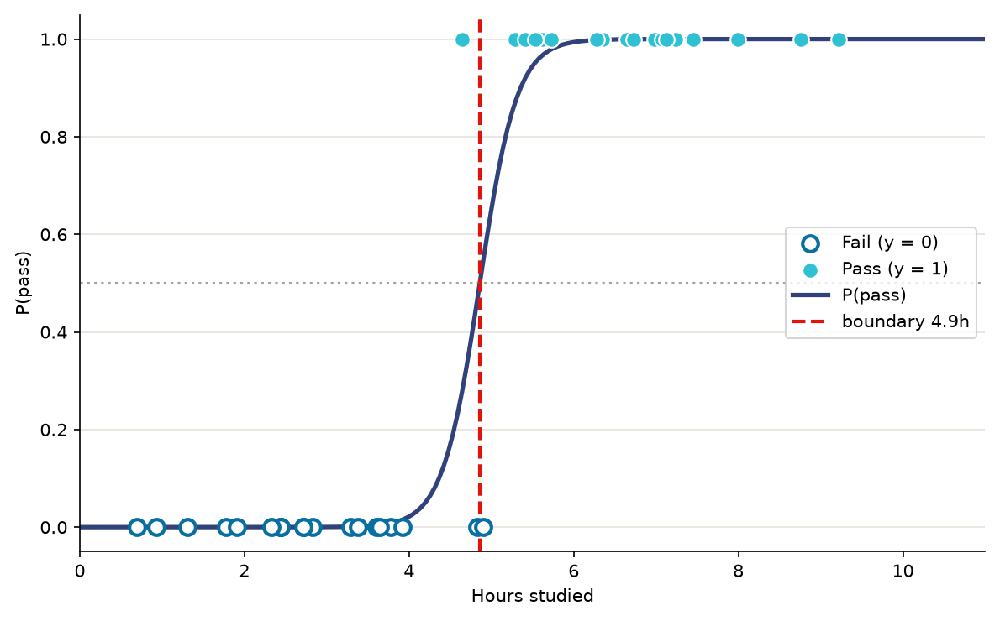

::: {.lm-hero}
[Chapter 4 · Classification]{.eyebrow}

# Logistic Regression

[A straight line predicts numbers that run off the ends of probability; the sigmoid bends it back into (0, 1) and turns regression into a classifier.]{.dek}
:::

In [binary classification]{.term} the target takes two values, $y \in \{0, 1\}$, and we
want a model that returns the probability of the positive class rather than an unbounded
number. We work a single running example: predict whether a student passes an exam from the
hours they studied. The same forty students carry us from the failure of a straight line,
through the [sigmoid]{.term} and [log-loss]{.term}, to a fitted decision rule and the
threshold that controls its errors.

## Why a straight line won't do

Suppose we ignore the discreteness and fit ordinary least squares to the $0/1$ labels. The
line has to keep rising to separate the failures from the passes, so it predicts negative
"probabilities" for students who barely studied and probabilities above one for those who
studied a lot. Both are nonsense as probabilities, and no rescaling fixes it, because a line
is unbounded by construction.

```{=html}
<figure class="lm-figure">

<figcaption><strong>The logistic curve.</strong> The fitted sigmoid maps hours studied to P(pass); the dots are students' <em>actual</em> outcomes (blue passed, red failed), and the gray dashed line is where the curve crosses 0.5 &mdash; the model's decision boundary. The points that straddle the line &mdash; one student passed on 4.65 hours, one failed on 4.90 &mdash; are genuine misclassifications: the classes overlap, which is exactly why we fit a probability rather than draw a hard cutoff. This is the result the code below reproduces.</figcaption>
</figure>
```

::: {.panel-tabset group="lang"}

## Python
```{pyodide}
import numpy as np
import matplotlib.pyplot as plt

# Forty students: hours studied, and whether they passed (1) or failed (0).
hours = np.array([2.83, 2.72, 2.72, 4.83, 2.44, 1.78, 3.78, 4.65, 7.25, 2.44,
                  6.28, 5.62, 6.65, 4.90, 1.91, 3.60, 1.31, 6.73, 2.44, 5.29,
                  5.41, 6.98, 7.24, 3.29, 2.33, 8.76, 9.22, 6.35, 7.45, 7.08,
                  7.99, 3.92, 0.93, 6.28, 0.70, 5.53, 3.65, 5.73, 7.13, 3.38])
passed = np.array([0, 0, 0, 0, 0, 0, 0, 1, 1, 0, 1, 1, 1, 0, 0, 0, 0, 1, 0, 1,
                   1, 1, 1, 0, 0, 1, 1, 1, 1, 1, 1, 0, 0, 1, 0, 1, 0, 1, 1, 0], dtype=float)

# Ordinary least squares fit to the 0/1 labels
X = np.column_stack([np.ones(len(hours)), hours])
theta = np.linalg.lstsq(X, passed, rcond=None)[0]

print(f"OLS line:  y = {theta[0]:.3f} + {theta[1]:.3f} * hours")
print(f"predicted at  0 hours: {theta[0]:.2f}   (a probability cannot be < 0)")
print(f"predicted at 10 hours: {theta[0] + theta[1]*10:.2f}   (a probability cannot be > 1)")

xs = np.linspace(0, 11, 100)
fig, ax = plt.subplots(figsize=(8, 4.5))
fail, pas = passed == 0, passed == 1
ax.scatter(hours[fail], passed[fail], s=70, facecolors="white", edgecolors="#076FA1", linewidths=2, zorder=3, label="Fail (y = 0)")
ax.scatter(hours[pas],  passed[pas],  s=70, color="#2FC1D3", edgecolor="white", zorder=3, label="Pass (y = 1)")
ax.plot(xs, theta[0] + theta[1]*xs, color="#31417A", lw=2.5, label="OLS line")
ax.fill_between(xs, -0.4, 0, color="#666666", alpha=0.12)
ax.fill_between(xs, 1, 1.4, color="#666666", alpha=0.12)
ax.axhline(0, color="#666666", lw=1, alpha=0.5)
ax.axhline(1, color="#666666", lw=1, alpha=0.5)
ax.set_xlabel("Hours studied"); ax.set_ylabel("Predicted value")
ax.set_xlim(0, 11); ax.set_ylim(-0.3, 1.3); ax.legend(loc="lower right")
for s in ["top", "right"]: ax.spines[s].set_visible(False)
ax.grid(axis="y", color="#e6e3da", lw=0.8); ax.set_axisbelow(True)
plt.tight_layout(); plt.show()
```

## R
```{webr}
hours <- c(2.83, 2.72, 2.72, 4.83, 2.44, 1.78, 3.78, 4.65, 7.25, 2.44,
           6.28, 5.62, 6.65, 4.90, 1.91, 3.60, 1.31, 6.73, 2.44, 5.29,
           5.41, 6.98, 7.24, 3.29, 2.33, 8.76, 9.22, 6.35, 7.45, 7.08,
           7.99, 3.92, 0.93, 6.28, 0.70, 5.53, 3.65, 5.73, 7.13, 3.38)
passed <- c(0, 0, 0, 0, 0, 0, 0, 1, 1, 0, 1, 1, 1, 0, 0, 0, 0, 1, 0, 1,
            1, 1, 1, 0, 0, 1, 1, 1, 1, 1, 1, 0, 0, 1, 0, 1, 0, 1, 1, 0)

# Ordinary least squares fit to the 0/1 labels
theta <- coef(lm(passed ~ hours))

cat(sprintf("OLS line:  y = %.3f + %.3f * hours\n", theta[1], theta[2]))
cat(sprintf("predicted at  0 hours: %.2f   (a probability cannot be < 0)\n", theta[1]))
cat(sprintf("predicted at 10 hours: %.2f   (a probability cannot be > 1)\n", theta[1] + theta[2]*10))

xs  <- seq(0, 11, length.out = 100)
col <- ifelse(passed == 1, "#2FC1D3", "#076FA1")   # y = 1 filled cyan, y = 0 open blue
plot(hours, passed, pch = ifelse(passed == 1, 19, 1), col = col, cex = 1.4, lwd = 2,
     xlab = "Hours studied", ylab = "Predicted value",
     xlim = c(0, 11), ylim = c(-0.3, 1.3), bty = "l")
grid(col = "#e6e3da", lty = 1, lwd = 0.6)
abline(a = theta[1], b = theta[2], col = "#31417A", lwd = 2.5)
abline(h = 0, col = "#666666"); abline(h = 1, col = "#666666")
```

:::

The fitted line predicts about $-0.41$ at
zero hours and $1.51$ at ten. We need a model that lives inside $(0, 1)$ by construction.

## The sigmoid and the model it builds

The [sigmoid]{.term} (or logistic) function $g(z) = 1/(1 + e^{-z})$ squashes any real number
into $(0, 1)$. Feed it the linear score $\boldsymbol{\theta}^\top x$ and the output reads as a
probability: large positive scores approach one, large negative scores approach zero, and
$g(0) = 0.5$ marks the crossover.

::: {.defbox}
[Logistic Regression Model]{.lbl}
[ P(y=1 &#8739; x) = g(&theta;<sup>&#8868;</sup>x) = 1 &#8725; (1 + e<sup>&#8722;&theta;<sup>&#8868;</sup>x</sup>) ]{.math}
:::

We cannot fit this by least squares, because squared error against a sigmoid is non-convex.
Instead we minimize the [log-loss]{.term} (cross-entropy)
$J(\boldsymbol{\theta}) = -\frac{1}{m}\sum_i [\, y^{(i)} \log h^{(i)} + (1 - y^{(i)}) \log(1 - h^{(i)}) \,]$,
which is convex and rewards confident correct predictions while punishing confident wrong
ones. Its gradient is strikingly clean, $\nabla J = \frac{1}{m} X^\top (h - y)$, the same
shape as the linear-regression gradient with the sigmoid standing in for the linear map. That
is the quantity gradient descent walks downhill.

The two languages fit the same model by different routes. Python runs gradient descent on the
log-loss; R calls `glm(..., family = binomial)`, which finds the [maximum likelihood]{.term}
estimate by Newton steps. The classes overlap (one student passed on 4.65 hours, two failed
on 4.83 and 4.90), so the maximum-likelihood estimate is finite, and `glm` reaches it at
$\boldsymbol{\theta} \approx (-24.03,\ 4.93)$. Gradient descent on raw, uncentered hours
approaches the same point slowly, and after a fixed budget of 20,000 steps it stops short, at
about $(-21.55,\ 4.44)$. What they agree on is what actually classifies a student, the
[decision boundary]{.term} where $\boldsymbol{\theta}^\top x = 0$ (here $x = -\theta_0/\theta_1$)
and the resulting accuracy.

::: {.panel-tabset group="lang"}

## Python
```{pyodide}
import numpy as np
import matplotlib.pyplot as plt

hours = np.array([2.83, 2.72, 2.72, 4.83, 2.44, 1.78, 3.78, 4.65, 7.25, 2.44,
                  6.28, 5.62, 6.65, 4.90, 1.91, 3.60, 1.31, 6.73, 2.44, 5.29,
                  5.41, 6.98, 7.24, 3.29, 2.33, 8.76, 9.22, 6.35, 7.45, 7.08,
                  7.99, 3.92, 0.93, 6.28, 0.70, 5.53, 3.65, 5.73, 7.13, 3.38])
passed = np.array([0, 0, 0, 0, 0, 0, 0, 1, 1, 0, 1, 1, 1, 0, 0, 0, 0, 1, 0, 1,
                   1, 1, 1, 0, 0, 1, 1, 1, 1, 1, 1, 0, 0, 1, 0, 1, 0, 1, 1, 0], dtype=float)

def sigmoid(z):
    return 1.0 / (1.0 + np.exp(-z))

X, y = np.column_stack([np.ones(len(hours)), hours]), passed

def log_loss(th):
    h = np.clip(sigmoid(X @ th), 1e-12, 1 - 1e-12)
    return -np.mean(y * np.log(h) + (1 - y) * np.log(1 - h))

# Gradient descent on the log-loss
theta = np.zeros(2)
print(f"initial log-loss: {log_loss(theta):.4f}")
for _ in range(20000):
    theta -= 0.5 * (X.T @ (sigmoid(X @ theta) - y)) / len(y)
print(f"final log-loss:   {log_loss(theta):.4f}")

boundary = -theta[0] / theta[1]
pred = (sigmoid(X @ theta) >= 0.5).astype(int)
print(f"coefficients (GD): theta0={theta[0]:.2f}, theta1={theta[1]:.2f}")
print(f"decision boundary: {boundary:.1f} hours")
print(f"training accuracy: {(pred == y).mean():.1%}")

xs = np.linspace(0, 11, 200)
fig, ax = plt.subplots(figsize=(8, 5))
fail, pas = y == 0, y == 1
ax.scatter(hours[fail], y[fail], s=80, facecolors="white", edgecolors="#076FA1", linewidths=2, zorder=3, label="Fail (y = 0)")
ax.scatter(hours[pas],  y[pas],  s=80, color="#2FC1D3", edgecolor="white", zorder=3, label="Pass (y = 1)")
ax.plot(xs, sigmoid(theta[0] + theta[1]*xs), color="#31417A", lw=2.5, label="P(pass)")
ax.axvline(boundary, color="#E3120B", ls="--", lw=2, label=f"boundary {boundary:.1f}h")
ax.axhline(0.5, color="#666666", ls=":", alpha=0.6)
ax.set_xlabel("Hours studied"); ax.set_ylabel("P(pass)")
ax.set_xlim(0, 11); ax.set_ylim(-0.05, 1.05); ax.legend(loc="center right")
for s in ["top", "right"]: ax.spines[s].set_visible(False)
ax.grid(axis="y", color="#e6e3da", lw=0.8); ax.set_axisbelow(True)
plt.tight_layout(); plt.show()
```

## R
```{webr}
hours <- c(2.83, 2.72, 2.72, 4.83, 2.44, 1.78, 3.78, 4.65, 7.25, 2.44,
           6.28, 5.62, 6.65, 4.90, 1.91, 3.60, 1.31, 6.73, 2.44, 5.29,
           5.41, 6.98, 7.24, 3.29, 2.33, 8.76, 9.22, 6.35, 7.45, 7.08,
           7.99, 3.92, 0.93, 6.28, 0.70, 5.53, 3.65, 5.73, 7.13, 3.38)
passed <- c(0, 0, 0, 0, 0, 0, 0, 1, 1, 0, 1, 1, 1, 0, 0, 0, 0, 1, 0, 1,
            1, 1, 1, 0, 0, 1, 1, 1, 1, 1, 1, 0, 0, 1, 0, 1, 0, 1, 1, 0)

# Maximum-likelihood logistic fit
fit <- glm(passed ~ hours, family = binomial)
co  <- coef(fit)

boundary <- -co[1] / co[2]
pred <- as.integer(predict(fit, type = "response") >= 0.5)
cat(sprintf("coefficients (glm): theta0=%.2f, theta1=%.2f\n", co[1], co[2]))
cat(sprintf("decision boundary: %.1f hours\n", boundary))
cat(sprintf("training accuracy: %.1f%%\n", 100 * mean(pred == passed)))

xs  <- seq(0, 11, length.out = 200)
ps  <- predict(fit, newdata = data.frame(hours = xs), type = "response")
col <- ifelse(passed == 1, "#2FC1D3", "#076FA1")   # y = 1 filled cyan, y = 0 open blue
plot(hours, passed, pch = ifelse(passed == 1, 19, 1), col = col, cex = 1.5, lwd = 2,
     xlab = "Hours studied", ylab = "P(pass)",
     xlim = c(0, 11), ylim = c(-0.05, 1.05), bty = "l")
grid(col = "#e6e3da", lty = 1, lwd = 0.6)
lines(xs, ps, col = "#31417A", lwd = 2.5)
abline(v = boundary, col = "#E3120B", lty = 2, lwd = 2)
abline(h = 0.5, col = "#666666", lty = 3)
```

:::

The coefficients differ, but both put the boundary near 4.9 hours and both score 95% on the
training set: study past that mark and the model predicts a pass. The boundary, not the raw
coefficients, is the object that classifies, and it is robust to how we reach the fit.

## A boundary in two dimensions

With two features the boundary becomes a line. We take thirty points in two overlapping
clusters; because they overlap, the maximum-likelihood fit is finite and well conditioned, so
gradient descent and `glm` land on the *same* coefficients. The boundary $\theta_0 + \theta_1
x_1 + \theta_2 x_2 = 0$ rearranges to a line $x_2 = -(\theta_0 + \theta_1 x_1)/\theta_2$.

::: {.panel-tabset group="lang"}

## Python
```{pyodide}
import numpy as np
import matplotlib.pyplot as plt

x1 = np.array([1.02, 2.25, 1.48, -0.18, 3.14, 1.39, 3.34, 1.60, 3.99, 2.90,
               2.66, 1.16, 0.87, 2.82, 1.87, 3.77, 2.41, 4.83, 4.00, 3.21,
               3.28, 3.65, 4.30, 6.15, 4.88, 2.84, 5.57, 4.03, 4.80, 5.35])
x2 = np.array([2.90, 0.64, 3.49, 1.61, 1.22, 1.91, 1.42, 1.61, 3.97, 2.35,
               3.34, 3.06, 1.43, 0.71, 1.22, 1.48, 3.37, 3.84, 4.62, 4.26,
               2.45, 4.52, 3.99, 4.37, 6.01, 3.07, 3.28, 4.96, 5.58, 4.96])
y = np.array([0]*15 + [1]*15, dtype=float)

def sigmoid(z):
    return 1.0 / (1.0 + np.exp(-z))

X = np.column_stack([np.ones(len(y)), x1, x2])
theta = np.zeros(3)
for _ in range(20000):
    theta -= 0.5 * (X.T @ (sigmoid(X @ theta) - y)) / len(y)

pred = (sigmoid(X @ theta) >= 0.5).astype(int)
print(f"coefficients (GD): {np.round(theta, 4)}")
print(f"training accuracy: {(pred == y).mean():.1%}")
print(f"boundary line: x2 = {-theta[0]/theta[2]:.3f} + {-theta[1]/theta[2]:.3f} * x1")

xs = np.linspace(-1, 7, 200)
fig, ax = plt.subplots(figsize=(7, 6))
c0, c1 = y == 0, y == 1
ax.scatter(x1[c0], x2[c0], s=70, facecolors="white", edgecolors="#076FA1", linewidths=2, zorder=3, label="Class 0")
ax.scatter(x1[c1], x2[c1], s=70, color="#2FC1D3", edgecolor="white", zorder=3, label="Class 1")
ax.plot(xs, -(theta[0] + theta[1]*xs)/theta[2], color="#E3120B", lw=2.5, label="boundary")
ax.set_xlabel("Feature x1"); ax.set_ylabel("Feature x2")
ax.set_xlim(-1, 7); ax.set_ylim(0, 7); ax.legend(loc="lower right")
for s in ["top", "right"]: ax.spines[s].set_visible(False)
ax.set_axisbelow(True)
plt.tight_layout(); plt.show()
```

## R
```{webr}
x1 <- c(1.02, 2.25, 1.48, -0.18, 3.14, 1.39, 3.34, 1.60, 3.99, 2.90,
        2.66, 1.16, 0.87, 2.82, 1.87, 3.77, 2.41, 4.83, 4.00, 3.21,
        3.28, 3.65, 4.30, 6.15, 4.88, 2.84, 5.57, 4.03, 4.80, 5.35)
x2 <- c(2.90, 0.64, 3.49, 1.61, 1.22, 1.91, 1.42, 1.61, 3.97, 2.35,
        3.34, 3.06, 1.43, 0.71, 1.22, 1.48, 3.37, 3.84, 4.62, 4.26,
        2.45, 4.52, 3.99, 4.37, 6.01, 3.07, 3.28, 4.96, 5.58, 4.96)
y  <- c(rep(0, 15), rep(1, 15))

fit <- glm(y ~ x1 + x2, family = binomial)
co  <- coef(fit)

pred <- as.integer(predict(fit, type = "response") >= 0.5)
cat("coefficients (glm):", round(co, 4), "\n")
cat(sprintf("training accuracy: %.1f%%\n", 100 * mean(pred == y)))
cat(sprintf("boundary line: x2 = %.3f + %.3f * x1\n", -co[1]/co[3], -co[2]/co[3]))

xs  <- seq(-1, 7, length.out = 200)
col <- ifelse(y == 1, "#2FC1D3", "#076FA1")   # class 1 filled cyan, class 0 open blue
plot(x1, x2, pch = ifelse(y == 1, 19, 1), col = col, cex = 1.4, lwd = 2,
     xlab = "Feature x1", ylab = "Feature x2",
     xlim = c(-1, 7), ylim = c(0, 7), bty = "l")
grid(col = "#e6e3da", lty = 1, lwd = 0.6)
lines(xs, -(co[1] + co[2]*xs)/co[3], col = "#E3120B", lwd = 2.5)
```

:::

Here the two fits coincide to four decimals: well-separated-but-overlapping data pins down a
unique maximum, and gradient descent reaches it. The boundary $x_2 \approx 8.21 - 1.75\,x_1$
slices between the clusters and misclassifies the handful of points that stray across.

## Choosing the threshold

A probability becomes a label only after we pick a [threshold]{.term}, and the threshold
follows from what the two errors cost. Write $c_{\text{FP}}$ for the cost of a false positive
(predicted pass, actually failed) and $c_{\text{FN}}$ for a false negative (predicted fail,
actually passed). If the probabilities are calibrated, predicting a pass at probability $p$
has expected cost $(1-p)\,c_{\text{FP}}$ and predicting a fail has expected cost
$p\,c_{\text{FN}}$, so we predict a pass when

$$p > \frac{c_{\text{FP}}}{c_{\text{FP}} + c_{\text{FN}}}.$$

The default $0.5$ is the case of equal costs. The table runs the rule across cost ratios and
counts the training errors at each threshold; the plot fixes one ratio, a false pass three
times as costly as a missed one, and shows total training cost at every threshold, with the
rule's threshold in red.

::: {.panel-tabset group="lang"}

## Python
```{pyodide}
import numpy as np
import matplotlib.pyplot as plt

hours = np.array([2.83, 2.72, 2.72, 4.83, 2.44, 1.78, 3.78, 4.65, 7.25, 2.44,
                  6.28, 5.62, 6.65, 4.90, 1.91, 3.60, 1.31, 6.73, 2.44, 5.29,
                  5.41, 6.98, 7.24, 3.29, 2.33, 8.76, 9.22, 6.35, 7.45, 7.08,
                  7.99, 3.92, 0.93, 6.28, 0.70, 5.53, 3.65, 5.73, 7.13, 3.38])
passed = np.array([0, 0, 0, 0, 0, 0, 0, 1, 1, 0, 1, 1, 1, 0, 0, 0, 0, 1, 0, 1,
                   1, 1, 1, 0, 0, 1, 1, 1, 1, 1, 1, 0, 0, 1, 0, 1, 0, 1, 1, 0], dtype=float)

def sigmoid(z):
    return 1.0 / (1.0 + np.exp(-z))

X, y = np.column_stack([np.ones(len(hours)), hours]), passed
theta = np.zeros(2)
for _ in range(20000):
    theta -= 0.5 * (X.T @ (sigmoid(X @ theta) - y)) / len(y)
prob = sigmoid(X @ theta)

# The rule: predict a pass when p > c_FP / (c_FP + c_FN).
print(f"{'c_FN/c_FP':>9} {'threshold':>9} {'FP':>4} {'FN':>4}")
for ratio in [1/9, 1/3, 1, 3, 9]:
    t = 1 / (1 + ratio)
    pred = (prob > t).astype(int)
    fp = int(np.sum((y == 0) & (pred == 1)))
    fn = int(np.sum((y == 1) & (pred == 0)))
    print(f"{ratio:>9.2f} {t:>9.2f} {fp:>4} {fn:>4}")

# One cost setting: a false pass costs three times a missed pass.
c_FP, c_FN = 3.0, 1.0
rule = c_FP / (c_FP + c_FN)
ts = np.linspace(0.05, 0.95, 91)
cost = [c_FP * np.sum((y == 0) & (prob > t)) + c_FN * np.sum((y == 1) & (prob <= t))
        for t in ts]
fig, ax = plt.subplots(figsize=(8, 4.5))
ax.plot(ts, cost, color="#31417A", lw=2.5, label="total training cost")
ax.axvline(rule, color="#E3120B", ls="--", lw=2, label=f"rule threshold {rule:.2f}")
ax.set_xlabel("Decision threshold"); ax.set_ylabel("Total cost (units of $c_{FN}$)")
ax.set_xlim(0, 1); ax.legend()
for s in ["top", "right"]: ax.spines[s].set_visible(False)
ax.grid(axis="y", color="#e6e3da", lw=0.8); ax.set_axisbelow(True)
plt.tight_layout(); plt.show()
```

## R
```{webr}
hours <- c(2.83, 2.72, 2.72, 4.83, 2.44, 1.78, 3.78, 4.65, 7.25, 2.44,
           6.28, 5.62, 6.65, 4.90, 1.91, 3.60, 1.31, 6.73, 2.44, 5.29,
           5.41, 6.98, 7.24, 3.29, 2.33, 8.76, 9.22, 6.35, 7.45, 7.08,
           7.99, 3.92, 0.93, 6.28, 0.70, 5.53, 3.65, 5.73, 7.13, 3.38)
passed <- c(0, 0, 0, 0, 0, 0, 0, 1, 1, 0, 1, 1, 1, 0, 0, 0, 0, 1, 0, 1,
            1, 1, 1, 0, 0, 1, 1, 1, 1, 1, 1, 0, 0, 1, 0, 1, 0, 1, 1, 0)

fit  <- glm(passed ~ hours, family = binomial)
prob <- predict(fit, type = "response")

# The rule: predict a pass when p > c_FP / (c_FP + c_FN).
cat(sprintf("%9s %9s %4s %4s\n", "c_FN/c_FP", "threshold", "FP", "FN"))
for (ratio in c(1/9, 1/3, 1, 3, 9)) {
  t    <- 1 / (1 + ratio)
  pred <- as.integer(prob > t)
  fp   <- sum(passed == 0 & pred == 1)
  fn   <- sum(passed == 1 & pred == 0)
  cat(sprintf("%9.2f %9.2f %4d %4d\n", ratio, t, fp, fn))
}

# One cost setting: a false pass costs three times a missed pass.
c_FP <- 3; c_FN <- 1
rule <- c_FP / (c_FP + c_FN)
ts   <- seq(0.05, 0.95, by = 0.01)
cost <- sapply(ts, function(t) c_FP * sum(passed == 0 & prob > t) +
                               c_FN * sum(passed == 1 & prob <= t))
plot(ts, cost, type = "l", col = "#31417A", lwd = 2.5, xlim = c(0, 1), bty = "l",
     xlab = "Decision threshold", ylab = "Total cost (units of c_FN)")
grid(col = "#e6e3da", lty = 1, lwd = 0.6)
abline(v = rule, col = "#E3120B", lty = 2, lwd = 2)
```

:::

The two fits agree on every row of the table, on these data only. A threshold $t$ cuts at
$\boldsymbol{\theta}^\top x = \log(t/(1-t))$, and since the two coefficient vectors differ,
they cut at slightly different hours (4.36 and 4.43 at $t = 0.1$); no student happens to fall
in between. In the plot, the rule's threshold of
$0.75$ lands in the flat bottom of the cost curve, at a total cost of one missed pass. The
rule assumes calibrated probabilities, and forty students are too few to check that; Chapter 6
takes up calibration, along with precision, recall, and ROC curves. Which error costs more is
a question about the application, not the algorithm.

::: {.explore}
[Try it]{.lbl}
In the first fit, drop the iteration count from `20000` to `200` and re-run. Watch the
coefficients shrink and the sigmoid flatten, yet the decision boundary moves only from about
4.9 to 4.5 hours and the accuracy does not change. Gradient descent settles the boundary long
before it settles the magnitudes.
:::
