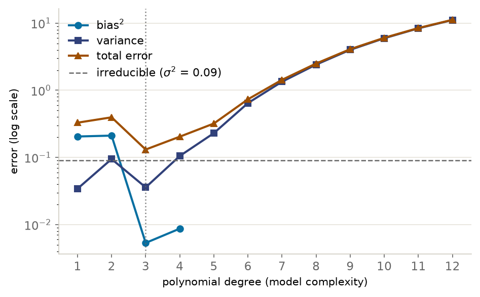

::: {.lm-hero}
[Chapter 5 · Learning Theory]{.eyebrow}

# The Bias–Variance Trade-off

[Simple models are biased but steady, complex ones flexible but jittery; the only way to truly feel the trade-off is to simulate it and watch bias and variance fall out of the statistics.]{.dek}
:::

The textbook *proves* that expected prediction error splits into three pieces. Here we
*measure* them. By drawing many training sets from the same source, fitting a model to
each, and looking at how the predictions scatter, we turn [bias]{.term} and
[variance]{.term} from terms in an equation into quantities we can compute and plot.

::: {.defbox}
[Bias–Variance Decomposition]{.lbl}
[ E<sub>D</sub>[(y &minus; h<sub>D</sub>(x))&sup2;] = Bias&sup2; + Variance + &sigma;&sup2; ]{.math}
:::

```{=html}
<figure class="lm-figure">

<figcaption><strong>The bias–variance trade-off.</strong> Bias falls with degree and variance rises, and their sum bottoms out at degree three before rising by two orders of magnitude, so the vertical scale is logarithmic. Past degree four the remaining bias is too small to measure, so its curve stops. The decomposition cells below compute it.</figcaption>
</figure>
```

Here $h_{\mathcal{D}}$ is the model fitted to a training set $\mathcal{D}$, and
$\bar{h}(x)$ is its prediction at $x$ averaged over training sets. Read the three terms as
answers to three questions. [Bias]{.term} asks how far the *average* fitted prediction
$\bar{h}(x)$ sits from the truth, the error baked in by assumptions that are
too rigid (a straight line for a curved signal). [Variance]{.term} asks how much the fit
*moves* when the training set changes, the error from chasing the noise in any one sample.
The [irreducible error]{.term} $\sigma^2$ is the noise floor: scatter no model can remove
because it lives in the data, not the model.

The dartboard picture names the four corners. Low bias and low variance is a tight cluster
on the bullseye. High bias, low variance is a tight cluster sitting off-center
(underfitting). Low bias, high variance is a wide spray centered on the target
(overfitting). High bias and high variance is a wide spray, off-center as well. Everything
below is the middle two cases competing as we turn one knob: model complexity.

## The simulation

The example is this page's own; the book's Section 5.4 draws its training sets from simulated
houses instead. Every demonstration on this page draws data the same way: inputs uniform on
$[0, 1]$, and targets from the true function $f(x) = \sin(2\pi x)$ plus Gaussian noise with
standard deviation $0.3$. That noise level fixes the irreducible error at $\sigma^2 = 0.09$,
the floor every model is measured against. Python and R draw different random samples, so their
numbers differ noticeably while the patterns agree. One noisy sample looks like this.

::: {.panel-tabset group="lang"}

## Python
```{pyodide}
#| autorun: true
import numpy as np
import matplotlib.pyplot as plt

def true_f(x):
    return np.sin(2 * np.pi * x)

np.random.seed(42)
x = np.random.uniform(0, 1, 20)
y = true_f(x) + np.random.normal(0, 0.3, 20)

grid = np.linspace(0, 1, 200)
fig, ax = plt.subplots(figsize=(7, 4.5))
ax.plot(grid, true_f(grid), color="#666666", linewidth=2.5,
        label=r"true $f(x)=\sin(2\pi x)$")
ax.scatter(x, y, s=70, color="#076FA1", edgecolor="white", zorder=3,
           label="noisy sample (m = 20)")
ax.set_xlabel("x"); ax.set_ylabel("y"); ax.set_xlim(0, 1)
ax.legend(loc="upper right")
for s in ["top", "right"]: ax.spines[s].set_visible(False)
ax.grid(axis="y", color="#e6e3da", lw=0.8); ax.set_axisbelow(True)
plt.tight_layout(); plt.show()

print(f"Noise std = 0.3  ->  irreducible error sigma^2 = {0.3**2:.2f}")
print(f"Sample y range: [{y.min():.2f}, {y.max():.2f}]")
```

## R
```{webr}
true_f <- function(x) sin(2 * pi * x)

set.seed(42)
x <- runif(20, 0, 1)
y <- true_f(x) + rnorm(20, 0, 0.3)

grid <- seq(0, 1, length.out = 200)
plot(x, y, pch = 19, col = "#076FA1", cex = 1.4, xlim = c(0, 1),
     xlab = "x", ylab = "y", bty = "l")
grid(col = "#e6e3da", lty = 1, lwd = 0.6)
lines(grid, true_f(grid), col = "#666666", lwd = 2.5)
legend("topright", c("true f(x) = sin(2 pi x)", "noisy sample (m = 20)"),
       col = c("#666666", "#076FA1"), lwd = c(2.5, NA), pch = c(NA, 19), bty = "n")

cat(sprintf("Noise std = 0.3  ->  irreducible error sigma^2 = %.2f\n", 0.3^2))
cat(sprintf("Sample y range: [%.2f, %.2f]\n", min(y), max(y)))
```

:::

We fit polynomials of varying degree to this signal. Degree is the complexity knob: degree
one is a straight line, degree twelve a curve flexible enough to wind through almost any
twenty points.

## Many training sets make variance visible

Variance is invisible in a single fit. It only appears when we imagine training on many
different samples from the same source and watch the fitted curves disagree. Below we draw
sixty samples, fit a polynomial to each, and overlay them. The pale blue cloud is the
spread of individual fits; the dark line is their average; the gray dashes are the truth.

::: {.panel-tabset group="lang"}

## Python
```{pyodide}
import numpy as np
import matplotlib.pyplot as plt
import warnings
warnings.filterwarnings("ignore")          # high-degree conditioning warnings

def true_f(x):
    return np.sin(2 * np.pi * x)

def make_data(m, noise=0.3, seed=None):
    if seed is not None:
        np.random.seed(seed)
    x = np.random.uniform(0, 1, m)
    return x, true_f(x) + np.random.normal(0, noise, m)

def fit_many(degree, n_datasets=60, m=20):
    grid = np.linspace(0, 1, 100)
    preds = []
    for s in range(n_datasets):
        xt, yt = make_data(m, seed=s)
        coef = np.polyfit(xt, yt, degree)
        preds.append(np.clip(np.polyval(coef, grid), -10, 10))
    return grid, np.array(preds)

fig, axes = plt.subplots(1, 3, figsize=(13, 4.2))
for ax, degree, title in zip(axes, [1, 3, 12],
                             ["Degree 1 (underfit)", "Degree 3 (good fit)",
                              "Degree 12 (overfit)"]):
    grid, preds = fit_many(degree)
    for p in preds:
        ax.plot(grid, p, color="#076FA1", alpha=0.15, linewidth=1)
    ax.plot(grid, preds.mean(0), color="#31417A", linewidth=2.5, label="mean fit")
    ax.plot(grid, true_f(grid), color="#666666", linewidth=2,
            linestyle="--", label="true f")
    # The average of n noisy fits sits off the truth by chance, which adds
    # variance/n to the squared gap; subtract that (unbiased) share.
    var_pt = preds.var(0)
    bias2 = max(((preds.mean(0) - true_f(grid)) ** 2
                 - var_pt / (len(preds) - 1)).mean(), 0)
    var = var_pt.mean()
    ax.set_title(f"{title}\nbias$^2$={bias2:.3f}  var={var:.3f}")
    ax.set_xlim(0, 1); ax.set_ylim(-2, 2); ax.set_xlabel("x")
    ax.legend(loc="upper right", fontsize=8)
    for s in ["top", "right"]: ax.spines[s].set_visible(False)
    ax.grid(axis="y", color="#e6e3da", lw=0.8); ax.set_axisbelow(True)
axes[0].set_ylabel("y")
plt.tight_layout(); plt.show()
```

## R
```{webr}
true_f <- function(x) sin(2 * pi * x)

make_data <- function(m, noise = 0.3, seed = NULL) {
  if (!is.null(seed)) set.seed(seed)
  x <- runif(m, 0, 1)
  list(x = x, y = true_f(x) + rnorm(m, 0, noise))
}
# Least-squares polynomial fit on a Vandermonde design matrix, built on the
# rescaled input u = 2x - 1 so qr.solve stays well conditioned at high degree.
poly_fit  <- function(x, y, degree) qr.solve(outer(2 * x - 1, 0:degree, `^`), y)
poly_pred <- function(x, b) as.vector(outer(2 * x - 1, 0:(length(b) - 1), `^`) %*% b)

fit_many <- function(degree, n_datasets = 60, m = 20) {
  grid <- seq(0, 1, length.out = 100)
  preds <- matrix(0, n_datasets, 100)
  for (s in 0:(n_datasets - 1)) {
    d <- make_data(m, seed = s)
    preds[s + 1, ] <- pmin(pmax(poly_pred(grid, poly_fit(d$x, d$y, degree)), -10), 10)
  }
  list(grid = grid, preds = preds)
}

par(mfrow = c(1, 3))
for (k in 1:3) {
  degree <- c(1, 3, 12)[k]
  title  <- c("Degree 1 (underfit)", "Degree 3 (good fit)", "Degree 12 (overfit)")[k]
  fm <- fit_many(degree); grid <- fm$grid; preds <- fm$preds
  mean_fit <- colMeans(preds)
  var_pt <- apply(preds, 2, function(col) mean((col - mean(col))^2))
  # The average of n noisy fits sits off the truth by chance, which adds
  # variance/n to the squared gap; subtract that (unbiased) share.
  bias2 <- max(mean((mean_fit - true_f(grid))^2 - var_pt / (nrow(preds) - 1)), 0)
  varc  <- mean(var_pt)
  plot(grid, true_f(grid), type = "n", ylim = c(-2, 2), xlab = "x", ylab = "y",
       main = sprintf("%s\nbias^2=%.3f  var=%.3f", title, bias2, varc), bty = "l")
  grid(col = "#e6e3da", lty = 1, lwd = 0.6)
  for (i in 1:nrow(preds))
    lines(grid, preds[i, ], col = adjustcolor("#076FA1", alpha.f = 0.15))
  lines(grid, mean_fit, col = "#31417A", lwd = 2.5)
  lines(grid, true_f(grid), col = "#666666", lwd = 2, lty = 2)
}
```

:::

Read the three panels left to right. The straight line (degree one) barely moves between
samples, so its variance is tiny, but its average sits well away from the curve: that gap is
bias. Degree three threads the signal with only modest spread. Degree twelve fits each sample
almost perfectly yet flails between them; its average wobbles about the truth only as much as
sixty wild fits leave by chance, so the estimated bias is zero, while the cloud is enormous
(high variance). Complexity trades one error for the other.

The R fit uses a Vandermonde design matrix on the rescaled input $u = 2x - 1$, which keeps
`qr.solve` well conditioned where a raw monomial basis would collapse; NumPy's `polyfit`
rescales internally for the same reason.

## Measuring the trade-off

Now we attach numbers. For each degree we fit five hundred samples, average the squared gap
between the mean fit and the truth, less the share that chance alone puts there (bias²),
average the pointwise spread of the fits (variance), add the noise floor, and read off the total. Sweeping the degree traces the
classic U-shaped error curve.

Every prediction on this page is clipped to $[-10, 10]$ before the decomposition runs, so these
plots decompose a clipped predictor rather than the raw polynomial. At low degree the clip
never binds and the distinction is empty. At degree twelve on twenty points it binds hard:
the variance the cell reports is about $11$, where the unclipped fit runs to the order of
$10^8$ — and that unclipped figure is not even stable, moving by three orders of magnitude
with the number of samples averaged, because a few catastrophic extrapolations set the scale.
Without the clip the right-hand tail could not share an axis with anything else. Read the
reported variance as evidence that the tail is bad, not as a measurement of how bad.

::: {.panel-tabset group="lang"}

## Python
```{pyodide}
import numpy as np
import matplotlib.pyplot as plt
import warnings
warnings.filterwarnings("ignore")

def true_f(x):
    return np.sin(2 * np.pi * x)

def make_data(m, noise=0.3, seed=None):
    if seed is not None:
        np.random.seed(seed)
    x = np.random.uniform(0, 1, m)
    return x, true_f(x) + np.random.normal(0, noise, m)

def decompose(degree, n_datasets=500, m=20, noise=0.3):
    grid = np.linspace(0, 1, 100)
    truth = true_f(grid)
    preds = []
    for s in range(n_datasets):
        xt, yt = make_data(m, noise, seed=s)
        coef = np.polyfit(xt, yt, degree)
        preds.append(np.clip(np.polyval(coef, grid), -10, 10))
    preds = np.array(preds)
    var_pt = preds.var(0)
    # The average of n noisy fits sits off the truth by chance, which adds
    # variance/n to the squared gap; subtract that (unbiased) share.
    bias2 = max(((preds.mean(0) - truth) ** 2 - var_pt / (n_datasets - 1)).mean(), 0)
    var = var_pt.mean()
    irr = noise ** 2
    return bias2, var, irr, bias2 + var + irr

degrees = range(1, 13)
rows = [decompose(d) for d in degrees]
bias2 = [r[0] for r in rows]; var = [r[1] for r in rows]
irr = rows[0][2];             total = [r[3] for r in rows]

print(f"{'deg':>4}{'bias^2':>9}{'var':>9}{'irred':>9}{'total':>9}")
for d, r in zip(degrees, rows):
    print(f"{d:>4}{r[0]:>9.3f}{r[1]:>9.3f}{r[2]:>9.3f}{r[3]:>9.3f}")
best = int(np.argmin(total)) + 1
print(f"\nLowest total error at degree {best}")

fig, ax = plt.subplots(figsize=(8, 5))
# A zero estimate has no place on a log axis; leave a gap there.
ax.plot(degrees, [b if b > 0 else np.nan for b in bias2], "o-", color="#076FA1", linewidth=2, label="bias$^2$")
ax.plot(degrees, var, "s-", color="#31417A", linewidth=2, label="variance")
ax.plot(degrees, total, "^-", color="#9E4F00", linewidth=2, label="total error")
ax.axhline(irr, color="#666666", linestyle="--", label=f"irreducible ($\\sigma^2$={irr:.2f})")
ax.axvline(best, color="#666666", linestyle=":", alpha=0.7)
ax.set_xlabel("polynomial degree (model complexity)")
ax.set_yscale("log")          # the tail spans three orders of magnitude
ax.set_ylabel("error (log scale)"); ax.set_xticks(list(degrees))
ax.legend(loc="upper left")
for s in ["top", "right"]: ax.spines[s].set_visible(False)
ax.grid(axis="y", color="#e6e3da", lw=0.8); ax.set_axisbelow(True)
plt.tight_layout(); plt.show()
```

## R
```{webr}
true_f <- function(x) sin(2 * pi * x)
make_data <- function(m, noise = 0.3, seed = NULL) {
  if (!is.null(seed)) set.seed(seed)
  x <- runif(m, 0, 1); list(x = x, y = true_f(x) + rnorm(m, 0, noise))
}
poly_fit  <- function(x, y, degree) qr.solve(outer(2 * x - 1, 0:degree, `^`), y)
poly_pred <- function(x, b) as.vector(outer(2 * x - 1, 0:(length(b) - 1), `^`) %*% b)

decompose <- function(degree, n_datasets = 500, m = 20, noise = 0.3) {
  grid <- seq(0, 1, length.out = 100); truth <- true_f(grid)
  preds <- matrix(0, n_datasets, 100)
  for (s in 0:(n_datasets - 1)) {
    d <- make_data(m, noise, seed = s)
    preds[s + 1, ] <- pmin(pmax(poly_pred(grid, poly_fit(d$x, d$y, degree)), -10), 10)
  }
  mean_fit <- colMeans(preds)
  var_pt <- apply(preds, 2, function(col) mean((col - mean(col))^2))
  # The average of n noisy fits sits off the truth by chance, which adds
  # variance/n to the squared gap; subtract that (unbiased) share.
  bias2 <- max(mean((mean_fit - truth)^2 - var_pt / (n_datasets - 1)), 0)
  varc  <- mean(var_pt)
  irr   <- noise^2
  c(bias2 = bias2, var = varc, irred = irr, total = bias2 + varc + irr)
}

degrees <- 1:12
rows <- t(sapply(degrees, decompose))
cat(sprintf("%4s%9s%9s%9s%9s\n", "deg", "bias^2", "var", "irred", "total"))
for (i in seq_along(degrees))
  cat(sprintf("%4d%9.3f%9.3f%9.3f%9.3f\n", degrees[i],
              rows[i, 1], rows[i, 2], rows[i, 3], rows[i, 4]))
best <- degrees[which.min(rows[, 4])]
cat(sprintf("\nLowest total error at degree %d\n", best))

irr <- rows[1, 3]
pos <- rows[rows[, 1] > 0, 1]
plot(degrees, rows[, 4], type = "o", pch = 17, col = "#9E4F00", lwd = 2, log = "y",
     ylim = range(c(pos, rows[, 2], rows[, 4])),
     xlab = "polynomial degree (model complexity)", ylab = "error (log scale)", bty = "l")
grid(col = "#e6e3da", lty = 1, lwd = 0.6)
# A zero estimate has no place on a log axis; leave a gap there.
lines(degrees, ifelse(rows[, 1] > 0, rows[, 1], NA), type = "o", pch = 19,
      col = "#076FA1", lwd = 2)
lines(degrees, rows[, 2], type = "o", pch = 15, col = "#31417A", lwd = 2)
abline(h = irr, col = "#666666", lty = 2)
abline(v = best, col = "#666666", lty = 3)
legend("topleft", c("total error", "bias^2", "variance", "irreducible"),
       col = c("#9E4F00", "#076FA1", "#31417A", "#666666"),
       pch = c(17, 19, 15, NA), lty = c(1, 1, 1, 2), bty = "n")
```

:::

The minimum is at degree three. Bias falls off a cliff once the model is
flexible enough to bend (degrees one and two are starved), and from there variance climbs
steadily, dragging the total back up. The best model is not the one that fits the training
data best; it is the one that balances the two errors. Notice also that the total never
drops below the dashed irreducible line: $\sigma^2$ is the price of admission.

Bias and variance are not spread evenly across the input. Near the edges of $[0, 1]$, where
data are sparse and a high-degree polynomial has the least to anchor it, variance spikes
sharply; in the well-sampled interior it stays small. This is why extrapolation is
dangerous: the same fit that is trustworthy in the middle is wild at the boundary.

The noise level $\sigma$ is fixed at 0.3 above. The slider below reruns the decomposition at
the noise level you set, and the plot beneath it redraws a few seconds after you release the
slider. Watch two things separately:
where the dashed irreducible line sits, and which degree wins.

```{ojs}
//| echo: false
viewof sigma = {
  const wrap = document.createElement("div");
  wrap.className = "lm-slider";
  const label = document.createElement("label");
  label.innerHTML = 'Noise <span class="sym">σ</span>';
  const range = document.createElement("input");
  range.type = "range";
  range.min = 0.05; range.max = 0.80; range.step = 0.05; range.value = 0.30;
  const out = document.createElement("output");
  const show = () => { out.textContent = Number(range.value).toFixed(2); };
  show();
  range.addEventListener("input", show);
  range.addEventListener("change", () => {
    wrap.value = Number(range.value);
    wrap.dispatchEvent(new CustomEvent("input"));
  });
  const hint = document.createElement("p");
  hint.className = "hint";
  hint.textContent = "Release the slider to re-run the decomposition (a few seconds).";
  wrap.append(label, range, out, hint);
  wrap.value = Number(range.value);
  return wrap;
}
```

```{pyodide}
#| input:
#|   - sigma
#| autorun: true
#| echo: false
import numpy as np
import matplotlib.pyplot as plt
import warnings
warnings.filterwarnings("ignore")

noise = float(sigma)

def truth_f(x):
    return np.sin(2 * np.pi * x)

# Fewer data sets than the table above (40 rather than 100) so the redraw stays quick.
def decompose_at(degree, n_datasets=40, m=20, noise=0.3):
    grid = np.linspace(0, 1, 100)
    truth = truth_f(grid)
    preds = []
    for s in range(n_datasets):
        np.random.seed(s)
        xt = np.random.uniform(0, 1, m)
        yt = truth_f(xt) + np.random.normal(0, noise, m)
        coef = np.polyfit(xt, yt, degree)
        preds.append(np.clip(np.polyval(coef, grid), -10, 10))
    preds = np.array(preds)
    var_pt = preds.var(0)
    # The average of n noisy fits sits off the truth by chance, which adds
    # variance/n to the squared gap; subtract that (unbiased) share.
    b2 = max(((preds.mean(0) - truth) ** 2 - var_pt / (n_datasets - 1)).mean(), 0)
    v = var_pt.mean()
    return b2, v, noise ** 2, b2 + v + noise ** 2

degs = list(range(1, 13))
rows = [decompose_at(d, noise=noise) for d in degs]
b2 = [r[0] for r in rows]; v = [r[1] for r in rows]
irr = rows[0][2]; total = [r[3] for r in rows]
best = degs[int(np.argmin(total))]

fig, ax = plt.subplots(figsize=(8, 4.6))
# A zero estimate has no place on a log axis; leave a gap there.
ax.plot(degs, [b if b > 0 else np.nan for b in b2], "o-", color="#076FA1", lw=2, label="bias$^2$")
ax.plot(degs, v, "s-", color="#31417A", lw=2, label="variance")
ax.plot(degs, total, "^-", color="#9E4F00", lw=2, label="total error")
ax.axhline(irr, color="#666666", ls="--", label=f"irreducible ($\\sigma^2$={irr:.3f})")
ax.axvline(best, color="#666666", ls=":", alpha=0.7)
ax.set_xlabel("polynomial degree (model complexity)")
ax.set_ylabel("error (log scale)")
ax.set_yscale("log"); ax.set_xticks(degs)
ax.set_title(rf"Noise $\sigma$ = {noise:.2f}; total error bottoms out at degree {best}")
ax.legend(loc="upper left")
for s in ["top", "right"]: ax.spines[s].set_visible(False)
ax.grid(axis="y", color="#e6e3da", lw=0.8); ax.set_axisbelow(True)
plt.tight_layout(); plt.show()

print(f"sigma = {noise:.2f}  ->  irreducible {irr:.3f}, best degree {best}, "
      f"total there {min(total):.3f}")
```

## Learning curves

A second diagnostic holds complexity fixed and varies the *amount* of data, plotting
training and test error as the sample grows. The gap between the two curves is the
signature of variance.

::: {.panel-tabset group="lang"}

## Python
```{pyodide}
import numpy as np
import matplotlib.pyplot as plt
import warnings
warnings.filterwarnings("ignore")

def true_f(x):
    return np.sin(2 * np.pi * x)

def make_data(m, noise=0.3, seed=None):
    if seed is not None:
        np.random.seed(seed)
    x = np.random.uniform(0, 1, m)
    return x, true_f(x) + np.random.normal(0, noise, m)

def learning_curve(degree, sizes, n_trials=50, noise=0.3):
    np.random.seed(999)                                   # one fixed test set
    x_test = np.random.uniform(0, 1, 5000)
    y_test = true_f(x_test) + np.random.normal(0, noise, 5000)
    train_mse, test_mse = [], []
    for m in sizes:
        tr, te = [], []
        for s in range(n_trials):
            xt, yt = make_data(m, noise, seed=s)
            coef = np.polyfit(xt, yt, degree)
            yp_tr = np.clip(np.polyval(coef, xt), -10, 10)
            yp_te = np.clip(np.polyval(coef, x_test), -10, 10)
            tr.append(np.mean((yt - yp_tr) ** 2))
            te.append(np.mean((y_test - yp_te) ** 2))
        train_mse.append(np.mean(tr)); test_mse.append(np.mean(te))
    return train_mse, test_mse

sizes = [20, 30, 50, 80, 120, 160]
noise = 0.3
fig, axes = plt.subplots(1, 3, figsize=(13, 4.2))
for ax, degree, title in zip(axes, [1, 3, 12],
                             ["Degree 1 (high bias)", "Degree 3 (good fit)",
                              "Degree 12 (high variance)"]):
    tr, te = learning_curve(degree, sizes, noise=noise)
    ax.plot(sizes, tr, "o-", color="#076FA1", linewidth=2, label="training MSE")
    ax.plot(sizes, te, "s-", color="#9E4F00", linewidth=2, label="test MSE")
    ax.axhline(noise ** 2, color="#666666", linestyle="--", label="irreducible")
    ax.set_title(title); ax.set_xlabel("training set size")
    ax.legend(loc="upper right", fontsize=8)
    for s in ["top", "right"]: ax.spines[s].set_visible(False)
    ax.grid(axis="y", color="#e6e3da", lw=0.8); ax.set_axisbelow(True)
axes[0].set_ylabel("MSE")
plt.tight_layout(); plt.show()

print("Degree 12 train vs test MSE by size:")
tr, te = learning_curve(12, sizes)
for m, a, b in zip(sizes, tr, te):
    print(f"  m={m:>3}: train={a:.3f}  test={b:.3f}  gap={b - a:.3f}")
```

## R
```{webr}
true_f <- function(x) sin(2 * pi * x)
make_data <- function(m, noise = 0.3, seed = NULL) {
  if (!is.null(seed)) set.seed(seed)
  x <- runif(m, 0, 1); list(x = x, y = true_f(x) + rnorm(m, 0, noise))
}
poly_fit  <- function(x, y, degree) qr.solve(outer(2 * x - 1, 0:degree, `^`), y)
poly_pred <- function(x, b) as.vector(outer(2 * x - 1, 0:(length(b) - 1), `^`) %*% b)

learning_curve <- function(degree, sizes, n_trials = 50, noise = 0.3) {
  set.seed(999)                                          # one fixed test set
  x_test <- runif(5000, 0, 1)
  y_test <- true_f(x_test) + rnorm(5000, 0, noise)
  train_mse <- numeric(length(sizes)); test_mse <- numeric(length(sizes))
  for (j in seq_along(sizes)) {
    m <- sizes[j]; tr <- numeric(n_trials); te <- numeric(n_trials)
    for (s in 0:(n_trials - 1)) {
      d <- make_data(m, noise, seed = s); b <- poly_fit(d$x, d$y, degree)
      yp_tr <- pmin(pmax(poly_pred(d$x, b), -10), 10)
      yp_te <- pmin(pmax(poly_pred(x_test, b), -10), 10)
      tr[s + 1] <- mean((d$y - yp_tr)^2); te[s + 1] <- mean((y_test - yp_te)^2)
    }
    train_mse[j] <- mean(tr); test_mse[j] <- mean(te)
  }
  list(train = train_mse, test = test_mse)
}

sizes <- c(20, 30, 50, 80, 120, 160)
noise <- 0.3
par(mfrow = c(1, 3))
for (k in 1:3) {
  degree <- c(1, 3, 12)[k]
  title  <- c("Degree 1 (high bias)", "Degree 3 (good fit)",
              "Degree 12 (high variance)")[k]
  lc <- learning_curve(degree, sizes, noise = noise)
  yhi <- max(lc$train, lc$test)
  plot(sizes, lc$train, type = "o", pch = 19, col = "#076FA1", lwd = 2,
       ylim = c(0, yhi), main = title, xlab = "training set size", ylab = "MSE",
       bty = "l")
  grid(col = "#e6e3da", lty = 1, lwd = 0.6)
  lines(sizes, lc$test, type = "o", pch = 15, col = "#9E4F00", lwd = 2)
  abline(h = noise^2, col = "#666666", lty = 2)
  legend("topright", c("training MSE", "test MSE", "irreducible"),
         col = c("#076FA1", "#9E4F00", "#666666"),
         pch = c(19, 15, NA), lty = c(1, 1, 2), bty = "n")
}

cat("Degree 12 train vs test MSE by size:\n")
lc <- learning_curve(12, sizes)
for (j in seq_along(sizes))
  cat(sprintf("  m=%3d: train=%.3f  test=%.3f  gap=%.3f\n",
              sizes[j], lc$train[j], lc$test[j], lc$test[j] - lc$train[j]))
```

:::

The degree-twelve panel tells the variance story cleanly: training error is near zero from
the start, while test error begins enormous and falls toward the noise floor as more data
pins the model down. More data shrinks variance. It does **not** shrink bias: the degree-one
panel converges quickly, but both curves settle well above $\sigma^2$, because a straight
line can never bend into a sine no matter how many points it sees.

| Learning-curve pattern | Diagnosis | Remedy |
|---|---|---|
| both errors high, small gap | high bias (underfitting) | richer model, better features |
| training low, test high, large gap | high variance (overfitting) | more data, regularization, simpler model |
| both settle near $\sigma^2$ | good fit | model is well matched to the problem |

## A modern footnote: double descent

The U-shaped curve is the classical picture, and it is not universal. In some settings,
past the point where the model can interpolate the training data exactly, test error falls
*again*: a second descent, observed in heavily overparameterized models, though it
occurs even in linear least squares. The book takes this up in Section 5.4 and Figure 5.4.

The book's Figure 5.4 sketches the shape; the cells below measure it with this page's own
knob. Keep raising the degree past nineteen, where a polynomial has as many coefficients as
there are training points and can pass through all twenty. Past that threshold many curves fit
the data exactly, and least squares has to choose: NumPy's `lstsq` and the pseudoinverse in R
return the one with the smallest coefficients, the choice the book's footnote in Section 5.4
describes. The polynomials are written in the Legendre basis, which keeps the columns on one
scale. The plot shows the median error over forty training sets, because near the threshold a
few fits explode and the mean is meaningless.

::: {.panel-tabset group="lang"}

## Python
```{pyodide}
import numpy as np
import matplotlib.pyplot as plt
from numpy.polynomial import legendre

def true_f(x):
    return np.sin(2 * np.pi * x)

def features(x, p):
    # the first p Legendre polynomials on [0, 1]: degree p - 1, well-scaled columns
    return legendre.legvander(2 * x - 1, p - 1)

m, noise, n_sets = 20, 0.3, 40
grid = np.linspace(0, 1, 400)
sizes = np.unique(np.r_[np.arange(2, 30), np.round(np.geomspace(30, 300, 12)).astype(int)])

rng = np.random.default_rng(0)
err = np.zeros((n_sets, len(sizes)))
for s in range(n_sets):
    x = rng.uniform(0, 1, m)
    y = true_f(x) + rng.normal(0, noise, m)
    for k, p in enumerate(sizes):
        # Past p = m many curves fit every point; lstsq returns the one with
        # the smallest coefficients.
        theta = np.linalg.lstsq(features(x, p), y, rcond=None)[0]
        err[s, k] = np.mean((features(grid, p) @ theta - true_f(grid)) ** 2)

typical = np.median(err, axis=0)          # the mean is ruled by a few exploding fits
best = int(np.argmin(typical[sizes < m]))
print(f"classical minimum: {sizes[best]} coefficients (degree {sizes[best] - 1}), error {typical[best]:.3f}")
print(f"at the threshold, {m} coefficients: error {typical[sizes == m][0]:.2g}")
print(f"at {sizes[-1]} coefficients: error {typical[-1]:.3f}")

fig, ax = plt.subplots(figsize=(8, 4.6))
ax.plot(sizes, typical, "o-", color="#9E4F00", lw=2, ms=4)
ax.axvline(m, color="#666666", ls=":", lw=1.2)
ax.annotate("interpolation threshold\n(20 coefficients, 20 points)", (m, typical.max()),
            xytext=(8, -4), textcoords="offset points", va="top", fontsize=9, color="#666666")
ax.axhline(typical[best], color="#31417A", ls="--", lw=1.2,
           label=f"classical minimum (degree {sizes[best] - 1})")
ax.set_xscale("log"); ax.set_yscale("log")
ticks = [2, 5, 10, 20, 50, 100, 200]
ax.set_xticks(ticks); ax.set_xticklabels([str(t) for t in ticks])
ax.legend(loc="upper right", frameon=False, fontsize=9)
ax.set_xlabel("number of coefficients (degree + 1)")
ax.set_ylabel("error against the true curve\n(median of 40 training sets)")
for side in ["top", "right"]:
    ax.spines[side].set_visible(False)
ax.grid(axis="y", color="#e6e3da", lw=0.8); ax.set_axisbelow(True)
plt.tight_layout()
plt.show()
```

## R
```{webr}
true_f <- function(x) sin(2 * pi * x)

features <- function(x, p) {
  # the first p Legendre polynomials on [0, 1]: degree p - 1, well-scaled columns
  u <- 2 * x - 1
  P <- matrix(0, length(x), p)
  P[, 1] <- 1
  if (p > 1) P[, 2] <- u
  if (p > 2) for (k in 2:(p - 1)) P[, k + 1] <- ((2 * k - 1) * u * P[, k] - (k - 1) * P[, k - 1]) / k
  P
}

min_norm <- function(A, y) {
  # Past p = m many curves fit every point; this returns the one with the
  # smallest coefficients (the pseudoinverse solution).
  s <- svd(A)
  keep <- s$d > max(s$d) * max(dim(A)) * .Machine$double.eps
  s$v[, keep, drop = FALSE] %*% (crossprod(s$u[, keep, drop = FALSE], y) / s$d[keep])
}

m <- 20; noise <- 0.3; n_sets <- 40
grid <- seq(0, 1, length.out = 400)
sizes <- sort(unique(c(2:29, as.integer(round(exp(seq(log(30), log(300), length.out = 12)))))))

set.seed(0)
err <- matrix(0, n_sets, length(sizes))
for (s in 1:n_sets) {
  x <- runif(m)
  y <- true_f(x) + rnorm(m, 0, noise)
  for (k in seq_along(sizes)) {
    theta <- min_norm(features(x, sizes[k]), y)
    err[s, k] <- mean((features(grid, sizes[k]) %*% theta - true_f(grid))^2)
  }
}

typical <- apply(err, 2, median)        # the mean is ruled by a few exploding fits
best <- which.min(typical[sizes < m])
cat(sprintf("classical minimum: %d coefficients (degree %d), error %.3f\n",
            sizes[best], sizes[best] - 1, typical[best]))
cat(sprintf("at the threshold, %d coefficients: error %.2g\n", m, typical[sizes == m]))
cat(sprintf("at %d coefficients: error %.3f\n", max(sizes), typical[length(typical)]))

plot(sizes, typical, type = "o", pch = 19, col = "#9E4F00", lwd = 2, log = "xy",
     xlab = "number of coefficients (degree + 1)",
     ylab = "error against the true curve (median of 40 training sets)", bty = "l")
grid(col = "#e6e3da", lty = 1, lwd = 0.6)
abline(v = m, col = "#666666", lty = 3)
abline(h = typical[best], col = "#31417A", lty = 2)
legend("topright", sprintf("classical minimum (degree %d)", sizes[best] - 1),
       col = "#31417A", lty = 2, bty = "n", cex = 0.8)
text(m, max(typical), "interpolation threshold", pos = 4, cex = 0.8, col = "#666666")
```

:::

The error falls to its classical minimum at degree three, then climbs by many orders of
magnitude to a spike at exactly twenty coefficients, where the polynomial is forced through
every noisy point with no freedom to spare. Past the threshold every fit still passes through
all twenty points, yet the error falls again as the coefficients multiply. It levels off at
about three times the classical minimum without beating it: more complexity need not raise
the error, and on this problem degree three remains the best model.

The trade-off is the reason the next two chapters exist. Cross-validation (Chapter 6)
estimates the test-error curve so we can find its minimum without peeking at held-out data,
and regularization (Chapter 7) attacks variance directly by shrinking the coefficients that
let a flexible model thrash.

::: {.explore}
[Try it]{.lbl}
Take the noise slider down to $0.10$. The irreducible error drops to $0.01$, as $\sigma^2$
must — but the winner does not move: degree three still takes it. Keep going to $0.05$ and
degree five edges ahead, though only barely, and here you should distrust the result rather
than learn from it. At forty data sets the two degrees are within Monte Carlo error of each
other, and which one "wins" flips as you add replications: 5, 5, 5, 3, 5, 3 at 40, 60, 100,
200, 400 and 800. The cell reports no uncertainty, so it cannot tell you that. A number that
changes when you look at it harder is not yet a finding.

The reason the optimum is so reluctant to move is worth having. Lowering $\sigma$ shrinks
variance at every degree, so in principle it should license a wigglier curve — and eventually
it does. But the optimum sits where the bias gap between two degrees equals their variance
gap, and for $\sin(2\pi x)$ the bias gaps are enormous. The function is odd about $x = 1/2$,
so an even degree buys nothing at all over the odd degree below it: the best squared
approximation error is $1.96 \times 10^{-1}$ at degrees 1 and 2 alike, $4.39 \times 10^{-3}$
at 3 and 4, $1.85 \times 10^{-5}$ at 5 and 6. Each odd step buys a factor of 45, then 237,
then 754. With that much bias available for the taking, the crossover where variance finally
outweighs it is pushed down to very small $\sigma$.

For the version that does move the optimum, change `m=20` to `m=100` in the cell above and
rerun: degree five wins outright. Both effects reduce variance, but sample size reduces it
far faster than noise does at the settings anyone would call realistic. The variance the plot reports at degree
twelve falls from about $9.9$ to about $0.05$.
:::
