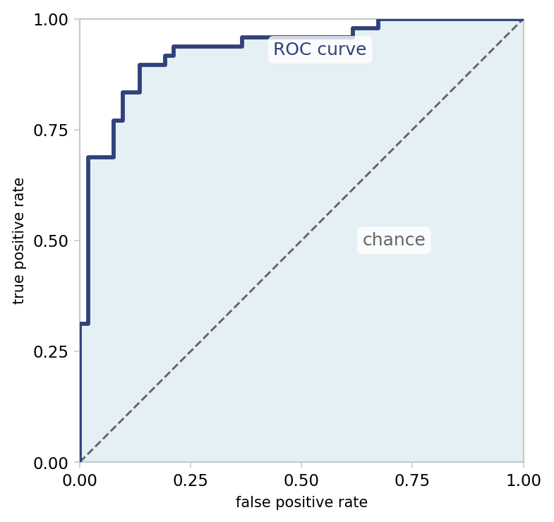

::: {.lm-hero}
[Chapter 6 · Model Evaluation]{.eyebrow}

# Model Evaluation

[Accuracy hides as much as it reveals; cross-validation, the confusion matrix, the ROC curve, and a calibration plot show what a classifier is actually doing.]{.dek}
:::

The real question a model has to answer is how it behaves on data it has never seen.
Score it on the same data it trained on and the number flatters you, because a flexible
model can memorize. This page makes evaluation concrete. We fit a logistic classifier to
an imbalanced, mildly nonlinear data set, then estimate its honest performance with
[cross-validation]{.term}, dissect its errors with a [confusion matrix]{.term}, slide the
decision threshold to watch [precision]{.term} and [recall]{.term} trade off, summarize
that trade-off with the [ROC curve]{.term} and its [AUC]{.term}, and finally ask whether
the predicted probabilities mean what they claim.

Formulas for precision and recall are easy to state. The value of running them is watching
them move as the threshold slides, and seeing a calibration plot reveal whether a "70%"
prediction is right about 70% of the time.

A note on the two languages below: each generates its own 500-point data set from its own
random number generator, so Python and R draw different samples. The exact accuracies and
AUCs therefore differ in the second digit, but both land in the same place, which is the
honest lesson. The Python side fits logistic regression by gradient descent from scratch;
the R side calls `glm`, base R's maximum-likelihood fitter for the same model.

```{=html}
<figure class="lm-figure">

<figcaption><strong>The ROC curve.</strong> Sweeping the decision threshold traces the true positive rate against the false positive rate; the curve bows toward the upper-left corner, for an AUC of 0.929, well above the 0.5 of the chance diagonal. This is the result the code below reproduces.</figcaption>
</figure>
```

## A classifier and an honest estimate of its accuracy

The data is deliberately awkward: the true boundary curves ($x_1 + 0.3\,x_2^2 > 0.5$) while
the model we fit is linear, and 5% of labels are flipped to mimic noise. A single train/test
split gives one estimate of out-of-sample accuracy; [$K$-fold cross-validation]{.term}
averages over $K$ such splits so the estimate stops depending on which points happened to
land in the test set. Five folds means each point is held out exactly once.

::: {.panel-tabset group="lang"}

## Python
```{pyodide}
import numpy as np
np.random.seed(42)

# Imbalanced binary data with a mildly nonlinear boundary, 5% label noise.
n = 500
X = np.random.randn(n, 2) * 1.5
y = (X[:, 0] + 0.3 * X[:, 1]**2 > 0.5).astype(int)
flip = np.random.choice(n, size=int(0.05 * n), replace=False)
y[flip] = 1 - y[flip]
print(f"{n} samples, {y.mean():.0%} positive")

# Logistic regression by gradient descent (the from-scratch fit).
def fit_logistic(X, y, lr=0.1, iters=1000):
    Xd = np.column_stack([np.ones(len(y)), X])
    theta = np.zeros(Xd.shape[1])
    for _ in range(iters):
        h = 1 / (1 + np.exp(-np.clip(Xd @ theta, -500, 500)))
        theta -= lr * (Xd.T @ (h - y)) / len(y)
    return theta

def proba(X, theta):
    Xd = np.column_stack([np.ones(len(X)), X])
    return 1 / (1 + np.exp(-np.clip(Xd @ theta, -500, 500)))

# Single 80/20 split: optimistic on train, honest on the held-out test set.
idx = np.random.permutation(n)
test, train = idx[:100], idx[100:]
theta = fit_logistic(X[train], y[train])
acc = lambda i: np.mean((proba(X[i], theta) >= 0.5).astype(int) == y[i])
print(f"train accuracy {acc(train):.1%}, test accuracy {acc(test):.1%}")

# 5-fold cross-validation: refit on each training split, score the held-out fold.
folds = np.array_split(np.random.permutation(n), 5)
scores = []
for k in range(5):
    te = folds[k]
    tr = np.concatenate([folds[j] for j in range(5) if j != k])
    th = fit_logistic(X[tr], y[tr])
    scores.append(np.mean((proba(X[te], th) >= 0.5).astype(int) == y[te]))
    print(f"  fold {k+1}: {scores[-1]:.1%}")
scores = np.array(scores)
print(f"CV accuracy {scores.mean():.1%} +/- {scores.std():.1%}")
```

## R
```{webr}
set.seed(42)

# Imbalanced binary data with a mildly nonlinear boundary, 5% label noise.
n <- 500
x1 <- rnorm(n) * 1.5
x2 <- rnorm(n) * 1.5
y <- as.integer(x1 + 0.3 * x2^2 > 0.5)
flip <- sample(n, size = round(0.05 * n))
y[flip] <- 1 - y[flip]
df <- data.frame(x1 = x1, x2 = x2, y = y)
cat(sprintf("%d samples, %.0f%% positive\n", n, 100 * mean(y)))

# Logistic regression by maximum likelihood (base-R glm).
acc <- function(fit, d) mean((predict(fit, d, type = "response") >= 0.5) == d$y)

# Single 80/20 split: optimistic on train, honest on the held-out test set.
idx <- sample(n)
test <- idx[1:100]; train <- idx[101:n]
fit <- glm(y ~ x1 + x2, family = binomial, data = df[train, ])
cat(sprintf("train accuracy %.1f%%, test accuracy %.1f%%\n",
            100 * acc(fit, df[train, ]), 100 * acc(fit, df[test, ])))

# 5-fold cross-validation: refit on each training split, score the held-out fold.
folds <- split(sample(n), rep(1:5, length.out = n))
scores <- numeric(5)
for (k in 1:5) {
  te <- folds[[k]]; tr <- setdiff(1:n, te)
  fk <- glm(y ~ x1 + x2, family = binomial, data = df[tr, ])
  scores[k] <- acc(fk, df[te, ])
  cat(sprintf("  fold %d: %.1f%%\n", k, 100 * scores[k]))
}
cat(sprintf("CV accuracy %.1f%% +/- %.1f%%\n", 100 * mean(scores), 100 * sd(scores)))
```

:::

The spread across folds is the point. A single split can read several points high or low; the
cross-validated mean, with its standard deviation, tells you how much to trust any one number.

## What accuracy leaves out: the confusion matrix

One accuracy figure collapses two very different mistakes into one. The confusion matrix
keeps them apart by crossing the truth against the prediction.

|  | Predicted negative | Predicted positive |
|--|--------------------|--------------------|
| **Actual negative** | True negative (TN) | False positive (FP) |
| **Actual positive** | False negative (FN) | True positive (TP) |

From its four counts come the metrics that matter when the two error types carry different
costs. [Precision]{.term} asks how trustworthy a positive prediction is; [recall]{.term}
(also called sensitivity) asks how many of the actual positives were caught. The
[F1 score]{.term} is their harmonic mean, and [specificity]{.term} is recall for the
negative class.

::: {.defbox}
[Precision and Recall]{.lbl}
[ Precision = TP / (TP + FP) &nbsp;&nbsp;&middot;&nbsp;&nbsp; Recall = TP / (TP + FN) ]{.math}
:::

::: {.panel-tabset group="lang"}

## Python
```{pyodide}
import numpy as np
np.random.seed(42)
n = 500
X = np.random.randn(n, 2) * 1.5
y = (X[:, 0] + 0.3 * X[:, 1]**2 > 0.5).astype(int)
flip = np.random.choice(n, size=int(0.05 * n), replace=False)
y[flip] = 1 - y[flip]

def fit_logistic(X, y, lr=0.1, iters=1000):
    Xd = np.column_stack([np.ones(len(y)), X]); theta = np.zeros(Xd.shape[1])
    for _ in range(iters):
        h = 1 / (1 + np.exp(-np.clip(Xd @ theta, -500, 500)))
        theta -= lr * (Xd.T @ (h - y)) / len(y)
    return theta

def proba(X, theta):
    Xd = np.column_stack([np.ones(len(X)), X])
    return 1 / (1 + np.exp(-np.clip(Xd @ theta, -500, 500)))

idx = np.random.permutation(n); test, train = idx[:100], idx[100:]
p = proba(X[test], fit_logistic(X[train], y[train]))
yhat = (p >= 0.5).astype(int)
yt = y[test]

TP = np.sum((yt == 1) & (yhat == 1)); TN = np.sum((yt == 0) & (yhat == 0))
FP = np.sum((yt == 0) & (yhat == 1)); FN = np.sum((yt == 1) & (yhat == 0))
print("            pred 0   pred 1")
print(f"actual 0 |   {TN:5d}   {FP:5d}    (TN, FP)")
print(f"actual 1 |   {FN:5d}   {TP:5d}    (FN, TP)")

accuracy = (TP + TN) / (TP + TN + FP + FN)
precision = TP / (TP + FP)
recall = TP / (TP + FN)
specificity = TN / (TN + FP)
f1 = 2 * precision * recall / (precision + recall)
print(f"\naccuracy    {accuracy:.3f}")
print(f"precision   {precision:.3f}")
print(f"recall      {recall:.3f}")
print(f"specificity {specificity:.3f}")
print(f"F1          {f1:.3f}")
```

## R
```{webr}
set.seed(42)
n <- 500
x1 <- rnorm(n) * 1.5; x2 <- rnorm(n) * 1.5
y <- as.integer(x1 + 0.3 * x2^2 > 0.5)
flip <- sample(n, size = round(0.05 * n)); y[flip] <- 1 - y[flip]
df <- data.frame(x1 = x1, x2 = x2, y = y)

idx <- sample(n); test <- idx[1:100]; train <- idx[101:n]
fit <- glm(y ~ x1 + x2, family = binomial, data = df[train, ])
p <- predict(fit, df[test, ], type = "response")
yhat <- as.integer(p >= 0.5); yt <- df$y[test]

# Confusion matrix from logical sums (base R, no caret).
TP <- sum(yt == 1 & yhat == 1); TN <- sum(yt == 0 & yhat == 0)
FP <- sum(yt == 0 & yhat == 1); FN <- sum(yt == 1 & yhat == 0)
cat("            pred 0   pred 1\n")
cat(sprintf("actual 0 |   %5d   %5d    (TN, FP)\n", TN, FP))
cat(sprintf("actual 1 |   %5d   %5d    (FN, TP)\n", FN, TP))

accuracy <- (TP + TN) / (TP + TN + FP + FN)
precision <- TP / (TP + FP)
recall <- TP / (TP + FN)
specificity <- TN / (TN + FP)
f1 <- 2 * precision * recall / (precision + recall)
cat(sprintf("\naccuracy    %.3f\n", accuracy))
cat(sprintf("precision   %.3f\n", precision))
cat(sprintf("recall      %.3f\n", recall))
cat(sprintf("specificity %.3f\n", specificity))
cat(sprintf("F1          %.3f\n", f1))
```

:::

## The threshold is a dial, not a constant

A logistic model outputs a probability; turning it into a label requires a cutoff, and 0.5
is only a default. Raise the threshold and you predict positive less often, which lifts
precision and drops recall. Lower it and the trade goes the other way. The curves below are
the same model evaluated at every cutoff from near 0 to near 1.

::: {.panel-tabset group="lang"}

## Python
```{pyodide}
import numpy as np
import matplotlib.pyplot as plt
np.random.seed(42)
n = 500
X = np.random.randn(n, 2) * 1.5
y = (X[:, 0] + 0.3 * X[:, 1]**2 > 0.5).astype(int)
flip = np.random.choice(n, size=int(0.05 * n), replace=False)
y[flip] = 1 - y[flip]

def fit_logistic(X, y, lr=0.1, iters=1000):
    Xd = np.column_stack([np.ones(len(y)), X]); theta = np.zeros(Xd.shape[1])
    for _ in range(iters):
        h = 1 / (1 + np.exp(-np.clip(Xd @ theta, -500, 500)))
        theta -= lr * (Xd.T @ (h - y)) / len(y)
    return theta

def proba(X, theta):
    Xd = np.column_stack([np.ones(len(X)), X])
    return 1 / (1 + np.exp(-np.clip(Xd @ theta, -500, 500)))

idx = np.random.permutation(n); test, train = idx[:100], idx[100:]
p = proba(X[test], fit_logistic(X[train], y[train]))
yt = y[test]

thr = np.linspace(0.01, 0.99, 99)
prec, rec = [], []
for t in thr:
    yh = (p >= t).astype(int)
    TP = np.sum((yt == 1) & (yh == 1))
    FP = np.sum((yt == 0) & (yh == 1))
    FN = np.sum((yt == 1) & (yh == 0))
    prec.append(TP / (TP + FP) if TP + FP > 0 else 1.0)
    rec.append(TP / (TP + FN) if TP + FN > 0 else 0.0)

fig, ax = plt.subplots(figsize=(7, 4.5))
ax.plot(thr, prec, color="#076FA1", lw=2.5, label="precision")
ax.plot(thr, rec, color="#31417A", lw=2.5, label="recall")
ax.axvline(0.5, color="#666666", ls="--", alpha=0.8, label="default threshold")
ax.set_xlabel("classification threshold")
ax.set_ylabel("score")
ax.set_ylim(0, 1.05)
ax.legend(loc="center left")
plt.tight_layout()
plt.show()
```

## R
```{webr}
set.seed(42)
n <- 500
x1 <- rnorm(n) * 1.5; x2 <- rnorm(n) * 1.5
y <- as.integer(x1 + 0.3 * x2^2 > 0.5)
flip <- sample(n, size = round(0.05 * n)); y[flip] <- 1 - y[flip]
df <- data.frame(x1 = x1, x2 = x2, y = y)
idx <- sample(n); test <- idx[1:100]; train <- idx[101:n]
fit <- glm(y ~ x1 + x2, family = binomial, data = df[train, ])
p <- predict(fit, df[test, ], type = "response"); yt <- df$y[test]

thr <- seq(0.01, 0.99, length.out = 99)
prec <- sapply(thr, function(t) {
  yh <- as.integer(p >= t)
  tp <- sum(yh == 1 & yt == 1); fp <- sum(yh == 1 & yt == 0)
  if (tp + fp > 0) tp / (tp + fp) else 1
})
rec <- sapply(thr, function(t) {
  yh <- as.integer(p >= t)
  tp <- sum(yh == 1 & yt == 1); fn <- sum(yh == 0 & yt == 1)
  if (tp + fn > 0) tp / (tp + fn) else 0
})

plot(thr, prec, type = "l", col = "#076FA1", lwd = 2.5, ylim = c(0, 1.05),
     xlab = "classification threshold", ylab = "score")
lines(thr, rec, col = "#31417A", lwd = 2.5)
abline(v = 0.5, col = "#666666", lty = 2)
legend("left", c("precision", "recall", "default threshold"),
       col = c("#076FA1", "#31417A", "#666666"),
       lwd = c(2.5, 2.5, 1), lty = c(1, 1, 2), bty = "n")
```

:::

Which cutoff is right depends on the application. If a false negative is a missed diagnosis,
favor recall; if a false positive is an expensive intervention, favor precision. The dial,
not a fixed 0.5, is the decision.

## ROC and AUC: the whole trade-off at once

Sweeping the threshold and plotting the [true positive rate]{.term} against the
[false positive rate]{.term} traces the ROC curve. Every point is one cutoff. A curve that
hugs the upper-left corner separates the classes well; the diagonal is random guessing. The
[area under the curve]{.term} collapses the whole picture into one number with a clean
meaning: the probability that a randomly chosen positive is scored above a randomly chosen
negative.

::: {.defbox}
[ROC Coordinates]{.lbl}
[ TPR = TP / (TP + FN) &nbsp;&nbsp;&middot;&nbsp;&nbsp; FPR = FP / (FP + TN) ]{.math}
:::

We build the curve in base machinery on both sides: sort the distinct scores, sweep each as
a threshold, count the two rates, then integrate by the trapezoid rule. No `pROC`, no
`roc_auc_score`.

::: {.panel-tabset group="lang"}

## Python
```{pyodide}
import numpy as np
import matplotlib.pyplot as plt
np.random.seed(42)
n = 500
X = np.random.randn(n, 2) * 1.5
y = (X[:, 0] + 0.3 * X[:, 1]**2 > 0.5).astype(int)
flip = np.random.choice(n, size=int(0.05 * n), replace=False)
y[flip] = 1 - y[flip]

def fit_logistic(X, y, lr=0.1, iters=1000):
    Xd = np.column_stack([np.ones(len(y)), X]); theta = np.zeros(Xd.shape[1])
    for _ in range(iters):
        h = 1 / (1 + np.exp(-np.clip(Xd @ theta, -500, 500)))
        theta -= lr * (Xd.T @ (h - y)) / len(y)
    return theta

def proba(X, theta):
    Xd = np.column_stack([np.ones(len(X)), X])
    return 1 / (1 + np.exp(-np.clip(Xd @ theta, -500, 500)))

idx = np.random.permutation(n); test, train = idx[:100], idx[100:]
p = proba(X[test], fit_logistic(X[train], y[train]))
yt = y[test]

# Sort the distinct scores, sweep each as a threshold, count TPR and FPR.
thr = np.sort(np.unique(p))[::-1]
P = (yt == 1).sum(); N = (yt == 0).sum()
tpr = np.array([np.sum((p >= t) & (yt == 1)) for t in thr]) / P
fpr = np.array([np.sum((p >= t) & (yt == 0)) for t in thr]) / N
fpr = np.concatenate([[0.0], fpr]); tpr = np.concatenate([[0.0], tpr])
auc = np.trapezoid(tpr, fpr)   # area by the trapezoid rule

fig, ax = plt.subplots(figsize=(6, 6))
ax.plot(fpr, tpr, color="#076FA1", lw=3, label=f"ROC (AUC = {auc:.3f})")
ax.plot([0, 1], [0, 1], color="#666666", ls="--", label="random (AUC = 0.5)")
ax.set_xlabel("false positive rate")
ax.set_ylabel("true positive rate")
ax.set_aspect("equal")
ax.legend(loc="lower right")
plt.tight_layout()
plt.show()
print(f"AUC = {auc:.3f}")
```

## R
```{webr}
set.seed(42)
n <- 500
x1 <- rnorm(n) * 1.5; x2 <- rnorm(n) * 1.5
y <- as.integer(x1 + 0.3 * x2^2 > 0.5)
flip <- sample(n, size = round(0.05 * n)); y[flip] <- 1 - y[flip]
df <- data.frame(x1 = x1, x2 = x2, y = y)
idx <- sample(n); test <- idx[1:100]; train <- idx[101:n]
fit <- glm(y ~ x1 + x2, family = binomial, data = df[train, ])
p <- predict(fit, df[test, ], type = "response"); yt <- df$y[test]

# Sort the distinct scores, sweep each as a threshold, count TPR and FPR.
thr <- sort(unique(p), decreasing = TRUE)
P <- sum(yt == 1); N <- sum(yt == 0)
tpr <- sapply(thr, function(t) sum(p >= t & yt == 1)) / P
fpr <- sapply(thr, function(t) sum(p >= t & yt == 0)) / N
fpr <- c(0, fpr); tpr <- c(0, tpr)
auc <- sum(diff(fpr) * (tpr[-1] + tpr[-length(tpr)]) / 2)   # trapezoid rule

plot(fpr, tpr, type = "l", col = "#076FA1", lwd = 3, asp = 1,
     xlab = "false positive rate", ylab = "true positive rate")
abline(0, 1, col = "#666666", lty = 2)
legend("bottomright", sprintf("ROC (AUC = %.3f)", auc),
       col = "#076FA1", lwd = 3, bty = "n")
cat(sprintf("AUC = %.3f\n", auc))
```

:::

Both fits score an AUC near 0.9, comfortably above the 0.5 of a coin flip and well short of a
perfect 1.0, which is what you expect from a linear model facing a curved boundary. The two
numbers differ slightly because the data sets differ, not the method.

## Do the probabilities mean what they say?

A model can rank well, high AUC, yet still report probabilities that are off. A classifier
is [well-calibrated]{.term} when, among the cases it calls 70% positive, about 70% really are.
Binning the predictions and plotting the observed fraction of positives against the mean
predicted probability gives the [reliability diagram]{.term}: points on the diagonal are
calibrated, above it underconfident, below it overconfident. Logistic regression, fit by
maximum likelihood, is usually close to the line by construction.

::: {.panel-tabset group="lang"}

## Python
```{pyodide}
import numpy as np
import matplotlib.pyplot as plt
np.random.seed(42)
n = 500
X = np.random.randn(n, 2) * 1.5
y = (X[:, 0] + 0.3 * X[:, 1]**2 > 0.5).astype(int)
flip = np.random.choice(n, size=int(0.05 * n), replace=False)
y[flip] = 1 - y[flip]

def fit_logistic(X, y, lr=0.1, iters=1000):
    Xd = np.column_stack([np.ones(len(y)), X]); theta = np.zeros(Xd.shape[1])
    for _ in range(iters):
        h = 1 / (1 + np.exp(-np.clip(Xd @ theta, -500, 500)))
        theta -= lr * (Xd.T @ (h - y)) / len(y)
    return theta

def proba(X, theta):
    Xd = np.column_stack([np.ones(len(X)), X])
    return 1 / (1 + np.exp(-np.clip(Xd @ theta, -500, 500)))

idx = np.random.permutation(n); test, train = idx[:100], idx[100:]
p = proba(X[test], fit_logistic(X[train], y[train]))
yt = y[test]

# Bin into deciles; compare mean prediction to the observed positive rate.
bins = np.linspace(0, 1, 11)
mean_pred, frac_pos = [], []
for i in range(10):
    m = (p >= bins[i]) & (p < bins[i + 1])
    if m.sum() > 0:
        mean_pred.append(p[m].mean())
        frac_pos.append(yt[m].mean())
mean_pred = np.array(mean_pred); frac_pos = np.array(frac_pos)

fig, ax = plt.subplots(figsize=(6, 6))
ax.plot([0, 1], [0, 1], color="#666666", ls="--", label="perfectly calibrated")
ax.plot(mean_pred, frac_pos, "o-", color="#076FA1", lw=2.5, ms=8, label="logistic regression")
ax.set_xlabel("mean predicted probability")
ax.set_ylabel("fraction positive")
ax.set_aspect("equal")
ax.legend(loc="upper left")
plt.tight_layout()
plt.show()
```

## R
```{webr}
set.seed(42)
n <- 500
x1 <- rnorm(n) * 1.5; x2 <- rnorm(n) * 1.5
y <- as.integer(x1 + 0.3 * x2^2 > 0.5)
flip <- sample(n, size = round(0.05 * n)); y[flip] <- 1 - y[flip]
df <- data.frame(x1 = x1, x2 = x2, y = y)
idx <- sample(n); test <- idx[1:100]; train <- idx[101:n]
fit <- glm(y ~ x1 + x2, family = binomial, data = df[train, ])
p <- predict(fit, df[test, ], type = "response"); yt <- df$y[test]

# Bin into deciles; compare mean prediction to the observed positive rate.
bins <- seq(0, 1, length.out = 11)
b <- findInterval(p, bins, rightmost.closed = TRUE)
mean_pred <- tapply(p, b, mean)
frac_pos <- tapply(yt, b, mean)

plot(mean_pred, frac_pos, type = "b", col = "#076FA1", lwd = 2.5, pch = 19,
     xlim = c(0, 1), ylim = c(0, 1), asp = 1,
     xlab = "mean predicted probability", ylab = "fraction positive")
abline(0, 1, col = "#666666", lty = 2)
legend("topleft", c("logistic regression", "perfectly calibrated"),
       col = c("#076FA1", "#666666"), lwd = c(2.5, 1),
       lty = c(1, 2), pch = c(19, NA), bty = "n")
```

:::

With only 100 test points spread across ten bins, the diagram is noisy, but it tracks the
diagonal: the probabilities are roughly trustworthy. A model that ranked well yet drifted
far off the line would warn you that its scores rank cases correctly without being usable as
probabilities.

No single number settles whether a model is good. Accuracy can flatter an imbalanced
classifier; the confusion matrix names the errors; the threshold sets the precision-recall
balance for the task at hand; AUC measures ranking independent of any cutoff; and calibration
asks whether the probabilities can be taken at face value. Choose the metric that matches the
cost you actually face.

::: {.explore}
[Try it]{.lbl}
In the ROC cell, raise the label-noise rate from `0.05` to `0.25` and rerun. Watch the AUC
fall toward 0.5 as the corrupted labels make the classes harder to separate, and notice that
the curve sags toward the diagonal even though nothing about the model changed.
:::
