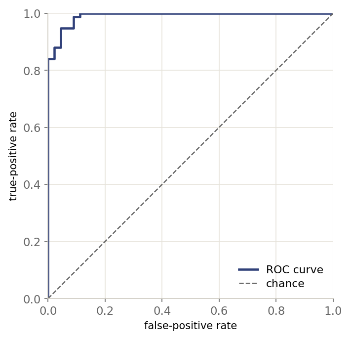

::: {.lm-hero}
[Chapter 6 · Model Evaluation]{.eyebrow}

# Applied — Evaluating a Classifier

[Training a classifier is the easy half. The chapter is the other half: judging it with a confusion matrix, precision, recall, and an ROC curve with its AUC.]{.dek}
:::

A classifier outputs probabilities, and a probability is not yet a verdict. To turn it into
one we pick a threshold, and every choice of threshold trades one kind of mistake against
another. Evaluation is the discipline of measuring those trade-offs honestly. We fit a
logistic-regression classifier and then run it through the chapter's toolkit: the
[confusion matrix]{.term}, the [precision]{.term} / [recall]{.term} / $F_1$ triple built on
its four counts, and the [ROC curve]{.term} with its [AUC]{.term}.

Both panels evaluate the same data: a representative 120-case subset of the Wisconsin
breast-cancer measurements (mean radius, mean texture, and mean concave points for each tumor,
labeled malignant or benign), inlined directly into the page so it runs offline in either
language with nothing to download. Python and R fit the same logistic model to the same cases,
so the two columns report the same confusion matrix, the same precision, recall, and $F_1$, and
the same AUC. Toggling the language switches the syntax, not the problem.

::: {.defbox}
[Precision, Recall, F&#8321;]{.lbl}
[ precision = TP / (TP + FP) &nbsp;&middot;&nbsp; recall = TP / (TP + FN) &nbsp;&middot;&nbsp; F&#8321; = 2 &middot; precision &middot; recall / (precision + recall) ]{.math}
:::

```{=html}
<figure class="lm-figure">

<figcaption><strong>ROC curve for the breast-cancer classifier.</strong> Sweeping the threshold traces true-positive rate against false-positive rate; the curve hugs the top-left corner (AUC = 0.991), far above the chance diagonal. This is the result the code below reproduces.</figcaption>
</figure>
```

## The confusion matrix, and the metrics built on it

At a threshold of $0.5$ the [confusion matrix]{.term} tallies the four outcomes: true and
false positives, true and false negatives. Treating "benign" as the positive class,
[precision]{.term} asks what fraction of the cases flagged benign really are, and
[recall]{.term} asks what fraction of the truly benign cases were caught. $F_1$ is their
harmonic mean, a single number that punishes a model for sacrificing one to inflate the other.
The heatmap below is just the matrix, shaded by count.

::: {.panel-tabset group="lang"}

## Python
```{pyodide}
import numpy as np
import matplotlib.pyplot as plt

# A representative 120-case subset of the Wisconsin breast-cancer data, inlined so
# the cell runs offline and matches the R panel case for case (1 = benign, 0 = malignant).
radius      = np.array([
    13.71, 10.2, 19.4, 10.6, 14.54, 8.62, 21.56, 11.29, 11.74, 16.25, 13.71, 20.18, 18.31, 11.34, 13.43,
    20.6, 11.71, 9.68, 11.08, 12.96, 13.08, 14.06, 11.16, 11.63, 13.16, 23.51, 14.11, 12.56, 10.08, 14.19,
    11.6, 7.76, 15.46, 13.45, 10.16, 12.89, 11.31, 17.68, 17.29, 15.22, 9.67, 27.42, 15.61, 18.81, 14.64,
    18.66, 10.75, 9.68, 13.87, 12.34, 17.19, 12.8, 19, 12.89, 11.08, 14.22, 9.61, 12.78, 9.88, 11.99,
    14.25, 13.81, 7.73, 11.06, 18.03, 11.71, 19.17, 20.16, 9.74, 9.85, 19.44, 9, 20.18, 7.69, 21.75,
    11.25, 12.07, 11.52, 12.65, 9.88, 8.6, 12.39, 11.89, 11.26, 17.85, 15.75, 13.74, 19.79, 10.95, 10.26,
    9.17, 17.3, 13.05, 11.47, 12.86, 19.81, 12.45, 15.08, 11.93, 20.26, 13.4, 11.04, 12.88, 12, 12.72,
    14.95, 14.26, 12.34, 13.27, 12.43, 12.27, 10.9, 23.27, 18.31, 21.37, 13.38, 11.67, 14.53, 14.68, 16.26])
texture     = np.array([
    20.83, 17.48, 18.18, 18.95, 27.54, 11.79, 22.39, 13.04, 14.69, 19.51, 18.68, 19.54, 20.58, 21.26, 19.63,
    29.33, 15.45, 19.34, 14.71, 18.29, 15.71, 17.18, 21.41, 29.29, 20.54, 24.27, 12.88, 19.07, 15.11, 23.81,
    24.49, 24.54, 11.89, 18.3, 19.59, 14.11, 19.04, 20.74, 22.13, 30.62, 18.1, 26.27, 19.38, 19.98, 16.85,
    17.12, 14.97, 13.14, 16.21, 22.22, 22.07, 17.46, 18.91, 13.12, 18.83, 23.12, 16.84, 16.49, 19.4, 24.89,
    21.72, 23.75, 25.49, 14.96, 16.85, 17.19, 24.8, 19.66, 19.12, 15.68, 18.82, 14.4, 23.97, 25.44, 20.99,
    14.78, 13.44, 18.75, 18.17, 17.27, 20.98, 17.48, 17.36, 19.96, 13.23, 19.22, 17.91, 25.12, 21.35, 14.71,
    13.86, 17.08, 19.31, 16.03, 18, 22.15, 15.7, 25.74, 21.53, 23.03, 20.52, 14.93, 28.92, 28.23, 13.78,
    18.77, 18.17, 14.95, 17.02, 17, 17.92, 12.96, 22.04, 18.58, 15.1, 30.72, 20.02, 13.98, 20.13, 21.88])
concave_pts = np.array([
    0.0598, 0.0107, 0.0946, 0.0264, 0.0736, 0.0078, 0.1389, 0.0276, 0.0264, 0.0919, 0.0378, 0.1259, 0.0945, 0.019, 0.0344,
    0.152, 0.0325, 0.0096, 0.0258, 0.0188, 0.0311, 0.0325, 0.0108, 0.0202, 0.0126, 0.141, 0.0273, 0.0439, 0.0024, 0.0646,
    0.0131, 0, 0.1097, 0.0278, 0.0112, 0.0398, 0.0223, 0.1054, 0.0751, 0.0943, 0.0058, 0.1689, 0.0285, 0.0584, 0.0279,
    0.0866, 0.0079, 0.0704, 0.0209, 0.0282, 0.0653, 0.0408, 0.0563, 0.0117, 0.0637, 0.0662, 0.0229, 0.0286, 0.0303, 0.0427,
    0.056, 0.0918, 0, 0.0334, 0.0625, 0.0324, 0.1118, 0.0773, 0.0197, 0.0242, 0.1194, 0.0035, 0.1604, 0.0136, 0.1088,
    0.0029, 0.028, 0.0228, 0.0507, 0.0195, 0.0093, 0.0288, 0.074, 0.0559, 0.0418, 0.1242, 0.0133, 0.1149, 0.0567, 0.0204,
    0.0218, 0.0835, 0.0042, 0.0232, 0.0232, 0.095, 0.0809, 0.0655, 0.0201, 0.0868, 0.0817, 0.0207, 0.0234, 0.0194, 0.0192,
    0.0356, 0.0137, 0.0205, 0.0246, 0.017, 0.0265, 0.0066, 0.097, 0.0581, 0.1255, 0.0326, 0.0216, 0.0649, 0.0526, 0.0798])
y           = np.array([
    0, 1, 0, 1, 0, 1, 0, 1, 1, 0, 1, 0, 0, 1, 0,
    0, 1, 1, 1, 1, 1, 1, 1, 1, 1, 0, 1, 1, 1, 0,
    1, 1, 0, 1, 1, 1, 1, 0, 0, 0, 1, 0, 0, 0, 1,
    0, 1, 1, 1, 1, 0, 1, 0, 1, 0, 0, 1, 1, 1, 1,
    0, 0, 1, 1, 0, 1, 0, 0, 1, 1, 0, 1, 0, 1, 0,
    1, 1, 1, 1, 1, 1, 1, 1, 1, 1, 0, 1, 0, 0, 1,
    1, 0, 1, 1, 1, 0, 0, 0, 1, 0, 0, 1, 1, 1, 1,
    1, 1, 1, 1, 1, 1, 1, 0, 0, 0, 1, 1, 1, 0, 0])

# Fit the logistic model, then threshold its probabilities at 0.5.
X = np.column_stack([np.ones(len(y)), radius, texture, concave_pts])
beta = np.zeros(X.shape[1])
for _ in range(50):                         # IRLS: the fit glm() also computes
    p = 1 / (1 + np.exp(-X @ beta))
    W = np.clip(p * (1 - p), 1e-9, None)
    z = X @ beta + (y - p) / W
    beta = np.linalg.solve((X * W[:, None]).T @ X, (X * W[:, None]).T @ z)
proba = 1 / (1 + np.exp(-X @ beta))          # P(benign)
pred = (proba >= 0.5).astype(int)

TN = int(((pred == 0) & (y == 0)).sum()); FP = int(((pred == 1) & (y == 0)).sum())
FN = int(((pred == 0) & (y == 1)).sum()); TP = int(((pred == 1) & (y == 1)).sum())
cm = np.array([[TN, FP], [FN, TP]])          # rows = actual, cols = predicted
precision = TP / (TP + FP); recall = TP / (TP + FN)
f1 = 2 * precision * recall / (precision + recall)
print("Confusion matrix [rows actual, cols predicted]:")
print(cm)
print(f"precision {precision:.3f} | recall {recall:.3f} | F1 {f1:.3f}")

fig, ax = plt.subplots(figsize=(3.9, 3.7))
ax.imshow(cm, cmap="Blues")
for i in range(2):
    for j in range(2):
        ax.text(j, i, cm[i, j], ha="center", va="center", fontsize=13, color="#31417A")
ax.set_xticks([0, 1]); ax.set_xticklabels(["malignant", "benign"])
ax.set_yticks([0, 1]); ax.set_yticklabels(["malignant", "benign"])
ax.set_xlabel("predicted"); ax.set_ylabel("actual")
for s in ["top", "right"]: ax.spines[s].set_visible(False)
plt.tight_layout()
plt.show()
```

## R
```{webr}
# The same 120-case subset of the Wisconsin breast-cancer data as the Python panel,
# inlined so the cell runs offline (1 = benign, 0 = malignant).
radius      <- c(
    13.71, 10.2, 19.4, 10.6, 14.54, 8.62, 21.56, 11.29, 11.74, 16.25, 13.71, 20.18, 18.31, 11.34, 13.43,
    20.6, 11.71, 9.68, 11.08, 12.96, 13.08, 14.06, 11.16, 11.63, 13.16, 23.51, 14.11, 12.56, 10.08, 14.19,
    11.6, 7.76, 15.46, 13.45, 10.16, 12.89, 11.31, 17.68, 17.29, 15.22, 9.67, 27.42, 15.61, 18.81, 14.64,
    18.66, 10.75, 9.68, 13.87, 12.34, 17.19, 12.8, 19, 12.89, 11.08, 14.22, 9.61, 12.78, 9.88, 11.99,
    14.25, 13.81, 7.73, 11.06, 18.03, 11.71, 19.17, 20.16, 9.74, 9.85, 19.44, 9, 20.18, 7.69, 21.75,
    11.25, 12.07, 11.52, 12.65, 9.88, 8.6, 12.39, 11.89, 11.26, 17.85, 15.75, 13.74, 19.79, 10.95, 10.26,
    9.17, 17.3, 13.05, 11.47, 12.86, 19.81, 12.45, 15.08, 11.93, 20.26, 13.4, 11.04, 12.88, 12, 12.72,
    14.95, 14.26, 12.34, 13.27, 12.43, 12.27, 10.9, 23.27, 18.31, 21.37, 13.38, 11.67, 14.53, 14.68, 16.26)
texture     <- c(
    20.83, 17.48, 18.18, 18.95, 27.54, 11.79, 22.39, 13.04, 14.69, 19.51, 18.68, 19.54, 20.58, 21.26, 19.63,
    29.33, 15.45, 19.34, 14.71, 18.29, 15.71, 17.18, 21.41, 29.29, 20.54, 24.27, 12.88, 19.07, 15.11, 23.81,
    24.49, 24.54, 11.89, 18.3, 19.59, 14.11, 19.04, 20.74, 22.13, 30.62, 18.1, 26.27, 19.38, 19.98, 16.85,
    17.12, 14.97, 13.14, 16.21, 22.22, 22.07, 17.46, 18.91, 13.12, 18.83, 23.12, 16.84, 16.49, 19.4, 24.89,
    21.72, 23.75, 25.49, 14.96, 16.85, 17.19, 24.8, 19.66, 19.12, 15.68, 18.82, 14.4, 23.97, 25.44, 20.99,
    14.78, 13.44, 18.75, 18.17, 17.27, 20.98, 17.48, 17.36, 19.96, 13.23, 19.22, 17.91, 25.12, 21.35, 14.71,
    13.86, 17.08, 19.31, 16.03, 18, 22.15, 15.7, 25.74, 21.53, 23.03, 20.52, 14.93, 28.92, 28.23, 13.78,
    18.77, 18.17, 14.95, 17.02, 17, 17.92, 12.96, 22.04, 18.58, 15.1, 30.72, 20.02, 13.98, 20.13, 21.88)
concave_pts <- c(
    0.0598, 0.0107, 0.0946, 0.0264, 0.0736, 0.0078, 0.1389, 0.0276, 0.0264, 0.0919, 0.0378, 0.1259, 0.0945, 0.019, 0.0344,
    0.152, 0.0325, 0.0096, 0.0258, 0.0188, 0.0311, 0.0325, 0.0108, 0.0202, 0.0126, 0.141, 0.0273, 0.0439, 0.0024, 0.0646,
    0.0131, 0, 0.1097, 0.0278, 0.0112, 0.0398, 0.0223, 0.1054, 0.0751, 0.0943, 0.0058, 0.1689, 0.0285, 0.0584, 0.0279,
    0.0866, 0.0079, 0.0704, 0.0209, 0.0282, 0.0653, 0.0408, 0.0563, 0.0117, 0.0637, 0.0662, 0.0229, 0.0286, 0.0303, 0.0427,
    0.056, 0.0918, 0, 0.0334, 0.0625, 0.0324, 0.1118, 0.0773, 0.0197, 0.0242, 0.1194, 0.0035, 0.1604, 0.0136, 0.1088,
    0.0029, 0.028, 0.0228, 0.0507, 0.0195, 0.0093, 0.0288, 0.074, 0.0559, 0.0418, 0.1242, 0.0133, 0.1149, 0.0567, 0.0204,
    0.0218, 0.0835, 0.0042, 0.0232, 0.0232, 0.095, 0.0809, 0.0655, 0.0201, 0.0868, 0.0817, 0.0207, 0.0234, 0.0194, 0.0192,
    0.0356, 0.0137, 0.0205, 0.0246, 0.017, 0.0265, 0.0066, 0.097, 0.0581, 0.1255, 0.0326, 0.0216, 0.0649, 0.0526, 0.0798)
y           <- c(
    0, 1, 0, 1, 0, 1, 0, 1, 1, 0, 1, 0, 0, 1, 0,
    0, 1, 1, 1, 1, 1, 1, 1, 1, 1, 0, 1, 1, 1, 0,
    1, 1, 0, 1, 1, 1, 1, 0, 0, 0, 1, 0, 0, 0, 1,
    0, 1, 1, 1, 1, 0, 1, 0, 1, 0, 0, 1, 1, 1, 1,
    0, 0, 1, 1, 0, 1, 0, 0, 1, 1, 0, 1, 0, 1, 0,
    1, 1, 1, 1, 1, 1, 1, 1, 1, 1, 0, 1, 0, 0, 1,
    1, 0, 1, 1, 1, 0, 0, 0, 1, 0, 0, 1, 1, 1, 1,
    1, 1, 1, 1, 1, 1, 1, 0, 0, 0, 1, 1, 1, 0, 0)

# Fit the logistic model, then threshold its probabilities at 0.5.
fit   <- glm(y ~ radius + texture + concave_pts, family = binomial)
proba <- as.numeric(predict(fit, type = "response"))   # P(benign), the MLE fit
pred  <- as.integer(proba >= 0.5)

cm <- table(actual    = factor(y,    levels = c(0, 1)),
            predicted = factor(pred, levels = c(0, 1)))
cat("Confusion matrix [rows actual, cols predicted]:\n")
print(cm)

TP <- cm["1","1"]; FP <- cm["0","1"]; FN <- cm["1","0"]; TN <- cm["0","0"]
precision <- TP / (TP + FP)
recall    <- TP / (TP + FN)
f1        <- 2 * precision * recall / (precision + recall)
cat(sprintf("precision %.3f | recall %.3f | F1 %.3f\n", precision, recall, f1))

# Confusion-matrix heatmap, blue identity (rows actual, cols predicted)
counts <- matrix(c(TN, FP, FN, TP), nrow = 2, byrow = TRUE)
labels <- c("malignant", "benign")
shade  <- counts / max(counts)
plot(NA, xlim = c(0, 2), ylim = c(0, 2), axes = FALSE, asp = 1,
     xlab = "predicted", ylab = "actual")
for (i in 1:2) for (j in 1:2) {
  rect(j - 1, 2 - i, j, 3 - i,
       col = rgb(7, 111, 161, alpha = 255 * shade[i, j], maxColorValue = 255),
       border = "white")
  text(j - 0.5, 2.5 - i, counts[i, j], cex = 1.4, col = "#31417A")
}
axis(1, at = c(0.5, 1.5), labels = labels, tick = FALSE)
axis(2, at = c(1.5, 0.5), labels = labels, tick = FALSE, las = 1)
```

:::

A high-recall, high-precision matrix has its mass on the diagonal: most cases are graded
correctly, and the off-diagonal counts are the errors. But every count here is a hostage to
that one threshold of $0.5$. Move it, and the whole table shifts.

## ROC and AUC: every threshold at once

Rather than commit to one threshold, sweep it from $1$ down to $0$ and record, at each stop,
the true-positive rate against the false-positive rate. The trace is the [ROC curve]{.term}.
The [AUC]{.term}, the area beneath it, has a clean reading: it is the probability that the
model scores a random positive above a random negative. A perfect ranker scores $1$; blind
guessing traces the diagonal and scores $0.5$. It summarizes a classifier across all
thresholds at once, before any threshold is chosen.

Both panels compute the curve from first principles: sweep the predicted probabilities, count
the rates at each threshold, and integrate the area with the trapezoidal rule. Sweeping from a
high threshold down keeps both rates rising together, so no re-sorting is needed.
scikit-learn's `roc_curve` and `roc_auc_score` do exactly this, faster.

::: {.panel-tabset group="lang"}

## Python
```{pyodide}
import numpy as np
import matplotlib.pyplot as plt

# Same 120-case breast-cancer subset as the confusion-matrix panel.
radius      = np.array([
    13.71, 10.2, 19.4, 10.6, 14.54, 8.62, 21.56, 11.29, 11.74, 16.25, 13.71, 20.18, 18.31, 11.34, 13.43,
    20.6, 11.71, 9.68, 11.08, 12.96, 13.08, 14.06, 11.16, 11.63, 13.16, 23.51, 14.11, 12.56, 10.08, 14.19,
    11.6, 7.76, 15.46, 13.45, 10.16, 12.89, 11.31, 17.68, 17.29, 15.22, 9.67, 27.42, 15.61, 18.81, 14.64,
    18.66, 10.75, 9.68, 13.87, 12.34, 17.19, 12.8, 19, 12.89, 11.08, 14.22, 9.61, 12.78, 9.88, 11.99,
    14.25, 13.81, 7.73, 11.06, 18.03, 11.71, 19.17, 20.16, 9.74, 9.85, 19.44, 9, 20.18, 7.69, 21.75,
    11.25, 12.07, 11.52, 12.65, 9.88, 8.6, 12.39, 11.89, 11.26, 17.85, 15.75, 13.74, 19.79, 10.95, 10.26,
    9.17, 17.3, 13.05, 11.47, 12.86, 19.81, 12.45, 15.08, 11.93, 20.26, 13.4, 11.04, 12.88, 12, 12.72,
    14.95, 14.26, 12.34, 13.27, 12.43, 12.27, 10.9, 23.27, 18.31, 21.37, 13.38, 11.67, 14.53, 14.68, 16.26])
texture     = np.array([
    20.83, 17.48, 18.18, 18.95, 27.54, 11.79, 22.39, 13.04, 14.69, 19.51, 18.68, 19.54, 20.58, 21.26, 19.63,
    29.33, 15.45, 19.34, 14.71, 18.29, 15.71, 17.18, 21.41, 29.29, 20.54, 24.27, 12.88, 19.07, 15.11, 23.81,
    24.49, 24.54, 11.89, 18.3, 19.59, 14.11, 19.04, 20.74, 22.13, 30.62, 18.1, 26.27, 19.38, 19.98, 16.85,
    17.12, 14.97, 13.14, 16.21, 22.22, 22.07, 17.46, 18.91, 13.12, 18.83, 23.12, 16.84, 16.49, 19.4, 24.89,
    21.72, 23.75, 25.49, 14.96, 16.85, 17.19, 24.8, 19.66, 19.12, 15.68, 18.82, 14.4, 23.97, 25.44, 20.99,
    14.78, 13.44, 18.75, 18.17, 17.27, 20.98, 17.48, 17.36, 19.96, 13.23, 19.22, 17.91, 25.12, 21.35, 14.71,
    13.86, 17.08, 19.31, 16.03, 18, 22.15, 15.7, 25.74, 21.53, 23.03, 20.52, 14.93, 28.92, 28.23, 13.78,
    18.77, 18.17, 14.95, 17.02, 17, 17.92, 12.96, 22.04, 18.58, 15.1, 30.72, 20.02, 13.98, 20.13, 21.88])
concave_pts = np.array([
    0.0598, 0.0107, 0.0946, 0.0264, 0.0736, 0.0078, 0.1389, 0.0276, 0.0264, 0.0919, 0.0378, 0.1259, 0.0945, 0.019, 0.0344,
    0.152, 0.0325, 0.0096, 0.0258, 0.0188, 0.0311, 0.0325, 0.0108, 0.0202, 0.0126, 0.141, 0.0273, 0.0439, 0.0024, 0.0646,
    0.0131, 0, 0.1097, 0.0278, 0.0112, 0.0398, 0.0223, 0.1054, 0.0751, 0.0943, 0.0058, 0.1689, 0.0285, 0.0584, 0.0279,
    0.0866, 0.0079, 0.0704, 0.0209, 0.0282, 0.0653, 0.0408, 0.0563, 0.0117, 0.0637, 0.0662, 0.0229, 0.0286, 0.0303, 0.0427,
    0.056, 0.0918, 0, 0.0334, 0.0625, 0.0324, 0.1118, 0.0773, 0.0197, 0.0242, 0.1194, 0.0035, 0.1604, 0.0136, 0.1088,
    0.0029, 0.028, 0.0228, 0.0507, 0.0195, 0.0093, 0.0288, 0.074, 0.0559, 0.0418, 0.1242, 0.0133, 0.1149, 0.0567, 0.0204,
    0.0218, 0.0835, 0.0042, 0.0232, 0.0232, 0.095, 0.0809, 0.0655, 0.0201, 0.0868, 0.0817, 0.0207, 0.0234, 0.0194, 0.0192,
    0.0356, 0.0137, 0.0205, 0.0246, 0.017, 0.0265, 0.0066, 0.097, 0.0581, 0.1255, 0.0326, 0.0216, 0.0649, 0.0526, 0.0798])
y           = np.array([
    0, 1, 0, 1, 0, 1, 0, 1, 1, 0, 1, 0, 0, 1, 0,
    0, 1, 1, 1, 1, 1, 1, 1, 1, 1, 0, 1, 1, 1, 0,
    1, 1, 0, 1, 1, 1, 1, 0, 0, 0, 1, 0, 0, 0, 1,
    0, 1, 1, 1, 1, 0, 1, 0, 1, 0, 0, 1, 1, 1, 1,
    0, 0, 1, 1, 0, 1, 0, 0, 1, 1, 0, 1, 0, 1, 0,
    1, 1, 1, 1, 1, 1, 1, 1, 1, 1, 0, 1, 0, 0, 1,
    1, 0, 1, 1, 1, 0, 0, 0, 1, 0, 0, 1, 1, 1, 1,
    1, 1, 1, 1, 1, 1, 1, 0, 0, 0, 1, 1, 1, 0, 0])

X = np.column_stack([np.ones(len(y)), radius, texture, concave_pts])
beta = np.zeros(X.shape[1])
for _ in range(50):                         # IRLS: the fit glm() also computes
    p = 1 / (1 + np.exp(-X @ beta))
    W = np.clip(p * (1 - p), 1e-9, None)
    z = X @ beta + (y - p) / W
    beta = np.linalg.solve((X * W[:, None]).T @ X, (X * W[:, None]).T @ z)
proba = 1 / (1 + np.exp(-X @ beta))          # P(benign)

# Sweep the threshold from high to low; the TPR and FPR rise together, monotone.
thr = np.unique(np.concatenate([[0.0], proba, [1.0]]))[::-1]
P = int((y == 1).sum()); N = int((y == 0).sum())
tpr = np.array([np.sum((proba >= t) & (y == 1)) / P for t in thr])
fpr = np.array([np.sum((proba >= t) & (y == 0)) / N for t in thr])
auc = np.sum(np.diff(fpr) * (tpr[:-1] + tpr[1:]) / 2)   # trapezoidal area
print(f"AUC = {auc:.3f}")

fig, ax = plt.subplots(figsize=(5, 4.5))
ax.plot(fpr, tpr, color="#076FA1", lw=2, label=f"AUC = {auc:.3f}")
ax.plot([0, 1], [0, 1], color="#666666", ls="--", lw=1, label="chance")
ax.set_xlabel("false-positive rate"); ax.set_ylabel("true-positive rate")
ax.legend()
for s in ["top", "right"]: ax.spines[s].set_visible(False)
ax.grid(color="#e6e3da", lw=0.8); ax.set_axisbelow(True)
plt.tight_layout()
plt.show()
```

## R
```{webr}
# Same 120-case breast-cancer subset as the confusion-matrix panel.
radius      <- c(
    13.71, 10.2, 19.4, 10.6, 14.54, 8.62, 21.56, 11.29, 11.74, 16.25, 13.71, 20.18, 18.31, 11.34, 13.43,
    20.6, 11.71, 9.68, 11.08, 12.96, 13.08, 14.06, 11.16, 11.63, 13.16, 23.51, 14.11, 12.56, 10.08, 14.19,
    11.6, 7.76, 15.46, 13.45, 10.16, 12.89, 11.31, 17.68, 17.29, 15.22, 9.67, 27.42, 15.61, 18.81, 14.64,
    18.66, 10.75, 9.68, 13.87, 12.34, 17.19, 12.8, 19, 12.89, 11.08, 14.22, 9.61, 12.78, 9.88, 11.99,
    14.25, 13.81, 7.73, 11.06, 18.03, 11.71, 19.17, 20.16, 9.74, 9.85, 19.44, 9, 20.18, 7.69, 21.75,
    11.25, 12.07, 11.52, 12.65, 9.88, 8.6, 12.39, 11.89, 11.26, 17.85, 15.75, 13.74, 19.79, 10.95, 10.26,
    9.17, 17.3, 13.05, 11.47, 12.86, 19.81, 12.45, 15.08, 11.93, 20.26, 13.4, 11.04, 12.88, 12, 12.72,
    14.95, 14.26, 12.34, 13.27, 12.43, 12.27, 10.9, 23.27, 18.31, 21.37, 13.38, 11.67, 14.53, 14.68, 16.26)
texture     <- c(
    20.83, 17.48, 18.18, 18.95, 27.54, 11.79, 22.39, 13.04, 14.69, 19.51, 18.68, 19.54, 20.58, 21.26, 19.63,
    29.33, 15.45, 19.34, 14.71, 18.29, 15.71, 17.18, 21.41, 29.29, 20.54, 24.27, 12.88, 19.07, 15.11, 23.81,
    24.49, 24.54, 11.89, 18.3, 19.59, 14.11, 19.04, 20.74, 22.13, 30.62, 18.1, 26.27, 19.38, 19.98, 16.85,
    17.12, 14.97, 13.14, 16.21, 22.22, 22.07, 17.46, 18.91, 13.12, 18.83, 23.12, 16.84, 16.49, 19.4, 24.89,
    21.72, 23.75, 25.49, 14.96, 16.85, 17.19, 24.8, 19.66, 19.12, 15.68, 18.82, 14.4, 23.97, 25.44, 20.99,
    14.78, 13.44, 18.75, 18.17, 17.27, 20.98, 17.48, 17.36, 19.96, 13.23, 19.22, 17.91, 25.12, 21.35, 14.71,
    13.86, 17.08, 19.31, 16.03, 18, 22.15, 15.7, 25.74, 21.53, 23.03, 20.52, 14.93, 28.92, 28.23, 13.78,
    18.77, 18.17, 14.95, 17.02, 17, 17.92, 12.96, 22.04, 18.58, 15.1, 30.72, 20.02, 13.98, 20.13, 21.88)
concave_pts <- c(
    0.0598, 0.0107, 0.0946, 0.0264, 0.0736, 0.0078, 0.1389, 0.0276, 0.0264, 0.0919, 0.0378, 0.1259, 0.0945, 0.019, 0.0344,
    0.152, 0.0325, 0.0096, 0.0258, 0.0188, 0.0311, 0.0325, 0.0108, 0.0202, 0.0126, 0.141, 0.0273, 0.0439, 0.0024, 0.0646,
    0.0131, 0, 0.1097, 0.0278, 0.0112, 0.0398, 0.0223, 0.1054, 0.0751, 0.0943, 0.0058, 0.1689, 0.0285, 0.0584, 0.0279,
    0.0866, 0.0079, 0.0704, 0.0209, 0.0282, 0.0653, 0.0408, 0.0563, 0.0117, 0.0637, 0.0662, 0.0229, 0.0286, 0.0303, 0.0427,
    0.056, 0.0918, 0, 0.0334, 0.0625, 0.0324, 0.1118, 0.0773, 0.0197, 0.0242, 0.1194, 0.0035, 0.1604, 0.0136, 0.1088,
    0.0029, 0.028, 0.0228, 0.0507, 0.0195, 0.0093, 0.0288, 0.074, 0.0559, 0.0418, 0.1242, 0.0133, 0.1149, 0.0567, 0.0204,
    0.0218, 0.0835, 0.0042, 0.0232, 0.0232, 0.095, 0.0809, 0.0655, 0.0201, 0.0868, 0.0817, 0.0207, 0.0234, 0.0194, 0.0192,
    0.0356, 0.0137, 0.0205, 0.0246, 0.017, 0.0265, 0.0066, 0.097, 0.0581, 0.1255, 0.0326, 0.0216, 0.0649, 0.0526, 0.0798)
y           <- c(
    0, 1, 0, 1, 0, 1, 0, 1, 1, 0, 1, 0, 0, 1, 0,
    0, 1, 1, 1, 1, 1, 1, 1, 1, 1, 0, 1, 1, 1, 0,
    1, 1, 0, 1, 1, 1, 1, 0, 0, 0, 1, 0, 0, 0, 1,
    0, 1, 1, 1, 1, 0, 1, 0, 1, 0, 0, 1, 1, 1, 1,
    0, 0, 1, 1, 0, 1, 0, 0, 1, 1, 0, 1, 0, 1, 0,
    1, 1, 1, 1, 1, 1, 1, 1, 1, 1, 0, 1, 0, 0, 1,
    1, 0, 1, 1, 1, 0, 0, 0, 1, 0, 0, 1, 1, 1, 1,
    1, 1, 1, 1, 1, 1, 1, 0, 0, 0, 1, 1, 1, 0, 0)

fit   <- glm(y ~ radius + texture + concave_pts, family = binomial)
proba <- as.numeric(predict(fit, type = "response"))   # P(benign), the MLE fit
yt <- y

# Sweep the threshold from high to low; the TPR and FPR rise together, monotone.
thr <- sort(unique(c(0, proba, 1)), decreasing = TRUE)
P <- sum(yt == 1); N <- sum(yt == 0)
tpr <- sapply(thr, function(t) sum(proba >= t & yt == 1) / P)
fpr <- sapply(thr, function(t) sum(proba >= t & yt == 0) / N)

# AUC by the trapezoidal rule under the ROC curve.
auc <- sum(diff(fpr) * (head(tpr, -1) + tail(tpr, -1)) / 2)
cat(sprintf("AUC = %.3f\n", auc))

plot(fpr, tpr, type = "l", col = "#076FA1", lwd = 2, bty = "l",
     xlim = c(0, 1), ylim = c(0, 1),
     xlab = "false-positive rate", ylab = "true-positive rate")
grid(col = "#e6e3da", lty = 1, lwd = 0.6)
lines(fpr, tpr, col = "#076FA1", lwd = 2)
abline(0, 1, col = "#666666", lty = 2)
legend("bottomright", legend = c(sprintf("AUC = %.3f", auc), "chance"),
       col = c("#076FA1", "#666666"), lty = c(1, 2), lwd = c(2, 1), bty = "n")
```

:::

The classifier rides close to the top-left corner, an AUC near $0.99$: on these three features
the malignant and benign cases separate cleanly. Both panels report the same AUC because they
rank the same cases with the same fitted model. That is the honest reading of AUC: it rates the
ranking, not the dataset, and an easy problem flatters any reasonable model.

::: {.explore}
[Try it]{.lbl}
Move the threshold off $0.5$ and watch precision trade against recall. For a cancer screen,
which error is worse, a missed malignancy or a false alarm, and which way should the threshold
move? Then recall that a model can post a high AUC yet be poorly *calibrated*: bin the
predicted probabilities and plot predicted against observed frequency to ask whether "0.7"
really means 70%.
:::
