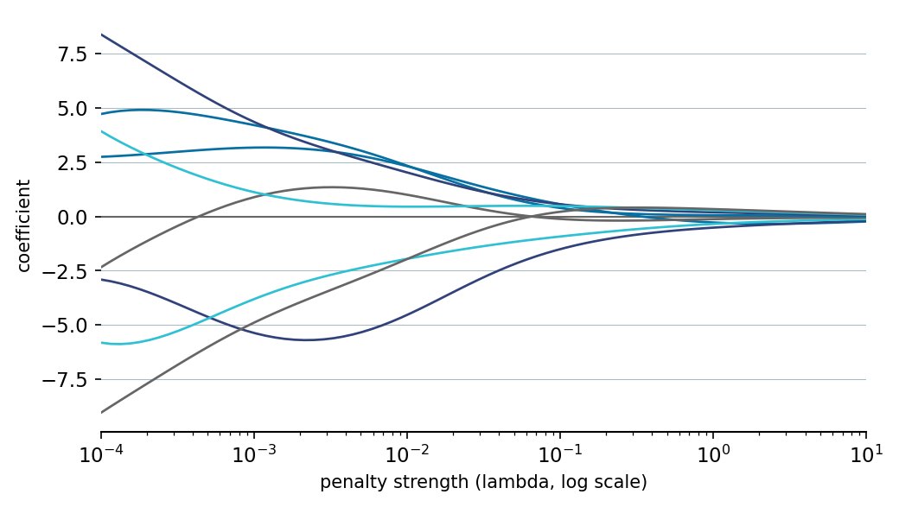

::: {.lm-hero}
[Chapter 7 · Regularization]{.eyebrow}

# Ridge and LASSO

[A single penalty term trades a little bias for a large drop in variance; the shape of that penalty decides whether coefficients merely shrink or vanish outright.]{.dek}
:::

A model with enough parameters can pass through every training point and still predict
badly, because it has fit the noise along with the signal. [Regularization]{.term} adds a
penalty on the size of the coefficients to the training loss, so the fit has to pay for
complexity it cannot justify. The penalty buys a small increase in bias in exchange for a
large reduction in variance.

::: {.defbox}
[Regularized Cost]{.lbl}
[ J(&theta;) = Loss(data, &theta;) + &lambda; &middot; Penalty(&theta;) ]{.math}
:::

The knob $\lambda$ sets the strength. Two penalties dominate practice and differ in one
respect that changes everything. [Ridge]{.term} squares the coefficients, $\sum_j \theta_j^2$,
and has a closed form. [LASSO]{.term} takes their absolute values, $\sum_j |\theta_j|$, has
no closed form, and can set coefficients to *exactly* zero. This page builds both from the
linear algebra up, watches their coefficient paths diverge, and shows the geometry that
explains why only one of them selects features.

## The overfitting it cures

Fifteen noisy points come from $y = \sin(2\pi x)$. A degree-9 polynomial has enough freedom
to chase every wiggle, and ordinary least squares takes the bait: its coefficients blow up to
hundreds of thousands. Ridge solves the same normal equations with $\lambda I$ added to the
cross-product, leaving the intercept unpenalized. That one term tames the fit.

::: {.defbox}
[Ridge Estimate]{.lbl}
[ &theta;&#770;<sub>ridge</sub> = (X&#8868;X + &lambda;I)&#8722;&sup1; X&#8868;y ]{.math}
:::

```{=html}
<figure class="lm-figure">

<figcaption><strong>Ridge shrinkage paths.</strong> As the penalty strength &lambda; grows, every coefficient glides smoothly toward zero without ever quite reaching it. This is the result the code below reproduces.</figcaption>
</figure>
```

::: {.panel-tabset group="lang"}

## Python
```{pyodide}
import numpy as np
import matplotlib.pyplot as plt

# Fifteen fixed points from y = sin(2*pi*x) + noise
x = np.array([0.3745, 0.9507, 0.732, 0.5987, 0.156, 0.156, 0.0581, 0.8662,
              0.6011, 0.7081, 0.0206, 0.9699, 0.8324, 0.2123, 0.1818])
y = np.array([0.5377, -0.582, -1.7774, -0.2958, 1.0756, 0.3734, 0.2285, -0.9679,
              -0.8044, -1.6074, -0.0599, -0.0086, -0.101, 1.0904, 0.9463])

def poly(x, d):                       # design matrix [1, x, x^2, ..., x^d]
    return np.column_stack([x**k for k in range(d + 1)])

def ridge(X, y, lam):
    n = X.shape[1]
    P = lam * np.eye(n); P[0, 0] = 0.0      # do not penalize the intercept
    return np.linalg.solve(X.T @ X + P, X.T @ y)

degree = 9
X = poly(x, degree)
theta_ols   = ridge(X, y, 0.0)             # lambda = 0 is plain OLS
theta_ridge = ridge(X, y, 1e-2)
print(f"max|theta|  OLS  : {np.abs(theta_ols).max():12.1f}")
print(f"max|theta|  ridge: {np.abs(theta_ridge).max():12.1f}")

grid = np.linspace(0, 1, 200)
G = poly(grid, degree)
fig, ax = plt.subplots(figsize=(7, 4.5))
ax.scatter(x, y, s=70, color="#076FA1", edgecolor="white", zorder=5, label="training data")
ax.plot(grid, np.sin(2*np.pi*grid), color="#666666", lw=2, ls="--", label="true function")
ax.plot(grid, G @ theta_ols,   color="#E3120B", lw=2.2, label="degree-9 OLS (overfit)")
ax.plot(grid, G @ theta_ridge, color="#31417A", lw=2.2, label="ridge (lambda=0.01)")
ax.set_ylim(-2, 2); ax.set_xlabel("x"); ax.set_ylabel("y"); ax.legend(fontsize=8)
plt.tight_layout(); plt.show()
```

## R
```{webr}
# Fifteen fixed points from y = sin(2*pi*x) + noise
x <- c(0.3745, 0.9507, 0.732, 0.5987, 0.156, 0.156, 0.0581, 0.8662,
       0.6011, 0.7081, 0.0206, 0.9699, 0.8324, 0.2123, 0.1818)
y <- c(0.5377, -0.582, -1.7774, -0.2958, 1.0756, 0.3734, 0.2285, -0.9679,
       -0.8044, -1.6074, -0.0599, -0.0086, -0.101, 1.0904, 0.9463)

poly_features <- function(x, d) outer(x, 0:d, `^`)   # [1, x, x^2, ..., x^d]

ridge_fit <- function(X, y, lambda) {
  p <- ncol(X)
  P <- lambda * diag(p); P[1, 1] <- 0                # do not penalize the intercept
  solve(t(X) %*% X + P, t(X) %*% y)
}

degree <- 9
X <- poly_features(x, degree)
theta_ols   <- ridge_fit(X, y, 0)                    # lambda = 0 is plain OLS
theta_ridge <- ridge_fit(X, y, 1e-2)
cat(sprintf("max|theta|  OLS  : %12.1f\n", max(abs(theta_ols))))
cat(sprintf("max|theta|  ridge: %12.1f\n", max(abs(theta_ridge))))

grid <- seq(0, 1, length.out = 200)
G <- poly_features(grid, degree)
plot(x, y, pch = 19, col = "#076FA1", cex = 1.4, ylim = c(-2, 2), xlab = "x", ylab = "y")
lines(grid, sin(2*pi*grid),       col = "#666666", lwd = 2, lty = 2)
lines(grid, G %*% theta_ols,      col = "#E3120B", lwd = 2.2)
lines(grid, G %*% theta_ridge,    col = "#31417A", lwd = 2.2)
legend("topright", c("training data", "true function", "degree-9 OLS", "ridge (0.01)"),
       col = c("#076FA1", "#666666", "#E3120B", "#31417A"),
       pch = c(19, NA, NA, NA), lty = c(NA, 2, 1, 1), lwd = 2, bty = "n", cex = 0.8)
```

:::

Ridge cuts the largest coefficient from roughly $3 \times 10^5$ down to about $5$. The two
languages agree to that figure, but their OLS maxima differ in the fifth significant digit
(about 318026 versus 318018). That gap is not a bug; it is the symptom. The unpenalized
cross-product is so close to singular that two linear solvers round it differently. Adding
$\lambda I$ removes the pathology, and both report the same $4.9$.

## Two penalties, two paths

A [coefficient path]{.term} plots each coefficient as $\lambda$ sweeps from small to large.
Ridge has its closed form; LASSO needs an iterative solver. The standard one is
[coordinate descent]{.term}: cycle through the coefficients, and update each to minimize the
cost with the others held fixed. For the L1 penalty that one-dimensional minimum has a tidy
form, [soft-thresholding]{.term}, which shrinks a coefficient toward zero and clips it to
exactly zero once the penalty outweighs its correlation with the residual.

::: {.defbox}
[Soft-Thresholding (one LASSO coordinate)]{.lbl}
[ &theta;<sub>j</sub> = sign(&rho;<sub>j</sub>) &middot; max(|&rho;<sub>j</sub>| &minus; &lambda;m, 0) / &Sigma;<sub>i</sub> x<sub>ij</sub>&sup2; ]{.math}
:::

Here $\rho_j$ is the dot product of feature $j$ with the residual formed by leaving feature
$j$ out. We standardize the polynomial features first, so a single $\lambda$ penalizes every
coefficient on equal footing. The two panels tell the whole story: ridge coefficients glide
toward zero but never arrive, while LASSO coefficients hit zero one after another. At
$\lambda = 0.05$ ridge keeps all eight features and LASSO keeps three. (`glmnet` in R and
`Lasso` in scikit-learn are the production solvers; the dozen lines below are the idea they
optimize.)

::: {.panel-tabset group="lang"}

## Python
```{pyodide}
import numpy as np
import matplotlib.pyplot as plt

x = np.array([0.3745, 0.9507, 0.732, 0.5987, 0.156, 0.156, 0.0581, 0.8662,
              0.6011, 0.7081, 0.0206, 0.9699, 0.8324, 0.2123, 0.1818])
y = np.array([0.5377, -0.582, -1.7774, -0.2958, 1.0756, 0.3734, 0.2285, -0.9679,
              -0.8044, -1.6074, -0.0599, -0.0086, -0.101, 1.0904, 0.9463])

def poly(x, d):
    return np.column_stack([x**k for k in range(d + 1)])

def ridge(X, y, lam):
    n = X.shape[1]; P = lam * np.eye(n); P[0, 0] = 0.0
    return np.linalg.solve(X.T @ X + P, X.T @ y)

def lasso(X, y, lam, iters=5000, tol=1e-7):
    m, n = X.shape
    theta = np.zeros(n)
    col_sq = (X**2).sum(axis=0)
    for _ in range(iters):
        old = theta.copy()
        for j in range(n):
            r = y - X @ theta + X[:, j] * theta[j]   # residual without feature j
            rho = X[:, j] @ r
            if j == 0:                                # intercept: no penalty
                theta[j] = rho / col_sq[j]
            else:                                     # soft-threshold
                theta[j] = np.sign(rho) * max(abs(rho) - lam * m, 0.0) / col_sq[j]
        if np.abs(theta - old).max() < tol:
            break
    return theta

# Standardize the polynomial columns (not the intercept) so lambda is comparable
degree = 8
X = poly(x, degree)
mu = X[:, 1:].mean(axis=0); sd = X[:, 1:].std(axis=0)
Xs = X.copy(); Xs[:, 1:] = (X[:, 1:] - mu) / sd

lams = np.logspace(-4, 1, 40)
ridge_path = np.array([ridge(Xs, y, l)[1:] for l in lams])
lasso_path = np.array([lasso(Xs, y, l)[1:] for l in lams])

lam0 = 0.05
nz_r = int(np.sum(np.abs(ridge(Xs, y, lam0)[1:]) > 1e-6))
nz_l = int(np.sum(np.abs(lasso(Xs, y, lam0)[1:]) > 1e-6))
print(f"at lambda={lam0}: ridge keeps {nz_r}/{degree} coefs, LASSO keeps {nz_l}/{degree}")

fig, axes = plt.subplots(1, 2, figsize=(11, 4.2), sharey=True)
for j in range(ridge_path.shape[1]):
    axes[0].plot(lams, ridge_path[:, j], lw=1.6)
    axes[1].plot(lams, lasso_path[:, j], lw=1.6)
for ax, t in zip(axes, ["Ridge: shrink, never zero", "LASSO: snap to zero"]):
    ax.set_xscale("log"); ax.axhline(0, color="#666666", ls="--", lw=1)
    ax.set_xlabel("lambda"); ax.set_title(t, loc="left")
axes[0].set_ylabel("coefficient")
plt.tight_layout(); plt.show()
```

## R
```{webr}
x <- c(0.3745, 0.9507, 0.732, 0.5987, 0.156, 0.156, 0.0581, 0.8662,
       0.6011, 0.7081, 0.0206, 0.9699, 0.8324, 0.2123, 0.1818)
y <- c(0.5377, -0.582, -1.7774, -0.2958, 1.0756, 0.3734, 0.2285, -0.9679,
       -0.8044, -1.6074, -0.0599, -0.0086, -0.101, 1.0904, 0.9463)

poly_features <- function(x, d) outer(x, 0:d, `^`)

ridge_fit <- function(X, y, lambda) {
  p <- ncol(X); P <- lambda * diag(p); P[1, 1] <- 0
  solve(t(X) %*% X + P, t(X) %*% y)
}

lasso_fit <- function(X, y, lambda, iters = 5000, tol = 1e-7) {
  m <- nrow(X); p <- ncol(X)
  theta <- rep(0, p); col_sq <- colSums(X^2)
  for (it in seq_len(iters)) {
    old <- theta
    for (j in seq_len(p)) {
      r   <- y - X %*% theta + X[, j] * theta[j]    # residual without feature j
      rho <- sum(X[, j] * r)
      if (j == 1) {                                 # intercept: no penalty
        theta[j] <- rho / col_sq[j]
      } else {                                      # soft-threshold
        theta[j] <- sign(rho) * max(abs(rho) - lambda * m, 0) / col_sq[j]
      }
    }
    if (max(abs(theta - old)) < tol) break
  }
  theta
}

# Standardize the polynomial columns (not the intercept) so lambda is comparable
degree <- 8
X <- poly_features(x, degree)
sds <- apply(X[, -1], 2, function(c) sqrt(mean((c - mean(c))^2)))   # population sd
Xs <- X; Xs[, -1] <- scale(X[, -1], center = colMeans(X[, -1]), scale = sds)

lams <- 10^seq(-4, 1, length.out = 40)
ridge_path <- t(sapply(lams, function(l) ridge_fit(Xs, y, l)[-1]))
lasso_path <- t(sapply(lams, function(l) lasso_fit(Xs, y, l)[-1]))

lam0 <- 0.05
nz_r <- sum(abs(ridge_fit(Xs, y, lam0)[-1]) > 1e-6)
nz_l <- sum(abs(lasso_fit(Xs, y, lam0)[-1]) > 1e-6)
cat(sprintf("at lambda=%.2f: ridge keeps %d/%d coefs, LASSO keeps %d/%d\n",
            lam0, nz_r, degree, nz_l, degree))

par(mfrow = c(1, 2))
matplot(lams, ridge_path, type = "l", lty = 1, lwd = 1.6, log = "x",
        xlab = "lambda", ylab = "coefficient", main = "Ridge: shrink, never zero")
abline(h = 0, col = "#666666", lty = 2)
matplot(lams, lasso_path, type = "l", lty = 1, lwd = 1.6, log = "x",
        xlab = "lambda", ylab = "coefficient", main = "LASSO: snap to zero")
abline(h = 0, col = "#666666", lty = 2)
par(mfrow = c(1, 1))
```

:::

Both cells run the same fixed data through the same two algorithms, so the paths and the
nonzero counts agree exactly: ridge $8/8$, LASSO $3/8$ at $\lambda = 0.05$.

## Why only LASSO selects

The contrast is geometric. Minimizing the loss subject to a budget on the coefficients is the
same as the penalized form, and the budget draws a constraint region. The squared loss has
elliptical contours; the solution sits where the smallest ellipse that still reaches the
region touches its boundary. Ridge's region is a circle, smooth everywhere, so the contact
point lands almost anywhere. LASSO's region is a diamond, and its corners sit on the axes. An
ellipse sliding in from outside tends to strike a corner first, and a corner means one
coefficient is exactly zero. That is feature selection falling out of the shape of the
penalty.

This panel is illustration, not computation, so there are no cross-language numbers to
reconcile; both languages draw the same picture.

::: {.panel-tabset group="lang"}

## Python
```{pyodide}
import numpy as np
import matplotlib.pyplot as plt
from matplotlib.patches import Circle, Polygon

g = np.linspace(-3, 3, 200)
T1, T2 = np.meshgrid(g, g)
ols = np.array([1.5, 2.0])                       # unconstrained optimum
loss = (T1 - ols[0])**2 + 0.35 * (T2 - ols[1])**2

fig, axes = plt.subplots(1, 2, figsize=(10, 5), sharex=True, sharey=True)
for ax in axes:
    ax.contour(T1, T2, loss, levels=12, colors="#076FA1", alpha=0.6, linewidths=0.8)
    ax.axhline(0, color="#666666", lw=0.8); ax.axvline(0, color="#666666", lw=0.8)
    ax.scatter(*ols, color="#31417A", marker="*", s=180, zorder=5,
               edgecolor="white", label="OLS")
    ax.set_aspect("equal"); ax.set_xlim(-3, 3); ax.set_ylim(-3, 3)
    ax.set_xlabel(r"$\theta_1$")
axes[0].set_ylabel(r"$\theta_2$")

r = 1.3
axes[0].add_patch(Circle((0, 0), r, fill=False, edgecolor="#E3120B", lw=2.5))
axes[0].scatter(0.78, 1.04, color="#E3120B", s=120, zorder=6, edgecolor="white", label="ridge")
axes[0].set_title("Ridge (L2): circle", loc="left"); axes[0].legend(fontsize=8, loc="lower left")

axes[1].add_patch(Polygon([(r, 0), (0, r), (-r, 0), (0, -r)], fill=False,
                          edgecolor="#E3120B", lw=2.5))
axes[1].scatter(0, r, color="#E3120B", s=120, zorder=6, edgecolor="white",
                label="LASSO (corner)")
axes[1].set_title("LASSO (L1): diamond", loc="left"); axes[1].legend(fontsize=8, loc="lower left")
plt.tight_layout(); plt.show()
```

## R
```{webr}
g <- seq(-3, 3, length.out = 200)
loss <- outer(g, g, function(a, b) (a - 1.5)^2 + 0.35 * (b - 2.0)^2)

draw_panel <- function(shape, sol, title) {
  contour(g, g, loss, nlevels = 12, col = "#076FA1", drawlabels = FALSE, asp = 1,
          xlab = expression(theta[1]), ylab = expression(theta[2]), main = title)
  abline(h = 0, v = 0, col = "#666666")
  if (shape == "circle") {
    a <- seq(0, 2*pi, length.out = 200)
    lines(1.3 * cos(a), 1.3 * sin(a), col = "#E3120B", lwd = 2.5)
  } else {
    polygon(c(1.3, 0, -1.3, 0), c(0, 1.3, 0, -1.3), border = "#E3120B", lwd = 2.5)
  }
  points(1.5, 2.0, pch = 8,  col = "#31417A", cex = 1.6)   # OLS solution
  points(sol[1], sol[2], pch = 19, col = "#E3120B", cex = 1.6)
}

par(mfrow = c(1, 2))
draw_panel("circle",  c(0.78, 1.04), "Ridge (L2): circle")
draw_panel("diamond", c(0, 1.3),     "LASSO (L1): diamond")
par(mfrow = c(1, 1))
```

:::

## Scale your features first

The penalty couples to the scale of each feature. A coefficient on a tiny-scale feature has
to be large to matter, and a large coefficient is exactly what the penalty punishes, so an
informative variable measured in small units gets crushed while a coarse-scale variable
slides through. The fix is to standardize every feature to zero mean and unit variance before
fitting. Here the true model leans on a small-scale feature; raw, ridge nearly zeros its
coefficient, and after standardization the two stand on equal terms.

::: {.panel-tabset group="lang"}

## Python
```{pyodide}
import numpy as np

# Two features on wildly different scales; the small one carries the signal
x1 = np.array([0.011, -0.004, 0.009, -0.013, 0.006, -0.008, 0.015, -0.002,
               0.010, -0.011, 0.003, -0.007, 0.012, -0.005, 0.001])
x2 = np.array([820., -540., 410., -930., 360., -610., 1180., -150.,
               770., -880., 240., -470., 990., -330., 80.])
y  = 100*x1 + 0.001*x2 + np.array([0.02, -0.01, 0.015, -0.02, 0.01, -0.012, 0.018,
               -0.003, 0.014, -0.016, 0.005, -0.009, 0.017, -0.006, 0.002])

def ridge(X, y, lam):
    n = X.shape[1]; P = lam * np.eye(n); P[0, 0] = 0.0
    return np.linalg.solve(X.T @ X + P, X.T @ y)

def standardize(X):
    Z = X.copy()
    Z[:, 1:] = (X[:, 1:] - X[:, 1:].mean(axis=0)) / X[:, 1:].std(axis=0)
    return Z

X = np.column_stack([np.ones(len(x1)), x1, x2])
t_raw = ridge(X, y, 1.0)
t_std = ridge(standardize(X), y, 1.0)
print("                       raw         standardized")
print(f"theta1 (small scale): {t_raw[1]:9.4f}     {t_std[1]:8.4f}")
print(f"theta2 (large scale): {t_raw[2]:9.6f}     {t_std[2]:8.4f}")
```

## R
```{webr}
# Two features on wildly different scales; the small one carries the signal
x1 <- c(0.011, -0.004, 0.009, -0.013, 0.006, -0.008, 0.015, -0.002,
        0.010, -0.011, 0.003, -0.007, 0.012, -0.005, 0.001)
x2 <- c(820, -540, 410, -930, 360, -610, 1180, -150,
        770, -880, 240, -470, 990, -330, 80)
y  <- 100*x1 + 0.001*x2 + c(0.02, -0.01, 0.015, -0.02, 0.01, -0.012, 0.018,
        -0.003, 0.014, -0.016, 0.005, -0.009, 0.017, -0.006, 0.002)

ridge_fit <- function(X, y, lambda) {
  p <- ncol(X); P <- lambda * diag(p); P[1, 1] <- 0
  solve(t(X) %*% X + P, t(X) %*% y)
}

X <- cbind(1, x1, x2)
t_raw <- ridge_fit(X, y, 1.0)
Z <- X
Z[, -1] <- scale(X[, -1], center = colMeans(X[, -1]),
                 scale = apply(X[, -1], 2, function(c) sqrt(mean((c - mean(c))^2))))
t_std <- ridge_fit(Z, y, 1.0)
cat("                       raw         standardized\n")
cat(sprintf("theta1 (small scale): %9.4f     %8.4f\n", t_raw[2], t_std[2]))
cat(sprintf("theta2 (large scale): %9.6f     %8.4f\n", t_raw[3], t_std[3]))
```

:::

Raw, ridge gives the signal-carrying coefficient about $0.003$, no better than the noise
feature. Standardized, the two coefficients are comparable, near $0.77$ and $0.73$. The fixed
data makes the two languages agree to every printed digit.

The one knob left is $\lambda$ itself, chosen by cross-validation against held-out error
rather than by eye (see the model-evaluation page). When predictors are correlated, LASSO
picks one of a group somewhat arbitrarily; [Elastic Net]{.term} adds a ridge term to the L1
penalty to keep correlated features together while still zeroing out the rest, and it is the
default in `scikit-learn`'s `ElasticNet` and `glmnet`.

::: {.explore}
[Try it]{.lbl}
In the path demo, lower the polynomial `degree` to 4 or raise the comparison `lam0`, and
watch the LASSO nonzero count fall while ridge stubbornly keeps every coefficient. Then drop
the standardization step and see the LASSO path turn to noise: without equal scales, a single
$\lambda$ no longer means the same thing across features.
:::
