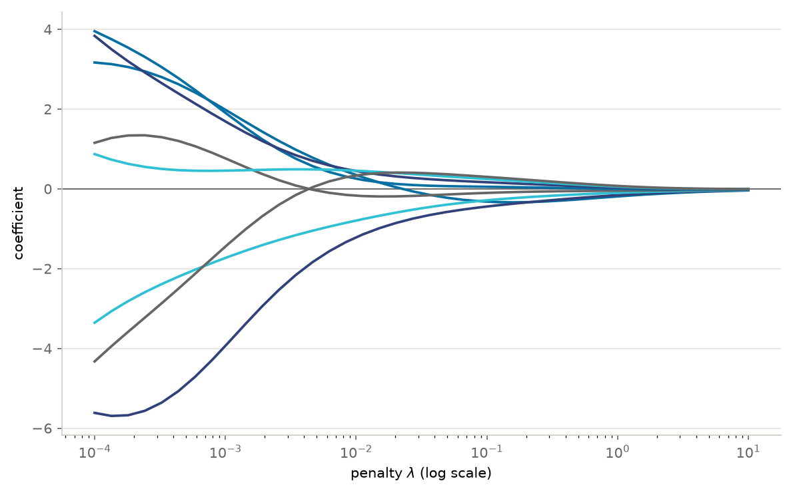

::: {.lm-hero}
[Chapter 7 · Regularization]{.eyebrow}

# Ridge and LASSO

[A single penalty term trades a little bias for a large drop in variance; the shape of that penalty decides whether coefficients merely shrink or vanish outright.]{.dek}
:::

A model with enough parameters can pass through every training point and still predict
badly, because it has fit the noise along with the signal. [Regularization]{.term} adds a
penalty on the size of the coefficients to the training loss, so the fit has to pay for
complexity it cannot justify. The penalty buys a small increase in bias in exchange for a
large reduction in variance.

::: {.defbox}
[Regularized Cost]{.lbl}
[ J(&theta;) = Loss(data, &theta;) + &lambda; &middot; Penalty(&theta;) ]{.math}
:::

The knob $\lambda$ sets the strength. Two penalties dominate practice and differ in one
respect that changes everything. [Ridge]{.term} squares the coefficients, $\sum_j \theta_j^2$,
and has a closed form. [LASSO]{.term} takes their absolute values, $\sum_j |\theta_j|$, has
no closed form, and can set coefficients to *exactly* zero. This page builds both from the
linear algebra up, watches their coefficient paths diverge, and shows the geometry that
explains why only one of them selects features.

## The overfitting it cures

Fifteen noisy points come from $y = \sin(2\pi x)$. A degree-9 polynomial has enough freedom
to chase every wiggle, and ordinary least squares takes the bait: its coefficients blow up to
hundreds of thousands. Ridge solves the same normal equation with $m\lambda I$ added to the
cross-product, leaving the intercept unpenalized. That one term tames the fit.

::: {.defbox}
[Ridge Estimate]{.lbl}
[ &theta;&#770;<sub>ridge</sub> = (X<sup>&#8868;</sup>X + m&lambda;I)<sup>&#8722;1</sup> X<sup>&#8868;</sup>y ]{.math}
:::

```{=html}
<figure class="lm-figure">

<figcaption><strong>Ridge shrinkage paths.</strong> As the penalty strength &lambda; grows, the coefficients are drawn smoothly toward zero without ever quite reaching it, though with correlated features a few swell or change sign before the penalty reins them in. This is the result the code below reproduces.</figcaption>
</figure>
```

::: {.panel-tabset group="lang"}

## Python
```{pyodide}
import numpy as np
import matplotlib.pyplot as plt

# Fifteen fixed points from y = sin(2*pi*x) + noise
x = np.array([0.3745, 0.9507, 0.732, 0.5987, 0.156, 0.156, 0.0581, 0.8662,
              0.6011, 0.7081, 0.0206, 0.9699, 0.8324, 0.2123, 0.1818])
y = np.array([0.5377, -0.582, -1.7774, -0.2958, 1.0756, 0.3734, 0.2285, -0.9679,
              -0.8044, -1.6074, -0.0599, -0.0086, -0.101, 1.0904, 0.9463])

def poly(x, d):                       # design matrix [1, x, x^2, ..., x^d]
    return np.column_stack([x**k for k in range(d + 1)])

def ridge(X, y, lam):
    m, n = X.shape
    P = lam * m * np.eye(n); P[0, 0] = 0.0  # do not penalize the intercept
    return np.linalg.solve(X.T @ X + P, X.T @ y)

degree = 9
X = poly(x, degree)
theta_ols   = ridge(X, y, 0.0)             # lambda = 0 is plain OLS
theta_ridge = ridge(X, y, 1e-2)
print(f"max|theta|  OLS  : {np.abs(theta_ols).max():12.1f}")
print(f"max|theta|  ridge: {np.abs(theta_ridge).max():12.1f}")

grid = np.linspace(0, 1, 200)
G = poly(grid, degree)
fig, ax = plt.subplots(figsize=(7, 4.5))
ax.scatter(x, y, s=70, color="#076FA1", edgecolor="white", zorder=5, label="training data")
ax.plot(grid, np.sin(2*np.pi*grid), color="#666666", lw=2, ls="--", label="true function")
ax.plot(grid, G @ theta_ols,   color="#2FC1D3", lw=2.2, label="degree-9 OLS (overfit)")
ax.plot(grid, G @ theta_ridge, color="#31417A", lw=2.2, label="ridge (lambda=0.01)")
ax.set_ylim(-2, 2); ax.set_xlabel("x"); ax.set_ylabel("y"); ax.legend(fontsize=8)
for s in ["top", "right"]: ax.spines[s].set_visible(False)
ax.grid(axis="y", color="#e6e3da", lw=0.8); ax.set_axisbelow(True)
plt.tight_layout(); plt.show()
```

## R
```{webr}
# Fifteen fixed points from y = sin(2*pi*x) + noise
x <- c(0.3745, 0.9507, 0.732, 0.5987, 0.156, 0.156, 0.0581, 0.8662,
       0.6011, 0.7081, 0.0206, 0.9699, 0.8324, 0.2123, 0.1818)
y <- c(0.5377, -0.582, -1.7774, -0.2958, 1.0756, 0.3734, 0.2285, -0.9679,
       -0.8044, -1.6074, -0.0599, -0.0086, -0.101, 1.0904, 0.9463)

poly_features <- function(x, d) outer(x, 0:d, `^`)   # [1, x, x^2, ..., x^d]

ridge_fit <- function(X, y, lambda) {
  n <- ncol(X); m <- nrow(X)
  P <- lambda * m * diag(n); P[1, 1] <- 0            # do not penalize the intercept
  solve(t(X) %*% X + P, t(X) %*% y)
}

degree <- 9
X <- poly_features(x, degree)
theta_ols   <- ridge_fit(X, y, 0)                    # lambda = 0 is plain OLS
theta_ridge <- ridge_fit(X, y, 1e-2)
cat(sprintf("max|theta|  OLS  : %12.1f\n", max(abs(theta_ols))))
cat(sprintf("max|theta|  ridge: %12.1f\n", max(abs(theta_ridge))))

grid <- seq(0, 1, length.out = 200)
G <- poly_features(grid, degree)
plot(x, y, pch = 19, col = "#076FA1", cex = 1.4, ylim = c(-2, 2), xlab = "x", ylab = "y", bty = "l")
grid(col = "#e6e3da", lty = 1, lwd = 0.6)
lines(grid, sin(2*pi*grid),       col = "#666666", lwd = 2, lty = 2)
lines(grid, G %*% theta_ols,      col = "#2FC1D3", lwd = 2.2)
lines(grid, G %*% theta_ridge,    col = "#31417A", lwd = 2.2)
legend("topright", c("training data", "true function", "degree-9 OLS", "ridge (0.01)"),
       col = c("#076FA1", "#666666", "#2FC1D3", "#31417A"),
       pch = c(19, NA, NA, NA), lty = c(NA, 2, 1, 1), lwd = 2, bty = "n", cex = 0.8)
```

:::

Ridge cuts the largest coefficient from roughly $3 \times 10^5$ down to about $1.4$. The two
languages agree to that figure, but their OLS maxima differ in the fifth significant digit
(about 318026 versus 318018). That gap is not a bug; it is the symptom. The unpenalized
cross-product is so close to singular that two linear solvers round it differently. Adding
$m\lambda I$ removes the pathology, and both report the same $1.4$.

## What adding $m\lambda I$ does

The ridge estimate changes one thing about least squares: before inverting
$\mathbf{X}^\top\mathbf{X}$, it adds $m\lambda$ to each diagonal entry. The figure below follows
that change through the book's example of floor area against number of rooms (Section 7.2),
with twelve houses at about 25 square meters per room. On standardized features,
$\mathbf{X}^\top\mathbf{X}$ stretches the direction in which both coefficients rise together far
more than the direction that trades one against the other. Equation 7.2 of the book writes the
ridge solution in exactly these two directions, with the stretches as $d_j^2$.

```{=html}
<div class="lm-ix" id="ix-ridge" role="figure" aria-label="Interactive figure: ridge regression traced through the matrix it inverts">
<div class="ix-eyebrow">Interactive</div>
<div class="ix-title">Ridge, one matrix at a time</div>
<div class="ix-views even">
  <div class="ix-card">
    <div class="ix-ttl">The matrix</div>
    <p class="ix-sub">How far <span class="sym">X</span><sup>⊤</sup><span class="sym">X</span> + <span class="sym">m</span>λ<span class="sym">I</span> stretches each direction. The shape is to scale; the size is fixed.</p>
    <svg class="ix-fwd" viewBox="0 0 400 300"></svg>
    <div class="ix-matrix m-fwd"></div>
  </div>
  <div class="ix-card">
    <div class="ix-ttl">Its inverse</div>
    <p class="ix-sub">Inverting divides by the same stretches, so the long and short axes swap.</p>
    <svg class="ix-inv" viewBox="0 0 400 300"></svg>
    <div class="ix-matrix m-inv"></div>
  </div>
</div>
<div class="ix-views one" style="margin-top:12px">
  <div class="ix-card">
    <div class="ix-ttl">The coefficients</div>
    <p class="ix-sub">Training error over the two standardized coefficients, the ridge solution, and its path as λ grows. The dashed circle is the penalty's level set through the solution; the solid curve is the error contour that touches it there.</p>
    <svg class="ix-coef" viewBox="0 0 560 362"></svg>
  </div>
</div>
<div class="lm-slider"><label>Penalty <span class="sym">λ</span></label><input class="ix-l" type="range" min="-4" max="1" step="0.01" value="-4"><output class="ix-lv"></output></div>
<div class="ix-buttons"></div>
<div class="ix-readout">
  <div class="ix-stat t-ml"><div class="k"><span class="sym">m</span>λ, against the smallest stretch 0.148</div><div class="v"></div></div>
  <div class="ix-stat t-k"><div class="k">Condition number of the matrix</div><div class="v"></div></div>
  <div class="ix-stat t-c"><div class="k">Price per m² · per room (thousand €)</div><div class="v"></div></div>
  <div class="ix-stat t-f"><div class="k">Kept along both up · area against rooms</div><div class="v"></div></div>
</div>
<div class="ix-note"></div>
<script src="../assets/lm-ix.js"></script>
<script>
(function () {
  const root = document.getElementById('ix-ridge'), L = window.LMIX, $ = s => root.querySelector(s);
  // Twelve houses at about 25 m² per room, generated at 4 thousand € per m² and nothing per room
  // (tools/ch07_ridge_houses.py, seed 1971). The book's Section 7.2 example, given numbers.
  const AREA  = [117, 81, 144, 117, 146, 74, 155, 99, 148, 75, 86, 148];
  const ROOMS = [5, 3, 6, 5, 6, 3, 6, 4, 6, 3, 3, 6];
  const PRICE = [459, 339, 565, 388, 579, 309, 647, 390, 590, 304, 358, 627];
  const m = AREA.length, mean = a => a.reduce((s, v) => s + v, 0) / a.length;
  const sd = a => { const u = mean(a); return Math.sqrt(mean(a.map(v => (v - u) ** 2))); };
  const SA = sd(AREA), SR = sd(ROOMS);
  const Z1 = AREA.map(v => (v - mean(AREA)) / SA), Z2 = ROOMS.map(v => (v - mean(ROOMS)) / SR);
  const YC = PRICE.map(v => v - mean(PRICE));
  const dot = (a, b) => a.reduce((s, v, i) => s + v * b[i], 0);
  const G = [[dot(Z1, Z1), dot(Z1, Z2)], [dot(Z1, Z2), dot(Z2, Z2)]];   // X^T X, standardized
  const XTY = [dot(Z1, YC), dot(Z2, YC)];
  // eigen-decomposition of the symmetric 2x2: stretches s1 >= s2 along unit directions v1, v2
  const tr = G[0][0] + G[1][1], det = G[0][0] * G[1][1] - G[0][1] ** 2, rad = Math.sqrt(tr * tr / 4 - det);
  const S1 = tr / 2 + rad, S2 = tr / 2 - rad;
  const unit = v => { const n = Math.hypot(v[0], v[1]); return [v[0] / n, v[1] / n]; };
  const V1 = unit([G[0][1], S1 - G[0][0]]);                  // both coefficients up together
  let V2 = unit([-V1[1], V1[0]]); if (V2[0] < 0) V2 = [-V2[0], -V2[1]];   // area up, rooms down
  function solve(lam) {                                      // (X^T X + m lam I)^{-1} X^T y
    const a = G[0][0] + m * lam, b = G[0][1], c = G[1][1] + m * lam, d = a * c - b * b;
    return [(c * XTY[0] - b * XTY[1]) / d, (a * XTY[1] - b * XTY[0]) / d];
  }
  const mse = t => mean(YC.map((y, i) => (y - t[0] * Z1[i] - t[1] * Z2[i]) ** 2));
  const OLS = solve(0), MSE0 = mse(OLS);
  let lam = 0;

  function ellipse(svg, C, along1, along2, lab1, lab2) {     // semi-axes along v1 and v2
    svg.innerHTML = '';
    const cx = 200, cy = 150, R = 118, big = Math.max(along1, along2);
    const r1 = Math.max(R * along1 / big, 1.4), r2 = Math.max(R * along2 / big, 1.4);
    const ang = Math.atan2(V1[1], V1[0]) * 180 / Math.PI;
    const tip = (v, r) => [cx + v[0] * r, cy - v[1] * r];
    [[V1, lab1], [V2, lab2]].forEach(([v, lab]) => {
      const p = tip(v, -R - 8), q = tip(v, R + 8);
      L.el('line', { x1: p[0], y1: p[1], x2: q[0], y2: q[1], stroke: C.axis, 'stroke-width': 1, 'stroke-dasharray': '3 4' }, svg);
      const t = tip(v, R + 14);
      L.el('text', { x: t[0], y: t[1], 'text-anchor': v[0] >= 0 ? 'start' : 'end', 'font-size': 18, fill: C.muted }, svg).textContent = lab;
    });
    L.el('ellipse', { cx, cy, rx: r1, ry: r2, transform: `rotate(${-ang} ${cx} ${cy})`, fill: C.plane, stroke: C.fs, 'stroke-width': 2 }, svg);
  }
  const f3 = v => v >= 100 ? v.toFixed(0) : v >= 10 ? v.toFixed(1) : v >= 1 ? v.toFixed(2) : v.toFixed(3);
  function matrix(el, lhs, M, addDiag) {
    const cell = (v, add) => add ? `<td>${f3(v - add)} <span class="add">+ ${f3(add)}</span></td>` : `<td>${L.fmt(v, Math.abs(v) < 1 ? 3 : 2)}</td>`;
    el.innerHTML = `<span class="lhs">${lhs}</span><table><tr>${cell(M[0][0], addDiag)}${cell(M[0][1])}</tr><tr>${cell(M[1][0])}${cell(M[1][1], addDiag)}</tr></table>`;
  }

  const P = { x0: 56, x1: 548, y0: 12, y1: 310, X: [-45, 292], Y: [-124, 80] };   // 1.46 px per unit on both axes   // equal units on both axes
  const px = v => P.x0 + (v - P.X[0]) / (P.X[1] - P.X[0]) * (P.x1 - P.x0);
  const py = v => P.y1 - (v - P.Y[0]) / (P.Y[1] - P.Y[0]) * (P.y1 - P.y0);
  const PATH = [OLS].concat(Array.from({ length: 140 }, (_, i) => solve(10 ** (-4 + i * 6.5 / 139))));
  const TRUTH = [4 * SA, 0];                                   // 4 per m², 0 per room, standardized
  function coef(C, t) {
    const svg = $('.ix-coef'); svg.innerHTML = '';
    L.el('rect', { x: P.x0, y: P.y0, width: P.x1 - P.x0, height: P.y1 - P.y0 }, L.el('clipPath', { id: 'ixr-clip' }, svg));
    const g = L.el('g', { 'clip-path': 'url(#ixr-clip)' }, svg);
    [0, 50, 100, 150, 200, 250].forEach(v => L.el('line', { x1: px(v), x2: px(v), y1: P.y0, y2: P.y1, stroke: C.grid }, g));
    [-100, -50, 0, 50].forEach(v => L.el('line', { x1: P.x0, x2: P.x1, y1: py(v), y2: py(v), stroke: C.grid }, g));
    L.contours((a, b) => mse([a, b]), P.X, P.Y, [30, 120, 400, 1200, 3000, 6000, 10000].map(d => MSE0 + d), 120)
      .forEach((cl, k) => cl.segs.forEach(s => L.el('line', { x1: px(s[0]), y1: py(s[1]), x2: px(s[2]), y2: py(s[3]), stroke: k < 2 ? C.cyan : C.axis, 'stroke-width': k < 2 ? 1.5 : 1 }, g)));
    [[V1, 'both up'], [V2, 'area against rooms']].forEach(([v, lab]) => {
      L.arrow(g, [px(0), py(0)], [px(42 * v[0]), py(42 * v[1])], C.muted, 1.6);
      L.el('text', { x: px(42 * v[0]) + (v[1] > 0 ? -8 : 6), y: py(42 * v[1]) + (v[1] < 0 ? 16 : -2), 'text-anchor': v[1] > 0 ? 'end' : 'start', 'font-size': 14, fill: C.muted }, g).textContent = lab;
    });
    L.el('polyline', { points: PATH.map(p => px(p[0]) + ',' + py(p[1])).join(' '), fill: 'none', stroke: C.fs, 'stroke-width': 1.4, 'stroke-dasharray': '5 4', opacity: 0.7 }, g);
    if (lam > 0) L.contours((a, b) => mse([a, b]), P.X, P.Y, [mse(t)], 160)   // the error contour through the solution
      .forEach(cl => cl.segs.forEach(sg => L.el('line', { x1: px(sg[0]), y1: py(sg[1]), x2: px(sg[2]), y2: py(sg[3]), stroke: C.fs, 'stroke-width': 1.6 }, g)));
    const r = Math.hypot(t[0], t[1]);
    if (lam > 0) L.el('circle', { cx: px(0), cy: py(0), r: r * (P.x1 - P.x0) / (P.X[1] - P.X[0]), fill: 'none', stroke: C.orange, 'stroke-width': 1.4, 'stroke-dasharray': '6 5' }, g);
    L.el('line', { x1: px(TRUTH[0]) - 6, x2: px(TRUTH[0]) + 6, y1: py(0) - 6, y2: py(0) + 6, stroke: C.muted, 'stroke-width': 2 }, g);
    L.el('line', { x1: px(TRUTH[0]) - 6, x2: px(TRUTH[0]) + 6, y1: py(0) + 6, y2: py(0) - 6, stroke: C.muted, 'stroke-width': 2 }, g);
    L.el('text', { x: px(TRUTH[0]) + 9, y: py(0) - 9, 'font-size': 14, fill: C.muted }, g).textContent = 'generating values';
    L.el('circle', { cx: px(OLS[0]), cy: py(OLS[1]), r: 6, fill: '#fff', stroke: C.fs, 'stroke-width': 2.2 }, g);
    L.el('text', { x: px(OLS[0]) - 10, y: py(OLS[1]) + 5, 'text-anchor': 'end', 'font-size': 14, fill: C.fs }, g).textContent = 'least squares';
    L.el('circle', { cx: px(t[0]), cy: py(t[1]), r: 6.5, fill: C.fs, stroke: '#fff', 'stroke-width': 1.5 }, g);
    if (lam > 0) L.el('text', { x: px(t[0]) + 10, y: py(t[1]) - 9, 'font-size': 15, fill: C.fs }, g).textContent = 'ridge';
    L.el('line', { x1: P.x0, x2: P.x1, y1: P.y1, y2: P.y1, stroke: C.axis }, svg);
    L.el('line', { x1: P.x0, x2: P.x0, y1: P.y0, y2: P.y1, stroke: C.axis }, svg);
    [0, 50, 100, 150, 200, 250].forEach(v => L.el('text', { x: px(v), y: P.y1 + 19, 'text-anchor': 'middle', 'font-size': 15, fill: C.muted }, svg).textContent = v);
    [-100, -50, 0, 50].forEach(v => L.el('text', { x: P.x0 - 7, y: py(v) + 5, 'text-anchor': 'end', 'font-size': 15, fill: C.muted }, svg).textContent = v);
    L.el('text', { x: (P.x0 + P.x1) / 2, y: 356, 'text-anchor': 'middle', 'font-size': 15, fill: C.muted }, svg).textContent = 'area coefficient (standardized)';
    L.el('text', { x: 13, y: (P.y0 + P.y1) / 2, transform: `rotate(-90 13 ${(P.y0 + P.y1) / 2})`, 'text-anchor': 'middle', 'font-size': 15, fill: C.muted }, svg).textContent = 'rooms coefficient (standardized)';
  }

  const pct = v => v === 1 ? '100%' : (100 * v >= 99.5 ? '>99' : 100 * v < 1 ? '<1' : (100 * v).toFixed(0)) + '%';
  function note(t, k1, k2) {
    const ml = m * lam, per = [t[0] / SA, t[1] / SR];
    if (lam === 0) return 'Least squares. The matrix stretches “both up” ' + L.fmt(S1 / S2, 0) + ' times as far as “area against rooms”, so its inverse multiplies the area-against-rooms direction by ' + L.fmt(1 / S2, 1) + '. That is where the two large coefficients of opposite sign come from: ' + L.fmt(per[0]) + ' per m² and ' + L.fmt(per[1], 1) + ' per room, for houses generated at 4 per m² and nothing per room.';
    if (ml < 0.5 * S2) return 'mλ = ' + f3(ml) + ' is still small next to the smallest stretch, 0.148, so the inverse barely changes: ridge keeps ' + pct(k2) + ' of the area-against-rooms component.';
    if (ml <= 2 * S2) return 'mλ = ' + f3(ml) + ' is about the size of the smallest stretch. Adding it to 0.148 cuts what the inverse does along area against rooms to ' + pct(k2) + ', while “both up” keeps ' + pct(k1) + '. At mλ = 0.148 exactly, the factor is one half.';
    if (ml < 0.25 * S1) return 'mλ = ' + f3(ml) + ' swamps the smallest stretch and barely touches the largest. Ridge keeps ' + pct(k2) + ' of the move the data barely see and ' + pct(k1) + ' of the move they pin down.' + (per[1] > 0 ? ' The price per room is now positive: pulling one direction toward zero moved a single coefficient away from it.' : '');
    return 'mλ = ' + f3(ml) + ' is now large against both stretches, so both directions shrink and the whole coefficient vector heads toward zero.';
  }

  function update() {
    const C = L.colors(root), ml = m * lam, t = solve(lam);
    const F = [[G[0][0] + ml, G[0][1]], [G[1][0], G[1][1] + ml]], d = F[0][0] * F[1][1] - F[0][1] ** 2;
    const Finv = [[F[1][1] / d, -F[0][1] / d], [-F[1][0] / d, F[0][0] / d]];
    const s1 = S1 + ml, s2 = S2 + ml;
    ellipse($('.ix-fwd'), C, s1, s2, '×' + f3(s1), '×' + f3(s2));
    ellipse($('.ix-inv'), C, 1 / s1, 1 / s2, '×' + f3(1 / s1), '×' + f3(1 / s2));
    matrix($('.m-fwd'), 'X<sup>⊤</sup>X + mλI =', F, ml > 0 ? ml : 0);
    matrix($('.m-inv'), 'inverse =', Finv, 0);
    coef(C, t);
    const k1 = S1 / s1, k2 = S2 / s2;
    L.stat($('.t-ml'), ml, ml >= 0.5 * S2 && ml <= 2 * S2, f3);
    L.stat($('.t-k'), s1 / s2, false, v => L.fmt(v, 1));
    L.stat($('.t-c'), 0, false, () => L.fmt(t[0] / SA) + ' · ' + L.fmt(t[1] / SR, 1));
    L.stat($('.t-f'), 0, false, () => pct(k1) + ' · ' + pct(k2));
    $('.ix-note').textContent = note(t, k1, k2);
  }

  const showLam = v => v <= -3.995 ? '0' : (10 ** v) >= 1 ? (10 ** v).toFixed(1) : (10 ** v).toPrecision(2);
  const sl = L.slider($('.ix-l'), $('.ix-lv'), showLam, v => { lam = v <= -3.995 ? 0 : 10 ** v; update(); });
  L.presets($('.ix-buttons'), [
    { label: 'Least squares (λ = 0)', action: () => sl.set(-4) },
    { label: 'mλ = smallest stretch', action: () => sl.set(Math.log10(S2 / m)) },
    { label: 'λ = 0.1', action: () => sl.set(-1) },
    { label: 'λ = 1', action: () => sl.set(0) },
  ]);
  sl.refresh();
})();
</script>
</div>
```


## Two penalties, two paths

A [coefficient path]{.term} plots each coefficient as $\lambda$ sweeps from small to large.
Ridge has its closed form; LASSO needs an iterative solver. The standard one is
[coordinate descent]{.term}: cycle through the coefficients, and update each to minimize the
cost with the others held fixed. For the L1 penalty that one-dimensional minimum has a tidy
form, [soft-thresholding]{.term}, which shrinks a coefficient toward zero and clips it to
exactly zero once the penalty outweighs its correlation with the residual.

::: {.defbox}
[Soft-Thresholding (one LASSO coordinate)]{.lbl}
[ &theta;<sub>j</sub> = sign(&rho;<sub>j</sub>) &middot; max(|&rho;<sub>j</sub>| &minus; m&lambda;/2, 0) / &Sigma;<sub>i</sub> x<sub>ij</sub>&sup2; ]{.math}
:::

Here $\rho_j$ is the dot product of feature $j$ with the residual formed by leaving feature
$j$ out. We standardize the polynomial features first, so a single $\lambda$ penalizes every
coefficient on equal footing. The two panels tell the whole story: ridge coefficients glide
toward zero but never arrive, while LASSO coefficients hit zero one after another. At
$\lambda = 0.05$ ridge keeps all eight features and LASSO keeps two. (`glmnet` in R and
`Lasso` in scikit-learn are the production solvers; the dozen lines below are the idea they
optimize.)

::: {.panel-tabset group="lang"}

## Python
```{pyodide}
import numpy as np
import matplotlib.pyplot as plt

x = np.array([0.3745, 0.9507, 0.732, 0.5987, 0.156, 0.156, 0.0581, 0.8662,
              0.6011, 0.7081, 0.0206, 0.9699, 0.8324, 0.2123, 0.1818])
y = np.array([0.5377, -0.582, -1.7774, -0.2958, 1.0756, 0.3734, 0.2285, -0.9679,
              -0.8044, -1.6074, -0.0599, -0.0086, -0.101, 1.0904, 0.9463])

def poly(x, d):
    return np.column_stack([x**k for k in range(d + 1)])

def ridge(X, y, lam):
    m, n = X.shape; P = lam * m * np.eye(n); P[0, 0] = 0.0
    return np.linalg.solve(X.T @ X + P, X.T @ y)

def lasso(X, y, lam, iters=5000, tol=1e-7):
    m, n = X.shape
    theta = np.zeros(n)
    col_sq = (X**2).sum(axis=0)
    for _ in range(iters):
        old = theta.copy()
        for j in range(n):
            r = y - X @ theta + X[:, j] * theta[j]   # residual without feature j
            rho = X[:, j] @ r
            if j == 0:                                # intercept: no penalty
                theta[j] = rho / col_sq[j]
            else:                                     # soft-threshold
                theta[j] = np.sign(rho) * max(abs(rho) - lam * m / 2, 0.0) / col_sq[j]
        if np.abs(theta - old).max() < tol:
            break
    return theta

# Standardize the polynomial columns (not the intercept) so lambda is comparable
degree = 8
X = poly(x, degree)
mu = X[:, 1:].mean(axis=0); sd = X[:, 1:].std(axis=0)
Xs = X.copy(); Xs[:, 1:] = (X[:, 1:] - mu) / sd

lams = np.logspace(-4, 1, 40)
ridge_path = np.array([ridge(Xs, y, l)[1:] for l in lams])
lasso_path = np.array([lasso(Xs, y, l)[1:] for l in lams])

lam0 = 0.05
nz_r = int(np.sum(np.abs(ridge(Xs, y, lam0)[1:]) > 1e-6))
nz_l = int(np.sum(np.abs(lasso(Xs, y, lam0)[1:]) > 1e-6))
print(f"at lambda={lam0}: ridge keeps {nz_r}/{degree} coefs, LASSO keeps {nz_l}/{degree}")

# Cycle the book-blue family so each coefficient keeps one color across panels
path_colors = ["#076FA1", "#31417A", "#2FC1D3", "#666666"]   # BLUE, FS_BLUE, CYAN, GRAY
fig, axes = plt.subplots(1, 2, figsize=(11, 4.2), sharey=True)
for j in range(ridge_path.shape[1]):
    c = path_colors[j % len(path_colors)]
    axes[0].plot(lams, ridge_path[:, j], lw=1.6, color=c)
    axes[1].plot(lams, lasso_path[:, j], lw=1.6, color=c)
for ax, t in zip(axes, ["Ridge: shrink, never zero", "LASSO: snap to zero"]):
    ax.set_xscale("log"); ax.axhline(0, color="#666666", ls="--", lw=1)
    ax.set_xlabel("lambda"); ax.set_title(t, loc="left")
    for s in ["top", "right"]: ax.spines[s].set_visible(False)
    ax.grid(axis="y", color="#e6e3da", lw=0.8); ax.set_axisbelow(True)
axes[0].set_ylabel("coefficient")
plt.tight_layout(); plt.show()
```

## R
```{webr}
x <- c(0.3745, 0.9507, 0.732, 0.5987, 0.156, 0.156, 0.0581, 0.8662,
       0.6011, 0.7081, 0.0206, 0.9699, 0.8324, 0.2123, 0.1818)
y <- c(0.5377, -0.582, -1.7774, -0.2958, 1.0756, 0.3734, 0.2285, -0.9679,
       -0.8044, -1.6074, -0.0599, -0.0086, -0.101, 1.0904, 0.9463)

poly_features <- function(x, d) outer(x, 0:d, `^`)

ridge_fit <- function(X, y, lambda) {
  n <- ncol(X); m <- nrow(X); P <- lambda * m * diag(n); P[1, 1] <- 0
  solve(t(X) %*% X + P, t(X) %*% y)
}

lasso_fit <- function(X, y, lambda, iters = 5000, tol = 1e-7) {
  m <- nrow(X); n <- ncol(X)
  theta <- rep(0, n); col_sq <- colSums(X^2)
  for (it in seq_len(iters)) {
    old <- theta
    for (j in seq_len(n)) {
      r   <- y - X %*% theta + X[, j] * theta[j]    # residual without feature j
      rho <- sum(X[, j] * r)
      if (j == 1) {                                 # intercept: no penalty
        theta[j] <- rho / col_sq[j]
      } else {                                      # soft-threshold
        theta[j] <- sign(rho) * max(abs(rho) - lambda * m / 2, 0) / col_sq[j]
      }
    }
    if (max(abs(theta - old)) < tol) break
  }
  theta
}

# Standardize the polynomial columns (not the intercept) so lambda is comparable
degree <- 8
X <- poly_features(x, degree)
sds <- apply(X[, -1], 2, function(c) sqrt(mean((c - mean(c))^2)))   # population sd
Xs <- X; Xs[, -1] <- scale(X[, -1], center = colMeans(X[, -1]), scale = sds)

lams <- 10^seq(-4, 1, length.out = 40)
ridge_path <- t(sapply(lams, function(l) ridge_fit(Xs, y, l)[-1]))
lasso_path <- t(sapply(lams, function(l) lasso_fit(Xs, y, l)[-1]))

lam0 <- 0.05
nz_r <- sum(abs(ridge_fit(Xs, y, lam0)[-1]) > 1e-6)
nz_l <- sum(abs(lasso_fit(Xs, y, lam0)[-1]) > 1e-6)
cat(sprintf("at lambda=%.2f: ridge keeps %d/%d coefs, LASSO keeps %d/%d\n",
            lam0, nz_r, degree, nz_l, degree))

# Cycle the book-blue family so each coefficient keeps one color across panels
path_colors <- c("#076FA1", "#31417A", "#2FC1D3", "#666666")   # BLUE, FS_BLUE, CYAN, GRAY
par(mfrow = c(1, 2))
matplot(lams, ridge_path, type = "l", lty = 1, lwd = 1.6, col = path_colors, log = "x", bty = "l",
        xlab = "lambda", ylab = "coefficient", main = "Ridge: shrink, never zero")
grid(col = "#e6e3da", lty = 1, lwd = 0.6)
abline(h = 0, col = "#666666", lty = 2)
matplot(lams, lasso_path, type = "l", lty = 1, lwd = 1.6, col = path_colors, log = "x", bty = "l",
        xlab = "lambda", ylab = "coefficient", main = "LASSO: snap to zero")
grid(col = "#e6e3da", lty = 1, lwd = 0.6)
abline(h = 0, col = "#666666", lty = 2)
par(mfrow = c(1, 1))
```

:::

Both cells run the same fixed data through the same two algorithms, so the paths and the
nonzero counts agree exactly: ridge $8/8$, LASSO $2/8$ at $\lambda = 0.05$.

## Why only LASSO selects

The contrast is geometric. Minimizing the loss subject to a budget on the coefficients is the
same as the penalized form, and the budget draws a constraint region. The squared loss has
elliptical contours; the solution sits where the smallest ellipse that still reaches the
region touches its boundary. Ridge's region is a circle, smooth everywhere, so the contact
point lands almost anywhere. LASSO's region is a diamond, and its corners sit on the axes. An
ellipse sliding in from outside tends to strike a corner first, and a corner means one
coefficient is exactly zero. That is feature selection falling out of the shape of the
penalty.

::: {.panel-tabset group="lang"}

## Python
```{pyodide}
import numpy as np
import matplotlib.pyplot as plt
from matplotlib.patches import Circle, Polygon

g = np.linspace(-3, 3, 200)
T1, T2 = np.meshgrid(g, g)
ols = np.array([1.5, 2.0])                       # unconstrained optimum
loss = (T1 - ols[0])**2 + 0.35 * (T2 - ols[1])**2

fig, axes = plt.subplots(1, 2, figsize=(10, 5), sharex=True, sharey=True)
for ax in axes:
    ax.contour(T1, T2, loss, levels=12, colors="#666666", alpha=0.6, linewidths=0.8)
    ax.axhline(0, color="#666666", lw=0.8); ax.axvline(0, color="#666666", lw=0.8)
    ax.scatter(*ols, color="#31417A", marker="*", s=180, zorder=5,
               edgecolor="white", label="OLS")
    ax.set_aspect("equal"); ax.set_xlim(-3, 3); ax.set_ylim(-3, 3)
    ax.set_xlabel(r"$\theta_1$")
    for s in ["top", "right"]: ax.spines[s].set_visible(False)
axes[0].set_ylabel(r"$\theta_2$")

r = 1.3
axes[0].add_patch(Circle((0, 0), r, fill=False, edgecolor="#076FA1", lw=2.5))
axes[0].scatter(0.78, 1.04, color="#076FA1", s=120, zorder=6, edgecolor="white", label="ridge")
axes[0].set_title("Ridge (L2): circle", loc="left"); axes[0].legend(fontsize=8, loc="lower left")

axes[1].add_patch(Polygon([(r, 0), (0, r), (-r, 0), (0, -r)], fill=False,
                          edgecolor="#2FC1D3", lw=2.5))
axes[1].scatter(0, r, color="#2FC1D3", s=120, zorder=6, edgecolor="white",
                label="LASSO (corner)")
axes[1].set_title("LASSO (L1): diamond", loc="left"); axes[1].legend(fontsize=8, loc="lower left")
plt.tight_layout(); plt.show()
```

## R
```{webr}
g <- seq(-3, 3, length.out = 200)
loss <- outer(g, g, function(a, b) (a - 1.5)^2 + 0.35 * (b - 2.0)^2)

draw_panel <- function(shape, sol, title) {
  contour(g, g, loss, nlevels = 12, col = "#666666", drawlabels = FALSE, asp = 1, bty = "l",
          xlab = expression(theta[1]), ylab = expression(theta[2]), main = title)
  abline(h = 0, v = 0, col = "#666666")
  if (shape == "circle") {
    a <- seq(0, 2*pi, length.out = 200)
    lines(1.3 * cos(a), 1.3 * sin(a), col = "#076FA1", lwd = 2.5)
  } else {
    polygon(c(1.3, 0, -1.3, 0), c(0, 1.3, 0, -1.3), border = "#2FC1D3", lwd = 2.5)
  }
  points(1.5, 2.0, pch = 8,  col = "#31417A", cex = 1.6)   # OLS solution
  points(sol[1], sol[2], pch = 19, col = if (shape == "circle") "#076FA1" else "#2FC1D3", cex = 1.6)
}

par(mfrow = c(1, 2))
draw_panel("circle",  c(0.78, 1.04), "Ridge (L2): circle")
draw_panel("diamond", c(0, 1.3),     "LASSO (L1): diamond")
par(mfrow = c(1, 1))
```

:::

## Scale your features first

The penalty couples to the scale of each feature. A coefficient on a tiny-scale feature has
to be large to matter, and a large coefficient is exactly what the penalty punishes, so an
informative variable measured in small units gets crushed while a coarse-scale variable
slides through. The fix is to standardize every feature to zero mean and unit variance before
fitting. Here the true model leans on a small-scale feature; raw, ridge nearly zeros its
coefficient, and after standardization the two stand on equal terms.

::: {.panel-tabset group="lang"}

## Python
```{pyodide}
import numpy as np

# Two features on wildly different scales; the small one carries the signal
x1 = np.array([0.011, -0.004, 0.009, -0.013, 0.006, -0.008, 0.015, -0.002,
               0.010, -0.011, 0.003, -0.007, 0.012, -0.005, 0.001])
x2 = np.array([820., -540., 410., -930., 360., -610., 1180., -150.,
               770., -880., 240., -470., 990., -330., 80.])
y  = 100*x1 + 0.001*x2 + np.array([0.02, -0.01, 0.015, -0.02, 0.01, -0.012, 0.018,
               -0.003, 0.014, -0.016, 0.005, -0.009, 0.017, -0.006, 0.002])

def ridge(X, y, lam):
    m, n = X.shape; P = lam * m * np.eye(n); P[0, 0] = 0.0
    return np.linalg.solve(X.T @ X + P, X.T @ y)

def standardize(X):
    Z = X.copy()
    Z[:, 1:] = (X[:, 1:] - X[:, 1:].mean(axis=0)) / X[:, 1:].std(axis=0)
    return Z

X = np.column_stack([np.ones(len(x1)), x1, x2])
t_raw = ridge(X, y, 1.0)
t_std = ridge(standardize(X), y, 1.0)
print("                       raw         standardized")
print(f"theta1 (small scale): {t_raw[1]:9.4f}     {t_std[1]:8.4f}")
print(f"theta2 (large scale): {t_raw[2]:9.6f}     {t_std[2]:8.4f}")
```

## R
```{webr}
# Two features on wildly different scales; the small one carries the signal
x1 <- c(0.011, -0.004, 0.009, -0.013, 0.006, -0.008, 0.015, -0.002,
        0.010, -0.011, 0.003, -0.007, 0.012, -0.005, 0.001)
x2 <- c(820, -540, 410, -930, 360, -610, 1180, -150,
        770, -880, 240, -470, 990, -330, 80)
y  <- 100*x1 + 0.001*x2 + c(0.02, -0.01, 0.015, -0.02, 0.01, -0.012, 0.018,
        -0.003, 0.014, -0.016, 0.005, -0.009, 0.017, -0.006, 0.002)

ridge_fit <- function(X, y, lambda) {
  n <- ncol(X); m <- nrow(X); P <- lambda * m * diag(n); P[1, 1] <- 0
  solve(t(X) %*% X + P, t(X) %*% y)
}

X <- cbind(1, x1, x2)
t_raw <- ridge_fit(X, y, 1.0)
Z <- X
Z[, -1] <- scale(X[, -1], center = colMeans(X[, -1]),
                 scale = apply(X[, -1], 2, function(c) sqrt(mean((c - mean(c))^2))))
t_std <- ridge_fit(Z, y, 1.0)
cat("                       raw         standardized\n")
cat(sprintf("theta1 (small scale): %9.4f     %8.4f\n", t_raw[2], t_std[2]))
cat(sprintf("theta2 (large scale): %9.6f     %8.4f\n", t_raw[3], t_std[3]))
```

:::

Raw, ridge crushes the signal-carrying coefficient to about $0.0002$, though its true value
is $100$. Standardized, the two coefficients are comparable, near $0.52$ and $0.51$.

The one knob left is $\lambda$ itself, chosen by cross-validation against held-out error
rather than by eye (see the model-evaluation page). When predictors are correlated, LASSO
picks one of a group somewhat arbitrarily; [Elastic Net]{.term} adds a ridge term to the L1
penalty to keep correlated features together while still zeroing out the rest; `scikit-learn`
fits it with `ElasticNet`.

::: {.explore}
[Try it]{.lbl}
In the path demo, lower the polynomial `degree` to 4 or raise the comparison `lam0`, and
watch the LASSO nonzero count fall while ridge stubbornly keeps every coefficient. Then drop
the standardization step and see the LASSO path turn to noise: without equal scales, a single
$\lambda$ no longer means the same thing across features.
:::
