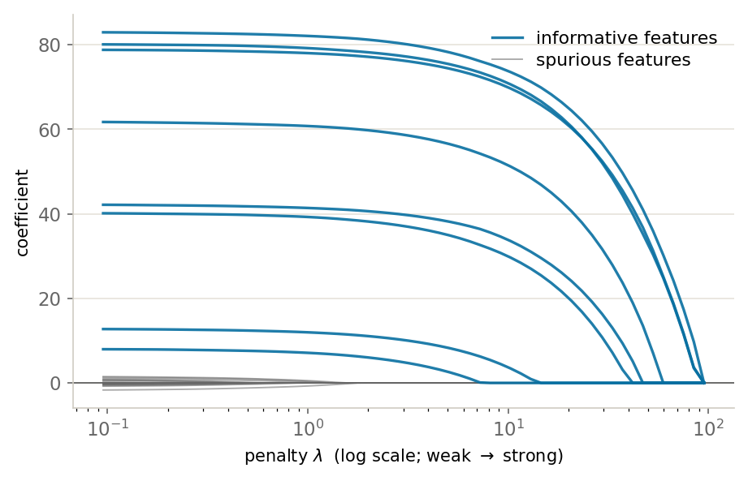

::: {.lm-hero}
[Chapter 7 · Regularization]{.eyebrow}

# Ridge, LASSO, and the Regularization Path

[Two penalties shrink the same coefficients toward zero, but only one of them sets coefficients exactly to zero and so chooses which features to keep.]{.dek}
:::

[Regularization]{.term} adds a penalty on the size of the coefficients to the least-squares
objective. The penalty buys lower variance at the cost of a little bias, and the trade is
controlled by a single knob $\lambda$. Two choices of penalty dominate practice. [Ridge]{.term}
penalizes the squared length $\lVert\boldsymbol{\theta}\rVert_2^2$; [LASSO]{.term} penalizes
the absolute length $\lVert\boldsymbol{\theta}\rVert_1$. The switch from squared to absolute
is small on paper and decisive in effect: ridge shrinks every coefficient smoothly and keeps
them all, while LASSO drives most of them to *exactly* zero and so performs
[feature selection]{.term}.

::: {.defbox}
[The Two Penalties]{.lbl}

[ min<sub>&theta;</sub>&ensp; &#8741;y &minus; X&theta;&#8741;&sup2; + &lambda;&#8201;R(&theta;),&emsp; R<sub>ridge</sub> = &#8741;&theta;&#8741;&#8322;&sup2;,&emsp; R<sub>LASSO</sub> = &#8741;&theta;&#8741;&#8321; ]{.math}
:::

```{=html}
<figure class="lm-figure">

<figcaption><strong>The LASSO path.</strong> As the penalty &lambda; grows, each coefficient is driven to <em>exactly</em> zero one at a time; the eight informative features (blue) survive deepest into the penalty while the spurious ones (gray) hug zero and are the first driven out, which is how the LASSO selects variables. This is the result the code below reproduces.</figcaption>
</figure>
```

We work on a synthetic problem where the truth is sparse, so we can judge each method against
a known answer. Python uses scikit-learn's `make_regression`, `lasso_path`, and `LassoCV`. R
builds the same kind of data by hand and computes the LASSO from first principles, by
[coordinate descent]{.term} with [soft-thresholding]{.term} over a grid of penalties, with
penalty selection by a plain k-fold loop. No `glmnet`, no contributed packages: the mechanism
is on the page.

## The data: a sparse truth

Thirty features, of which only eight carry any signal; the other twenty-two are noise.
Standardizing every column to mean zero and unit scale makes one shared penalty fair to all of
them. Because we generated the data, we know which eight features matter and can check what each
method does with the rest.

::: {.panel-tabset group="lang"}

## Python
```{pyodide}
import numpy as np
from sklearn.datasets import make_regression
from sklearn.preprocessing import StandardScaler

# 30 features, only 8 carry signal; the rest are noise.
X, y, coef_true = make_regression(
    n_samples=200, n_features=30, n_informative=8,
    noise=10.0, coef=True, random_state=0)
X = StandardScaler().fit_transform(X)   # one shared penalty needs a shared scale

print(f"{X.shape[1]} features; {(coef_true != 0).sum()} of them actually matter")
print("informative indices:", np.flatnonzero(coef_true))
```

## R
```{webr}
set.seed(0)
n <- 200; p <- 30; k <- 8                 # 200 rows, 30 features, 8 with signal

X <- scale(matrix(rnorm(n * p), n, p))    # standardize: each column mean 0, sd 1
true_idx <- sort(sample(p, k))            # which features carry signal
theta_true <- numeric(p)
theta_true[true_idx] <- runif(k, 10, 100)  # their coefficients
y <- as.vector(X %*% theta_true) + rnorm(n, 0, 10)
y <- y - mean(y)                          # center the target, so no intercept is needed

cat(p, "features;", sum(theta_true != 0), "of them actually matter\n")
cat("informative indices:", true_idx, "\n")
```

:::

The two languages draw from different random number generators and build the data by different
routines, so the specific informative indices differ. What stays fixed is the structure: thirty
features, eight of them real.

## The regularization path

The [regularization path]{.term} traces every coefficient as the penalty sweeps from weak to
strong. Read it from right to left, weak penalty to strong: ridge pulls all thirty coefficients
toward zero together, smoothly, never quite reaching it. LASSO pulls them in too, but each one
arrives at exactly zero at some finite penalty and stays there. The kinks in the LASSO panel are
features leaving the model.

The kink is the [soft-thresholding operator]{.term}, the engine of the R coordinate descent
below. Coordinate descent cycles through the coefficients, and for each one it computes the
correlation of that feature with the current residual, then shrinks it toward zero by the
penalty. If the correlation is smaller than the penalty, the coefficient snaps to zero. That
hard cutoff is what ridge's smooth squared penalty can never produce.

::: {.defbox}
[Soft-Thresholding Operator]{.lbl}

[ S(z, &gamma;) = sign(z) &middot; max(&#8201;|z| &minus; &gamma;,&ensp;0&#8201;) ]{.math}
:::

Ridge, by contrast, has a closed form: add $\lambda$ to the diagonal of
$\mathbf{X}^\top\mathbf{X}$ and solve once. No coefficient is ever set to zero because the
squared penalty has zero gradient at the origin, so there is no force to pin a coefficient
there.

::: {.panel-tabset group="lang"}

## Python
```{pyodide}
import numpy as np
import matplotlib.pyplot as plt
from matplotlib.lines import Line2D
from sklearn.datasets import make_regression
from sklearn.preprocessing import StandardScaler
from sklearn.linear_model import Ridge, lasso_path

X, y, coef_true = make_regression(n_samples=200, n_features=30, n_informative=8,
                                  noise=10.0, coef=True, random_state=0)
X = StandardScaler().fit_transform(X)
informative = coef_true != 0          # the 8 features we know carry signal

# A grid of penalty strengths, log-spaced from weak to strong.
alphas = np.logspace(-1, 2.5, 40)
ridge_coefs = np.array([Ridge(alpha=a).fit(X, y).coef_ for a in alphas])  # (n_alphas, p)
lasso_alphas, lasso_coefs, _ = lasso_path(X, y, alphas=alphas[::-1])      # coefs: (p, n_alphas)

# Color by truth, matching the hero figure: informative blue, spurious gray.
INFO, SPUR = "#076FA1", "#666666"

fig, (a1, a2) = plt.subplots(1, 2, figsize=(11, 4.2), sharey=True)
for ax in (a1, a2):
    ax.axhline(0, color=SPUR, lw=0.9, zorder=1)   # gray zero line, as in the hero

# ridge: spurious gray behind, informative blue on top
for j in np.flatnonzero(~informative):
    a1.plot(np.log10(alphas), ridge_coefs[:, j], color=SPUR, lw=0.9, alpha=0.55, zorder=2)
for j in np.flatnonzero(informative):
    a1.plot(np.log10(alphas), ridge_coefs[:, j], color=INFO, lw=1.6, alpha=0.9, zorder=3)
a1.set_title("ridge"); a1.set_xlabel(r"$\log_{10}$ penalty"); a1.set_ylabel("coefficient")

# LASSO (the hero panel): informative blue survive deepest, spurious gray hug zero
for j in np.flatnonzero(~informative):
    a2.plot(np.log10(lasso_alphas), lasso_coefs[j], color=SPUR, lw=0.9, alpha=0.55, zorder=2)
for j in np.flatnonzero(informative):
    a2.plot(np.log10(lasso_alphas), lasso_coefs[j], color=INFO, lw=1.6, alpha=0.9, zorder=3)
a2.set_title("LASSO"); a2.set_xlabel(r"$\log_{10}$ penalty")

for ax in (a1, a2):
    for s in ["top", "right"]:
        ax.spines[s].set_visible(False)
    ax.grid(axis="y", color="#e6e3da", lw=0.8); ax.set_axisbelow(True)
a2.legend(handles=[Line2D([0], [0], color=INFO, lw=1.6, label="informative features"),
                   Line2D([0], [0], color=SPUR, lw=0.9, label="spurious features")],
          loc="upper right", frameon=False, fontsize=9)
fig.tight_layout()
plt.show()

# Watch features re-enter as the LASSO penalty shrinks (strong -> weak).
counts = (lasso_coefs != 0).sum(axis=0)
print("LASSO nonzero coefficients as the penalty shrinks:")
for a, c in zip(lasso_alphas[::8], counts[::8]):
    print(f"  penalty {a:7.2f} -> {c:2d} nonzero")
```

## R
```{webr}
set.seed(0)
n <- 200; p <- 30; k <- 8
X <- scale(matrix(rnorm(n * p), n, p))
true_idx <- sort(sample(p, k))
theta_true <- numeric(p); theta_true[true_idx] <- runif(k, 10, 100)
y <- as.vector(X %*% theta_true) + rnorm(n, 0, 10)
y <- y - mean(y)

# LASSO by coordinate descent: cycle the coefficients, soft-thresholding each one
# against the partial residual. The soft threshold is what snaps a weight to 0.
lasso_cd <- function(X, y, lambda, n_iter = 200, tol = 1e-7) {
  n <- nrow(X); p <- ncol(X)
  theta <- numeric(p)
  cj <- colSums(X^2)               # column energies (= n - 1 after scaling)
  r  <- y - X %*% theta             # working residual
  for (it in seq_len(n_iter)) {
    theta_old <- theta
    for (j in seq_len(p)) {
      r <- r + X[, j] * theta[j]    # add feature j back into the residual
      rho <- sum(X[, j] * r)
      theta[j] <- sign(rho) * max(abs(rho) - n * lambda, 0) / cj[j]  # soft-threshold
      r <- r - X[, j] * theta[j]    # take the updated feature back out
    }
    if (max(abs(theta - theta_old)) < tol) break
  }
  theta
}

# Ridge has a closed form: add lambda to the diagonal before solving.
ridge_fit <- function(X, y, lambda)
  solve(crossprod(X) + lambda * diag(ncol(X)), crossprod(X, y))

# lambda_max for LASSO: the smallest penalty that zeroes every coefficient.
lam_max  <- max(abs(crossprod(X, y))) / n
lam_grid <- 10^seq(log10(lam_max), log10(lam_max * 1e-3), length.out = 40)

lasso_path <- t(sapply(lam_grid, function(l) lasso_cd(X, y, l)))   # 40 x p
ridge_grid <- 10^seq(-1, 3.5, length.out = 40) * n
ridge_path <- t(sapply(ridge_grid, function(l) ridge_fit(X, y, l)))

# Color by truth, matching the hero figure: informative blue, spurious gray.
info <- which(theta_true != 0)        # the 8 informative columns
spur <- which(theta_true == 0)        # the 22 spurious columns
INFO <- "#076FA1"; SPUR <- "#666666"

par(mfrow = c(1, 2))

# ridge: spurious gray behind, informative blue on top
matplot(log10(ridge_grid / n), ridge_path, type = "n", bty = "l",
        main = "ridge", xlab = "log10 penalty", ylab = "coefficient")
abline(h = 0, col = SPUR, lwd = 0.9)                       # gray zero line, as in the hero
grid(col = "#e6e3da", lty = 1, lwd = 0.6)
matlines(log10(ridge_grid / n), ridge_path[, spur], lty = 1, lwd = 0.9, col = SPUR)
matlines(log10(ridge_grid / n), ridge_path[, info], lty = 1, lwd = 1.8, col = INFO)

# LASSO (the hero panel): informative blue survive deepest, spurious gray hug zero
matplot(log10(lam_grid), lasso_path, type = "n", bty = "l",
        main = "LASSO", xlab = "log10 penalty", ylab = "coefficient")
abline(h = 0, col = SPUR, lwd = 0.9)
grid(col = "#e6e3da", lty = 1, lwd = 0.6)
matlines(log10(lam_grid), lasso_path[, spur], lty = 1, lwd = 0.9, col = SPUR)
matlines(log10(lam_grid), lasso_path[, info], lty = 1, lwd = 1.8, col = INFO)
legend("topright", legend = c("informative features", "spurious features"),
       col = c(INFO, SPUR), lwd = c(1.8, 0.9), bty = "n", cex = 0.8)

# Features re-enter as the LASSO penalty shrinks (strong -> weak).
counts <- rowSums(lasso_path != 0)
cat("LASSO nonzero coefficients as the penalty shrinks:\n")
for (i in seq(1, 40, by = 8))
  cat(sprintf("  penalty %7.3f -> %2d nonzero\n", lam_grid[i], counts[i]))
```

:::

Both counts climb from zero at the strongest penalty to most of the thirty features at the
weakest. Near the true count of eight, the LASSO path lingers: a band of penalties keeps roughly
the right number of features. The job of cross-validation is to land in that band.

## Choosing the penalty, and counting survivors

Left alone, the penalty is a free parameter. [Cross-validation]{.term} fixes it: split the data
into folds, and for each candidate penalty measure how well a model fit on the other folds
predicts the held-out one. The penalty with the best held-out error wins. At that choice we count
survivors, the features LASSO keeps nonzero, and compare them against the eight that truly matter.

::: {.panel-tabset group="lang"}

## Python
```{pyodide}
import numpy as np
from sklearn.datasets import make_regression
from sklearn.preprocessing import StandardScaler
from sklearn.linear_model import LassoCV

X, y, coef_true = make_regression(n_samples=200, n_features=30, n_informative=8,
                                  noise=10.0, coef=True, random_state=0)
X = StandardScaler().fit_transform(X)
true_idx = set(np.flatnonzero(coef_true).tolist())

# 5-fold cross-validation picks the penalty that predicts best on held-out folds.
lasso = LassoCV(cv=5, random_state=0).fit(X, y)
kept = set(np.flatnonzero(lasso.coef_).tolist())

print(f"LASSO cross-validated penalty: alpha = {lasso.alpha_:.3f}")
print(f"features kept by LASSO: {len(kept)} of {X.shape[1]}")
print(f"features kept by ridge: {X.shape[1]} of {X.shape[1]}  (all shrunk, none exactly zero)")
print(f"true features recovered: {len(kept & true_idx)} of {len(true_idx)}")
print(f"spurious features kept:  {len(kept - true_idx)}")
```

## R
```{webr}
set.seed(0)
n <- 200; p <- 30; k <- 8
X <- scale(matrix(rnorm(n * p), n, p))
true_idx <- sort(sample(p, k))
theta_true <- numeric(p); theta_true[true_idx] <- runif(k, 10, 100)
y <- as.vector(X %*% theta_true) + rnorm(n, 0, 10)
y <- y - mean(y)

lasso_cd <- function(X, y, lambda, n_iter = 200, tol = 1e-7) {
  n <- nrow(X); p <- ncol(X)
  theta <- numeric(p); cj <- colSums(X^2); r <- y - X %*% theta
  for (it in seq_len(n_iter)) {
    theta_old <- theta
    for (j in seq_len(p)) {
      r <- r + X[, j] * theta[j]
      rho <- sum(X[, j] * r)
      theta[j] <- sign(rho) * max(abs(rho) - n * lambda, 0) / cj[j]
      r <- r - X[, j] * theta[j]
    }
    if (max(abs(theta - theta_old)) < tol) break
  }
  theta
}

lam_max  <- max(abs(crossprod(X, y))) / n
lam_grid <- 10^seq(log10(lam_max), log10(lam_max * 1e-3), length.out = 40)

# 5-fold cross-validation: for each penalty, average held-out squared error.
K <- 5
folds <- sample(rep(1:K, length.out = n))
cv_mse <- sapply(lam_grid, function(l) {
  err <- 0
  for (f in 1:K) {
    tr <- folds != f; te <- folds == f
    b <- lasso_cd(X[tr, , drop = FALSE], y[tr], l)
    err <- err + sum((y[te] - X[te, , drop = FALSE] %*% b)^2)
  }
  err / n
})

best_lambda <- lam_grid[which.min(cv_mse)]
theta_hat <- lasso_cd(X, y, best_lambda)        # refit on all data at the chosen penalty
kept <- which(theta_hat != 0)

cat(sprintf("LASSO cross-validated penalty: lambda = %.3f\n", best_lambda))
cat(sprintf("features kept by LASSO: %d of %d\n", length(kept), p))
cat(sprintf("features kept by ridge: %d of %d  (all shrunk, none exactly zero)\n", p, p))
cat(sprintf("true features recovered: %d of %d\n", length(intersect(kept, true_idx)), k))
cat(sprintf("spurious features kept:  %d\n", length(setdiff(kept, true_idx))))
```

:::

The two languages compute on independently generated data with different LASSO solvers
(scikit-learn's optimized path versus our from-scratch coordinate descent), so the chosen penalty
and exact survivor count differ. The lesson is identical in both. At a penalty tuned for
prediction, LASSO recovers all eight true features but over-selects, keeping a handful of spurious
ones alongside them. Ridge keeps all thirty, every coefficient shrunk but none exactly zero.
Prediction-optimal is not selection-optimal: the penalty that predicts best is looser than the
penalty that would isolate exactly the true support. The production tool for the LASSO is
`glmnet` in R and `LassoCV` in Python; the coordinate descent above is what they run underneath.

::: {.explore}
[Try it]{.lbl}
Raise the noise (`noise=10.0` in Python, the `rnorm(n, 0, 10)` standard deviation in R) or shrink
the sample size from 200, and re-run the last cell. LASSO's selected set grows less reliable: it
misses true features or keeps more spurious ones. That is the bias-variance trade of Chapter 7
made concrete, the price of selecting features from noisy data.
:::
