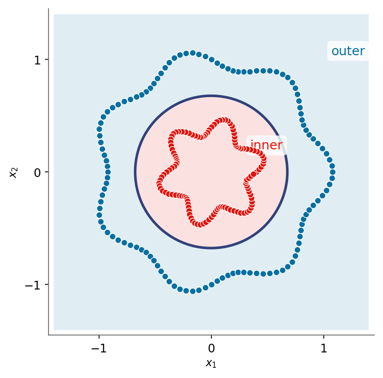

::: {.lm-hero}
[Chapter 8 · Kernel Methods, Trees & Ensembles]{.eyebrow}

# Kernel Methods

[No line can split two interleaved rings, so change coordinates until one can; the kernel trick performs that change of coordinates without ever building them.]{.dek}
:::

Some patterns no straight line can split. Concentric rings, an exclusive-or checkerboard: the classes interleave so thoroughly that every linear boundary lands near chance. The fix is not a cleverer line but a change of coordinates. Lift the data into a space where the same classes pull apart, fit a linear boundary there, and read it back as a curve in the original space. The [kernel trick]{.term} does this lift implicitly, and the payoff of running it in code is seeing a linear method bend around the data without ever writing down the new coordinates.

## The feature-space lift

Take two noisy rings, an inner cluster wrapped by an outer one. No line separates them in the plane. But measure each point's squared distance from the origin, $\phi(x) = x_1^2 + x_2^2$, and the rings collapse onto a single axis: inner points pile up at small radius, outer points at large, and one threshold splits them cleanly. The classifier is still linear. It just lives in the lifted coordinate.

The two languages build the same deterministic rings, so their figures and the threshold accuracy match exactly.

```{=html}
<figure class="lm-figure">

<figcaption><strong>An RBF kernel bends a linear method around the rings.</strong> The nonlinear boundary of an RBF-kernel support vector machine wraps the inner class and excludes the outer one, achieving perfect separation that no straight line could. This is the result the code below reproduces.</figcaption>
</figure>
```

::: {.panel-tabset group="lang"}

## Python
```{pyodide}
import numpy as np
import matplotlib.pyplot as plt

def make_rings(n=120):
    """Two deterministic concentric rings: outer class 0, inner class 1."""
    theta = np.linspace(0, 2*np.pi, n, endpoint=False)
    r_out = 1.00 + 0.08*np.cos(7*theta)
    r_in  = 0.40 + 0.08*np.sin(6*theta)
    X = np.vstack([np.column_stack([r_out*np.cos(theta), r_out*np.sin(theta)]),
                   np.column_stack([r_in *np.cos(theta), r_in *np.sin(theta)])])
    return X, np.r_[np.zeros(n), np.ones(n)].astype(int)

X, y = make_rings()
r2 = X[:, 0]**2 + X[:, 1]**2          # the lift: phi(x) = x1^2 + x2^2
thresh = 0.5
acc = np.mean((r2 < thresh).astype(int) == y)

fig, axes = plt.subplots(1, 2, figsize=(11, 4.2))
axes[0].scatter(X[y==0, 0], X[y==0, 1], c="#076FA1", s=30, edgecolor="white", linewidths=0.5, label="outer")
axes[0].scatter(X[y==1, 0], X[y==1, 1], c="#E3120B", s=30, edgecolor="white", linewidths=0.5, label="inner")
axes[0].set_aspect("equal"); axes[0].legend(fontsize=8)
axes[0].set_title("Original space: no line separates")
axes[0].set_xlabel("$x_1$"); axes[0].set_ylabel("$x_2$")

axes[1].scatter(r2[y==0], np.zeros((y==0).sum()), c="#076FA1", s=30, edgecolor="white", linewidths=0.5)
axes[1].scatter(r2[y==1], np.zeros((y==1).sum()), c="#E3120B", s=30, edgecolor="white", linewidths=0.5)
axes[1].axvline(thresh, color="#31417A", linestyle="--", linewidth=2, label=f"threshold = {thresh}")
axes[1].set_yticks([]); axes[1].legend(fontsize=8)
axes[1].set_title("Lifted to $r^2$: a threshold separates")
axes[1].set_xlabel(r"$\phi(x) = x_1^2 + x_2^2$")
plt.tight_layout(); plt.show()

print(f"Threshold rule on the lift: {acc:.1%} training accuracy")
```

## R
```{webr}
make_rings <- function(n = 120) {
  theta <- seq(0, 2*pi, length.out = n + 1)[1:n]
  r_out <- 1.00 + 0.08 * cos(7 * theta)
  r_in  <- 0.40 + 0.08 * sin(6 * theta)
  X <- rbind(cbind(r_out * cos(theta), r_out * sin(theta)),
             cbind(r_in  * cos(theta), r_in  * sin(theta)))
  list(X = X, y = c(rep(0, n), rep(1, n)))
}

d <- make_rings(); X <- d$X; y <- d$y
r2 <- X[, 1]^2 + X[, 2]^2             # the lift: phi(x) = x1^2 + x2^2
thresh <- 0.5
acc <- mean(as.integer(r2 < thresh) == y)

par(mfrow = c(1, 2))
plot(X[, 1], X[, 2], col = ifelse(y == 0, "#076FA1", "#E3120B"), pch = 19,
     asp = 1, xlab = "x1", ylab = "x2", main = "Original space: no line separates")
plot(r2, rep(0, length(r2)), col = ifelse(y == 0, "#076FA1", "#E3120B"), pch = 19,
     yaxt = "n", ylab = "", xlab = "phi(x) = x1^2 + x2^2",
     main = "Lifted to r^2: a threshold separates")
abline(v = thresh, col = "#31417A", lty = 2, lwd = 2)

cat(sprintf("Threshold rule on the lift: %.1f%% training accuracy\n", 100 * acc))
```

:::

## The kernel trick

The lift solved the rings, but it raises a cost. Rich patterns need rich feature maps, sometimes infinite-dimensional ones, and writing down $\phi(x)$ becomes impossible. The escape is an observation about the algorithms that use the lift: many of them, support vector machines among them, touch the data only through inner products $\langle \phi(x), \phi(x') \rangle$. A [kernel]{.term} computes that inner product straight from the raw inputs, so the feature space gets used but never built.

::: {.defbox}
[The Kernel Trick]{.lbl}
[ k(x, x&prime;) = &#10216; &phi;(x), &phi;(x&prime;) &#10217; ]{.math}
:::

Three kernels recur. Each corresponds to a different (implicit) feature space.

| Kernel | $k(x, x')$ | Feature space |
|--------|------------|---------------|
| Linear | $x^\top x'$ | the original input space |
| Polynomial | $(x^\top x' + c)^d$ | monomials up to degree $d$ |
| RBF (Gaussian) | $\exp(-\gamma\lVert x - x'\rVert^2)$ | infinite-dimensional |

Read the RBF kernel as a [similarity]{.term}: it equals one when two points coincide and decays toward zero as they separate, with the [bandwidth]{.term} $\gamma$ setting how fast. The kernel values below carry no randomness, so the two languages print identical numbers.

::: {.panel-tabset group="lang"}

## Python
```{pyodide}
import numpy as np

def linear_kernel(a, b):            return a @ b
def rbf_kernel(a, b, gamma=1.0):    return np.exp(-gamma * np.sum((a - b)**2))

x1 = np.array([1.0, 0.0]); x2 = np.array([0.0, 1.0]); x3 = np.array([1.0, 0.1])

print("linear kernel (a dot product):")
print(f"  k(x1,x1) = {linear_kernel(x1, x1):.3f}")
print(f"  k(x1,x2) = {linear_kernel(x1, x2):.3f}   (orthogonal)")
print(f"  k(x1,x3) = {linear_kernel(x1, x3):.3f}   (aligned)")
print("rbf kernel, gamma=1 (a similarity in [0,1]):")
print(f"  k(x1,x1) = {rbf_kernel(x1, x1):.3f}   (identical points)")
print(f"  k(x1,x2) = {rbf_kernel(x1, x2):.3f}   (far apart)")
print(f"  k(x1,x3) = {rbf_kernel(x1, x3):.3f}   (close together)")
```

## R
```{webr}
linear_kernel <- function(a, b) sum(a * b)
rbf_kernel    <- function(a, b, gamma = 1) exp(-gamma * sum((a - b)^2))

x1 <- c(1, 0); x2 <- c(0, 1); x3 <- c(1, 0.1)

cat("linear kernel (a dot product):\n")
cat(sprintf("  k(x1,x1) = %.3f\n", linear_kernel(x1, x1)))
cat(sprintf("  k(x1,x2) = %.3f   (orthogonal)\n", linear_kernel(x1, x2)))
cat(sprintf("  k(x1,x3) = %.3f   (aligned)\n", linear_kernel(x1, x3)))
cat("rbf kernel, gamma=1 (a similarity in [0,1]):\n")
cat(sprintf("  k(x1,x1) = %.3f   (identical points)\n", rbf_kernel(x1, x1)))
cat(sprintf("  k(x1,x2) = %.3f   (far apart)\n", rbf_kernel(x1, x2)))
cat(sprintf("  k(x1,x3) = %.3f   (close together)\n", rbf_kernel(x1, x3)))
```

:::

## From similarity to a classifier

A [support vector machine]{.term} fits the widest possible margin in feature space. Its decision function is a kernel-weighted vote of the training points:

::: {.defbox}
[SVM Decision Function]{.lbl}
[ f(x) = &sum;<sub>i &isin; SV</sub> &alpha;<sub>i</sub> y<sub>i</sub> k(x<sub>i</sub>, x) + b ]{.math}
:::

What makes it an SVM is the sparsity: only the [support vectors]{.term}, the points on or inside the margin, carry nonzero $\alpha_i$; the rest could be deleted without moving the boundary. Sklearn's `SVC` solves exactly this, and the Python tab below reports how few support vectors the RBF fit actually keeps.

Base R ships no SVM (the production tools are `e1071` and `kernlab`), so the R tab solves a close cousin instead: [kernel ridge regression]{.term}, $\alpha = (K + \lambda I)^{-1}\,y$, on the same [Gram matrix]{.term} $K_{ij} = k(x_i, x_j)$. It shares the kernel trick, since a prediction is again a kernel-weighted sum over training points, but it drops the sparsity: the linear solve hands every training point a nonzero weight. So the two tabs are honest cousins rather than one estimator. The SVM keeps only its handful of support vectors; kernel ridge keeps all of them. Both turn a linear method nonlinear by swapping one dot product for a kernel, but only the SVM throws most of the points away.

The numbers make the point of the whole chapter: a linear kernel cannot beat chance on the rings, while an RBF kernel classifies them almost perfectly.

::: {.panel-tabset group="lang"}

## Python
```{pyodide}
import numpy as np
from sklearn.svm import SVC

def make_rings(n=120):
    theta = np.linspace(0, 2*np.pi, n, endpoint=False)
    r_out = 1.00 + 0.08*np.cos(7*theta)
    r_in  = 0.40 + 0.08*np.sin(6*theta)
    X = np.vstack([np.column_stack([r_out*np.cos(theta), r_out*np.sin(theta)]),
                   np.column_stack([r_in *np.cos(theta), r_in *np.sin(theta)])])
    return X, np.r_[np.zeros(n), np.ones(n)].astype(int)

X, y = make_rings()

for name, kw in [("linear",     dict(kernel="linear")),
                 ("poly (d=3)", dict(kernel="poly", degree=3)),
                 ("rbf (g=2)",  dict(kernel="rbf", gamma=2.0))]:
    clf = SVC(**kw).fit(X, y)
    print(f"{name:11s} train accuracy = {clf.score(X, y):6.1%}   "
          f"({len(clf.support_vectors_)} of {len(X)} points are support vectors)")

print("the SVM keeps only its support vectors; kernel ridge (the R tab) keeps all 240")
```

## R
```{webr}
make_rings <- function(n = 120) {
  theta <- seq(0, 2*pi, length.out = n + 1)[1:n]
  r_out <- 1.00 + 0.08 * cos(7 * theta)
  r_in  <- 0.40 + 0.08 * sin(6 * theta)
  X <- rbind(cbind(r_out * cos(theta), r_out * sin(theta)),
             cbind(r_in  * cos(theta), r_in  * sin(theta)))
  list(X = X, y = c(rep(0, n), rep(1, n)))
}

# Squared-distance Gram matrix for an RBF kernel, rows of A against rows of B
rbf_gram <- function(A, B, gamma) {
  d2 <- outer(rowSums(A^2), rowSums(B^2), "+") - 2 * A %*% t(B)
  exp(-gamma * pmax(d2, 0))
}

d <- make_rings(); X <- d$X; ys <- 2 * d$y - 1   # labels in {-1, +1}

# Linear baseline: a least-squares classifier on the raw coordinates
lin <- lm(ys ~ X[, 1] + X[, 2])
acc_lin <- mean(sign(fitted(lin)) == ys)

# RBF kernel ridge regression: solve in Gram space (the kernel trick).
# This is an SVM COUSIN, not an SVM: the solve gives DENSE weights (no support vectors).
gamma <- 2.0; lambda <- 1e-2
K <- rbf_gram(X, X, gamma)
alpha <- solve(K + lambda * diag(nrow(K)), ys)
acc_rbf <- mean(sign(as.vector(K %*% alpha)) == ys)
nz <- sum(abs(alpha) > 1e-8)

cat(sprintf("linear     train accuracy = %5.1f%%\n", 100 * acc_lin))
cat(sprintf("rbf (g=2)  train accuracy = %5.1f%%   (%d of %d weights nonzero)\n",
            100 * acc_rbf, nz, length(alpha)))
cat("kernel ridge keeps every training point; an SVM would keep only its support vectors\n")
```

:::

## The bandwidth knob γ

One number controls how far the RBF boundary bends. Small $\gamma$ makes each point's influence broad, so the boundary stays smooth and may underfit. Large $\gamma$ makes influence local, so the boundary contracts around individual points and overfits, wrapping the data in islands. This is the bias-variance trade-off of Chapter 5, tuned now by a kernel width rather than a model order. For the SVM the symptom shows in the support-vector count, which climbs as $\gamma$ grows.

Python sweeps $\gamma$ with `SVC`; R sweeps the same $\gamma$ through kernel ridge regression. The two solvers differ (hinge-margin versus least squares), but $\gamma$ plays the identical role, and both boundaries fracture into islands at the high end.

::: {.panel-tabset group="lang"}

## Python
```{pyodide}
import numpy as np
import matplotlib.pyplot as plt
from matplotlib.colors import ListedColormap
from sklearn.svm import SVC

def make_rings(n=120):
    theta = np.linspace(0, 2*np.pi, n, endpoint=False)
    r_out = 1.00 + 0.08*np.cos(7*theta)
    r_in  = 0.40 + 0.08*np.sin(6*theta)
    X = np.vstack([np.column_stack([r_out*np.cos(theta), r_out*np.sin(theta)]),
                   np.column_stack([r_in *np.cos(theta), r_in *np.sin(theta)])])
    return X, np.r_[np.zeros(n), np.ones(n)].astype(int)

X, y = make_rings()
xx, yy = np.meshgrid(np.linspace(-1.4, 1.4, 160), np.linspace(-1.4, 1.4, 160))
grid = np.c_[xx.ravel(), yy.ravel()]
cmap = ListedColormap(["#076FA1", "#E3120B"])

fig, axes = plt.subplots(1, 4, figsize=(15, 3.8))
for ax, g in zip(axes, [0.3, 2.0, 10.0, 50.0]):
    clf = SVC(kernel="rbf", gamma=g).fit(X, y)
    Z = clf.predict(grid).reshape(xx.shape)
    ax.contourf(xx, yy, Z, alpha=0.25, cmap=cmap)
    ax.scatter(X[y==0, 0], X[y==0, 1], c="#076FA1", s=14)
    ax.scatter(X[y==1, 0], X[y==1, 1], c="#E3120B", s=14)
    ax.set_title(f"$\\gamma$ = {g}   ({len(clf.support_vectors_)} SV)", fontsize=10)
    ax.set_aspect("equal"); ax.set_xticks([]); ax.set_yticks([])
plt.tight_layout(); plt.show()

print("Small gamma underfits (smooth); large gamma overfits (islands), and support vectors multiply.")
```

## R
```{webr}
make_rings <- function(n = 120) {
  theta <- seq(0, 2*pi, length.out = n + 1)[1:n]
  r_out <- 1.00 + 0.08 * cos(7 * theta)
  r_in  <- 0.40 + 0.08 * sin(6 * theta)
  X <- rbind(cbind(r_out * cos(theta), r_out * sin(theta)),
             cbind(r_in  * cos(theta), r_in  * sin(theta)))
  list(X = X, y = c(rep(0, n), rep(1, n)))
}
rbf_gram <- function(A, B, gamma) {
  d2 <- outer(rowSums(A^2), rowSums(B^2), "+") - 2 * A %*% t(B)
  exp(-gamma * pmax(d2, 0))
}

d <- make_rings(); X <- d$X; ys <- 2 * d$y - 1
gx <- seq(-1.4, 1.4, length.out = 100)
G  <- as.matrix(expand.grid(gx, gx))
lambda <- 1e-2

par(mfrow = c(1, 4), mar = c(2, 2, 2, 1))
for (g in c(0.3, 2, 10, 50)) {
  K <- rbf_gram(X, X, g)
  alpha <- solve(K + lambda * diag(nrow(K)), ys)
  Z <- matrix(rbf_gram(G, X, g) %*% alpha, length(gx), length(gx))
  image(gx, gx, Z > 0, col = c("#9FC4DC", "#F2B7B4"),
        asp = 1, xaxt = "n", yaxt = "n", xlab = "", ylab = "",
        main = sprintf("gamma = %g", g))
  contour(gx, gx, Z, levels = 0, add = TRUE, drawlabels = FALSE, col = "#31417A", lwd = 1.5)
  points(X, pch = 19, cex = 0.5, col = ifelse(d$y == 0, "#076FA1", "#E3120B"))
}

cat("Small gamma underfits (smooth); large gamma overfits (islands wrapping single points).\n")
```

:::

## Forward to attention

The kernel weights have been doing something we never named outright: turning similarities into a prediction by averaging. Make that explicit with the simplest kernel estimator there is. The [Nadaraya-Watson smoother]{.term} weights every training label by its similarity to the query, normalizes the weights so they sum to one, and returns that weighted average.

::: {.defbox}
[Nadaraya-Watson Smoother]{.lbl}
[ y&#770;(x) = &sum;<sub>i</sub> k(x, x<sub>i</sub>) y<sub>i</sub> / &sum;<sub>i</sub> k(x, x<sub>i</sub>) ]{.math}
:::

This is not kernel ridge regression. There is no matrix to invert and no $\lambda$ to tune; the normalization by $\sum_i k(x, x_i)$ is the whole estimator. Run it on a deterministic 1-D signal and watch the smooth curve emerge from the local averages.

::: {.panel-tabset group="lang"}

## Python
```{pyodide}
import numpy as np
import matplotlib.pyplot as plt

# A 1-D regression example: a wiggly but deterministic signal (no RNG, so R matches).
xs = np.linspace(0, 6, 40)
ys = np.sin(xs) + 0.3*np.cos(7*xs)

def rbf(a, b, gamma=2.0):
    return np.exp(-gamma * (a - b)**2)

# Nadaraya-Watson: at each query, weight every point by similarity, NORMALIZE, average.
grid = np.linspace(0, 6, 200)
gamma = 2.0
smooth = np.empty_like(grid)
for j, xq in enumerate(grid):
    w = rbf(xq, xs, gamma)     # similarities (the "scores")
    w = w / w.sum()            # normalize so the weights sum to 1 (the softmax's job)
    smooth[j] = w @ ys         # weighted average of the values

fig, ax = plt.subplots(figsize=(8, 4))
ax.scatter(xs, ys, c="#076FA1", s=28, edgecolor="white", linewidths=0.5, label="data")
ax.plot(grid, smooth, color="#31417A", lw=2.5, label="Nadaraya-Watson smooth")
ax.legend(fontsize=9); ax.set_xlabel("x"); ax.set_ylabel("y")
ax.set_title("Normalize the kernel weights, then average: one attention head")
plt.tight_layout(); plt.show()

# At any query the normalized weights sum to exactly 1 -- that is the softmax.
w = rbf(2.5, xs, gamma); w = w / w.sum()
print(f"weights at x=2.5 sum to {w.sum():.3f}; smoothed value = {w @ ys:.3f}")
```

## R
```{webr}
# A 1-D regression example: a wiggly but deterministic signal (no RNG, so Python matches).
xs <- seq(0, 6, length.out = 40)
ys <- sin(xs) + 0.3 * cos(7 * xs)

rbf <- function(a, b, gamma = 2) exp(-gamma * (a - b)^2)

# Nadaraya-Watson: at each query, weight every point by similarity, NORMALIZE, average.
grid <- seq(0, 6, length.out = 200)
gamma <- 2
smooth <- numeric(length(grid))
for (j in seq_along(grid)) {
  w <- rbf(grid[j], xs, gamma)   # similarities (the "scores")
  w <- w / sum(w)                # normalize so the weights sum to 1 (the softmax's job)
  smooth[j] <- sum(w * ys)       # weighted average of the values
}

plot(xs, ys, col = "#076FA1", pch = 19, xlab = "x", ylab = "y",
     main = "Normalize the kernel weights, then average: one attention head")
lines(grid, smooth, col = "#31417A", lwd = 2.5)
legend("topright", c("data", "Nadaraya-Watson smooth"),
       col = c("#076FA1", "#31417A"), pch = c(19, NA), lwd = c(NA, 2.5), bty = "n")

# At any query the normalized weights sum to exactly 1 -- that is the softmax.
w <- rbf(2.5, xs, gamma); w <- w / sum(w)
cat(sprintf("weights at x=2.5 sum to %.3f; smoothed value = %.3f\n", sum(w), sum(w * ys)))
```

:::

That normalize-then-average is exactly what one head of [attention]{.term} computes. A transformer scores a query against every key, passes the scores through a softmax (the same normalization that makes the weights sum to one), and returns the weighted average of the values. Trade the Gaussian similarity for a learned score and the label for a value, and a single attention head is a Nadaraya-Watson smoother whose similarity metric is learned rather than fixed. Chapter 11 builds the transformer on exactly this footing. The kernel trick is no historical curiosity; it is the same idea the newest models run on.

::: {.explore}
[Try it]{.lbl}
In the $\gamma$ sweep, push $\gamma$ to 50 and drop the kernel ridge $\lambda$ toward `1e-4` (in Python, raise `SVC`'s `C` toward 1000). Watch the boundary shatter into islands that hug single points: zero training error, useless generalization. Then lower $\gamma$ and raise $\lambda$ and see it relax back into one clean ring. The two knobs trade fit against smoothness from opposite directions.
:::
