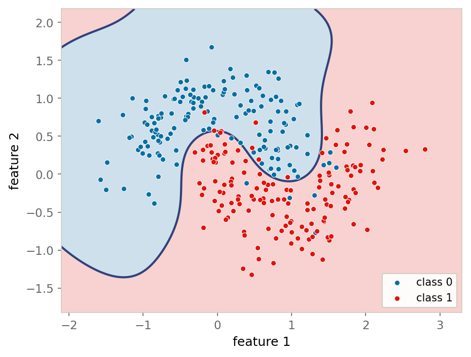

::: {.lm-hero}
[Chapter 8 · Kernel Methods, Trees & Ensembles]{.eyebrow}

# Applied — Trees, Ensembles, and Decision Boundaries

[Watch a single tree, a forest, and a boosted ensemble score the same patients, then see each method's inductive bias become a shape you can point at.]{.dek}
:::

The chapter built [kernel methods]{.term}, [decision trees]{.term}, and the two ways of
combining trees: [bagging]{.term} (random forests) and [boosting]{.term}. Here we carry
those tools to a real diagnostic data set, then drop to a two-feature problem we can see and
draw the [decision boundary]{.term} of each model class side by side. The bagging-versus-boosting
contrast stops being a slogan once you watch the models score the same held-out patients, and
the [inductive bias]{.term} of each method (a smooth kernel similarity, an axis-aligned
partition, an average over many partitions) becomes a *shape*.

The two columns below diverge by necessity. Pyodide ships scikit-learn, so the Python column
runs the genuine ensembles. Base R ships no `randomForest`, `gbm`, or `e1071`, so rather than
emit code that needs an uninstalled package, the R column builds the two inductive biases it
*can* express from scratch: an axis-aligned [decision stump]{.term} and an RBF
[kernel-ridge]{.term} classifier. The production tools in R are those three packages; what
follows is the idea underneath them.

## Bagging versus boosting

A single fully grown tree is a low-bias, high-variance learner: it fits the training tumors
closely and pays for it on new ones. The chapter gave two cures. A [random forest]{.term}
averages many decorrelated trees, attacking the variance directly. [Gradient boosting]{.term}
adds shallow trees in sequence, each correcting the last, attacking the bias. The Python
column fits all three on the Wisconsin diagnostic data (569 tumors, 30 cell-nucleus
measurements, a held-out quarter for the honest test) and reports the gaps. The R column
fits its stump and kernel classifier on the moons data introduced below and reports the same
kind of accuracy contrast: a single axis-aligned cut against a smooth kernel boundary.

```{=html}
<figure class="lm-figure">

<figcaption><strong>A decision boundary you can see.</strong> A radial-basis kernel SVM splits the make_moons data with one smooth curve, shading each <em>predicted</em> class soft blue and soft red; the dots are the points' <em>true</em> labels. The two crescents are noisy and overlap, so some dots land on the wrong side of the curve: real misclassifications the smooth boundary can't avoid without overfitting. This is the result the code below reproduces.</figcaption>
</figure>
```

::: {.panel-tabset group="lang"}

## Python
```{pyodide}
import numpy as np
import matplotlib.pyplot as plt
from sklearn.datasets import load_breast_cancer
from sklearn.model_selection import train_test_split
from sklearn.tree import DecisionTreeClassifier
from sklearn.ensemble import RandomForestClassifier, GradientBoostingClassifier

RNG = 0
data = load_breast_cancer()                      # bundled; no network needed
X, y = data.data, data.target
X_tr, X_te, y_tr, y_te = train_test_split(
    X, y, test_size=0.25, stratify=y, random_state=RNG)
print(f"{X.shape[0]} tumors, {X.shape[1]} features; "
      f"{len(X_tr)} train / {len(X_te)} test")

tree   = DecisionTreeClassifier(random_state=RNG).fit(X_tr, y_tr)
forest = RandomForestClassifier(n_estimators=300, random_state=RNG).fit(X_tr, y_tr)
boost  = GradientBoostingClassifier(random_state=RNG).fit(X_tr, y_tr)

acc = lambda m: m.score(X_te, y_te)
print(f"single decision tree   test accuracy: {acc(tree):.3f}")
print(f"random forest          test accuracy: {acc(forest):.3f}")
print(f"gradient boosting      test accuracy: {acc(boost):.3f}")
print(f"forest gain over tree: {acc(forest) - acc(tree):+.3f}")
print(f"boost  gain over tree: {acc(boost)  - acc(tree):+.3f}")

# A forest reports how much each feature reduced impurity across all its trees.
importances = forest.feature_importances_
order = np.argsort(importances)[::-1][:8]

fig, ax = plt.subplots(figsize=(8, 4.5))
ax.barh(range(len(order)), importances[order][::-1], color="#076FA1")
ax.set_yticks(range(len(order)))
ax.set_yticklabels([data.feature_names[k] for k in order][::-1], fontsize=9)
ax.set_xlabel("mean impurity decrease")
ax.set_title("Random forest: eight most important features")
for s in ["top", "right"]:
    ax.spines[s].set_visible(False)
for s in ["left", "bottom"]:
    ax.spines[s].set_color("#cfccc2")
ax.grid(axis="x", color="#e6e3da", lw=0.8)   # faint grid on the value axis
ax.set_axisbelow(True)
plt.tight_layout()
plt.show()
print(f"top 8 features account for {importances[order].sum():.1%} of total importance")
```

## R
```{webr}
set.seed(0)

# Recreate make_moons in base R: two interleaving half-circles, plus noise.
make_moons <- function(n, noise = 0.30) {
  n_out <- n %/% 2; n_in <- n - n_out
  t_out <- seq(0, pi, length.out = n_out)
  t_in  <- seq(0, pi, length.out = n_in)
  x <- c(cos(t_out),      1 - cos(t_in))
  y <- c(sin(t_out), 0.5 - sin(t_in))
  X <- cbind(x, y) + matrix(rnorm(2 * n, sd = noise), ncol = 2)
  list(X = X, label = c(rep(0L, n_out), rep(1L, n_in)))
}

m <- make_moons(300, noise = 0.30); X <- m$X; lab <- m$label
test <- sample(nrow(X), nrow(X) %/% 4)            # hold out a quarter
Xtr <- X[-test, ]; ytr <- lab[-test]
Xte <- X[ test, ]; yte <- lab[ test]

# Decision stump: the single axis-aligned cut that misclassifies the fewest.
fit_stump <- function(X, y) {
  best <- list(err = Inf)
  for (j in 1:ncol(X)) for (thr in sort(unique(X[, j]))) {
    left <- X[, j] <= thr
    pl <- as.integer(mean(y[left]) >= 0.5)        # majority vote each side
    pr <- as.integer(mean(y[!left]) >= 0.5)
    err <- mean(ifelse(left, pl, pr) != y)
    if (err < best$err) best <- list(err = err, j = j, thr = thr, pl = pl, pr = pr)
  }
  best
}
predict_stump <- function(s, X) ifelse(X[, s$j] <= s$thr, s$pl, s$pr)

# RBF kernel classifier: Gram matrix + ridge (kernel ridge on +/-1 labels).
rbf <- function(A, B, gamma) {
  d2 <- outer(rowSums(A^2), rowSums(B^2), "+") - 2 * A %*% t(B)
  exp(-gamma * pmax(d2, 0))
}
fit_rbf <- function(X, y, gamma = 2, lambda = 0.1)
  list(X = X, gamma = gamma,
       alpha = solve(rbf(X, X, gamma) + lambda * diag(nrow(X)), 2 * y - 1))
predict_rbf <- function(f, Xnew) as.integer(rbf(Xnew, f$X, f$gamma) %*% f$alpha > 0)

stump <- fit_stump(Xtr, ytr)
kern  <- fit_rbf(Xtr, ytr, gamma = 2, lambda = 0.1)

acc <- function(pred, y) mean(pred == y)
cat(sprintf("%d points, 2 features; %d train / %d test\n",
            nrow(X), nrow(Xtr), nrow(Xte)))
cat(sprintf("decision stump   (one axis cut)  test accuracy: %.3f\n",
            acc(predict_stump(stump, Xte), yte)))
cat(sprintf("RBF kernel ridge (smooth bound)  test accuracy: %.3f\n",
            acc(predict_rbf(kern, Xte), yte)))
```

:::

Both Python ensembles lift accuracy well above the single tree, and the two "gain" lines are
the chapter's bias-variance decomposition made arithmetic. A deep tree's errors come mostly
from variance, which the forest attacks by averaging decorrelated trees; boosting reaches a
similar place from the other side, reducing bias one shallow correction at a time. The
forest's [feature importances]{.term} also explain why it *subsamples* features at each split:
left alone, every tree would seize the same one or two strong predictors and the trees would
be near-copies. Forcing each split to choose from a random subset [decorrelates]{.term} them,
which is what makes the average worth taking. The base-R column shows the same lesson in
miniature: a lone axis cut underperforms the smooth kernel that follows the data's shape.

## Decision boundaries across model classes

To *see* the inductive biases, we drop to two features. The `make_moons` data is two
interleaving crescents, not linearly separable, with enough noise that a flexible model can
overfit. The kernel classifier rests on the radial basis function, the same Gaussian
similarity from the chapter's kernel smoother.

::: {.defbox}
[Radial Basis Function Kernel]{.lbl}
[ K(x, x&prime;) = exp(&minus;&gamma;&#8201;&Vert;x &minus; x&prime;&Vert;&sup2;) ]{.math}
:::

The Python column fits five classifiers on the same points and draws where each switches its
prediction. The R column draws the two it builds by hand: the axis-aligned stump against the
smooth RBF boundary. Plotted in the site's blue and red, the shaded region is each model's
predicted class.

::: {.panel-tabset group="lang"}

## Python
```{pyodide}
import numpy as np
import matplotlib.pyplot as plt
from matplotlib.colors import ListedColormap
from sklearn.datasets import make_moons
from sklearn.linear_model import LogisticRegression
from sklearn.svm import SVC
from sklearn.tree import DecisionTreeClassifier
from sklearn.ensemble import RandomForestClassifier, GradientBoostingClassifier

RNG = 0
Xm, ym = make_moons(n_samples=300, noise=0.30, random_state=RNG)

models = [
    ("linear (logistic)",  LogisticRegression()),
    ("kernel SVM (RBF)",   SVC(kernel="rbf", gamma=2.0, C=1.0)),
    ("single tree",        DecisionTreeClassifier(random_state=RNG)),
    ("random forest",      RandomForestClassifier(n_estimators=300, random_state=RNG)),
    ("gradient boosting",  GradientBoostingClassifier(random_state=RNG)),
]

region = ListedColormap(["#076FA1", "#E3120B"])   # blue / red, one per class
point  = np.array(["#076FA1", "#E3120B"])

x_min, x_max = Xm[:, 0].min() - 0.5, Xm[:, 0].max() + 0.5
y_min, y_max = Xm[:, 1].min() - 0.5, Xm[:, 1].max() + 0.5
xx, yy = np.meshgrid(np.linspace(x_min, x_max, 200),
                     np.linspace(y_min, y_max, 200))
grid = np.c_[xx.ravel(), yy.ravel()]

fig, axes = plt.subplots(2, 3, figsize=(11, 7))
for ax, (name, model) in zip(axes.ravel(), models):
    model.fit(Xm, ym)
    Z = model.predict(grid).reshape(xx.shape)
    ax.contourf(xx, yy, Z, levels=[-0.5, 0.5, 1.5], cmap=region, alpha=0.20)
    ax.scatter(Xm[:, 0], Xm[:, 1], c=point[ym], s=14,
               edgecolors="white", linewidths=0.3)
    ax.set_title(name, fontsize=10)
    for s in ["top", "right", "left", "bottom"]:   # light frame; keep both feature axes
        ax.spines[s].set_color("#cfccc2")
    ax.tick_params(colors="#666666", labelsize=8)

# Five models, six panels: use the empty sixth panel for a white-box class legend.
legend_ax = axes.ravel()[-1]
legend_ax.axis("off")
handles = [plt.Line2D([], [], marker="o", linestyle="", markersize=9,
                      markerfacecolor=point[k], markeredgecolor="white",
                      label=f"class {k}") for k in (0, 1)]
legend_ax.legend(handles=handles, loc="center", title="true class", frameon=True,
                 facecolor="white", framealpha=0.92, edgecolor="#cfccc2", fontsize=11)
fig.tight_layout()
plt.show()
```

## R
```{webr}
set.seed(0)

make_moons <- function(n, noise = 0.30) {
  n_out <- n %/% 2; n_in <- n - n_out
  t_out <- seq(0, pi, length.out = n_out); t_in <- seq(0, pi, length.out = n_in)
  x <- c(cos(t_out), 1 - cos(t_in)); y <- c(sin(t_out), 0.5 - sin(t_in))
  X <- cbind(x, y) + matrix(rnorm(2 * n, sd = noise), ncol = 2)
  list(X = X, label = c(rep(0L, n_out), rep(1L, n_in)))
}
m <- make_moons(300, noise = 0.30); X <- m$X; lab <- m$label

fit_stump <- function(X, y) {
  best <- list(err = Inf)
  for (j in 1:ncol(X)) for (thr in sort(unique(X[, j]))) {
    left <- X[, j] <= thr
    pl <- as.integer(mean(y[left]) >= 0.5); pr <- as.integer(mean(y[!left]) >= 0.5)
    err <- mean(ifelse(left, pl, pr) != y)
    if (err < best$err) best <- list(err = err, j = j, thr = thr, pl = pl, pr = pr)
  }
  best
}
predict_stump <- function(s, X) ifelse(X[, s$j] <= s$thr, s$pl, s$pr)

rbf <- function(A, B, gamma) {
  d2 <- outer(rowSums(A^2), rowSums(B^2), "+") - 2 * A %*% t(B)
  exp(-gamma * pmax(d2, 0))
}
fit_rbf <- function(X, y, gamma = 2, lambda = 0.1)
  list(X = X, gamma = gamma,
       alpha = solve(rbf(X, X, gamma) + lambda * diag(nrow(X)), 2 * y - 1))
predict_rbf <- function(f, Xnew) as.integer(rbf(Xnew, f$X, f$gamma) %*% f$alpha > 0)

stump <- fit_stump(X, lab)
kern  <- fit_rbf(X, lab, gamma = 2, lambda = 0.1)

# Prediction grid over the data range
xs <- seq(min(X[, 1]) - 0.5, max(X[, 1]) + 0.5, length.out = 120)
ys <- seq(min(X[, 2]) - 0.5, max(X[, 2]) + 0.5, length.out = 120)
grid <- as.matrix(expand.grid(x = xs, y = ys))

region <- c("#CDE0EC", "#F7D2D0")     # light blue / light red fill
pts    <- c("#076FA1", "#E3120B")     # blue / red points

draw <- function(pred, title) {
  z <- matrix(pred, nrow = length(xs))
  image(xs, ys, z, col = region, xlab = "feature 1", ylab = "feature 2", main = title)
  points(X[, 1], X[, 2], pch = 21, bg = pts[lab + 1], col = "white", cex = 0.9)
  legend("bottomright", legend = c("class 0", "class 1"), pch = 21,
         pt.bg = pts, col = "white", bg = "white", box.col = "#cfccc2", cex = 0.8)
}

par(mfrow = c(1, 2))
draw(predict_stump(stump, grid), "decision stump (axis-aligned)")
draw(predict_rbf(kern, grid),    "RBF kernel ridge (smooth)")
```

:::

Read the panels against the methods. **Linear (logistic)** draws one straight cut and cannot
help misclassifying a slice of each crescent; its bias is a single hyperplane and no amount
of data changes that. **Kernel SVM (RBF)** draws a smooth curved boundary that follows the
crescents, its shape set by a hand-designed similarity fixed before any data is seen. The
**single tree** draws an axis-aligned staircase with small islands fencing off individual
noisy points, the high-variance learner that overfits this data most readily. The **random
forest** keeps the axis-aligned vocabulary but smooths the staircase, because it averages
hundreds of trees grown on different resamples, so the islands mostly dissolve. **Gradient
boosting** is also axis-aligned, built additively, with a boundary sharper near the margin
where successive trees concentrate their corrections. The base-R pair shows the two poles of
this story directly: the stump can only cut once, while the kernel bends smoothly around both
crescents.

Every one of these methods commits to a *fixed* geometry, a hyperplane, an RBF similarity,
axis-aligned cuts, before seeing the data. A neural network, the next chapter's subject,
instead *learns* a representation in which a problem like this becomes easy to separate,
rather than fixing the shape of the boundary in advance.

::: {.explore}
[Try it]{.lbl}
Raise the moons' `noise` to 0.5 and refit. In Python the single tree's islands multiply while
the forest barely moves, variance reduction on screen. In R, push the kernel's `gamma` to 10
and watch the smooth boundary tighten into overfitting islands of its own, the bias-variance
dial turning the other way.
:::
