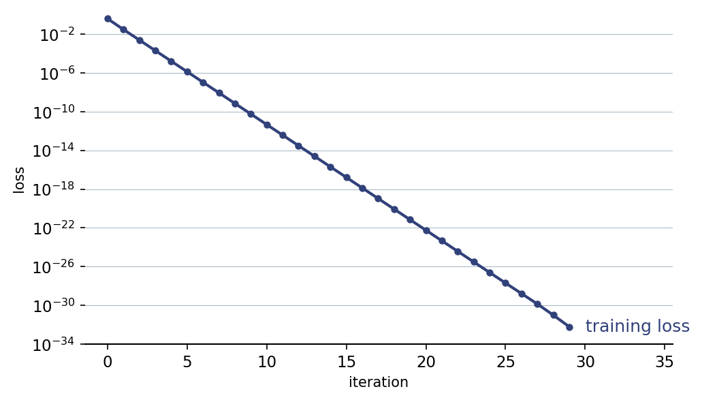

::: {.lm-hero}
[Chapter 9 · Neural Networks]{.eyebrow}

# Backpropagation

[Values flow forward through the network and gradients flow backward through the same path; trace the actual numbers and the chain rule stops being abstract.]{.dek}
:::

Backpropagation is the algorithm that makes neural networks trainable. The textbook derives the gradients symbolically; here we run the numbers through the smallest network that still shows the full mechanism. Values flow forward to a prediction and a loss, then [gradients]{.term} flow backward along the same edges, each node passing a [delta]{.term} to the node behind it. A numerical gradient check confirms the hand-derived formulas are right.

The network is deliberately tiny: one input $x$, one hidden unit with a [sigmoid]{.term} activation, one linear output, and squared-error loss. It computes

$$z^{[1]} = w^{[1]} x + b^{[1]}, \quad a^{[1]} = \sigma(z^{[1]}), \quad \hat{y} = z^{[2]} = w^{[2]} a^{[1]} + b^{[2]}, \quad \ell = \tfrac{1}{2}(y - \hat{y})^2.$$

::: {.defbox}
[The Backward Recurrence]{.lbl}
[ &delta;<sup>[2]</sup> = &part;&ell;/&part;z<sup>[2]</sup> = &minus;(y &minus; ŷ) &nbsp;&nbsp; &delta;<sup>[1]</sup> = w<sup>[2]</sup>&middot;&delta;<sup>[2]</sup>&middot;&sigma;&prime;(z<sup>[1]</sup>) &nbsp;&nbsp; &part;&ell;/&part;w = &delta;&middot;(input) ]{.math}
:::

```{=html}
<figure class="lm-figure">

<figcaption><strong>Backprop plus a step rule is training.</strong> Fifty gradient-descent steps on the scalar network drive the squared-error loss down geometrically — a straight line on the log axis — until it reaches the floating-point floor around iteration 30. This is the result the code below reproduces.</figcaption>
</figure>
```

## The forward and backward pass

We use the textbook's starting values, $w^{[1]}=0.5,\ b^{[1]}=0.1,\ w^{[2]}=0.8,\ b^{[2]}=-0.2$, with input $x=1$ and target $y=0.5$. The forward pass caches every intermediate value; the backward pass reuses them. Because $\sigma'(z) = \sigma(z)\,(1-\sigma(z))$, the hidden delta needs only the activation we already stored. The network is scalar, so the matrix products of a full layer collapse to ordinary multiplication, but the order of operations is exactly the one a tensor library runs.

::: {.panel-tabset group="lang"}

## Python
```{pyodide}
import numpy as np

def sigmoid(z):
    return 1 / (1 + np.exp(-z))

def sigmoid_deriv(z):              # sigma'(z) = sigma(z)(1 - sigma(z))
    s = sigmoid(z)
    return s * (1 - s)

# Parameters (textbook values), input, target
w1, b1, w2, b2 = 0.5, 0.1, 0.8, -0.2
x, y = 1.0, 0.5

# --- Forward pass: cache every intermediate value ---
z1 = w1 * x + b1
a1 = sigmoid(z1)
z2 = w2 * a1 + b2
y_hat = z2                          # linear output
loss = 0.5 * (y - y_hat) ** 2

print("=== Forward pass ===")
print(f"z1 = w1*x + b1   = {z1:.4f}")
print(f"a1 = sigma(z1)   = {a1:.4f}")
print(f"z2 = w2*a1 + b2  = {z2:.4f}")
print(f"y_hat            = {y_hat:.4f}")
print(f"ℓ = 0.5(y-y_hat)^2 = {loss:.4f}")

# --- Backward pass: deltas flow right to left ---
dL_dyhat = -(y - y_hat)
delta2 = dL_dyhat * 1.0             # linear output: derivative is 1
delta1 = w2 * delta2 * sigmoid_deriv(z1)

# Parameter gradients: grad = delta * (input to that weight)
dL_dw2, dL_db2 = delta2 * a1, delta2
dL_dw1, dL_db1 = delta1 * x, delta1

print("\n=== Backward pass ===")
print(f"delta2 = {delta2:.4f}")
print(f"delta1 = w2*delta2*sigma'(z1) = {delta1:.4f}")
print("\n=== Gradients ===")
print(f"dL/dw1 = {dL_dw1:.4f}   dL/db1 = {dL_db1:.4f}")
print(f"dL/dw2 = {dL_dw2:.4f}   dL/db2 = {dL_db2:.4f}")
```

## R
```{webr}
sigmoid <- function(z) 1 / (1 + exp(-z))
sigmoid_deriv <- function(z) {      # sigma'(z) = sigma(z)(1 - sigma(z))
  s <- sigmoid(z); s * (1 - s)
}

# Parameters (textbook values), input, target
w1 <- 0.5; b1 <- 0.1; w2 <- 0.8; b2 <- -0.2
x <- 1.0; y <- 0.5

# --- Forward pass: cache every intermediate value ---
z1 <- w1 * x + b1
a1 <- sigmoid(z1)
z2 <- w2 * a1 + b2
y_hat <- z2                         # linear output
loss <- 0.5 * (y - y_hat)^2

cat("=== Forward pass ===\n")
cat(sprintf("z1 = w1*x + b1   = %.4f\n", z1))
cat(sprintf("a1 = sigma(z1)   = %.4f\n", a1))
cat(sprintf("z2 = w2*a1 + b2  = %.4f\n", z2))
cat(sprintf("y_hat            = %.4f\n", y_hat))
cat(sprintf("ℓ = 0.5(y-y_hat)^2 = %.4f\n", loss))

# --- Backward pass: deltas flow right to left ---
dL_dyhat <- -(y - y_hat)
delta2 <- dL_dyhat * 1.0            # linear output: derivative is 1
delta1 <- w2 * delta2 * sigmoid_deriv(z1)

# Parameter gradients: grad = delta * (input to that weight)
dL_dw2 <- delta2 * a1; dL_db2 <- delta2
dL_dw1 <- delta1 * x;  dL_db1 <- delta1

cat("\n=== Backward pass ===\n")
cat(sprintf("delta2 = %.4f\n", delta2))
cat(sprintf("delta1 = w2*delta2*sigma'(z1) = %.4f\n", delta1))
cat("\n=== Gradients ===\n")
cat(sprintf("dL/dw1 = %.4f   dL/db1 = %.4f\n", dL_dw1, dL_db1))
cat(sprintf("dL/dw2 = %.4f   dL/db2 = %.4f\n", dL_dw2, dL_db2))
```

:::

Both languages run the identical scalar recurrence on the same fixed inputs, so every traced number agrees to the printed digits. Every gradient is negative: the network underpredicts ($\hat{y} < y$), so nudging each weight upward would shrink the loss, which is precisely what the next section's update does.

## Checking the gradients numerically

Hand-derived gradients are easy to get subtly wrong. The standard defense is a [finite-difference]{.term} check: perturb one parameter by a tiny $\epsilon$, measure how the loss moves, and compare against the analytical gradient.

::: {.defbox}
[Central-Difference Gradient]{.lbl}
[ &part;&ell;/&part;&theta; &asymp; [ &ell;(&theta;+&epsilon;) &minus; &ell;(&theta;&minus;&epsilon;) ] / (2&epsilon;) ]{.math}
:::

::: {.panel-tabset group="lang"}

## Python
```{pyodide}
import numpy as np

def sigmoid(z):
    return 1 / (1 + np.exp(-z))

theta0 = dict(w1=0.5, b1=0.1, w2=0.8, b2=-0.2)
x, y = 1.0, 0.5

def loss_at(p):                     # forward pass as a function of the parameters
    z1 = p["w1"] * x + p["b1"]
    a1 = sigmoid(z1)
    y_hat = p["w2"] * a1 + p["b2"]
    return 0.5 * (y - y_hat) ** 2

# Analytical gradients (from the backward pass)
z1 = theta0["w1"] * x + theta0["b1"]
a1 = sigmoid(z1)
y_hat = theta0["w2"] * a1 + theta0["b2"]
delta2 = -(y - y_hat)
delta1 = theta0["w2"] * delta2 * a1 * (1 - a1)
analytic = dict(w1=delta1 * x, b1=delta1, w2=delta2 * a1, b2=delta2)

eps = 1e-5
print(f"{'param':<6}{'analytical':>14}{'numerical':>14}{'|diff|':>12}")
for name in ["w1", "b1", "w2", "b2"]:
    p_plus  = {**theta0, name: theta0[name] + eps}
    p_minus = {**theta0, name: theta0[name] - eps}
    numeric = (loss_at(p_plus) - loss_at(p_minus)) / (2 * eps)
    diff = abs(analytic[name] - numeric)
    print(f"{name:<6}{analytic[name]:>14.6f}{numeric:>14.6f}{diff:>12.2e}")
```

## R
```{webr}
sigmoid <- function(z) 1 / (1 + exp(-z))

theta0 <- c(w1 = 0.5, b1 = 0.1, w2 = 0.8, b2 = -0.2)
x <- 1.0; y <- 0.5

loss_at <- function(p) {            # forward pass as a function of the parameters
  z1 <- p["w1"] * x + p["b1"]
  a1 <- sigmoid(z1)
  y_hat <- p["w2"] * a1 + p["b2"]
  0.5 * (y - y_hat)^2
}

# Analytical gradients (from the backward pass)
z1 <- theta0["w1"] * x + theta0["b1"]
a1 <- as.numeric(sigmoid(z1))
y_hat <- theta0["w2"] * a1 + theta0["b2"]
delta2 <- as.numeric(-(y - y_hat))
delta1 <- as.numeric(theta0["w2"]) * delta2 * a1 * (1 - a1)
analytic <- c(w1 = delta1 * x, b1 = delta1, w2 = delta2 * a1, b2 = delta2)

eps <- 1e-5
cat(sprintf("%-6s%14s%14s%12s\n", "param", "analytical", "numerical", "|diff|"))
for (name in c("w1", "b1", "w2", "b2")) {
  p_plus  <- theta0; p_plus[name]  <- p_plus[name]  + eps
  p_minus <- theta0; p_minus[name] <- p_minus[name] - eps
  numeric <- as.numeric((loss_at(p_plus) - loss_at(p_minus)) / (2 * eps))
  diff <- abs(analytic[name] - numeric)
  cat(sprintf("%-6s%14.6f%14.6f%12.2e\n", name, analytic[name], numeric, diff))
}
```

:::

The differences land near $10^{-10}$, the floor set by floating-point arithmetic, not by any error in the formulas. When you write your own layer, this check is the difference between a bug you find in thirty seconds and one you chase for a day.

## One step, then fifty

Gradients point uphill, so we step against them: $\theta \leftarrow \theta - \alpha\,\partial \ell/\partial\theta$. With a fresh set of weights and a learning rate $\alpha = 0.5$, we repeat forward pass, backward pass, and update for fifty iterations and watch the loss fall as the prediction closes on its target. The original notebook animates a single forward-and-backward sweep through the computation graph; that animation does not survive in a static page, so we show the loss curve instead, which carries the same point: backprop plus a step rule is training.

::: {.panel-tabset group="lang"}

## Python
```{pyodide}
import numpy as np
import matplotlib.pyplot as plt

def sigmoid(z):
    return 1 / (1 + np.exp(-z))

w1, b1, w2, b2 = 0.5, 0.2, -0.3, 0.1   # fresh starting weights
x, y = 1.0, 0.8
alpha, n_steps = 0.5, 50
losses, preds = [], []

for step in range(n_steps):
    # forward
    z1 = w1 * x + b1
    a1 = sigmoid(z1)
    y_hat = w2 * a1 + b2
    losses.append(0.5 * (y - y_hat) ** 2)
    preds.append(y_hat)
    # backward
    delta2 = -(y - y_hat)
    delta1 = w2 * delta2 * a1 * (1 - a1)
    # update
    w1 -= alpha * delta1 * x
    b1 -= alpha * delta1
    w2 -= alpha * delta2 * a1
    b2 -= alpha * delta2

fig, (ax1, ax2) = plt.subplots(1, 2, figsize=(11, 4))
ax1.plot(losses, color="#076FA1", linewidth=2.5)
ax1.set_xlabel("Iteration"); ax1.set_ylabel("Loss")
ax1.set_title("Loss during training")
ax2.plot(preds, color="#31417A", linewidth=2.5, label="prediction")
ax2.axhline(y, color="#E3120B", linestyle="--", linewidth=2, label=f"target y={y}")
ax2.set_xlabel("Iteration"); ax2.set_ylabel("Output")
ax2.set_title("Prediction converging to target"); ax2.legend(loc="lower right")
plt.tight_layout()
plt.show()

print(f"Initial loss: {losses[0]:.6f}   final loss: {losses[-1]:.6f}")
print(f"Final prediction: {preds[-1]:.4f}   (target {y})")
```

## R
```{webr}
sigmoid <- function(z) 1 / (1 + exp(-z))

w1 <- 0.5; b1 <- 0.2; w2 <- -0.3; b2 <- 0.1   # fresh starting weights
x <- 1.0; y <- 0.8
alpha <- 0.5; n_steps <- 50
losses <- numeric(n_steps); preds <- numeric(n_steps)

for (step in seq_len(n_steps)) {
  # forward
  z1 <- w1 * x + b1
  a1 <- sigmoid(z1)
  y_hat <- w2 * a1 + b2
  losses[step] <- 0.5 * (y - y_hat)^2
  preds[step] <- y_hat
  # backward
  delta2 <- -(y - y_hat)
  delta1 <- w2 * delta2 * a1 * (1 - a1)
  # update
  w1 <- w1 - alpha * delta1 * x
  b1 <- b1 - alpha * delta1
  w2 <- w2 - alpha * delta2 * a1
  b2 <- b2 - alpha * delta2
}

par(mfrow = c(1, 2))
plot(seq_len(n_steps), losses, type = "l", col = "#076FA1", lwd = 2.5,
     xlab = "Iteration", ylab = "Loss", main = "Loss during training")
plot(seq_len(n_steps), preds, type = "l", col = "#31417A", lwd = 2.5,
     xlab = "Iteration", ylab = "Output", main = "Prediction converging to target")
abline(h = y, col = "#E3120B", lty = 2, lwd = 2)
legend("bottomright", legend = c("prediction", sprintf("target y=%.1f", y)),
       col = c("#31417A", "#E3120B"), lty = c(1, 2), lwd = 2)

cat(sprintf("Initial loss: %.6f   final loss: %.6f\n", losses[1], losses[n_steps]))
cat(sprintf("Final prediction: %.4f   (target %.1f)\n", preds[n_steps], y))
```

:::

Both runs start and end at the same numbers, because the update is deterministic given the weights. The loss falls steeply at first, then flattens as the gradients shrink near the solution. This is the whole training loop in miniature: the deep networks of the next chapters differ only in scale, replacing these four scalars with millions of weights and these scalar products with matrix multiplications.

## Why sigmoid makes deep networks hard

The hidden delta carries a factor of $\sigma'(z^{[1]})$, and that factor is the seed of a famous problem. The sigmoid derivative peaks at $0.25$ and decays toward zero on both sides; stack $L$ sigmoid layers and a gradient can shrink by up to $(0.25)^L$ on its way back. [ReLU]{.term}, whose derivative is exactly $1$ for positive inputs, was the fix that let gradients pass through deep stacks unchanged. The plot contrasts the activations with their derivatives, where the gradient-flow story lives.

::: {.panel-tabset group="lang"}

## Python
```{pyodide}
import numpy as np
import matplotlib.pyplot as plt

z = np.linspace(-4, 4, 200)
sigmoid = lambda z: 1 / (1 + np.exp(-z))
sig_d = lambda z: sigmoid(z) * (1 - sigmoid(z))
relu = lambda z: np.maximum(0, z)
relu_d = lambda z: (z > 0).astype(float)

fig, (ax1, ax2) = plt.subplots(1, 2, figsize=(11, 4))
ax1.plot(z, sigmoid(z), color="#076FA1", linewidth=2, label="sigmoid")
ax1.plot(z, np.tanh(z), color="#666666", linewidth=2, label="tanh")
ax1.plot(z, relu(z), color="#31417A", linewidth=2, label="ReLU")
ax1.axhline(0, color="gray", linewidth=0.5); ax1.axvline(0, color="gray", linewidth=0.5)
ax1.set_title("Activations"); ax1.set_xlabel("z"); ax1.set_ylim(-1.5, 4); ax1.legend(loc="upper left")

ax2.plot(z, sig_d(z), color="#076FA1", linewidth=2, label="sigmoid'")
ax2.plot(z, 1 - np.tanh(z) ** 2, color="#666666", linewidth=2, label="tanh'")
ax2.plot(z, relu_d(z), color="#31417A", linewidth=2, label="ReLU'")
ax2.axhline(0.25, color="#E3120B", linestyle="--", linewidth=1, label="sigmoid' max = 0.25")
ax2.set_title("Derivatives (gradient flow)"); ax2.set_xlabel("z"); ax2.set_ylim(-0.1, 1.2)
ax2.legend(loc="upper right")
plt.tight_layout()
plt.show()

print(f"After 10 sigmoid layers, gradient shrinks by up to {0.25**10:.2e}")
print(f"After 20 sigmoid layers, gradient shrinks by up to {0.25**20:.2e}")
```

## R
```{webr}
z <- seq(-4, 4, length.out = 200)
sigmoid <- function(z) 1 / (1 + exp(-z))
sig_d <- function(z) sigmoid(z) * (1 - sigmoid(z))
relu <- function(z) pmax(0, z)
relu_d <- function(z) as.numeric(z > 0)

par(mfrow = c(1, 2))
plot(z, sigmoid(z), type = "l", col = "#076FA1", lwd = 2, ylim = c(-1.5, 4),
     xlab = "z", ylab = "", main = "Activations")
lines(z, tanh(z), col = "#666666", lwd = 2)
lines(z, relu(z), col = "#31417A", lwd = 2)
abline(h = 0, col = "gray", lwd = 0.5); abline(v = 0, col = "gray", lwd = 0.5)
legend("topleft", legend = c("sigmoid", "tanh", "ReLU"),
       col = c("#076FA1", "#666666", "#31417A"), lwd = 2)

plot(z, sig_d(z), type = "l", col = "#076FA1", lwd = 2, ylim = c(-0.1, 1.2),
     xlab = "z", ylab = "", main = "Derivatives (gradient flow)")
lines(z, 1 - tanh(z)^2, col = "#666666", lwd = 2)
lines(z, relu_d(z), col = "#31417A", lwd = 2)
abline(h = 0.25, col = "#E3120B", lty = 2, lwd = 1)
legend("topright", legend = c("sigmoid'", "tanh'", "ReLU'", "sigmoid' max = 0.25"),
       col = c("#076FA1", "#666666", "#31417A", "#E3120B"),
       lty = c(1, 1, 1, 2), lwd = c(2, 2, 2, 1))

cat(sprintf("After 10 sigmoid layers, gradient shrinks by up to %.2e\n", 0.25^10))
cat(sprintf("After 20 sigmoid layers, gradient shrinks by up to %.2e\n", 0.25^20))
```

:::

We kept sigmoid in the worked example because its derivative has a clean closed form, which makes the chain rule transparent. Production networks reach for ReLU and its variants for exactly the reason the right-hand plot shows: a derivative that does not collapse as the network deepens.

::: {.explore}
[Try it]{.lbl}
Raise the learning rate in the training loop from $0.5$ to $5$ and re-run. The loss may overshoot and oscillate instead of settling. Then extend the network to a hidden layer of several units: replace the scalar weights with vectors and matrices, swap the scalar products for `@` (Python) or `%*%` (R), and the same forward-then-backward recurrence trains it unchanged.
:::
