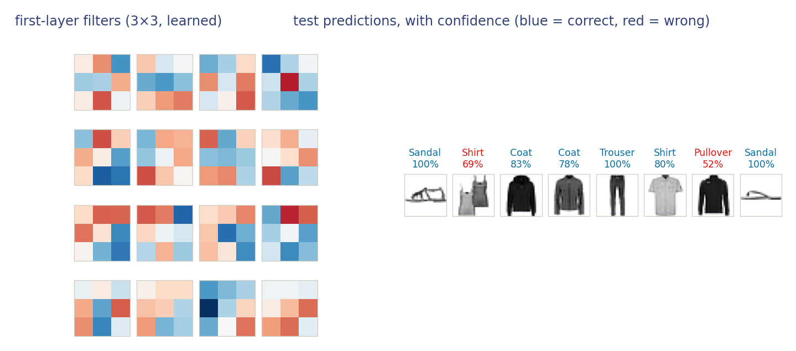

::: {.lm-hero}
[Chapter 10 · Representation Learning]{.eyebrow}

# Applied — A Convolutional Network

[Swap a flat MLP for a network that respects the grid, and the same training loop does more with far fewer parameters.]{.dek}
:::

Rung two. The data is the same subsample of Fashion-MNIST you met in Chapter 9, and the training loop is identical. Only the model changes: from a flat [multilayer perceptron]{.term} that treats every pixel as unrelated to its neighbors, to a [convolutional network]{.term} that exploits the layout the MLP throws away. Along the way you build a [residual block]{.term}, the skip connection at the heart of Chapter 10's ResNets and, not by coincidence, the same `x + F(x)` that lets a deep transformer block train at all.

The MLP flattens each image to a vector of 784 numbers. A convolution needs the grid, so we keep every image as a $1 \times 28 \times 28$ tensor: one channel, twenty-eight rows, twenty-eight columns. Nothing else about the data changes.

```{=html}
<figure class="lm-figure">

<figcaption><strong>What the first layer looks like, and how the network does on new images.</strong> The sixteen first-layer filters barely move during training: each stays within cosine similarity 0.94 of its own random initialization, median 0.99. The left panel therefore shows what a 3&times;3 first layer looks like, not what ten epochs taught it &mdash; at this filter size and this training budget, the useful work happens deeper in the stack. On the right, eight held-out images: six right, confidently, and two wrong &mdash; a T-shirt called a shirt at 69% and a coat called a pullover at 52%, the two lowest confidences in the row, and exactly the shirt/coat/pullover confusion Chapter 9 flagged.</figcaption>
</figure>
```

## A residual block

Stacking many convolutions makes optimization hard, because the gradient has a long way to travel back through the stack. A residual block fixes this by adding the block's input back to its output, so each block only has to learn a *correction* to the identity rather than the whole mapping. That added `+ x` is a gradient highway: it gives the gradient a short path home.

::: {.defbox}
[Residual Block]{.lbl}

[ **y** = &phi;( **x** + F(**x**) ) ]{.math}
:::

Here F is two padded convolutions, each with batch normalization and a ReLU; &phi; is the final activation. The convolutions are *same-shape*, so input and output have matching dimensions and the sum is well defined.

```python
import torch.nn as nn

class ResidualBlock(nn.Module):
    """Two same-shape convolutions with a skip connection: relu(x + F(x))."""
    def __init__(self, channels):
        super().__init__()
        self.conv1 = nn.Conv2d(channels, channels, kernel_size=3, padding=1)
        self.bn1   = nn.BatchNorm2d(channels)
        self.conv2 = nn.Conv2d(channels, channels, kernel_size=3, padding=1)
        self.bn2   = nn.BatchNorm2d(channels)
        self.relu  = nn.ReLU()

    def forward(self, x):
        out = self.relu(self.bn1(self.conv1(x)))
        out = self.bn2(self.conv2(out))
        return self.relu(out + x)            # the residual connection
```

The models train in **Google Colab**, where a free GPU keeps the convolutions quick; the code here is for reading, the Colab button below is for running.

```{=html}
<a class="colab-btn" href="https://colab.research.google.com/github/welr/learning_machines/blob/main/ch10_02_applied.ipynb" target="_blank" rel="noopener"><span class="dot"></span> Open in Google Colab</a>
```

## The model

The full network is small: two convolution-and-pool stages that shrink $28 \times 28$ down to $7 \times 7$ while growing the channel count, one residual block, then a linear head to the ten classes. Watch the parameter count. It comes in far under the Chapter 9 MLP's roughly 235k, because a convolution shares one small filter across the whole image instead of wiring every pixel to every unit.

```python
class CNN(nn.Module):
    def __init__(self):
        super().__init__()
        self.features = nn.Sequential(
            nn.Conv2d(1, 16, kernel_size=3, padding=1), nn.ReLU(), nn.MaxPool2d(2),   # 28 -> 14
            nn.Conv2d(16, 32, kernel_size=3, padding=1), nn.ReLU(), nn.MaxPool2d(2),  # 14 -> 7
            ResidualBlock(32),
        )
        self.head = nn.Sequential(nn.Flatten(), nn.Linear(32 * 7 * 7, 10))

    def forward(self, x):
        return self.head(self.features(x))
```

The final layer is once again the affine-plus-softmax classifier from Chapter 4. The convolutional stack learns *what* to look for; the linear head decides what the features mean.

## Training: the same loop

The loop below is the one from Chapter 9, unchanged. That is the whole point. Swapping the model does not change how we train it: cross-entropy loss, an AdamW step, repeat. The only concession to the larger network is evaluating accuracy in batches, since the convolutions hold more activations in memory than the MLP did.

```python
import torch

loss_fn = nn.CrossEntropyLoss()
optimizer = torch.optim.AdamW(model.parameters(), lr=1e-3)
batch_size, epochs = 128, 10

for epoch in range(epochs):
    order = torch.randperm(len(X_tr))
    running_loss, n_batches = 0.0, 0
    for i in range(0, len(X_tr), batch_size):
        batch = order[i : i + batch_size]
        loss = loss_fn(model(X_tr[batch]), y_tr[batch])
        optimizer.zero_grad(set_to_none=True)
        loss.backward()
        optimizer.step()
        # average over the epoch: one minibatch's loss is far too noisy to read
        running_loss += loss.item()
        n_batches += 1
    print(f"epoch {epoch + 1:2d} | train loss {running_loss / n_batches:.3f}")
```

## Three models, one split

The exercise asks for a comparison, not an assertion, so here is one. All three models see the same 15,000-image subsample, split 12,000 for training and 3,000 held out, and all three get the same budget: ten epochs, batch size 128, AdamW at $10^{-3}$. The only thing that changes is the architecture. Because a single run of a small network is noisy, the accuracies below are averaged over three seeds, with the spread given so you can see how little of the difference is luck.

| model | parameters | held-out accuracy | range over three seeds |
|---|---:|---:|---|
| MLP (Chapter 9) | 235,146 | 0.855 | 0.849 – 0.860 |
| convolutional, no residual block | 20,490 | 0.872 | 0.866 – 0.876 |
| convolutional + residual block | 39,114 | 0.885 | 0.881 – 0.889 |

Two things fall out. The plain convolutional network beats the multilayer perceptron by close to two points while using **one eleventh** of its parameters, and the ordering holds on every seed. That is the inductive bias earning its keep: locality and translation equivariance are true of images, so the convolution spends parameters on structure the data actually has, where the MLP spends most of its on wiring every pixel to every unit.

And the residual block does help here, by a little over a point, again on every seed. It is worth being exact about what that buys and costs: the block adds 18,624 parameters, nearly doubling the network, for about a third of the gain that switching from dense layers to convolutions produced in the first place. At this depth the block is not rescuing optimization the way it does in a fifty-layer network, since two convolutional stages train perfectly well without it. What it adds is capacity in a form the residual path keeps easy to optimize. The lesson to carry into deeper networks is the mechanism, not this margin.

Its [inductive bias]{.term}, locality and translation equivariance, matches the structure of images, so it spends its parameters where they help. The residual block let us add depth without making optimization harder.

The residual you just wrote is the same `x + F(x)` that wraps attention and the feed-forward network inside a transformer block. In Chapter 11 you build the attention that goes *inside* that block; in Chapter 12 you assemble the whole thing into a GPT, still trained by the loop you have now used twice.

::: {.explore}
[Try it]{.lbl}

In Colab, remove the residual block and send the second pooling output straight to the head, then stack two more plain convolutions in its place. Does training get harder, or the accuracy worse? Then go the other way: add a second residual block, or widen the channels past 32, and see how far you can push test accuracy before the extra capacity stops paying off.
:::
