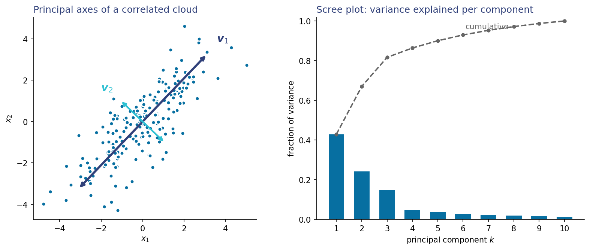

::: {.lm-hero}
[Chapter 13 · Unsupervised Learning]{.eyebrow}

# Structure Without Labels

[Take a data set, seal the labels away, and see how much of the story the inputs alone can tell: PCA finds the directions, K-means finds the groups, and only then do we peek.]{.dek}
:::

Every other page on this site had a response to predict. Here there is none — or rather,
we lock it away. The plan: run [PCA]{.term} and [K-means]{.term} on a data set using
nothing but the inputs, and only at the end reveal the labels to measure how much
structure was sitting in $p(\mathbf{x})$ all along. The textbook's Chapter 13 reads both
methods as maximum likelihood with the labels treated as latent variables; this page runs
them, from scratch, in a few lines each.

::: {.defbox}
[Principal Directions]{.lbl}
[ S v = &lambda; v &nbsp;&mdash;&nbsp; the directions of a data cloud are the eigenvectors of its covariance ]{.math}
:::

```{=html}
<figure class="lm-figure">

<figcaption><strong>What PCA finds.</strong> The principal axes of a correlated cloud (left) and a scree plot of variance per component (right). The code below runs the same construction on a real data set.</figcaption>
</figure>
```

## The data, with the labels sealed

We use Fisher's irises: 150 flowers, four measurements each, three species. It is the
classic *labeled* data set — which makes it perfect for this experiment, because we can
withhold the species column now and audit ourselves against it later. The four features
are standardized first; PCA is not scale-invariant, and we want each measurement to speak
with equal weight.

::: {.panel-tabset group="lang"}

## Python
```{pyodide}
import numpy as np
import matplotlib.pyplot as plt
from sklearn.datasets import load_iris

iris = load_iris()
X_raw = iris.data                      # 150 flowers x 4 measurements (cm)
species_sealed = iris.target           # sealed until the last section

X = (X_raw - X_raw.mean(axis=0)) / X_raw.std(axis=0)
print("X:", X.shape, " -- labels sealed away")
```

## R
```{webr}
X_raw <- as.matrix(iris[, 1:4])        # 150 flowers x 4 measurements (cm)
species_sealed <- iris$Species         # sealed until the last section

X <- scale(X_raw)
cat("X:", dim(X)[1], "x", dim(X)[2], " -- labels sealed away\n")
```

:::

## Principal components, by hand

Three lines: form the sample covariance, take its eigenvectors, project. The first two
components carry 95.8% of the variance — four correlated measurements were, all along,
close to a two-dimensional story.

::: {.panel-tabset group="lang"}

## Python
```{pyodide}
S = X.T @ X / len(X)                   # 4 x 4 sample covariance
evals, evecs = np.linalg.eigh(S)
evals, evecs = evals[::-1], evecs[:, ::-1]      # largest first
evecs = evecs * np.sign(evecs[0, :])   # fix signs (cosmetic, for parity with R)

frac = evals / evals.sum()
for k in range(4):
    print(f"PC{k+1}: {frac[k]:5.1%}   cumulative {frac[:k+1].sum():5.1%}")

Z = X @ evecs[:, :2]                   # every flower gets two coordinates

fig, ax = plt.subplots(figsize=(7, 5))
ax.scatter(Z[:, 0], Z[:, 1], s=45, color="#076FA1", alpha=0.7,
           edgecolor="white", linewidth=0.6)
ax.set_xlabel("first principal score"); ax.set_ylabel("second principal score")
ax.set_title("150 flowers, no labels")
for s in ["top", "right"]: ax.spines[s].set_visible(False)
ax.grid(axis="y", color="#e6e3da", lw=0.8); ax.set_axisbelow(True)
plt.tight_layout(); plt.show()
```

## R
```{webr}
S <- t(X) %*% X / nrow(X)              # 4 x 4 sample covariance
e <- eigen(S)                          # largest first by default
frac <- e$values / sum(e$values)
for (k in 1:4) cat(sprintf("PC%d: %5.1f%%   cumulative %5.1f%%\n",
                           k, 100 * frac[k], 100 * sum(frac[1:k])))

V <- e$vectors
V <- sweep(V, 2, sign(V[1, ]), "*")    # fix signs (cosmetic, for parity with Python)
Z <- X %*% V[, 1:2]                    # every flower gets two coordinates

plot(Z, pch = 19, col = adjustcolor("#076FA1", 0.7), cex = 1.1, bty = "l",
     xlab = "first principal score", ylab = "second principal score",
     main = "150 flowers, no labels")
grid(col = "#e6e3da", lty = 1, lwd = 0.6)
```

:::

Even with one color, the plot is not one blob: a tight island sits apart from a long
ridge. We did not put that there. It is structure in $p(\mathbf{x})$, and the next step
gives it names — well, numbers.

## K-means, by hand

Lloyd's algorithm is two alternating steps: assign each point to its nearest center, move
each center to the mean of its points. Each step can only lower the objective $J$, so the
printed trace falls monotonically and then stops moving — the same monotone descent as
the textbook's worked example, on real data.

::: {.panel-tabset group="lang"}

## Python
```{pyodide}
rng = np.random.default_rng(1)
K = 3
mus = Z[rng.choice(len(Z), K, replace=False)]   # init: three random flowers

for it in range(6):
    d2 = ((Z[:, None, :] - mus[None, :, :]) ** 2).sum(axis=2)
    cluster = d2.argmin(axis=1)                  # assign
    J = d2[np.arange(len(Z)), cluster].sum()
    print(f"iteration {it + 1}:  J = {J:6.1f}")
    for k in range(K):                           # update
        mus[k] = Z[cluster == k].mean(axis=0)
```

## R
```{webr}
set.seed(1)
K <- 3
mus <- Z[sample(nrow(Z), K), ]                   # init: three random flowers

for (it in 1:6) {
  d2 <- outer(rowSums(Z^2), rep(1, K)) - 2 * Z %*% t(mus) +
        outer(rep(1, nrow(Z)), rowSums(mus^2))
  cluster <- max.col(-d2)                        # assign
  J <- sum(d2[cbind(seq_len(nrow(Z)), cluster)])
  cat(sprintf("iteration %d:  J = %6.1f\n", it, J))
  for (k in 1:K)                                 # update
    mus[k, ] <- colMeans(Z[cluster == k, , drop = FALSE])
}
```

:::

The two languages start from different random centers, so the traces differ, but both
settle near $J \approx 115$–$116$ within a few iterations. Convergence is guaranteed;
convergence to the *best* partition is not, which is why production implementations
(`sklearn.cluster.KMeans`, R's `kmeans` with `nstart`) run several restarts and keep the
best. The textbook's statistical reading explains what we just fit: a Gaussian mixture
whose component variances have been sent to zero — density estimation with the class
labels treated as missing data.

## Breaking the seal

Now, and only now, we look at the species.

::: {.panel-tabset group="lang"}

## Python
```{pyodide}
names = iris.target_names
fig, ax = plt.subplots(figsize=(7, 5))
for s, color in zip(range(3), ["#076FA1", "#2FC1D3", "#9E4F00"]):
    pts = Z[species_sealed == s]
    ax.scatter(pts[:, 0], pts[:, 1], s=45, color=color, alpha=0.75,
               edgecolor="white", linewidth=0.6, label=names[s])
ax.set_xlabel("first principal score"); ax.set_ylabel("second principal score")
ax.set_title("The same cloud, species revealed")
ax.legend()
for s in ["top", "right"]: ax.spines[s].set_visible(False)
ax.grid(axis="y", color="#e6e3da", lw=0.8); ax.set_axisbelow(True)
plt.tight_layout(); plt.show()

# How well did the clusters anticipate the species?
tab = np.zeros((3, 3), dtype=int)
for k, s in zip(cluster, species_sealed):
    tab[k, s] += 1
print("cluster x species:\n", tab)
print(f"purity: {tab.max(axis=1).sum() / len(Z):.1%}")
```

## R
```{webr}
cols <- c("#076FA1", "#2FC1D3", "#9E4F00")
plot(Z, pch = 19, cex = 1.1, bty = "l",
     col = adjustcolor(cols[as.integer(species_sealed)], 0.75),
     xlab = "first principal score", ylab = "second principal score",
     main = "The same cloud, species revealed")
grid(col = "#e6e3da", lty = 1, lwd = 0.6)
legend("topright", levels(species_sealed), col = cols, pch = 19, bty = "n")

# How well did the clusters anticipate the species?
tab <- table(cluster = cluster, species = species_sealed)
print(tab)
cat(sprintf("purity: %.1f%%\n", 100 * sum(apply(tab, 1, max)) / nrow(Z)))
```

:::

The audit is instructive in both directions. One cluster captures *setosa* almost
perfectly — that was the island. The other two clusters split *versicolor* and
*virginica* imperfectly, because along the ridge the two species genuinely overlap in
these four measurements. Purity comes out around 85%: most of the class structure was in
$p(\mathbf{x})$ before any label was used, and the part that wasn't is exactly the part
where the species are hard to tell apart, labels in hand or not.

## The full-scale version

The textbook's applied exercise runs this same experiment at scale: 10,000 Fashion-MNIST
images with the labels sealed, PCA "eigen-garments," $K$-means cluster averages you can
recognize as trousers and boots, and a small PyTorch [autoencoder]{.term} whose learned
two-dimensional code bends where PCA's cannot. The autoencoder needs PyTorch, which is
more than a browser sandbox can carry, so the notebook runs in Google Colab.

```{=html}
<a class="colab-btn" href="https://colab.research.google.com/github/welr/learning_machines/blob/main/ch13_01_unsupervised.ipynb" target="_blank" rel="noopener"><span class="dot"></span> Open in Google Colab</a>
```

::: {.explore}
[Try it]{.lbl}
Set `K = 2` and rerun the clustering. Lloyd's algorithm will happily produce two clusters —
it always converges, whatever $K$ you assert. Then try `K = 4`. The textbook's
mixture-model reading turns "which $K$ is right?" into ordinary model selection with
held-out likelihood; with $K$-means alone you are left staring at the objective. Feel that
difference here.
:::
