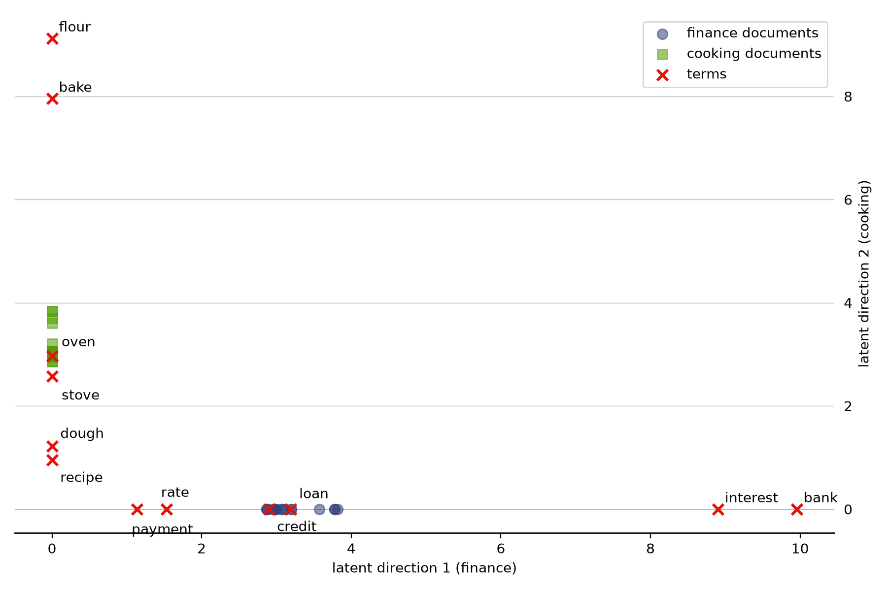

::: {.lm-hero}
[Chapter 13 · Unsupervised Learning]{.eyebrow}

# Latent Semantic Analysis

[Factor a matrix of word counts and topics fall out: two terms that never share a document become identical in direction, and a query crosses the gap between them.]{.dek}
:::

The textbook's Chapter 13 shows that PCA has a second computational route — the SVD of the
design matrix — and that [latent semantic analysis]{.term} is this route applied to text: one
row per document, one column per term, entries counting occurrences, truncate the SVD, and
the retained singular directions play the role of [topics]{.term}. The book factors a
three-document corpus by hand. This page first verifies that example, then builds a corpus
just large enough to show the effect the tiny one cannot: [synonymy]{.term}. Two terms that
never appear in the same document end up identical in the latent space, because they keep
the same company.

::: {.defbox}
[Truncated SVD]{.lbl}
[ X &asymp; U<sub>k</sub> D<sub>k</sub> V<sub>k</sub><sup>T</sup> &nbsp;&mdash;&nbsp; keep the k largest singular directions; documents and terms get coordinates in one k-dimensional space ]{.math}
:::

```{=html}
<figure class="lm-figure">

<figcaption><strong>The latent plane.</strong> Thirty-six documents and twelve terms in the coordinates of the two leading singular directions. <em>Loan</em> and <em>credit</em> never co-occur, yet both land on the finance ray — same direction, cosine 1, differing only in length; <em>oven</em> and <em>stove</em> likewise on the cooking ray. The code below builds exactly this.</figcaption>
</figure>
```

## The book's corpus, verified

Three documents over the vocabulary (*loan*, *interest*, *flour*, *oven*): two loan-office
documents and a recipe. The singular values should come out $3$, $\sqrt{2}$, $1$, and the
rank-two reconstruction should make the two loan-office rows identical — the discarded third
direction is *loan minus interest*, the word-choice difference the truncation treats as
noise.

::: {.panel-tabset group="lang"}

## Python
```{pyodide}
import numpy as np

X_small = np.array([[2, 1, 0, 0],
                    [1, 2, 0, 0],
                    [0, 0, 1, 1]], dtype=float)

U, d, Vt = np.linalg.svd(X_small, full_matrices=False)
print("singular values:", np.round(d, 4))          # 3, sqrt(2), 1

k = 2
X_hat = U[:, :k] @ np.diag(d[:k]) @ Vt[:k, :]      # rank-2 reconstruction
print("rank-2 reconstruction:")
print(np.round(X_hat, 4))
```

## R
```{webr}
X_small <- matrix(c(2, 1, 0, 0,
                    1, 2, 0, 0,
                    0, 0, 1, 1), nrow = 3, byrow = TRUE)

s <- svd(X_small)
cat("singular values:", round(s$d, 4), "\n")       # 3, sqrt(2), 1

k <- 2
X_hat <- s$u[, 1:k] %*% diag(s$d[1:k]) %*% t(s$v[, 1:k])
cat("rank-2 reconstruction:\n")
print(round(X_hat, 4))
```

:::

## A corpus where synonymy can show

In the tiny corpus, *loan* and *interest* co-occur, so their similarity is already visible in
the raw counts. The interesting case is a pair of terms that never share a document. We
construct one: thirty-six documents on two topics, where every finance document says *bank*
and *interest* but uses **either** *loan* **or** *credit*, never both — and every cooking
document says *flour* and *bake* but uses either *oven* or *stove*. The synonym pairs are
linked only through the company they keep. The two topics get different document counts and
hub weights on purpose: identical blocks would tie the two leading singular values, and a
tie leaves the individual axes undetermined — the degeneracy the textbook's Theorem 13.1
flags. Everything is deterministic, so Python and R agree digit for digit. For a moving
picture of the same idea, Wikipedia's
[topic-model animation](https://en.wikipedia.org/wiki/File:Topic_model_scheme.webm)
(Christoph Carl Kling, CC BY-SA 4.0) shows a document–word matrix reorganized until its
topic blocks surface — our corpus is that scheme at hand scale.

::: {.panel-tabset group="lang"}

## Python
```{pyodide}
import numpy as np

vocab = ["loan", "credit", "bank", "interest", "rate", "payment",
         "oven", "stove", "flour", "bake", "dough", "recipe"]
col = {term: j for j, term in enumerate(vocab)}

def finance_doc(i):
    counts = {}
    synonym = "loan" if i % 2 == 0 else "credit"   # never both
    counts[synonym] = 1 + (i % 3 == 0)
    counts["bank"] = 2 + (i % 5 == 0)              # hub words: in every doc
    counts["interest"] = 2
    if i % 3 == 1:                                 # occasional extras
        counts["rate"] = 1
    if i % 4 == 2:
        counts["payment"] = 1
    return counts

def cooking_doc(i):
    counts = {}
    synonym = "oven" if i % 2 == 0 else "stove"    # never both
    counts[synonym] = 1 + (i % 3 == 0)
    counts["flour"] = 2 + (i % 4 == 0)
    counts["bake"] = 2
    if i % 3 == 1:
        counts["dough"] = 1
    if i % 4 == 2:
        counts["recipe"] = 1
    return counts

docs = [finance_doc(i) for i in range(20)] + [cooking_doc(i) for i in range(16)]
topic = ["finance"] * 20 + ["cooking"] * 16

X = np.zeros((len(docs), len(vocab)))
for i, counts in enumerate(docs):
    for term, c in counts.items():
        X[i, col[term]] = c

print("document-term matrix:", X.shape)
print("loan and credit ever co-occur?",
      bool(np.any((X[:, col["loan"]] > 0) & (X[:, col["credit"]] > 0))))
```

## R
```{webr}
vocab <- c("loan", "credit", "bank", "interest", "rate", "payment",
           "oven", "stove", "flour", "bake", "dough", "recipe")

finance_doc <- function(i) {
  counts <- setNames(numeric(12), vocab)
  synonym <- if (i %% 2 == 0) "loan" else "credit"   # never both
  counts[synonym] <- 1 + (i %% 3 == 0)
  counts["bank"] <- 2 + (i %% 5 == 0)                # hub words: in every doc
  counts["interest"] <- 2
  if (i %% 3 == 1) counts["rate"] <- 1
  if (i %% 4 == 2) counts["payment"] <- 1
  counts
}

cooking_doc <- function(i) {
  counts <- setNames(numeric(12), vocab)
  synonym <- if (i %% 2 == 0) "oven" else "stove"    # never both
  counts[synonym] <- 1 + (i %% 3 == 0)
  counts["flour"] <- 2 + (i %% 4 == 0)
  counts["bake"] <- 2
  if (i %% 3 == 1) counts["dough"] <- 1
  if (i %% 4 == 2) counts["recipe"] <- 1
  counts
}

X <- rbind(t(sapply(0:19, finance_doc)), t(sapply(0:15, cooking_doc)))
topic <- c(rep("finance", 20), rep("cooking", 16))

cat("document-term matrix:", dim(X), "\n")
cat("loan and credit ever co-occur?",
    any(X[, "loan"] > 0 & X[, "credit"] > 0), "\n")
```

:::

## Two topic directions

The singular values should show two dominant directions — one per topic — followed by a tail
of within-topic variation. The sign of a singular vector is arbitrary, so we fix a
convention (loadings sum positive) to make the two languages, and the plot below, agree.

::: {.panel-tabset group="lang"}

## Python
```{pyodide}
import numpy as np

# Same corpus as above, rebuilt compactly: every cell on this page stands on its own.
vocab = ["loan", "credit", "bank", "interest", "rate", "payment",
         "oven", "stove", "flour", "bake", "dough", "recipe"]
col = {term: j for j, term in enumerate(vocab)}

def finance_doc(i):
    c = {("loan" if i % 2 == 0 else "credit"): 1 + (i % 3 == 0),
         "bank": 2 + (i % 5 == 0), "interest": 2}
    if i % 3 == 1: c["rate"] = 1
    if i % 4 == 2: c["payment"] = 1
    return c

def cooking_doc(i):
    c = {("oven" if i % 2 == 0 else "stove"): 1 + (i % 3 == 0),
         "flour": 2 + (i % 4 == 0), "bake": 2}
    if i % 3 == 1: c["dough"] = 1
    if i % 4 == 2: c["recipe"] = 1
    return c

docs = [finance_doc(i) for i in range(20)] + [cooking_doc(i) for i in range(16)]
topic = ["finance"] * 20 + ["cooking"] * 16
X = np.zeros((len(docs), len(vocab)))
for i, counts in enumerate(docs):
    for term, c in counts.items():
        X[i, col[term]] = c

U, d, Vt = np.linalg.svd(X, full_matrices=False)
print("singular values:", np.round(d, 2))

k = 2
for j in range(k):                      # canonical signs: topic loadings positive
    if Vt[j].sum() < 0:
        Vt[j] *= -1
        U[:, j] *= -1
doc_coords  = U[:, :k] * d[:k]          # documents in the latent plane
term_coords = Vt[:k, :].T * d[:k]       # terms in the same plane
```

## R
```{webr}
# Same corpus as above, rebuilt compactly: every cell on this page stands on its own.
vocab <- c("loan", "credit", "bank", "interest", "rate", "payment",
           "oven", "stove", "flour", "bake", "dough", "recipe")

finance_doc <- function(i) {
  counts <- setNames(numeric(12), vocab)
  counts[if (i %% 2 == 0) "loan" else "credit"] <- 1 + (i %% 3 == 0)
  counts["bank"] <- 2 + (i %% 5 == 0)
  counts["interest"] <- 2
  if (i %% 3 == 1) counts["rate"] <- 1
  if (i %% 4 == 2) counts["payment"] <- 1
  counts
}

cooking_doc <- function(i) {
  counts <- setNames(numeric(12), vocab)
  counts[if (i %% 2 == 0) "oven" else "stove"] <- 1 + (i %% 3 == 0)
  counts["flour"] <- 2 + (i %% 4 == 0)
  counts["bake"] <- 2
  if (i %% 3 == 1) counts["dough"] <- 1
  if (i %% 4 == 2) counts["recipe"] <- 1
  counts
}

X <- rbind(t(sapply(0:19, finance_doc)), t(sapply(0:15, cooking_doc)))
topic <- c(rep("finance", 20), rep("cooking", 16))

s <- svd(X)
d <- s$d; U <- s$u; V <- s$v
cat("singular values:", round(d, 2), "\n")

k <- 2
for (j in 1:k) {                        # canonical signs: topic loadings positive
  if (sum(V[, j]) < 0) {
    V[, j] <- -V[, j]
    U[, j] <- -U[, j]
  }
}

doc_coords  <- U[, 1:k] %*% diag(d[1:k])   # documents in the latent plane
term_coords <- V[, 1:k] %*% diag(d[1:k])   # terms in the same plane
```

:::

## The synonym effect

As raw count columns, *loan* and *credit* are exactly orthogonal — they never co-occur. In
the latent plane both load on the finance direction, because both co-occur with *bank* and
*interest*.

::: {.panel-tabset group="lang"}

## Python
```{pyodide}
import numpy as np

# Same corpus as above, rebuilt compactly: every cell on this page stands on its own.
vocab = ["loan", "credit", "bank", "interest", "rate", "payment",
         "oven", "stove", "flour", "bake", "dough", "recipe"]
col = {term: j for j, term in enumerate(vocab)}

def finance_doc(i):
    c = {("loan" if i % 2 == 0 else "credit"): 1 + (i % 3 == 0),
         "bank": 2 + (i % 5 == 0), "interest": 2}
    if i % 3 == 1: c["rate"] = 1
    if i % 4 == 2: c["payment"] = 1
    return c

def cooking_doc(i):
    c = {("oven" if i % 2 == 0 else "stove"): 1 + (i % 3 == 0),
         "flour": 2 + (i % 4 == 0), "bake": 2}
    if i % 3 == 1: c["dough"] = 1
    if i % 4 == 2: c["recipe"] = 1
    return c

docs = [finance_doc(i) for i in range(20)] + [cooking_doc(i) for i in range(16)]
topic = ["finance"] * 20 + ["cooking"] * 16
X = np.zeros((len(docs), len(vocab)))
for i, counts in enumerate(docs):
    for term, c in counts.items():
        X[i, col[term]] = c

U, d, Vt = np.linalg.svd(X, full_matrices=False)
k = 2
for j in range(k):                      # canonical signs: topic loadings positive
    if Vt[j].sum() < 0:
        Vt[j] *= -1
        U[:, j] *= -1
doc_coords  = U[:, :k] * d[:k]          # documents in the latent plane
term_coords = Vt[:k, :].T * d[:k]       # terms in the same plane

def cosine(a, b):
    return float(a @ b / (np.linalg.norm(a) * np.linalg.norm(b)))

print(f"{'pair':>16}  {'raw cosine':>10}  {'latent cosine':>13}")
for s_, t_ in [("loan", "credit"), ("oven", "stove"), ("loan", "oven")]:
    raw    = cosine(X[:, col[s_]], X[:, col[t_]])
    latent = cosine(term_coords[col[s_]], term_coords[col[t_]])
    print(f"{s_ + ' / ' + t_:>16}  {raw:>10.3f}  {latent:>13.3f}")
```

## R
```{webr}
# Same corpus as above, rebuilt compactly: every cell on this page stands on its own.
vocab <- c("loan", "credit", "bank", "interest", "rate", "payment",
           "oven", "stove", "flour", "bake", "dough", "recipe")

finance_doc <- function(i) {
  counts <- setNames(numeric(12), vocab)
  counts[if (i %% 2 == 0) "loan" else "credit"] <- 1 + (i %% 3 == 0)
  counts["bank"] <- 2 + (i %% 5 == 0)
  counts["interest"] <- 2
  if (i %% 3 == 1) counts["rate"] <- 1
  if (i %% 4 == 2) counts["payment"] <- 1
  counts
}

cooking_doc <- function(i) {
  counts <- setNames(numeric(12), vocab)
  counts[if (i %% 2 == 0) "oven" else "stove"] <- 1 + (i %% 3 == 0)
  counts["flour"] <- 2 + (i %% 4 == 0)
  counts["bake"] <- 2
  if (i %% 3 == 1) counts["dough"] <- 1
  if (i %% 4 == 2) counts["recipe"] <- 1
  counts
}

X <- rbind(t(sapply(0:19, finance_doc)), t(sapply(0:15, cooking_doc)))
topic <- c(rep("finance", 20), rep("cooking", 16))

s <- svd(X)
d <- s$d; U <- s$u; V <- s$v
k <- 2
for (j in 1:k) {                        # canonical signs: topic loadings positive
  if (sum(V[, j]) < 0) {
    V[, j] <- -V[, j]
    U[, j] <- -U[, j]
  }
}
doc_coords  <- U[, 1:k] %*% diag(d[1:k])   # documents in the latent plane
term_coords <- V[, 1:k] %*% diag(d[1:k])   # terms in the same plane

cosine <- function(a, b) sum(a * b) / (sqrt(sum(a * a)) * sqrt(sum(b * b)))

cat(sprintf("%16s  %10s  %13s\n", "pair", "raw cosine", "latent cosine"))
for (pair in list(c("loan", "credit"), c("oven", "stove"), c("loan", "oven"))) {
  raw    <- cosine(X[, pair[1]], X[, pair[2]])
  latent <- cosine(term_coords[which(vocab == pair[1]), ],
                   term_coords[which(vocab == pair[2]), ])
  cat(sprintf("%16s  %10.3f  %13.3f\n",
              paste(pair[1], "/", pair[2]), raw, latent))
}
```

:::

The synonym pairs go from orthogonal to parallel — and here the collapse is exact, cosine
$1.000$, because the two topics share no vocabulary at all, so the rank-two truncation
flattens each topic onto its own line. Real corpora blur the blocks and the cosines land
high rather than exactly at one, but the mechanism is this one: synonyms rarely co-occur,
yet they co-occur with the same *other* terms.

## Retrieval across a synonym gap

A query is folded into the latent plane like a short document,
$\hat{\mathbf{z}} = \mathbf{D}_k^{-1}\mathbf{V}_k^T\mathbf{q}$ — the textbook's Exercise 11
does this by hand. Query the corpus with the single word *credit* and score every document
two ways: raw inner product with the count vector, and cosine in the latent plane.

::: {.panel-tabset group="lang"}

## Python
```{pyodide}
import numpy as np

# Same corpus as above, rebuilt compactly: every cell on this page stands on its own.
vocab = ["loan", "credit", "bank", "interest", "rate", "payment",
         "oven", "stove", "flour", "bake", "dough", "recipe"]
col = {term: j for j, term in enumerate(vocab)}

def finance_doc(i):
    c = {("loan" if i % 2 == 0 else "credit"): 1 + (i % 3 == 0),
         "bank": 2 + (i % 5 == 0), "interest": 2}
    if i % 3 == 1: c["rate"] = 1
    if i % 4 == 2: c["payment"] = 1
    return c

def cooking_doc(i):
    c = {("oven" if i % 2 == 0 else "stove"): 1 + (i % 3 == 0),
         "flour": 2 + (i % 4 == 0), "bake": 2}
    if i % 3 == 1: c["dough"] = 1
    if i % 4 == 2: c["recipe"] = 1
    return c

docs = [finance_doc(i) for i in range(20)] + [cooking_doc(i) for i in range(16)]
topic = ["finance"] * 20 + ["cooking"] * 16
X = np.zeros((len(docs), len(vocab)))
for i, counts in enumerate(docs):
    for term, c in counts.items():
        X[i, col[term]] = c

U, d, Vt = np.linalg.svd(X, full_matrices=False)
k = 2
for j in range(k):                      # canonical signs: topic loadings positive
    if Vt[j].sum() < 0:
        Vt[j] *= -1
        U[:, j] *= -1
doc_coords  = U[:, :k] * d[:k]          # documents in the latent plane
term_coords = Vt[:k, :].T * d[:k]       # terms in the same plane

def cosine(a, b):
    return float(a @ b / (np.linalg.norm(a) * np.linalg.norm(b)))

q = np.zeros(len(vocab))
q[col["credit"]] = 1.0

z_query = (Vt[:k, :] @ q) / d[:k]                  # fold-in
latent_score = np.array([cosine(U[i, :k], z_query) for i in range(len(docs))])
raw_score = X @ q

loan_only = [i for i in range(len(docs)) if X[i, col["loan"]] > 0]
finance   = [i for i in range(len(docs)) if topic[i] == "finance"]
cooking   = [i for i in range(len(docs)) if topic[i] == "cooking"]

print("best RAW score among loan-only documents  :", raw_score[loan_only].max())
print("least LATENT score among finance documents:",
      round(latent_score[finance].min(), 3))
print("best LATENT score among cooking documents :",
      round(latent_score[cooking].max(), 3))
```

## R
```{webr}
# Same corpus as above, rebuilt compactly: every cell on this page stands on its own.
vocab <- c("loan", "credit", "bank", "interest", "rate", "payment",
           "oven", "stove", "flour", "bake", "dough", "recipe")

finance_doc <- function(i) {
  counts <- setNames(numeric(12), vocab)
  counts[if (i %% 2 == 0) "loan" else "credit"] <- 1 + (i %% 3 == 0)
  counts["bank"] <- 2 + (i %% 5 == 0)
  counts["interest"] <- 2
  if (i %% 3 == 1) counts["rate"] <- 1
  if (i %% 4 == 2) counts["payment"] <- 1
  counts
}

cooking_doc <- function(i) {
  counts <- setNames(numeric(12), vocab)
  counts[if (i %% 2 == 0) "oven" else "stove"] <- 1 + (i %% 3 == 0)
  counts["flour"] <- 2 + (i %% 4 == 0)
  counts["bake"] <- 2
  if (i %% 3 == 1) counts["dough"] <- 1
  if (i %% 4 == 2) counts["recipe"] <- 1
  counts
}

X <- rbind(t(sapply(0:19, finance_doc)), t(sapply(0:15, cooking_doc)))
topic <- c(rep("finance", 20), rep("cooking", 16))

s <- svd(X)
d <- s$d; U <- s$u; V <- s$v
k <- 2
for (j in 1:k) {                        # canonical signs: topic loadings positive
  if (sum(V[, j]) < 0) {
    V[, j] <- -V[, j]
    U[, j] <- -U[, j]
  }
}
doc_coords  <- U[, 1:k] %*% diag(d[1:k])   # documents in the latent plane
term_coords <- V[, 1:k] %*% diag(d[1:k])   # terms in the same plane

cosine <- function(a, b) sum(a * b) / (sqrt(sum(a * a)) * sqrt(sum(b * b)))

q <- setNames(numeric(12), vocab)
q["credit"] <- 1

z_query <- as.vector(t(V[, 1:k]) %*% q) / d[1:k]   # fold-in
latent_score <- apply(U[, 1:k], 1, cosine, b = z_query)
raw_score <- as.vector(X %*% q)

loan_only <- which(X[, "loan"] > 0)
finance   <- which(topic == "finance")
cooking   <- which(topic == "cooking")

cat("best RAW score among loan-only documents  :", max(raw_score[loan_only]), "\n")
cat("least LATENT score among finance documents:",
    round(min(latent_score[finance]), 3), "\n")
cat("best LATENT score among cooking documents :",
    round(max(latent_score[cooking]), 3), "\n")
```

:::

Raw matching can only find documents that contain the literal query term — every *loan*-only
document scores exactly zero. In the latent plane every finance document ties at cosine $1$,
loan documents included (the same exact collapse as above), while every cooking document
sits at $0$: the query crossed the synonym gap.

## The latent plane

Documents and terms live in the same two-dimensional space, so one plot shows the whole
geometry — the plot at the top of this page.

::: {.panel-tabset group="lang"}

## Python
```{pyodide}
import numpy as np

# Same corpus as above, rebuilt compactly: every cell on this page stands on its own.
vocab = ["loan", "credit", "bank", "interest", "rate", "payment",
         "oven", "stove", "flour", "bake", "dough", "recipe"]
col = {term: j for j, term in enumerate(vocab)}

def finance_doc(i):
    c = {("loan" if i % 2 == 0 else "credit"): 1 + (i % 3 == 0),
         "bank": 2 + (i % 5 == 0), "interest": 2}
    if i % 3 == 1: c["rate"] = 1
    if i % 4 == 2: c["payment"] = 1
    return c

def cooking_doc(i):
    c = {("oven" if i % 2 == 0 else "stove"): 1 + (i % 3 == 0),
         "flour": 2 + (i % 4 == 0), "bake": 2}
    if i % 3 == 1: c["dough"] = 1
    if i % 4 == 2: c["recipe"] = 1
    return c

docs = [finance_doc(i) for i in range(20)] + [cooking_doc(i) for i in range(16)]
topic = ["finance"] * 20 + ["cooking"] * 16
X = np.zeros((len(docs), len(vocab)))
for i, counts in enumerate(docs):
    for term, c in counts.items():
        X[i, col[term]] = c

U, d, Vt = np.linalg.svd(X, full_matrices=False)
k = 2
for j in range(k):                      # canonical signs: topic loadings positive
    if Vt[j].sum() < 0:
        Vt[j] *= -1
        U[:, j] *= -1
doc_coords  = U[:, :k] * d[:k]          # documents in the latent plane
term_coords = Vt[:k, :].T * d[:k]       # terms in the same plane

import matplotlib.pyplot as plt

fig, ax = plt.subplots(figsize=(7.5, 5))
for name, marker, color in [("finance", "o", "#31417A"), ("cooking", "s", "#4F9E00")]:
    idx = [i for i in range(len(docs)) if topic[i] == name]
    ax.scatter(doc_coords[idx, 0], doc_coords[idx, 1], marker=marker,
               color=color, alpha=0.55, label=f"{name} documents")
ax.scatter(term_coords[:, 0], term_coords[:, 1], marker="x", color="#E3120B",
           label="terms")
for j, term in enumerate(vocab):
    ax.annotate(term, term_coords[j], textcoords="offset points",
                xytext=(4, 4), fontsize=9)
ax.set_xlabel("latent direction 1 (finance)")
ax.set_ylabel("latent direction 2 (cooking)")
ax.legend()
plt.tight_layout()
plt.show()
```

## R
```{webr}
# Same corpus as above, rebuilt compactly: every cell on this page stands on its own.
vocab <- c("loan", "credit", "bank", "interest", "rate", "payment",
           "oven", "stove", "flour", "bake", "dough", "recipe")

finance_doc <- function(i) {
  counts <- setNames(numeric(12), vocab)
  counts[if (i %% 2 == 0) "loan" else "credit"] <- 1 + (i %% 3 == 0)
  counts["bank"] <- 2 + (i %% 5 == 0)
  counts["interest"] <- 2
  if (i %% 3 == 1) counts["rate"] <- 1
  if (i %% 4 == 2) counts["payment"] <- 1
  counts
}

cooking_doc <- function(i) {
  counts <- setNames(numeric(12), vocab)
  counts[if (i %% 2 == 0) "oven" else "stove"] <- 1 + (i %% 3 == 0)
  counts["flour"] <- 2 + (i %% 4 == 0)
  counts["bake"] <- 2
  if (i %% 3 == 1) counts["dough"] <- 1
  if (i %% 4 == 2) counts["recipe"] <- 1
  counts
}

X <- rbind(t(sapply(0:19, finance_doc)), t(sapply(0:15, cooking_doc)))
topic <- c(rep("finance", 20), rep("cooking", 16))

s <- svd(X)
d <- s$d; U <- s$u; V <- s$v
k <- 2
for (j in 1:k) {                        # canonical signs: topic loadings positive
  if (sum(V[, j]) < 0) {
    V[, j] <- -V[, j]
    U[, j] <- -U[, j]
  }
}
doc_coords  <- U[, 1:k] %*% diag(d[1:k])   # documents in the latent plane
term_coords <- V[, 1:k] %*% diag(d[1:k])   # terms in the same plane

plot(doc_coords, col = ifelse(topic == "finance", "#31417A", "#4F9E00"),
     pch = ifelse(topic == "finance", 19, 15),
     xlab = "latent direction 1 (finance)",
     ylab = "latent direction 2 (cooking)")
points(term_coords, col = "#E3120B", pch = 4, lwd = 2)
text(term_coords, labels = vocab, pos = 4, cex = 0.8)
legend("topright", c("finance documents", "cooking documents", "terms"),
       col = c("#31417A", "#4F9E00", "#E3120B"), pch = c(19, 15, 4), bty = "n")
```

:::

*Loan* and *credit* lie on the same ray from the origin, as do *oven* and *stove* — identical
in direction, which is all cosine similarity measures, differing only in length (*loan*'s
documents carry slightly more count mass). The factorization recovered a small semantic fact
from co-occurrence alone. The learned embeddings of
Chapters 11 and 12 are this idea's descendants — there too words become vectors and
similarity becomes an inner product — with the coordinates no longer extracted from counts
by factorization but fit by maximum likelihood on a prediction task.

The companion notebook runs the same construction end to end, ready to extend with your own
corpus.

```{=html}
<a class="colab-btn" href="https://colab.research.google.com/github/welr/learning_machines/blob/main/ch13_03_lsa.ipynb" target="_blank" rel="noopener"><span class="dot"></span> Open in Google Colab</a>
```

::: {.explore}
[Try it]{.lbl}
Truncate at `k = 1` and watch the two topics collapse onto a single axis — the scree gap
between the second and third singular values ($12.82$ against $4.67$) is what licensed
`k = 2`. Then add a third topic of your own five terms and check that `k = 3` recovers it.
Finally, replace the raw counts with tf-idf weights — multiply each column by
$\log(m / \mathrm{df}_j)$, where $\mathrm{df}_j$ is the number of documents containing term
$j$ — and see whether the hub words *bank* and *flour*, which appear in every document of
their topic, lose their grip on the topic directions.
:::
